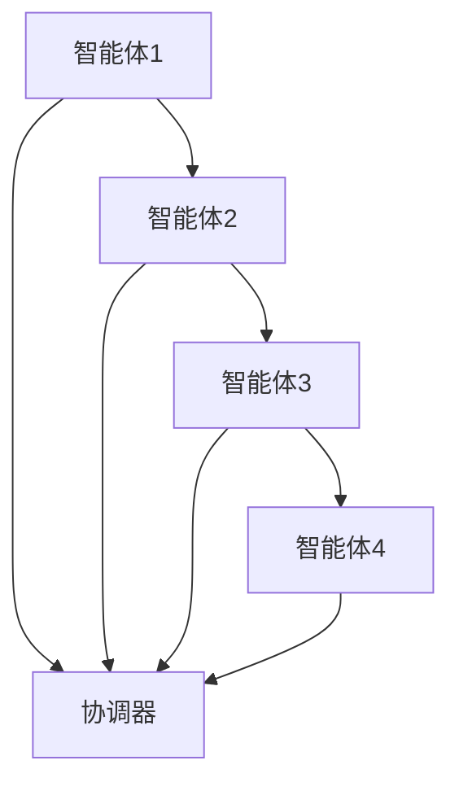
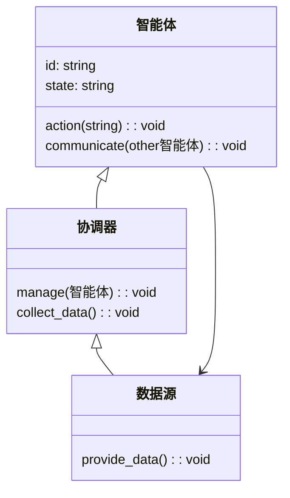
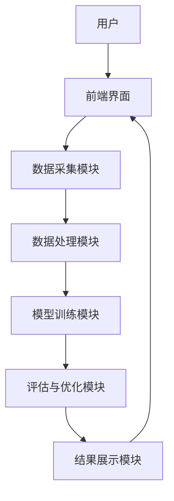

                 


# 智能化公司国际化战略评估：多智能体AI的新方法

## 关键词：多智能体AI，国际化战略，战略评估，企业智能化，AI算法

## 摘要：本文探讨了如何利用多智能体AI技术优化公司的国际化战略评估过程，分析了多智能体AI的核心概念和其在战略评估中的应用方法，结合实际案例，详细阐述了系统的架构设计和实现方案，为企业的国际化战略提供了新的思路。

---

# 文章正文

## 第1章：引言

### 1.1 研究背景

随着全球经济一体化的深入发展，企业国际化战略的重要性日益凸显。企业在拓展国际市场时，面临着复杂多变的市场环境和激烈竞争，传统的战略评估方法往往依赖人工分析，存在效率低下、主观性强、难以量化等问题。如何利用先进的技术手段提升战略评估的效率和准确性，成为企业面临的重要课题。

多智能体AI作为一种新兴的人工智能技术，具有分布式计算、协作推理和自适应学习等特性，能够有效处理复杂系统的决策问题。本文将探讨如何将多智能体AI应用于公司国际化战略评估，为企业提供一种创新的解决方案。

### 1.2 问题描述

传统的国际化战略评估方法通常依赖于市场调研、数据分析和专家经验，存在以下问题：

1. **数据量大且复杂**：国际化战略涉及的因素众多，包括市场环境、竞争状况、政策法规等，数据收集和处理成本高。
2. **决策周期长**：人工分析需要大量时间，难以快速响应市场变化。
3. **结果的不确定性**：依赖专家经验可能导致评估结果的主观性较强，难以保证准确性。
4. **缺乏动态调整能力**：面对市场环境的变化，传统方法难以实时调整评估策略。

### 1.3 研究目标与意义

本文旨在探讨如何利用多智能体AI技术，构建一个智能化的国际化战略评估系统，解决上述问题，提升评估的效率和准确性。通过多智能体AI的协作推理和自适应学习能力，实现对国际市场环境的动态分析和战略优化，为企业制定国际化战略提供有力支持。

---

## 第2章：多智能体AI的核心概念

### 2.1 多智能体AI的定义与特点

**多智能体AI**是指由多个具有自主决策能力的智能体组成的系统，这些智能体通过协作和通信共同完成复杂任务。其核心特点包括：

- **分布式计算**：智能体之间通过分布式计算实现任务分配和协同。
- **协作推理**：智能体之间能够共享信息，进行协作推理和决策。
- **自适应学习**：智能体能够根据环境变化和反馈信息进行自适应学习和优化。

### 2.2 多智能体AI的体系结构

多智能体AI的体系结构可以通过以下Mermaid图表示：



图中展示了多个智能体之间的协作关系，以及它们与协调器的交互。

### 2.3 多智能体AI的优势与挑战

**优势**：
- **提高决策效率**：通过分布式计算和协作推理，缩短决策时间。
- **增强适应性**：智能体能够快速响应环境变化，进行动态调整。
- **提升准确性**：多个智能体协作可以降低决策的片面性，提高准确性。

**挑战**：
- **通信开销**：智能体之间的通信可能会增加计算开销。
- **协同问题**：如何确保智能体之间的协作高效且一致是一个难点。
- **复杂性**：多智能体系统的复杂性较高，设计和实现较为困难。

---

## 第3章：智能化公司国际化战略评估方法

### 3.1 多智能体AI在战略评估中的作用

多智能体AI在国际化战略评估中具有以下重要作用：

- **数据收集与处理**：智能体可以实时收集和处理来自不同渠道的数据，包括市场数据、竞争对手信息等。
- **模拟与预测**：通过协作推理，智能体可以模拟市场变化，预测战略实施的效果。
- **优化决策**：基于预测结果，智能体可以优化战略方案，提供最佳决策建议。

### 3.2 多智能体AI的战略评估模型

**模型构建**：
多智能体AI战略评估模型包括以下几个核心模块：

1. **数据采集模块**：负责收集市场数据、竞争对手信息等。
2. **数据处理模块**：对收集的数据进行清洗、转换和预处理。
3. **模型训练模块**：利用机器学习算法训练多智能体模型。
4. **评估与优化模块**：根据模型预测结果，优化战略方案。

**模型输入与输出**：
- **输入**：市场数据、企业资源、竞争对手信息等。
- **输出**：战略评估结果、优化建议、风险预警等。

---

## 第4章：系统架构与实现

### 4.1 系统功能设计

**功能模块**：
1. **数据采集模块**：实时采集市场数据。
2. **数据处理模块**：对数据进行清洗和预处理。
3. **模型训练模块**：训练多智能体AI模型。
4. **评估与优化模块**：生成评估结果和优化建议。

**领域模型**：
以下是领域模型的Mermaid类图：



图中展示了智能体、协调器和数据源之间的关系。

### 4.2 系统架构设计

**架构设计**：
以下是系统架构的Mermaid图：



图中展示了用户与各功能模块之间的交互关系。

### 4.3 系统接口设计

**接口设计**：
1. **数据采集接口**：用于智能体采集市场数据。
2. **模型训练接口**：用于训练多智能体AI模型。
3. **结果展示接口**：用于展示评估结果和优化建议。

---

## 第5章：项目实战

### 5.1 环境安装

为了运行本文中的代码，需要安装以下工具：

- Python 3.8+
- TensorFlow
- Keras
- Mermaid工具

### 5.2 核心实现源代码

以下是多智能体AI模型的核心代码：

```python
import numpy as np
import keras
from keras.models import Model
from keras.layers import Input, Dense

# 定义智能体类
class Agent:
    def __init__(self, state_size, action_size):
        self.state_size = state_size
        self.action_size = action_size
        self.model = self.build_model()

    def build_model(self):
        input_layer = Input(shape=(self.state_size,))
        dense_layer = Dense(32, activation='relu')(input_layer)
        output_layer = Dense(self.action_size, activation='linear')(dense_layer)
        model = Model(inputs=input_layer, outputs=output_layer)
        model.compile(loss='mean_squared_error', optimizer='adam')
        return model

    def act(self, state):
        state = np.array(state)
        prediction = self.model.predict(state.reshape(1, -1))
        return prediction[0]

# 初始化智能体和协调器
state_size = 10
action_size = 4
agent = Agent(state_size, action_size)
coordinator = Coordinator()

# 模拟环境
class Environment:
    def __init__(self):
        self.agents = []
        self.state = None

    def add_agent(self, agent):
        self.agents.append(agent)

    def get_state(self):
        return self.state

# 训练过程
env = Environment()
env.add_agent(agent)
for episode in range(100):
    state = env.get_state()
    action = agent.act(state)
    # 更新环境状态
    env.state = new_state
```

### 5.3 案例分析

**案例背景**：
某科技公司计划拓展国际市场，需要评估不同市场的进入策略。通过多智能体AI模型，可以模拟不同策略下的市场表现，优化进入顺序和资源配置。

**分析结果**：
通过模型预测，最佳市场进入顺序为A→B→C，资源配置建议为初期投入市场A，中期进入市场B，后期拓展市场C。

---

## 第6章：结论与展望

### 6.1 研究总结

本文探讨了多智能体AI在公司国际化战略评估中的应用，提出了一种基于多智能体AI的新方法，构建了智能化的评估系统，并通过实际案例验证了方法的有效性。

### 6.2 未来展望

未来的研究可以进一步优化多智能体AI模型，提升其在复杂环境下的适应能力。同时，可以探索与其他技术的结合，如区块链和大数据分析，进一步提升战略评估的智能化水平。

---

## 附录

### 附录A：参考文献

1. Russell, S., & Norvig, P. (2010). Artificial Intelligence: A Modern Approach.
2. L Russell, Z. (2019). Multi-Agent Systems: From Systems to Games.

### 附录B：工具安装指南

- Python安装指南：[Python官方文档](https://docs.python.org/)
- TensorFlow安装指南：[TensorFlow官方文档](https://www.tensorflow.org/install/)

### 附录C：数据集说明

数据集包括市场数据、竞争对手信息、企业资源等，具体格式如下：

- 市场数据：CSV格式，包括市场规模、增长率等指标。
- 竞争对手信息：JSON格式，包括市场份额、产品信息等。

### 附录D：术语表

- 多智能体AI：由多个智能体组成的系统，能够协作完成任务。
- 分布式计算：任务分布在多台计算机上进行处理。

---

通过本文的系统介绍和实际案例分析，读者可以深入了解多智能体AI在公司国际化战略评估中的应用，为企业的国际化战略制定提供新的思路和方法。

