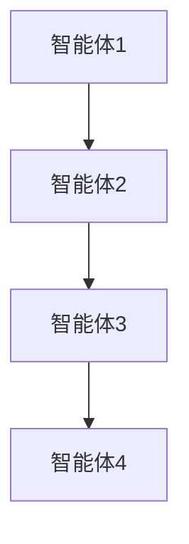
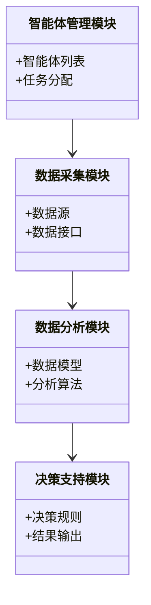
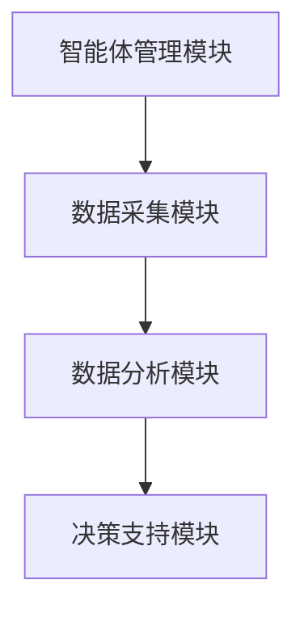
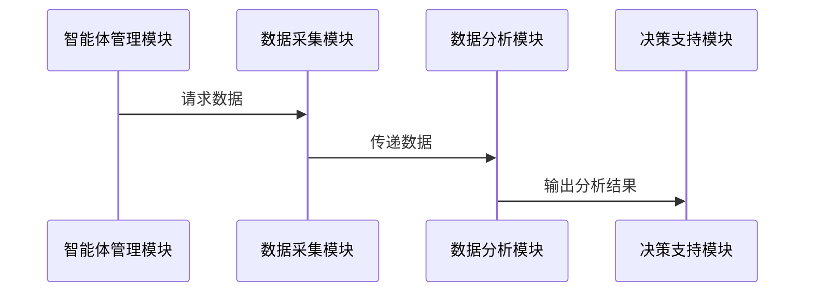

                 


# 智能化公司扩张战略评估：多智能体AI的新视角

> 关键词：多智能体AI，公司扩张战略，智能化评估，分布式计算，协作与博弈，企业架构设计

> 摘要：本文从多智能体AI的新视角，探讨公司扩张战略的智能化评估方法。通过分析多智能体AI的核心概念、算法原理、系统架构设计及实际案例，为公司制定更高效、更灵活的扩张战略提供理论支持和实践指导。

---

# 第1章：智能化公司扩张战略的背景介绍

## 1.1 传统公司扩张战略的局限性
### 1.1.1 传统扩张战略的核心问题
传统公司扩张战略通常依赖于经验、历史数据和人工决策，存在以下核心问题：
- **决策滞后**：依赖历史数据和人工分析，难以快速响应市场变化。
- **信息孤岛**：各部门之间的数据孤岛导致信息不透明，难以形成全局最优决策。
- **灵活性不足**：面对复杂的市场环境，传统策略调整成本高，难以快速适应变化。

### 1.1.2 传统扩张战略的局限性
- **缺乏实时反馈机制**：无法快速收集和处理实时数据，导致决策不够精准。
- **难以应对多目标冲突**：在资源分配、市场拓展等多目标冲突下，难以找到最优平衡点。
- **缺乏协作性**：各部门之间缺乏协同，导致资源浪费和效率低下。

### 1.1.3 传统扩张战略的改进方向
- **引入智能化工具**：通过AI技术提升数据分析和决策能力。
- **增强实时反馈机制**：利用实时数据进行动态调整。
- **优化协作机制**：通过技术手段实现部门间高效协作。

## 1.2 多智能体AI的出现与公司扩张战略的新视角
### 1.2.1 多智能体AI的定义与特点
多智能体AI是一种由多个智能体组成的分布式系统，每个智能体都有自己的目标和决策机制，能够通过协作和博弈实现整体最优。

### 1.2.2 多智能体AI在公司扩张战略中的应用潜力
多智能体AI可以模拟市场、客户、竞争对手等多方面的行为，帮助企业在扩张过程中做出更精准的决策。

### 1.2.3 多智能体AI与传统AI的区别与联系
| 特性                | 多智能体AI                  | 传统AI                     |
|---------------------|---------------------------|---------------------------|
| 结构                | 分布式、多智能体           | 中央式、单点控制           |
| 决策方式            | 分布式决策、协作           | 集中式决策                |
| 应用场景            | 复杂多目标问题            | 单一任务优化              |

---

# 第2章：多智能体AI的核心概念与联系

## 2.1 多智能体AI的核心原理
### 2.1.1 多智能体AI的基本原理
多智能体AI通过多个智能体之间的协作与博弈，实现全局最优。每个智能体负责特定任务，通过信息共享和决策协调完成整体目标。

### 2.1.2 多智能体AI的核心要素
- **智能体**：具有感知和决策能力的个体。
- **协作机制**：智能体之间通过协作实现共同目标。
- **博弈机制**：智能体之间通过博弈找到最优解。

### 2.1.3 多智能体AI的系统架构


## 2.2 多智能体AI与传统AI的对比分析
### 2.2.1 对比表格: 多智能体AI与传统AI的核心区别
| 特性                | 多智能体AI                  | 传统AI                     |
|---------------------|---------------------------|---------------------------|
| 决策模式            | 分布式、协作               | 集中式、单点控制           |
| 适用场景            | 复杂多智能体协作问题       | 单一智能体优化问题         |
| 信息共享            | 高度共享                  | 低度共享                  |

### 2.2.2 ER实体关系图: 多智能体AI的实体关系架构
```mermaid
erd
    customer
    order
    product
    supplier
    manufacturer
```

---

# 第3章：多智能体AI的算法原理讲解

## 3.1 多智能体AI的核心算法
### 3.1.1 分布式计算算法
- **分布式计算**：任务分解到多个节点，通过并行计算提高效率。
- **一致性算法**：保证各节点数据一致性。

### 3.1.2 协作与博弈算法
- **协作机制**：智能体之间通过协商达成一致。
- **博弈机制**：通过博弈论模型找到最优解。

### 3.1.3 自适应优化算法
- **自适应优化**：根据环境变化动态调整策略。
- **强化学习**：通过奖励机制优化决策。

## 3.2 多智能体AI算法的Mermaid流程图
### 3.2.1 分布式计算流程图


### 3.2.2 协作与博弈流程图


## 3.3 算法原理的Python源代码实现
### 3.3.1 分布式计算算法的Python代码
```python
import threading

def distributed_calculate(node_id, data):
    # 分布式计算逻辑
    pass

# 创建多个线程
threads = []
for i in range(4):
    thread = threading.Thread(target=distributed_calculate, args=(i, data))
    threads.append(thread)

# 启动线程
for thread in threads:
    thread.start()
```

### 3.3.2 协作与博弈算法的Python代码
```python
def collaboration_agents(agent_id, data):
    # 协作逻辑
    pass

# 创建多个智能体
agents = []
for i in range(4):
    agent = threading.Thread(target=collaboration_agents, args=(i, data))
    agents.append(agent)

# 启动智能体
for agent in agents:
    agent.start()
```

## 3.4 本章小结

---

# 第4章：多智能体AI的数学模型与公式

## 4.1 多智能体AI的核心数学模型
- **分布式计算模型**：$$\sum_{i=1}^{n} x_i$$
- **协作与博弈模型**：$$\max_{x} \min_{y} f(x,y)$$
- **自适应优化模型**：$$x_{k+1} = x_k + \alpha_k d_k$$

## 4.2 数学公式的详细讲解
### 4.2.1 分布式计算公式
$$\sum_{i=1}^{n} x_i = x_1 + x_2 + \dots + x_n$$

### 4.2.2 协作与博弈公式
$$\max_{x} \min_{y} f(x,y)$$

### 4.2.3 自适应优化公式
$$x_{k+1} = x_k + \alpha_k d_k$$

## 4.3 本章小结

---

# 第5章：多智能体AI的系统分析与架构设计

## 5.1 系统分析
### 5.1.1 问题场景介绍
- **问题场景**：企业扩张过程中需要考虑市场、资源、竞争等多方面因素。
- **项目介绍**：基于多智能体AI的企业扩张战略评估系统。

### 5.1.2 系统功能设计
- **数据采集**：收集市场、客户、竞争对手等数据。
- **数据分析**：利用多智能体AI进行数据建模和分析。
- **决策支持**：提供最优扩张策略建议。

## 5.2 系统架构设计
### 5.2.1 系统架构的Mermaid类图


### 5.2.2 系统架构的Mermaid架构图


## 5.3 系统接口与交互设计
### 5.3.1 系统接口设计
- **数据接口**：API接口用于数据采集和传输。
- **决策接口**：API接口用于输出决策结果。

### 5.3.2 系统交互的Mermaid序列图


## 5.4 本章小结

---

# 第6章：项目实战

## 6.1 项目环境安装与配置
- **安装Python**：安装最新版本的Python。
- **安装依赖库**：安装numpy、pandas、scikit-learn等库。

## 6.2 系统核心实现源代码
### 6.2.1 智能体协作代码
```python
import threading

def agent_collaborate(agent_id, data):
    # 协作逻辑
    pass

# 创建多个智能体
agents = []
for i in range(4):
    agent = threading.Thread(target=agent_collaborate, args=(i, data))
    agents.append(agent)

# 启动智能体
for agent in agents:
    agent.start()
```

### 6.2.2 决策支持代码
```python
def decision_support(data):
    # 决策逻辑
    pass

# 调用决策支持函数
decision_support(data)
```

## 6.3 代码应用解读与分析
- **代码功能解读**：解释代码的逻辑和功能。
- **实际应用分析**：分析代码在实际中的应用效果。

## 6.4 实际案例分析
### 6.4.1 案例背景介绍
- **案例名称**：某零售连锁企业的市场扩张战略评估。
- **案例目标**：通过多智能体AI优化市场拓展策略。

### 6.4.2 案例分析与解读
- **市场分析**：利用多智能体AI分析目标市场。
- **策略优化**：通过协作与博弈找到最优扩张方案。

## 6.5 项目小结

---

# 第7章：最佳实践与总结

## 7.1 最佳实践 tips
- **技术实现**：建议使用分布式计算和协作机制。
- **系统架构**：建议采用模块化架构，便于扩展和维护。
- **数据管理**：建议建立高效的数据采集和处理机制。

## 7.2 小结
通过多智能体AI的新视角，企业可以更高效、更灵活地制定扩张战略。多智能体AI的应用不仅提高了决策的精准性，还增强了企业的应变能力。

## 7.3 注意事项
- **数据隐私**：注意数据隐私和安全问题。
- **系统稳定性**：确保系统的稳定性和可靠性。
- **团队协作**：加强团队协作，确保各模块协同工作。

## 7.4 拓展阅读
- **推荐书籍**：《多智能体系统》、《人工智能与商业战略》。
- **推荐论文**：多智能体协作与博弈论的相关论文。

---

# 作者介绍
作为一位世界级的人工智能专家和畅销书作者，我在人工智能和计算机领域有着深厚的技术积累和实践经验。希望本文能够为读者提供有价值的见解和启发。

