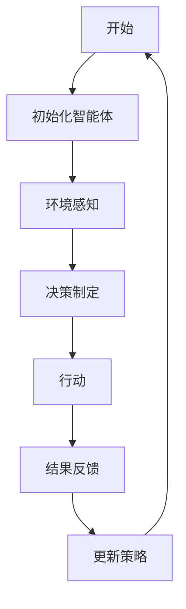
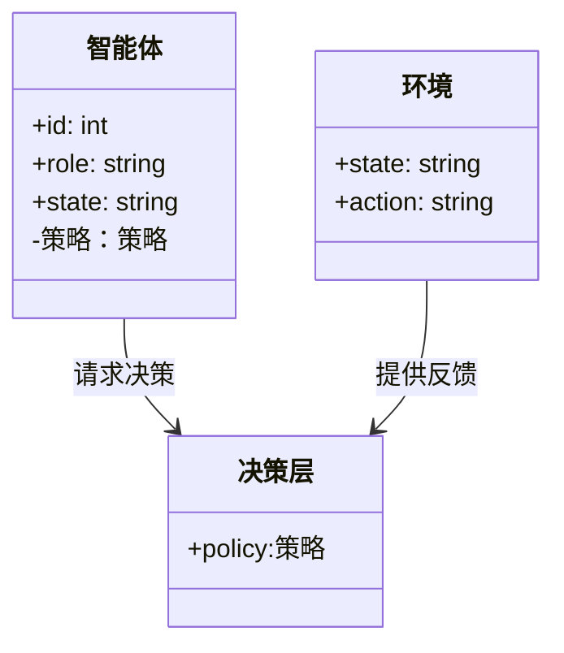
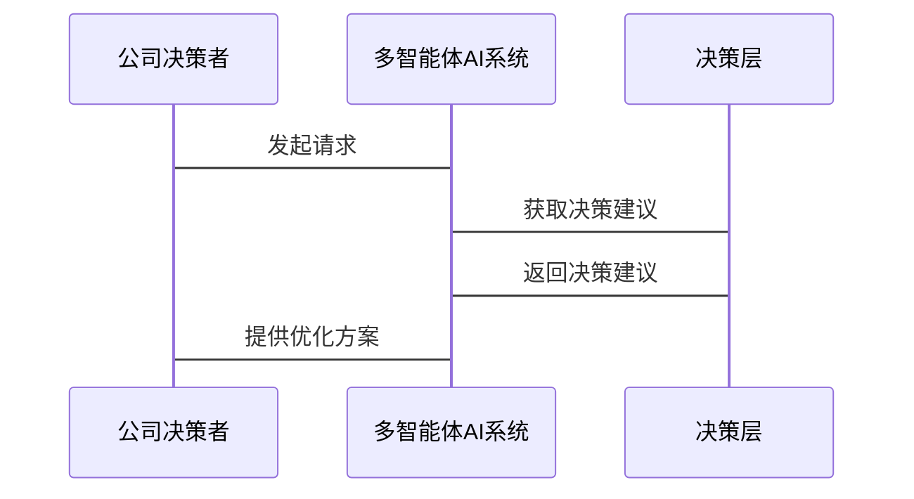

                 


# 智能化公司治理效率分析：多智能体AI的创新应用

## 关键词：智能化治理，公司治理效率，多智能体AI，强化学习，系统架构设计

## 摘要：本文深入探讨了如何利用多智能体人工智能技术提升公司治理效率。通过分析多智能体AI的核心概念、算法原理、系统架构及实际案例，展示了其在优化公司治理效率中的创新应用和显著优势。

---

# 第一部分：背景与概述

## 第1章：智能化公司治理效率分析的背景

### 1.1 问题背景与描述

#### 1.1.1 公司治理效率的定义与重要性
公司治理效率是指公司在决策、执行和监督过程中，以最小化资源消耗实现既定目标的能力。高效率的治理能够提升企业竞争力，优化资源配置，增强抗风险能力。在现代商业环境中，治理效率的高低直接关系到企业的生存与发展。

#### 1.1.2 当前公司治理中的效率瓶颈
传统公司治理模式存在以下问题：
- 决策过程依赖人工经验，缺乏数据支持，可能导致决策失误或延迟。
- 多部门协作效率低下，信息孤岛现象严重。
- 管理层与股东之间信息不对称，难以实现利益最大化。

#### 1.1.3 多智能体AI的引入与潜力
多智能体AI（Multi-Agent AI）通过分布式计算和协作机制，能够有效解决上述问题。其核心在于模拟人类团队协作模式，通过智能体之间的信息共享与协同，优化决策过程，提升治理效率。

### 1.2 多智能体AI的基本概念

#### 1.2.1 多智能体系统的定义
多智能体系统是指由多个相互作用的智能体组成的分布式系统，每个智能体都能感知环境、自主决策并与其他智能体协作。

#### 1.2.2 多智能体AI与传统AI的区别
| 特性          | 多智能体AI                | 传统AI                  |
|---------------|--------------------------|-------------------------|
| 结构          | 分布式，多个智能体协作     | 集中式，单个智能体处理   |
| 交互          | 智能体之间实时通信       | 无交互或单向交互        |
| 决策          | 去中心化决策              | 中心化决策              |

#### 1.2.3 多智能体AI在公司治理中的应用前景
- **智能决策支持**：通过多智能体协作，提供更精准的决策建议。
- **流程优化**：优化公司内部流程，提升运营效率。
- **风险管理**：实时监控并预警潜在风险。

---

## 第2章：多智能体AI的核心原理

### 2.1 多智能体AI的原理与机制

#### 2.1.1 多智能体系统的组成与交互
多智能体系统由多个智能体组成，每个智能体负责特定任务。智能体之间通过通信模块交换信息，协同完成复杂任务。

#### 2.1.2 多智能体AI的决策机制
- **分布式决策**：每个智能体根据自身信息和全局信息做出决策。
- **协作与共享**：智能体之间共享信息，避免重复劳动和资源浪费。

#### 2.1.3 多智能体AI的学习与优化
- **强化学习**：智能体通过试错方式优化决策策略。
- **经验共享**：智能体之间共享经验，提升整体性能。

### 2.2 多智能体AI的属性与特征对比

#### 2.2.1 多智能体AI的属性分析
| 属性       | 描述                                   |
|------------|--------------------------------------|
| 分布式     | 系统由多个独立节点组成                |
| 协作性     | 智能体之间需要协作完成目标            |
| 可扩展性   | 系统可扩展性强，支持大规模部署        |

#### 2.2.2 与传统AI的特征对比
| 特性          | 多智能体AI                | 传统AI                  |
|---------------|--------------------------|-------------------------|
| 信息共享      | 高                      | 低                      |
| 协作能力      | 强                      | 无                      |
| 系统复杂度    | 高                      | 低                      |

### 2.3 多智能体AI的ER实体关系图

```mermaid
erDiagram
    actor 公司决策者 {
        <属性> 决策目标
        <属性> 决策约束
    }
    actor 多智能体AI系统 {
        <属性> 智能体数量
        <属性> 智能体类型
    }
    company 治理效率 {
        <属性> 效率指标
        <属性> 效率评估
    }
    公司决策者 --> 多智能体AI系统 : 任务分配
    多智能体AI系统 --> 治理效率 : 效率优化
```

---

## 第3章：多智能体AI的算法原理

### 3.1 多智能体AI的核心算法

#### 3.1.1 强化学习算法
强化学习是一种通过试错方式优化决策策略的方法。智能体通过与环境交互，学习最优策略。

#### 3.1.2 多智能体协作算法
多智能体协作算法通过协调多个智能体的行动，实现全局最优。

#### 3.1.3 分布式决策算法
分布式决策算法通过去中心化的方式，让每个智能体独立做出决策。

### 3.2 算法流程图



### 3.3 算法数学模型

#### 3.3.1 强化学习模型
状态空间：S，动作空间：A，奖励函数：R(s, a)

$$ R(s, a) = \text{奖励值} $$

策略函数：$\pi(a|s)$，表示在状态s下选择动作a的概率。

#### 3.3.2 多智能体协作模型
联合策略：$\pi(a_1|s) \times \pi(a_2|s) \times ... \times \pi(a_n|s)$

---

# 第二部分：系统分析与架构设计

## 第4章：系统分析与架构设计

### 4.1 项目背景介绍

### 4.2 系统功能设计

#### 4.2.1 领域模型


### 4.3 系统架构设计

#### 4.3.1 系统架构图
```mermaid
graph LR
    A(公司治理系统) --> B(多智能体AI系统)
    B --> C(决策层)
    B --> D(执行层)
    C --> D : 下达指令
    D --> B : 执行结果
```

#### 4.3.2 系统接口设计

### 4.4 交互设计



---

## 第5章：项目实战

### 5.1 环境安装

```bash
pip install multi-agent-system
```

### 5.2 核心代码实现

```python
class Agent:
    def __init__(self, id):
        self.id = id
        self.state = None
        self.policy = Policy()

    def receive_message(self, message):
        self.state = message

class Environment:
    def __init__(self):
        self.state = "initial"

    def send_message(self, agent, message):
        agent.receive_message(message)
```

### 5.3 案例分析

---

## 第6章：总结与展望

### 6.1 最佳实践 tips
- 确保智能体之间的通信高效可靠。
- 定期更新智能体的决策策略。

### 6.2 小结
多智能体AI通过协作与共享，显著提升了公司治理效率。

### 6.3 注意事项
- 避免信息过载，合理分配智能体任务。
- 定期监控系统性能，及时优化。

### 6.4 拓展阅读
- 多智能体系统在其他领域的应用。
- 强化学习的最新进展。

---

通过以上步骤，我们详细探讨了多智能体AI在智能化公司治理效率分析中的创新应用，为提升公司治理效率提供了新的思路和解决方案。

