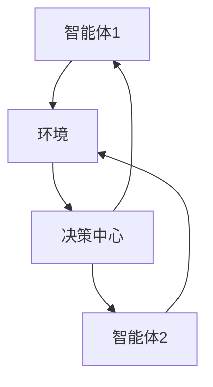
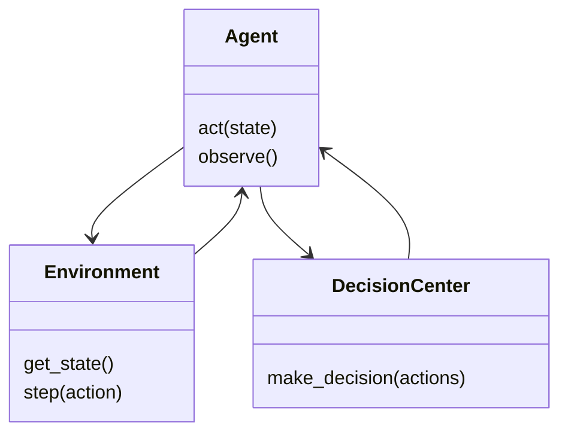
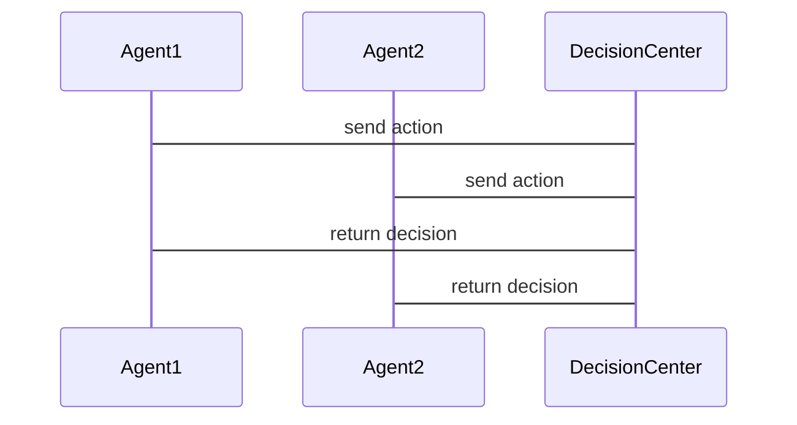

                 


# 智能化公司治理评估：多智能体AI在价值投资中的应用

---

## 关键词：多智能体AI, 公司治理, 价值投资, 智能化评估, 投资决策

---

## 摘要：

随着人工智能技术的快速发展，多智能体AI在金融领域的应用越来越广泛。本文深入探讨了多智能体AI在公司治理评估和价值投资中的应用，分析了其核心概念、算法原理及系统架构。通过实际案例分析，展示了多智能体AI在提升公司治理效率和优化投资决策中的巨大潜力。

---

# 第一部分：智能化公司治理评估的背景与核心概念

## 第1章：智能化公司治理评估的背景与问题描述

### 1.1 传统公司治理的局限性

- **传统公司治理**：依赖人工分析，效率低、主观性强。
- **主要问题**：信息处理复杂，决策延迟，难以应对动态市场变化。
- **挑战**：数据量大、维度多，传统方法难以有效处理。

### 1.2 价值投资的核心理念

- **价值投资**：寻找被市场低估的企业，长期持有。
- **传统方法的局限**：依赖经验判断，主观性强，难以量化。

### 1.3 多智能体AI的应用前景

- **多智能体AI的优势**：分布协作、自适应能力强。
- **应用潜力**：提高信息处理效率，优化投资决策。

---

## 第2章：多智能体AI的核心概念与原理

### 2.1 多智能体系统的基本结构

- **定义**：由多个智能体组成的协作系统。
- **组成要素**：智能体、环境、通信机制。
- **功能模块**：感知、决策、执行。

### 2.2 多智能体AI与传统AI的区别

| 特性 | 多智能体AI | 传统AI |
|------|------------|--------|
| 结构  | 分布式     | 集中式 | 
| 交互  | 高         | 低      |
| 灵活性 | 高         | 低      |

### 2.3 多智能体AI的核心算法

#### 博弈论基础
- **纳什均衡**：$Nash Equilibrium$。
- **囚徒困境**：$Prisoner's Dilemma$。

#### Q-learning公式
$$ Q(s, a) = (r + \gamma \max Q(s', a')) $$

---

## 第3章：多智能体AI在价值投资中的应用

### 3.1 信息处理需求

- **信息类型**：财务数据、市场动态、公司治理。
- **处理复杂性**：多维度分析、实时更新。

### 3.2 风险评估

- **案例分析**：使用多智能体AI评估某企业的信用风险。

### 3.3 投资决策

- **流程优化**：多智能体协作提升决策效率。

---

# 第四部分：多智能体AI的算法实现

## 第4章：多智能体AI的算法实现

### 4.1 算法流程图



### 4.2 Python代码实现

```python
import numpy as np
from collections import defaultdict

class MultiAgent:
    def __init__(self, agents):
        self.agents = agents
        self.state = None

    def step(self, state):
        actions = []
        for agent in self.agents:
            action = agent.act(state)
            actions.append(action)
        return actions
```

### 4.3 数学模型

$$ V(s) = \max_{a} \min_{a'} Q(s, a) $$

---

# 第五部分：系统设计与实现

## 第5章：系统设计与实现

### 5.1 系统架构设计



### 5.2 接口设计

- **API**：提供REST接口，供外部调用。

### 5.3 序列图



---

# 第六部分：项目实战

## 第6章：项目实战

### 6.1 环境安装

- **依赖**：安装Python、TensorFlow、Keras。

### 6.2 核心代码实现

```python
def multi_agent_learning():
    agents = [Agent1(), Agent2()]
    environment = MarketEnvironment()
    decision_center = DecisionCenter()
    while True:
        state = environment.get_state()
        actions = [agent.act(state) for agent in agents]
        decision = decision_center.make_decision(actions)
        environment.step(decision)
```

### 6.3 案例分析

- **案例**：分析某公司的治理结构，预测其股价走势。

---

## 第7章：总结与展望

### 7.1 总结

- **核心观点**：多智能体AI提升公司治理评估效率。
- **成功经验**：算法优化和系统设计的关键作用。

### 7.2 展望

- **未来方向**：结合大数据，探索更复杂的决策模型。
- **挑战**：数据隐私、模型可解释性。

---

## 致谢

感谢读者的关注，期待进一步探讨与合作。

