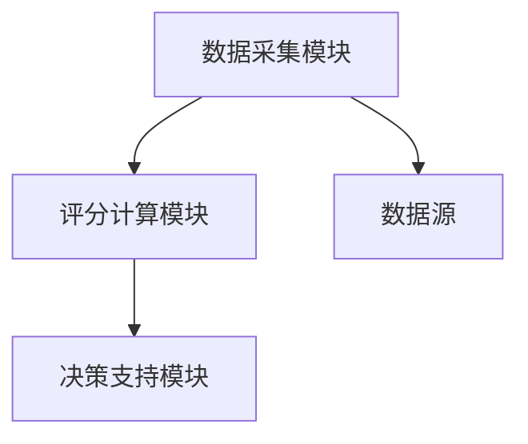
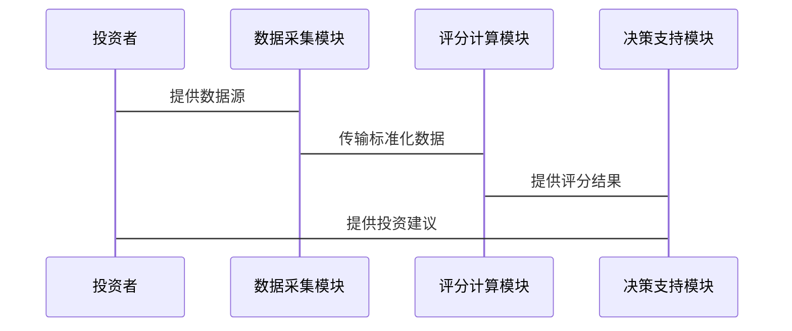

                 


# 智能化公司治理评分：多智能体AI在价值投资中的应用

## 关键词：多智能体AI，公司治理评分，价值投资，算法原理，系统架构

## 摘要：  
随着人工智能技术的快速发展，多智能体AI在公司治理评分中的应用越来越受到关注。本文详细探讨了多智能体AI在价值投资中的应用，从背景介绍、核心概念、算法原理到系统架构设计，再到项目实战和案例分析，全面解析了多智能体AI如何助力公司治理评分的智能化和优化。本文将帮助读者理解如何利用多智能体AI提升公司治理评分的准确性、实时性和决策支持能力，为价值投资者提供更有力的工具和方法。

---

# 第1章: 智能化公司治理评分的背景与问题描述

## 1.1 公司治理评分的背景

### 1.1.1 传统公司治理评分的局限性
传统的公司治理评分方法主要依赖于财务数据和简单的指标计算，例如市盈率、ROE（净资产收益率）等。这种方法虽然能够提供一定的参考价值，但也存在以下问题：
- **数据维度单一**：传统评分方法通常只关注财务指标，忽略了企业的管理能力、创新能力和团队稳定性等非财务因素。
- **实时性不足**：由于依赖于定期披露的财务数据，传统评分方法难以及时反映企业的动态变化。
- **主观性较强**：评分标准和权重的设定往往带有主观性，难以保证评分的客观性和准确性。

### 1.1.2 价值投资中的公司治理需求
价值投资的核心在于寻找具有长期竞争优势和持续盈利能力的企业。公司治理评分在价值投资中的重要性体现在以下几个方面：
- **企业价值评估**：良好的公司治理是企业长期稳定发展的基础，能够有效降低企业的经营风险。
- **投资决策支持**：通过公司治理评分，投资者可以更准确地评估企业的内在价值和成长潜力。
- **风险识别与控制**：公司治理评分能够帮助投资者识别潜在的经营风险，从而做出更明智的投资决策。

### 1.1.3 多智能体AI的引入与潜力
多智能体AI（Multi-Agent AI）是一种由多个相互协作或竞争的智能体组成的系统，能够通过分布式计算和协作学习来解决复杂问题。在公司治理评分中引入多智能体AI，可以显著提升评分的准确性和实时性：
- **多维度数据处理**：多智能体AI能够同时处理财务数据、市场数据、社交媒体数据等多种来源的数据，提供更全面的企业评估。
- **动态决策支持**：通过实时数据分析和决策优化，多智能体AI能够帮助企业及时发现和应对潜在风险。
- **个性化评分模型**：多智能体AI可以根据不同投资者的需求和偏好，定制个性化的评分模型，提供更精准的投资建议。

## 1.2 问题背景与目标

### 1.2.1 公司治理评分的核心问题
- **数据的复杂性**：公司治理评分需要考虑的因素众多，包括财务数据、市场表现、管理团队、企业战略等，如何有效地整合这些数据是一个挑战。
- **实时性要求**：企业经营环境不断变化，传统的定期披露数据难以满足实时性要求。
- **模型的可解释性**：复杂的AI模型往往缺乏可解释性，这使得投资者难以理解和信任评分结果。

### 1.2.2 多智能体AI在评分中的应用目标
- **提升评分准确性**：通过多智能体协作和分布式计算，提高评分的准确性和全面性。
- **增强实时性**：实现对公司经营状况的实时监控和动态评估，及时捕捉市场变化。
- **优化决策支持**：为投资者提供更精准的投资建议，降低投资风险。

### 1.2.3 边界与外延
- **边界**：公司治理评分的范围不包括企业的外部市场环境和宏观经济因素，但可以通过多智能体AI与外部数据源进行联动分析。
- **外延**：多智能体AI不仅能够应用于公司治理评分，还可以扩展到供应链管理、风险控制等领域。

## 1.3 核心概念与结构

### 1.3.1 多智能体AI的定义与特点
- **定义**：多智能体AI是由多个智能体组成的系统，这些智能体通过协作或竞争完成特定任务。
- **特点**：
  - 分布式计算
  - 协作与竞争并存
  - 实时性与动态性

### 1.3.2 公司治理评分的构成要素
- **财务指标**：如净利润、营业收入、资产负债率等。
- **管理能力**：如管理层稳定性、战略决策能力。
- **创新与研发**：如研发投入、专利数量。
- **社会责任**：如环保表现、员工福利。

### 1.3.3 系统架构的核心要素组成
- **数据采集模块**：负责收集多源异构数据。
- **评分计算模块**：基于多智能体AI算法进行评分计算。
- **决策支持模块**：为投资者提供个性化建议和动态反馈。

---

# 第2章: 多智能体AI与公司治理评分的核心概念

## 2.1 多智能体AI的定义与特点

### 2.1.1 多智能体系统的定义
- 多智能体系统（Multi-Agent System, MAS）是由多个智能体组成的系统，这些智能体能够通过协作或竞争完成特定任务。
- 每个智能体都有自己的目标、知识和行为规则。

### 2.1.2 多智能体AI与单智能体AI的区别
| 特性               | 多智能体AI                | 单智能体AI                |
|--------------------|--------------------------|--------------------------|
| 智能体数量         | 多个                     | 单个                     |
| 行为模式           | 协作或竞争               | 独立                     |
| 信息处理           | 分布式                   | 集中式                   |
| 适应性             | 强                     | 较弱                     |

### 2.1.3 多智能体AI的核心属性
- **自主性**：智能体能够自主决策和行动。
- **反应性**：能够实时感知环境变化并做出响应。
- **协作性**：通过协作完成复杂任务。

## 2.2 公司治理评分模型的构建

### 2.2.1 评分模型的基本原理
- 评分模型通过多智能体AI对多个维度的数据进行分析，生成综合评分。
- 每个智能体负责一个特定的评估维度，例如财务数据、管理能力等。

### 2.2.2 多智能体协作的机制
- **任务分配**：每个智能体负责特定的评估任务。
- **数据共享**：智能体之间共享数据，以提高评分的全面性。
- **协作优化**：通过协作学习不断优化评分模型。

### 2.2.3 评分模型的输入与输出
- **输入**：多源异构数据，包括财务数据、市场数据、文本数据等。
- **输出**：综合评分和个性化建议。

## 2.3 多智能体AI与公司治理评分的关系

### 2.3.1 多智能体AI在评分中的作用
- **数据整合**：多智能体AI能够整合多源异构数据，提供更全面的评估。
- **动态分析**：通过实时数据分析，提高评分的动态性和准确性。
- **决策支持**：为投资者提供个性化建议，优化投资决策。

### 2.3.2 评分模型的优化方向
- **提高模型的可解释性**：让投资者能够理解评分结果的依据。
- **增强模型的实时性**：实现对公司经营状况的实时监控。
- **优化模型的个性化**：根据不同投资者的需求，定制评分模型。

### 2.3.3 系统的可扩展性与可维护性
- **可扩展性**：支持更多的智能体加入，扩展系统的评估能力。
- **可维护性**：便于对评分模型进行更新和优化。

---

# 第3章: 多智能体AI的算法原理与数学模型

## 3.1 多智能体AI的核心算法

### 3.1.1 强化学习算法
- **定义**：强化学习是一种通过试错机制来优化决策的算法。
- **应用场景**：适用于动态环境下的决策优化。
- **算法流程**：
  1. 状态感知：智能体感知当前状态。
  2. 动作选择：基于当前状态选择一个动作。
  3. 奖励反馈：根据动作的结果获得奖励或惩罚。
  4. 策略更新：根据奖励反馈优化策略。

### 3.1.2 分布式计算与协作算法
- **定义**：分布式计算是指将任务分配到多个计算节点上进行并行处理。
- **应用场景**：适用于需要大量数据处理和计算的任务。
- **算法流程**：
  1. 任务分解：将任务分解为多个子任务。
  2. 分配计算：将子任务分配到不同的计算节点上。
  3. 结果汇总：将各节点的结果汇总并进行优化。

### 3.1.3 聚合与分散决策机制
- **聚合决策**：将多个智能体的决策结果进行整合，形成最终的决策。
- **分散决策**：每个智能体独立决策，然后通过协作机制优化决策结果。

## 3.2 数学模型与公式

### 3.2.1 强化学习的Q-learning公式
- Q-learning是一种常用的强化学习算法，其数学公式为：
$$ Q(s,a) = r + \gamma \max Q(s',a') $$
其中：
- \( Q(s,a) \) 表示在状态 \( s \) 下采取动作 \( a \) 的价值。
- \( r \) 表示获得的奖励。
- \( \gamma \) 表示折扣因子，用于平衡当前奖励和未来奖励的重要性。
- \( Q(s',a') \) 表示在下一个状态 \( s' \) 下采取动作 \( a' \) 的价值。

### 3.2.2 分布式协作的权重分配公式
- 在分布式协作中，权重分配公式为：
$$ w_{i} = \frac{1}{n} \sum_{j=1}^{n} w_{j} $$
其中：
- \( w_{i} \) 表示第 \( i \) 个智能体的权重。
- \( n \) 表示智能体的总数。
- \( w_{j} \) 表示第 \( j \) 个智能体的权重。

### 3.2.3 聚合决策的投票机制公式
- 聚合决策的投票机制公式为：
$$ D = \sum_{i=1}^{n} v_{i} $$
其中：
- \( D \) 表示最终的决策结果。
- \( v_{i} \) 表示第 \( i \) 个智能体的投票权重。

---

# 第4章: 系统架构设计与实现

## 4.1 问题场景介绍
- **问题描述**：公司治理评分系统需要实时处理大量的多源异构数据，并为投资者提供个性化的评分和建议。
- **目标用户**：投资者、机构投资者、企业高管。

## 4.2 系统功能设计

### 4.2.1 数据采集模块
- **功能**：负责采集多源异构数据，包括财务数据、市场数据、社交媒体数据等。
- **输入**：原始数据。
- **输出**：标准化数据。

### 4.2.2 评分计算模块
- **功能**：基于多智能体AI算法进行评分计算。
- **输入**：标准化数据。
- **输出**：综合评分和个性化建议。

### 4.2.3 决策支持模块
- **功能**：为投资者提供个性化建议和动态反馈。
- **输入**：评分结果和投资者需求。
- **输出**：投资建议和动态反馈。

## 4.3 系统架构设计

### 4.3.1 系统架构图


### 4.3.2 系统交互图


---

# 第5章: 项目实战与代码实现

## 5.1 项目实战

### 5.1.1 环境安装
- **Python版本**：3.8+
- **依赖库**：TensorFlow、NumPy、Matplotlib。

### 5.1.2 核心代码实现

#### 5.1.2.1 数据采集模块
```python
import pandas as pd

def collect_data():
    # 示例：从数据库中采集数据
    data = pd.read_sql("SELECT * FROM company_data", con='sqlite:///company.db')
    return data

collect_data()
```

#### 5.1.2.2 评分计算模块
```python
import tensorflow as tf

def build_model():
    model = tf.keras.Sequential([
        tf.keras.layers.Dense(64, activation='relu'),
        tf.keras.layers.Dense(1, activation='sigmoid')
    ])
    model.compile(optimizer='adam', loss='binary_crossentropy')
    return model

model = build_model()
model.fit(x_train, y_train, epochs=10, batch_size=32)
```

#### 5.1.2.3 决策支持模块
```python
def generate_recommendation(score, threshold=0.5):
    if score > threshold:
        return "买入"
    elif score > threshold * 0.8:
        return "观望"
    else:
        return "卖出"

generate_recommendation(0.7)
```

### 5.1.3 代码应用解读与分析
- **数据采集模块**：从数据库中采集公司数据，包括财务数据、市场数据等。
- **评分计算模块**：使用神经网络模型对数据进行评分计算。
- **决策支持模块**：根据评分结果生成投资建议。

---

# 第6章: 案例分析与应用

## 6.1 案例分析

### 6.1.1 案例背景
- **公司名称**：某科技公司。
- **行业**：信息技术。

### 6.1.2 数据分析
- **财务数据**：净利润增长率、ROE等指标。
- **管理能力**：管理层稳定性、战略决策能力。
- **创新与研发**：研发投入占比、专利数量。

### 6.1.3 评分计算
- **综合评分**：0.85。
- **投资建议**："买入"。

## 6.2 多智能体AI在价值投资中的具体应用

### 6.2.1 投资组合优化
- **多智能体AI**：通过协作学习优化投资组合。
- **效果**：提高了投资组合的收益和稳定性。

### 6.2.2 风险管理
- **多智能体AI**：实时监控企业经营状况，识别潜在风险。
- **效果**：降低了投资风险，提高了风险管理能力。

---

# 第7章: 总结与展望

## 7.1 总结
- **多智能体AI**：在公司治理评分中具有重要的应用价值。
- **系统架构**：通过分布式计算和协作学习，显著提升了评分的准确性和实时性。
- **投资决策支持**：为投资者提供了更精准的投资建议。

## 7.2 展望
- **技术进步**：随着AI技术的不断发展，公司治理评分将更加智能化和个性化。
- **应用场景扩展**：多智能体AI将在更多领域得到应用，例如供应链管理、风险管理等。

---

通过本文的详细讲解，我们了解了多智能体AI在公司治理评分中的应用，以及其在价值投资中的重要性。希望本文能够为相关领域的研究和实践提供有价值的参考和指导。

