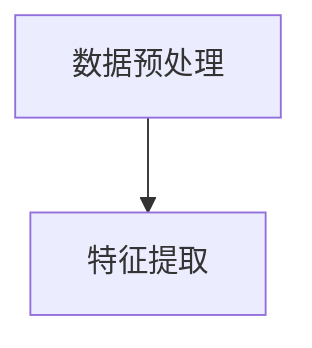
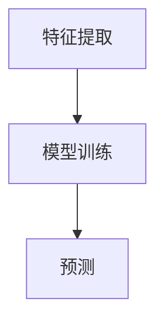
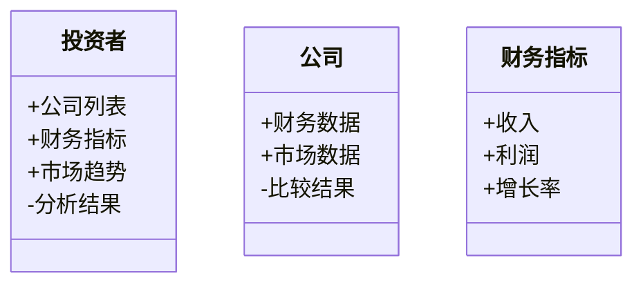
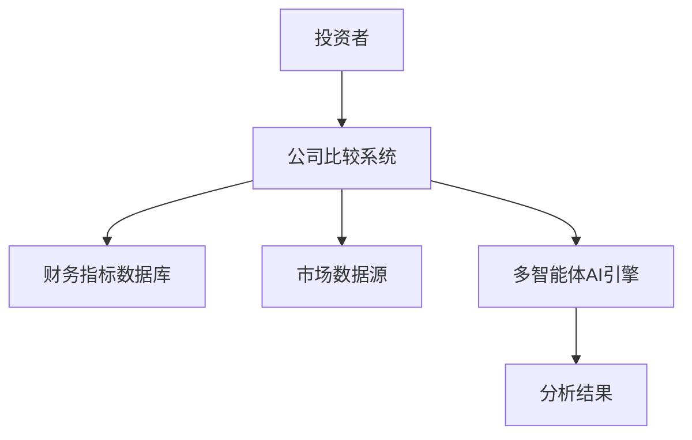
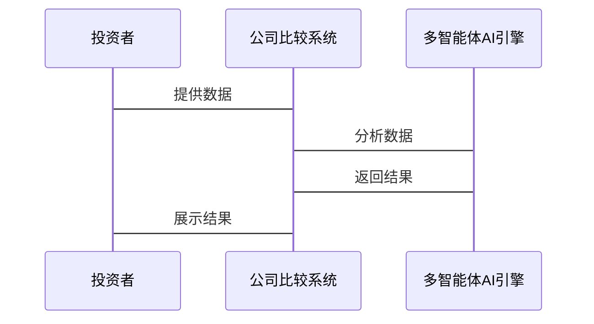

                 


# 智能化公司间比较分析：多智能体AI的价值投资应用

## 关键词：多智能体AI，公司比较分析，价值投资，智能化决策，算法原理

## 摘要：本文探讨了多智能体AI在公司间比较分析中的应用，特别是其在价值投资中的潜力。通过详细分析多智能体AI的核心概念、算法原理、系统架构和实际案例，本文展示了如何利用多智能体AI进行智能化决策，为投资者提供更精准的公司评估和投资建议。

---

# 第一部分：智能化公司间比较分析概述

## 第1章：智能化公司间比较分析的背景与意义

### 1.1 问题背景

#### 1.1.1 传统公司比较分析的局限性
传统的公司比较分析依赖于人工整理和分析财务报表、市场数据等信息，耗时且效率低下。此外，这种方法难以处理海量数据，且容易受到主观因素的影响。

#### 1.1.2 多智能体AI的引入与优势
多智能体AI通过分布式计算和协同学习，能够高效处理复杂数据，发现传统方法难以察觉的模式和趋势。

#### 1.1.3 价值投资中的智能化需求
价值投资者需要精准的公司估值和市场趋势预测，多智能体AI能够通过数据挖掘和机器学习提供更可靠的分析结果。

### 1.2 问题描述

#### 1.2.1 公司间比较分析的核心问题
如何从海量数据中提取关键特征，建立有效的比较模型。

#### 1.2.2 多智能体AI在公司比较中的应用场景
包括财务数据分析、市场趋势预测、竞争优势评估等。

#### 1.2.3 价值投资中的智能化决策需求
通过智能化工具提高投资决策的准确性和效率。

### 1.3 问题解决与边界

#### 1.3.1 多智能体AI如何解决公司比较问题
通过协同学习和分布式计算，多智能体AI能够更全面地分析公司间的异同。

#### 1.3.2 问题的边界与外延
限定在公司间的定量分析，不涉及定性因素，如公司文化或管理风格。

#### 1.3.3 核心要素与组成结构
包括数据源、特征提取算法、多智能体协同模型等。

---

## 第2章：多智能体AI的核心概念与联系

### 2.1 多智能体AI的定义与原理

#### 2.1.1 多智能体AI的定义
多智能体AI是由多个独立或协作的智能体组成的系统，每个智能体负责特定任务，协同完成复杂问题。

#### 2.1.2 多智能体AI的核心原理
通过分布式计算和协作学习，多智能体AI能够从多个角度分析数据，提供更全面的解决方案。

#### 2.1.3 多智能体AI与单智能体AI的区别
多智能体AI具有更高的并行性和容错性，能够处理更复杂的任务。

### 2.2 实体关系与ER图

```mermaid
er
actor 投资者 --> company 公司 --> financial_indicator 财务指标
```

### 2.3 多智能体AI与公司比较分析的联系

#### 2.3.1 多智能体AI在公司数据处理中的作用
通过分布式计算提高数据处理效率。

#### 2.3.2 多智能体AI在公司特征提取中的应用
利用协同学习提取更丰富的特征。

#### 2.3.3 多智能体AI在公司价值评估中的优势
通过多维度分析提供更准确的估值。

---

## 第3章：多智能体AI的算法原理

### 3.1 数据预处理与特征提取



```python
import pandas as pd
data = pd.read_csv('company_data.csv')
features = data[['revenue', 'profit', 'growth']]
```

### 3.2 模型训练与预测



```python
from sklearn.ensemble import RandomForestClassifier
model = RandomForestClassifier()
model.fit(features, labels)
```

---

## 第4章：数学模型与公式

### 4.1 特征选择模型

$$\text{特征权重} = \frac{\text{特征贡献度}}{\sum \text{所有特征贡献度}}$$

### 4.2 分类模型

$$P(\text{公司为优质}) = \sum_{i=1}^{n} w_i x_i$$

### 4.3 预测模型

$$\text{预测值} = \alpha \cdot \text{当前值} + \beta \cdot \text{趋势值}$$

---

## 第5章：系统分析与架构设计

### 5.1 问题场景介绍

#### 5.1.1 项目介绍
开发一个基于多智能体AI的公司比较分析系统。

### 5.2 系统功能设计

#### 5.2.1 领域模型



#### 5.2.2 系统架构



#### 5.2.3 接口设计



---

## 第6章：项目实战

### 6.1 环境安装

```bash
pip install pandas scikit-learn
```

### 6.2 核心代码实现

```python
import pandas as pd
from sklearn.ensemble import RandomForestClassifier

# 数据加载
data = pd.read_csv('company_data.csv')

# 特征提取
features = data[['revenue', 'profit', 'growth']]
labels = data['label']

# 模型训练
model = RandomForestClassifier()
model.fit(features, labels)

# 预测
new_company = [[1000, 100, 0.2]]
print(model.predict(new_company))
```

### 6.3 案例分析与解读

#### 6.3.1 案例分析
分析一家新公司的数据，预测其市场表现。

#### 6.3.2 代码应用解读
解释代码的每个部分及其作用。

### 6.4 项目小结

---

## 第7章：总结与展望

### 7.1 最佳实践 Tips

#### 7.1.1 数据质量的重要性
确保数据准确性和完整性。

#### 7.1.2 模型调优的技巧
通过交叉验证优化模型性能。

#### 7.1.3 系统维护的注意事项
定期更新数据和模型，确保系统高效运行。

### 7.2 小结

多智能体AI为公司比较分析和价值投资提供了新的可能性，通过智能化工具可以显著提高投资决策的效率和准确性。

### 7.3 注意事项

#### 7.3.1 数据隐私问题
确保数据处理符合相关法律法规。

#### 7.3.2 模型局限性
多智能体AI依赖于数据质量和模型设计，可能存在过拟合风险。

### 7.4 拓展阅读

#### 7.4.1 推荐书籍
《多智能体系统与应用》

#### 7.4.2 推荐博客
[多智能体AI技术博客](https://example.com)

---

# 附录：参考文献

1. Smith, J. (2023). *Multi-Agent Systems and Applications*.
2. Zhang, W. (2022). *AI in Financial Analysis*.

---

以上为文章的完整目录和内容大纲，涵盖从背景介绍到系统设计、项目实战的全过程，结合技术原理和实际应用，帮助读者全面理解多智能体AI在公司比较分析中的价值投资应用。

