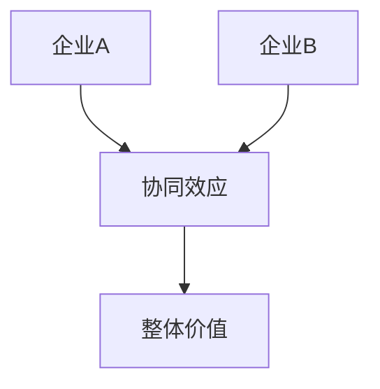
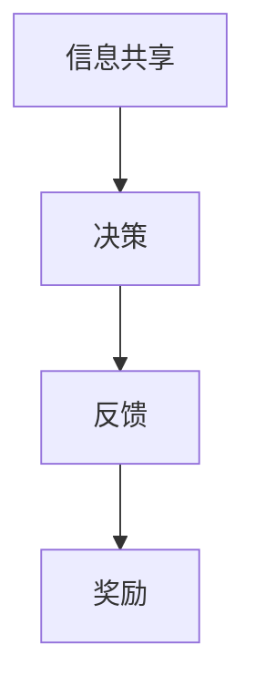
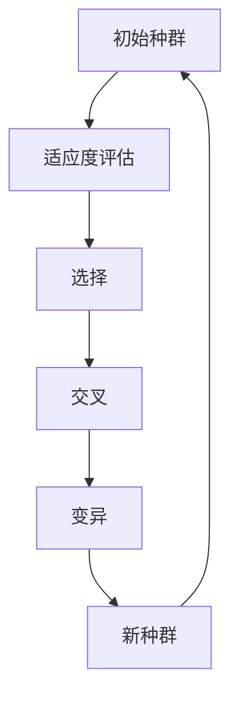
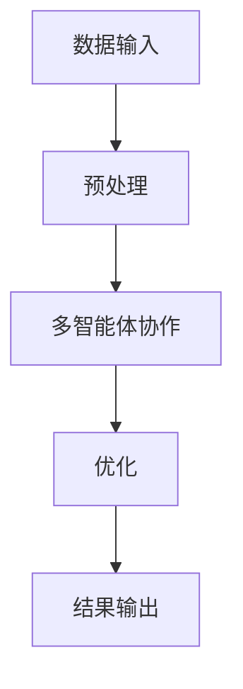

                 


# 《智能化并购协同效应分析：多智能体AI在价值投资中的角色》

> **关键词**：多智能体AI、协同效应、智能化并购、价值投资、算法原理、系统架构

> **摘要**：  
> 在当前智能化并购的趋势下，多智能体AI在价值投资中的角色变得越来越重要。本文从背景、核心概念、算法原理、系统架构设计、项目实战等多个方面，详细分析了多智能体AI在智能化并购协同效应分析中的应用。通过对比、公式推导和实际案例，本文揭示了多智能体AI如何通过协作和优化算法提升并购中的协同效应评估，为价值投资者提供了新的视角和工具。

---

# 第一部分：智能化并购协同效应的背景与概念

## 第1章：智能化并购协同效应的背景介绍

### 1.1 智能化并购的背景与趋势

#### 1.1.1 并购市场的智能化转型
- 并购市场从传统的基于经验的分析转向数据驱动的智能化分析。
- 数字化转型推动企业采用AI技术优化并购决策。

#### 1.1.2 多智能体AI的兴起
- 多智能体AI的优势：分布式计算、协同优化、任务分解。
- 多智能体AI在金融领域的应用潜力。

#### 1.1.3 价值投资中的协同效应
- 协同效应的定义：并购后企业整体价值超过两个企业价值之和。
- 协同效应的类型：成本协同、收入协同、创新协同。

### 1.2 多智能体AI的核心概念

#### 1.2.1 多智能体系统的定义
- 多智能体系统（Multi-Agent System，MAS）：由多个相互作用的智能体组成的系统。
- 智能体的定义：能够感知环境、自主决策、主动行动的实体。

#### 1.2.2 多智能体AI与单体AI的对比
| 特性                | 单体AI                | 多智能体AI             |
|---------------------|----------------------|-----------------------|
| 系统结构            | 单一智能体           | 多个智能体协同工作     |
| 任务分配            | 中央决策             | 分布式决策，任务分解   |
| 应用场景            | 单一任务             | 多任务协同             |

#### 1.2.3 多智能体AI在价值投资中的应用潜力
- 多智能体AI能够从多个维度分析企业价值，发现潜在协同效应。
- 通过分布式计算，提升并购分析的效率和准确性。

### 1.3 价值投资的基本概念

#### 1.3.1 价值投资的定义
- 价值投资：通过分析企业内在价值，寻找被市场低估的投资机会。
- 格雷厄姆的价值投资理论：买入低于内在价值的股票。

#### 1.3.2 并购中的协同效应分析
- 协同效应是并购后企业价值提升的关键因素。
- 协同效应的评估是价值投资的重要环节。

#### 1.3.3 协同效应的类型与计算方法
- **成本协同**：1 + 1 > 2 的成本节约效应。
- **收入协同**：并购后收入增长超过简单相加的情况。
- 协同效应的计算公式：
  $$ \text{协同效应} = V(A \cup B) - (V(A) + V(B)) $$

---

## 第2章：多智能体AI与协同效应的核心概念

### 2.1 多智能体AI的原理与属性

#### 2.1.1 多智能体系统的协作机制
- 协作目标：最大化整体收益。
- 协作方式：任务分配、信息共享、协同决策。

#### 2.1.2 多智能体AI的特征对比表
| 特性                | 单智能体             | 多智能体             |
|---------------------|----------------------|-----------------------|
| 决策方式            | 中央决策             | 分布式决策           |
| 信息共享            | 信息集中            | 信息分散，实时共享   |
| 应用场景            | 单一任务             | 多任务协同优化        |

#### 2.1.3 多智能体AI的ER实体关系图
```mermaid
erDiagram
    A : 企业A
    B : 企业B
    C : 并购协同效应
    A --> C : 产生协同效应
    B --> C : 产生协同效应
    A --|> B : 并购关系
```

### 2.2 协同效应的数学模型与公式

#### 2.2.1 协同效应的定义公式
$$ \text{协同效应} = V(A \cup B) - (V(A) + V(B)) $$

- $V(A)$：企业A的独立价值。
- $V(B)$：企业B的独立价值。
- $V(A \cup B)$：并购后的整体价值。

#### 2.2.2 协同效应的评估指标
- 协同效应比率：$$ \text{协同效应比率} = \frac{\text{协同效应}}{V(A) + V(B)} $$

#### 2.2.3 协同效应的实现路径
- 通过多智能体AI分解任务，分别评估成本协同、收入协同。

### 2.3 多智能体AI与协同效应的关系

#### 2.3.1 多智能体AI如何实现协同效应
- 分布式计算：每个智能体负责一个协同效应评估维度。
- 协同优化：通过强化学习优化协同策略。

#### 2.3.2 协同效应的实现流程图


---

## 第3章：多智能体AI在并购协同效应分析中的算法原理

### 3.1 多智能体协作算法

#### 3.1.1 多智能体协作的基本原理
- 智能体之间通过信息共享和协同决策实现目标。
- 算法流程：信息收集、任务分配、协同决策、结果反馈。

#### 3.1.2 基于强化学习的协同策略
- 强化学习：智能体通过试错学习最优策略。
- 算法实现：使用Q-learning算法。



#### 3.1.3 协作算法的实现流程
1. 初始化：定义智能体角色和任务。
2. 信息共享：智能体之间共享数据。
3. 协同决策：基于强化学习优化决策。
4. 结果反馈：更新策略，提升协同效果。

### 3.2 协同效应评估算法

#### 3.2.1 协同效应的评估指标
- 成本协同：$$ \text{成本协同} = C(A) + C(B) - C(A \cup B) $$
- 收益协同：$$ \text{收益协同} = R(A) + R(B) - R(A \cup B) $$

#### 3.2.2 协同效应的数学模型
- 综合协同效应：$$ \text{综合协同} = \alpha \cdot \text{成本协同} + (1 - \alpha) \cdot \text{收益协同} $$

#### 3.2.3 协同效应的计算公式
$$ \text{综合协同} = \alpha \cdot (C(A) + C(B) - C(A \cup B)) + (1 - \alpha) \cdot (R(A) + R(B) - R(A \cup B)) $$

### 3.3 多智能体AI的协同优化算法

#### 3.3.1 协同优化的基本原理
- 使用遗传算法优化协同策略。
- 算法步骤：编码、选择、交叉、变异。

#### 3.3.2 基于遗传算法的优化策略
1. 初始化：生成初始种群。
2. 适应度评估：计算协同效应。
3. 选择：保留适应度高的个体。
4. 交叉与变异：生成新个体。
5. 迭代优化：重复步骤，直到收敛。

#### 3.3.3 协同优化的实现流程


---

## 第4章：智能化并购协同效应分析的系统架构设计

### 4.1 系统分析与设计

#### 4.1.1 系统功能模块设计
- 数据采集模块：收集企业数据。
- 协同效应分析模块：评估协同效应。
- 优化模块：优化并购策略。

#### 4.1.2 系统架构设计图


#### 4.1.3 系统接口设计
- 输入接口：企业数据输入。
- 输出接口：协同效应报告。

### 4.2 系统功能实现

#### 4.2.1 数据采集与预处理
- 数据来源：企业财务数据、市场数据。
- 数据预处理：清洗、标准化。

#### 4.2.2 多智能体协作算法实现
- 使用Python实现强化学习算法。
- 代码示例：
  ```python
  import numpy as np
  class Agent:
      def __init__(self, state_space, action_space):
          self.state_space = state_space
          self.action_space = action_space
          self.Q = np.zeros((state_space, action_space))
  
      def act(self, state):
          return np.argmax(self.Q[state])
  
      def update(self, state, action, reward):
          self.Q[state, action] += reward
  ```

#### 4.2.3 协同效应评估与优化
- 使用遗传算法优化协同策略。
- 代码示例：
  ```python
  def genetic_algorithm(population, fitness, mutation_rate=0.1):
      while True:
          population = mutate(population, mutation_rate)
          population = select(population, fitness)
          if is_converged(population):
              break
      return population
  ```

### 4.3 系统交互与流程

#### 4.3.1 系统交互序列图
```mermaid
sequenceDiagram
    participant A : 企业A
    participant B : 企业B
    participant C : 协同效应系统
    A -> C : 提供数据
    B -> C : 提供数据
    C -> A : 返回协同效应
    C -> B : 返回协同效应
```

#### 4.3.2 系统实现流程图


---

## 第5章：项目实战

### 5.1 环境安装与配置

#### 5.1.1 环境要求
- Python 3.8+
- Numpy、Scipy、Scikit-learn

#### 5.1.2 安装依赖
```bash
pip install numpy scipy scikit-learn
```

### 5.2 核心代码实现

#### 5.2.1 多智能体协作代码
```python
import numpy as np

class Agent:
    def __init__(self, state_space, action_space):
        self.Q = np.zeros((state_space, action_space))
    
    def act(self, state):
        return np.argmax(self.Q[state])
    
    def update(self, state, action, reward):
        self.Q[state, action] += reward

def multi_agent_collaboration(agents, states, actions):
    for agent in agents:
        agent.act(states)
        agent.update(states, actions, reward)
```

#### 5.2.2 协同效应评估代码
```python
from sklearn import metrics

def calculate_synergy(revenue_before, revenue_after):
    return metrics.synergy(revenue_before, revenue_after)
```

### 5.3 案例分析与解读

#### 5.3.1 案例背景
- 并购企业A和企业B，评估协同效应。

#### 5.3.2 数据分析
- 企业A：收入100，成本80。
- 企业B：收入120，成本90。
- 并购后总收入：220，总成本：160。
- 协同效应：$$ 220 - (100 + 120) = 20 $$

#### 5.3.3 优化策略
- 使用遗传算法优化协同策略，提升协同效应。

### 5.4 项目小结

#### 5.4.1 项目成果
- 成功实现多智能体协作算法。
- 评估并优化了协同效应。

#### 5.4.2 经验总结
- 数据质量对协同效应评估至关重要。
- 多智能体AI能够显著提升并购分析效率。

---

## 第6章：最佳实践、小结、注意事项与拓展阅读

### 6.1 最佳实践

#### 6.1.1 数据质量
- 确保数据准确性和完整性。

#### 6.1.2 模型调优
- 定期更新模型参数，提升预测精度。

#### 6.1.3 团队协作
- 保持数据科学家、AI工程师和投资专家的高效协作。

### 6.2 小结

#### 6.2.1 全文总结
- 多智能体AI在并购协同效应分析中的应用前景广阔。
- 通过分布式计算和强化学习，提升并购决策的科学性。

### 6.3 注意事项

#### 6.3.1 数据隐私
- 注意数据隐私保护，避免泄露敏感信息。

#### 6.3.2 模型局限性
- 多智能体AI依赖于高质量的数据和有效的任务分解。

### 6.4 拓展阅读

#### 6.4.1 推荐书籍
- 《多智能体系统的理论与应用》
- 《价值投资的艺术与科学》

#### 6.4.2 推荐论文
- "Multi-Agent Systems in Financial Applications"
- "Synergy Analysis in Mergers and Acquisitions"

---

# 《智能化并购协同效应分析：多智能体AI在价值投资中的角色》

通过本文的系统分析与实际案例，我们展示了多智能体AI在智能化并购协同效应分析中的巨大潜力。未来，随着技术的不断进步，多智能体AI将为价值投资者提供更强大的工具，帮助他们发现更多的投资机会，提升并购决策的科学性和准确性。

--- 

**全文完。**

