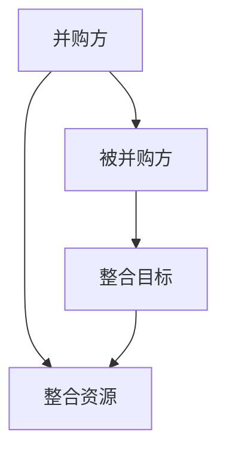
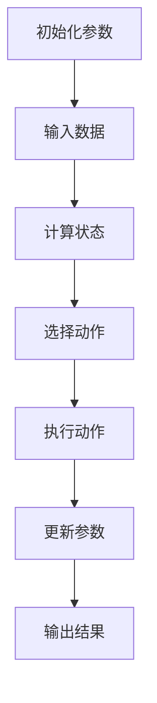
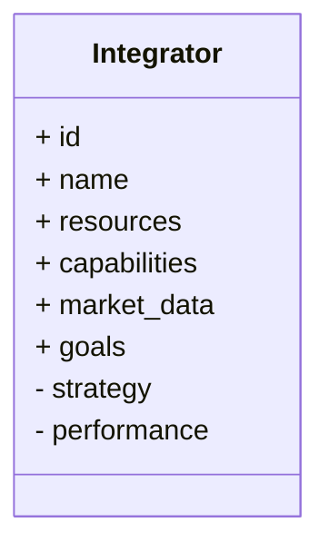
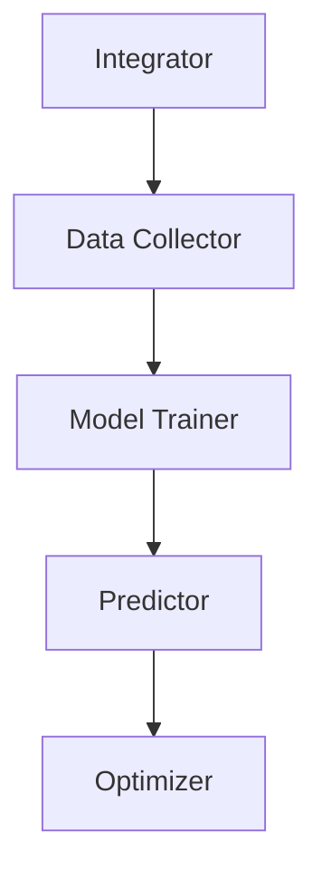
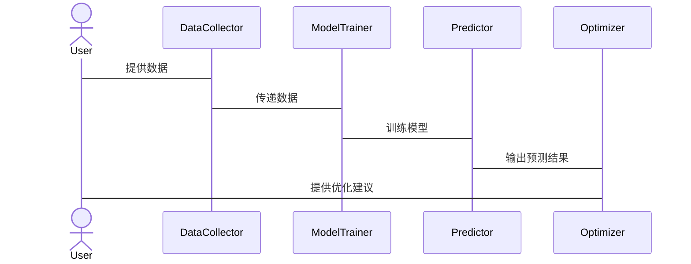

                 


```markdown
# 智能化并购后整合效果预测：多智能体AI的新视角

> 关键词：智能化并购、整合效果预测、多智能体AI、系统架构、算法原理

> 摘要：本文探讨了如何利用多智能体AI技术预测智能化并购后的整合效果。通过分析多智能体AI的核心原理、算法设计及系统架构，展示了其在并购整合中的应用优势，并通过实际案例验证了其有效性。

---

## 第1章 背景介绍

### 1.1 问题背景

#### 1.1.1 并购整合的重要性
企业并购是企业发展的重要手段之一，整合效果直接影响企业的长期绩效。有效的整合能够提升资源利用率、优化组织结构、增强市场竞争力。

#### 1.1.2 传统并购整合方法的局限性
传统整合方法依赖人工经验，存在耗时长、效率低、风险高等问题。整合效果难以量化，难以在复杂多变的市场环境中快速调整策略。

#### 1.1.3 智能化并购整合的必要性
随着市场竞争加剧，企业对整合效率和效果的要求越来越高。智能化整合能够利用数据和技术优势，提高整合的准确性和效率。

### 1.2 问题描述

#### 1.2.1 并购整合效果的定义
整合效果通常包括协同效应、成本节约、市场扩展等。这些效果需要通过量化指标来衡量。

#### 1.2.2 影响整合效果的关键因素
包括文化差异、组织结构、资源分配、技术整合、人员融合等多方面因素。

#### 1.2.3 整合过程中的挑战
信息不对称、决策复杂性高、利益冲突等挑战使得整合过程充满不确定性。

### 1.3 问题解决

#### 1.3.1 多智能体AI的应用场景
多智能体AI适用于复杂系统的决策优化，能够处理多目标、多利益相关者的问题。

#### 1.3.2 多智能体AI如何提升整合效果
通过分布式决策、协同优化、动态调整等特性，多智能体AI能够更好地应对整合中的复杂问题。

#### 1.3.3 多智能体AI的优势与局限性
优势：分布式计算、高容错性、适应性强。局限性：复杂性高、实现难度大、需要大量数据支持。

### 1.4 边界与外延

#### 1.4.1 并购整合的边界条件
包括企业规模、行业特点、市场环境等。

#### 1.4.2 多智能体AI的适用范围
适用于复杂决策、多方协作的场景。

#### 1.4.3 整合效果预测的范围界定
明确预测的指标和范围，避免预测范围过广或过窄。

### 1.5 核心要素与组成

#### 1.5.1 并购整合的核心要素
战略规划、组织结构、资源分配、风险管理等。

#### 1.5.2 多智能体AI的核心要素
智能体、环境、交互规则、目标函数等。

#### 1.5.3 整合效果预测的系统组成
数据采集模块、模型构建模块、预测模块、优化模块等。

---

## 第2章 多智能体AI的核心概念与联系

### 2.1 多智能体AI的原理

#### 2.1.1 多智能体系统的基本概念
多智能体系统由多个相互作用的智能体组成，每个智能体具有自主性、反应性、协作性和学习能力。

#### 2.1.2 多智能体AI的工作原理
智能体通过感知环境、执行动作、学习优化，实现系统的整体目标。

#### 2.1.3 多智能体AI与单智能体AI的区别
多智能体AI强调协作与分布式计算，单智能体AI强调集中式决策。

### 2.2 多智能体AI的概念属性对比

| 属性         | 单智能体AI          | 多智能体AI          |
|--------------|--------------------|--------------------|
| 决策方式     | 集中式决策         | 分布式决策         |
| 协作性       | 低                 | 高                 |
| 复杂性       | 较低               | 较高               |
| 应用场景     | 简单任务           | 复杂任务           |

#### 2.2.3 ER实体关系图


---

## 第3章 多智能体AI的算法原理

### 3.1 多智能体AI的算法流程

#### 3.1.1 算法输入与输出
- 输入：并购双方的资源、能力、市场数据
- 输出：整合效果预测结果、优化建议

#### 3.1.2 算法步骤分解
1. 初始化参数
2. 数据采集与预处理
3. 模型训练
4. 预测与优化
5. 结果输出

#### 3.1.3 算法的收敛性分析
通过损失函数的变化率来判断算法是否收敛。

### 3.2 多智能体AI的数学模型

#### 3.2.1 状态空间的定义
$$ S = \{ s_1, s_2, ..., s_n \} $$

#### 3.2.2 动作空间的定义
$$ A = \{ a_1, a_2, ..., a_m \} $$

#### 3.2.3 奖励函数的设计
$$ R(s, a) = \sum_{i=1}^{k} w_i \cdot r_i $$

#### 3.2.4 转移概率矩阵的构建
$$ P(a|s) = \frac{e^{Q(s,a)}}{\sum_{a'} e^{Q(s,a')}} $$

### 3.3 算法实现

#### 3.3.1 算法流程图


#### 3.3.2 算法代码实现
```python
def multi_agent_algorithm():
    params = initialize_parameters()
    while True:
        state = input_data(params)
        action = choose_action(state)
        next_state = execute_action(state, action)
        update_parameters(params, next_state)
        if is_converged(params):
            break
    return output_result(params)
```

---

## 第4章 系统分析与架构设计

### 4.1 项目场景介绍
以一家科技公司的并购整合为例，目标是优化资源配置、提升研发效率。

### 4.2 系统功能设计

#### 4.2.1 领域模型


#### 4.2.2 系统架构设计


### 4.3 系统接口设计
- 数据接口：数据采集模块与整合模块的交互
- 模型接口：模型训练模块与预测模块的交互
- 用户接口：用户与系统的交互界面

### 4.4 系统交互序列图


---

## 第5章 项目实战

### 5.1 环境安装
- Python 3.8+
- TensorFlow 2.0+
- Mermaid工具

### 5.2 核心代码实现

#### 5.2.1 数据预处理
```python
def preprocess_data(data):
    # 数据清洗、特征提取等处理
    return processed_data
```

#### 5.2.2 模型训练
```python
def train_model(data):
    model = build_model()
    model.fit(data)
    return model
```

#### 5.2.3 预测与优化
```python
def predict_and_optimize(model, new_data):
    predictions = model.predict(new_data)
    optimizer = Optimizer()
    optimized_plan = optimizer.optimize(predictions)
    return optimized_plan
```

### 5.3 案例分析
以某科技公司并购为例，详细分析整合过程中的数据处理、模型训练和预测结果。

### 5.4 项目小结
总结项目实施过程中的关键点和经验教训，强调多智能体AI的优势。

---

## 第6章 最佳实践

### 6.1 小结
多智能体AI在智能化并购整合中的应用前景广阔，能够显著提升整合效率和效果。

### 6.2 注意事项
- 数据质量至关重要
- 模型选择要根据具体场景
- 系统维护和更新要及时

### 6.3 拓展阅读
推荐相关书籍和论文，进一步深入学习多智能体AI和并购整合的知识。

---

# 结语

通过本文的详细分析，我们可以看到，多智能体AI为智能化并购整合提供了新的视角和方法。未来，随着技术的不断发展，多智能体AI将在企业并购中发挥更大的作用，帮助企业实现更高效的整合和优化。
```

