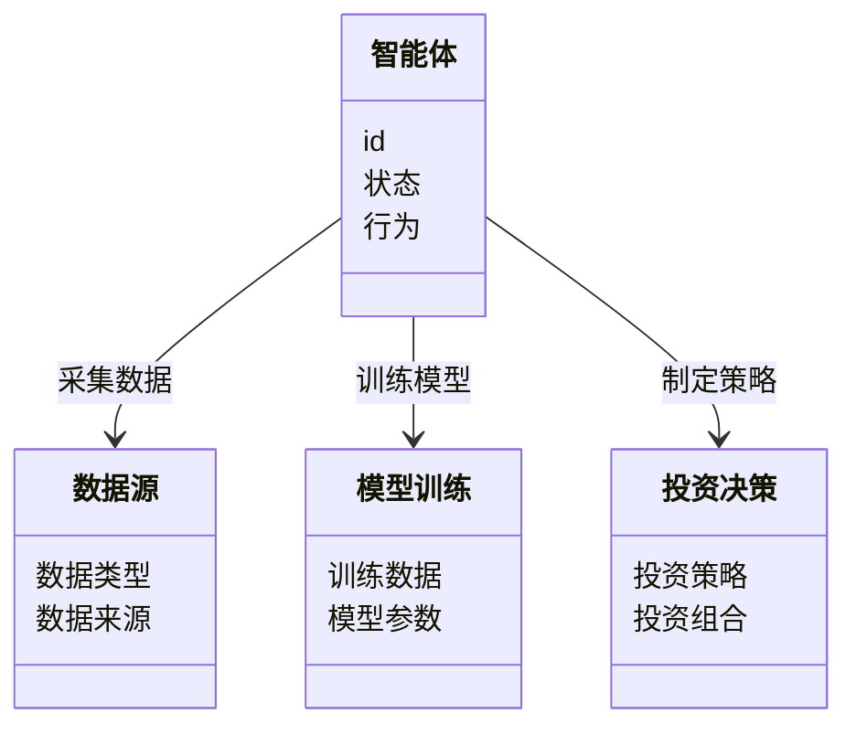
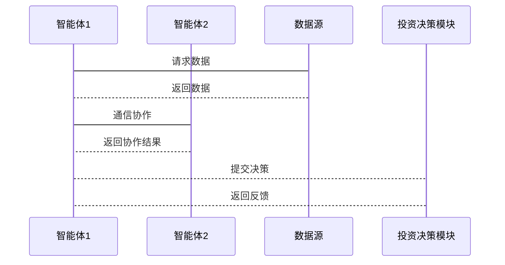

                 


# 《智能化战略执行力评估：多智能体AI在价值投资中的新方法》

> 关键词：多智能体AI，价值投资，战略执行力评估，强化学习，分布式计算，系统架构设计

> 摘要：本文探讨了多智能体AI在价值投资中的应用，重点分析了智能化战略执行力评估的新方法。通过详细讲解多智能体AI的基本原理、算法模型、系统架构设计及项目实战，展示了如何利用多智能体AI提升价值投资的决策效率和准确性。

---

# 第1章：智能化战略执行力评估的背景与问题描述

## 1.1 问题背景

### 1.1.1 传统战略执行力评估的局限性
传统的战略执行力评估方法依赖于人工分析和经验判断，存在以下问题：
- 数据处理效率低，难以应对海量数据
- 评估结果主观性较强，缺乏客观量化标准
- 难以实时动态调整，应对市场变化能力不足

### 1.1.2 智能化评估的必要性
随着金融市场的复杂化和数据化，传统的评估方法已无法满足需求。智能化评估能够通过AI技术实现以下目标：
- 提高数据处理效率和准确性
- 提供客观量化评估标准
- 实现动态调整和实时反馈

### 1.1.3 多智能体AI在评估中的优势
多智能体AI通过多个智能体协作完成任务，具有以下优势：
- 分布式计算能力，能够处理大规模数据
- 各智能体之间可以协作互补，提升整体评估效果
- 可以模拟市场中多方利益相关者的决策行为

## 1.2 问题描述

### 1.2.1 战略执行力评估的核心要素
战略执行力评估需要关注以下关键要素：
- 战略目标的分解与实现路径
- 各部门/团队的协同合作能力
- 执行过程中的动态调整能力

### 1.2.2 价值投资中的战略执行力评估挑战
价值投资中的战略执行力评估面临以下挑战：
- 市场环境复杂多变，需要快速适应
- 投资决策涉及多方利益，需要协调统一
- 如何量化战略执行的成效

### 1.2.3 多智能体AI的应用场景
多智能体AI可以在以下场景中应用：
- 分析市场参与者的行为模式
- 优化投资组合配置
- 监测市场风险并及时预警

## 1.3 问题解决思路

### 1.3.1 多智能体AI的基本原理
多智能体AI通过多个智能体协作完成任务，每个智能体负责特定的子任务，并通过通信和协调机制实现整体目标。

### 1.3.2 智能化评估的实现路径
实现智能化战略执行力评估的路径包括：
- 数据采集与 preprocessing
- 构建评估模型
- 模型训练与优化
- 实时监控与反馈

### 1.3.3 价值投资中的具体应用
在价值投资中，多智能体AI可以用于：
- 分析财务数据和市场趋势
- 评估企业基本面
- 监测投资组合的风险

## 1.4 本章小结

---

# 第2章：多智能体AI的核心概念与价值投资的结合

## 2.1 多智能体AI的核心概念

### 2.1.1 多智能体系统的定义
多智能体系统是由多个智能体组成的分布式系统，智能体之间通过通信和协作完成共同目标。

### 2.1.2 多智能体AI的特性
- 分布式计算能力
- 自主性与协作性
- 动态适应性

### 2.1.3 多智能体AI与单智能体AI的区别
| 特性 | 单智能体AI | 多智能体AI |
|------|------------|------------|
| 计算方式 | 集中式计算 | 分布式计算 |
| 决策方式 | 单点决策 | 多点协作决策 |
| 应用场景 | 简单任务 | 复杂任务 |

## 2.2 价值投资的核心要素

### 2.2.1 价值投资的基本原理
价值投资是一种长期投资策略，关注企业的内在价值，寻找市场价格低于内在价值的投资机会。

### 2.2.2 价值投资的关键指标
- 市盈率（P/E）
- 市净率（P/B）
- 股息率
- 资产负债率

### 2.2.3 价值投资中的决策过程
价值投资的决策过程包括以下几个步骤：
1. 识别具有投资价值的企业
2. 分析企业的财务状况
3. 评估市场估值
4. 优化投资组合

## 2.3 多智能体AI与价值投资的结合

### 2.3.1 多智能体AI在价值投资中的应用
- 数据采集与 preprocessing：多个智能体分别负责采集不同来源的数据，并进行清洗和整合。
- 模型训练：多个智能体分别训练不同的模型，并通过协作优化整体模型性能。
- 投资决策：多个智能体分别负责不同方面的分析，如财务分析、市场分析、风险评估，最终协同得出投资决策。

### 2.3.2 多智能体AI如何提升战略执行力
通过多智能体AI，可以实现以下目标：
- 提高数据分析效率
- 提升决策的准确性
- 实现动态调整和实时反馈

### 2.3.3 多智能体AI在价值投资中的优势
- 能够处理复杂多变的市场环境
- 可以模拟多方利益相关者的决策行为
- 通过协作优化投资组合

## 2.4 本章小结

---

# 第3章：多智能体AI的算法原理与数学模型

## 3.1 多智能体AI的基本算法

### 3.1.1 强化学习算法
强化学习是一种通过试错机制学习策略的方法。在多智能体AI中，多个智能体可以通过强化学习来优化各自的策略。

### 3.1.2 分布式计算算法
分布式计算算法用于在多智能体系统中进行并行计算，提高计算效率。

### 3.1.3 协作与竞争机制
多智能体系统中，智能体之间可以通过协作或竞争来优化整体性能。

## 3.2 多智能体AI的数学模型

### 3.2.1 Q-learning算法
Q-learning是一种常用的强化学习算法，其数学模型如下：

$$ Q(s, a) = Q(s, a) + \alpha [r + \max_{a'} Q(s', a') - Q(s, a)] $$

其中：
- \( Q(s, a) \) 表示状态 \( s \) 下采取行动 \( a \) 的价值
- \( \alpha \) 是学习率
- \( r \) 是奖励
- \( s' \) 是下一个状态

### 3.2.2 多智能体协作模型
多智能体协作模型可以通过以下公式表示：

$$ V(s) = \max_{a} \min_{a'} [ Q(s, a) - Q(s, a') ] $$

其中：
- \( V(s) \) 表示状态 \( s \) 的价值
- \( a \) 是智能体的动作
- \( a' \) 是其他智能体的动作

### 3.2.3 多智能体博弈论模型
多智能体博弈论模型可以通过纳什均衡来描述：

$$ \text{纳什均衡} = \{a_i\} \text{ 满足 } \forall i, Q(s, a_i) \geq Q(s, a_i') \text{ 对所有 } a_i' \} $$

## 3.3 价值投资中的数学模型

### 3.3.1 价值评估公式
价值评估公式可以表示为：

$$ V = \text{现金流的现值} + \text{未来现金流的现值} $$

### 3.3.2 投资组合优化模型
投资组合优化模型可以通过以下公式表示：

$$ \min_{w} w^T \Sigma w \quad \text{subject to} \quad w^T \mu = C $$

其中：
- \( w \) 是投资权重向量
- \( \Sigma \) 是协方差矩阵
- \( \mu \) 是收益向量
- \( C \) 是目标收益

### 3.3.3 风险评估模型
风险评估模型可以通过VaR（Value at Risk）来表示：

$$ \text{VaR}(\alpha) = \text{最小的损失值，使得损失超过该值的概率为 } \alpha $$

## 3.4 本章小结

---

# 第4章：系统分析与架构设计

## 4.1 问题场景介绍

### 4.1.1 价值投资中的战略执行力评估需求
在价值投资中，需要对企业的战略执行力进行全面评估，包括财务状况、市场表现、管理能力等方面。

### 4.1.2 多智能体AI的应用场景
多智能体AI可以在以下场景中应用：
- 数据采集与 preprocessing
- 模型训练与优化
- 投资决策与监控

## 4.2 系统功能设计

### 4.2.1 领域模型设计
以下是领域模型的Mermaid类图：



### 4.2.2 系统架构设计
以下是系统架构的Mermaid架构图：

```mermaid
container 系统架构 {
    数据采集模块
    数据处理模块
    模型训练模块
    投资决策模块
    结果展示模块
}

数据采集模块 --> 数据处理模块
数据处理模块 --> 模型训练模块
模型训练模块 --> 投资决策模块
投资决策模块 --> 结果展示模块
```

### 4.2.3 系统交互设计
以下是系统交互的Mermaid序列图：



## 4.3 本章小结

---

# 第5章：项目实战

## 5.1 环境安装

### 5.1.1 安装Python
安装Python 3.8或更高版本。

### 5.1.2 安装必要的库
安装以下Python库：
- `numpy`
- `pandas`
- `scikit-learn`
- `tensorflow`

### 5.1.3 安装其他工具
安装以下工具：
- Jupyter Notebook
- Git

## 5.2 系统核心实现

### 5.2.1 数据采集与 preprocessing
以下是一个数据采集与 preprocessing 的代码示例：

```python
import pandas as pd
import requests

# 采集数据
def fetch_data(url):
    response = requests.get(url)
    data = response.json()
    return data

# 数据处理
def preprocess_data(data):
    df = pd.DataFrame(data)
    df = df.dropna()
    return df

data = fetch_data('http://example.com/api')
df = preprocess_data(data)
print(df)
```

### 5.2.2 模型训练
以下是一个多智能体强化学习的模型训练代码示例：

```python
import numpy as np
import tensorflow as tf

# 定义智能体
class Agent:
    def __init__(self, state_dim, action_dim):
        self.state_dim = state_dim
        self.action_dim = action_dim
        self.model = self.build_model()

    def build_model(self):
        model = tf.keras.Sequential([
            tf.keras.layers.Dense(64, activation='relu', input_dim=self.state_dim),
            tf.keras.layers.Dense(self.action_dim, activation='linear')
        ])
        return model

    def act(self, state):
        state = tf.convert_to_tensor(state)
        return self.model(state)

# 初始化智能体
agent = Agent(state_dim=6, action_dim=4)

# 定义奖励函数
def reward_fn(action, next_state):
    # 简单的奖励函数，可以根据具体场景进行调整
    return np.random.rand()

# 强化学习训练
for episode in range(1000):
    state = env.reset()
    total_reward = 0
    while not done:
        action = agent.act(state)
        next_state, reward, done, _ = env.step(action)
        total_reward += reward_fn(action, next_state)
```

### 5.2.3 案例分析
以下是一个价值投资的案例分析：

假设我们有两家公司A和B，我们需要评估它们的投资价值。

公司A的市盈率为15，市净率为2，股息率为5%。

公司B的市盈率为20，市净率为1.5，股息率为7%。

通过多智能体AI的评估，我们可以得出公司A和B的投资价值，并优化投资组合。

## 5.3 本章小结

---

# 第6章：总结与展望

## 6.1 全文总结

## 6.2 未来展望

## 6.3 最佳实践 tips

## 6.4 本章小结

---

# 参考文献

（此处列出相关参考文献）

