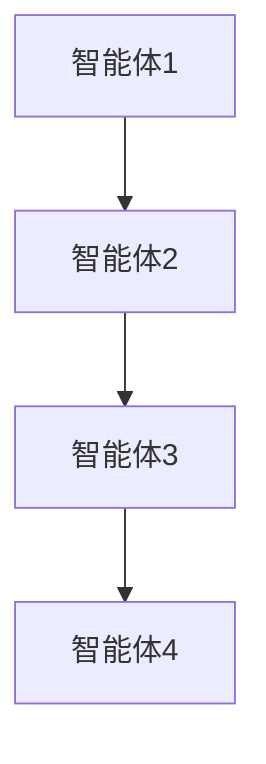
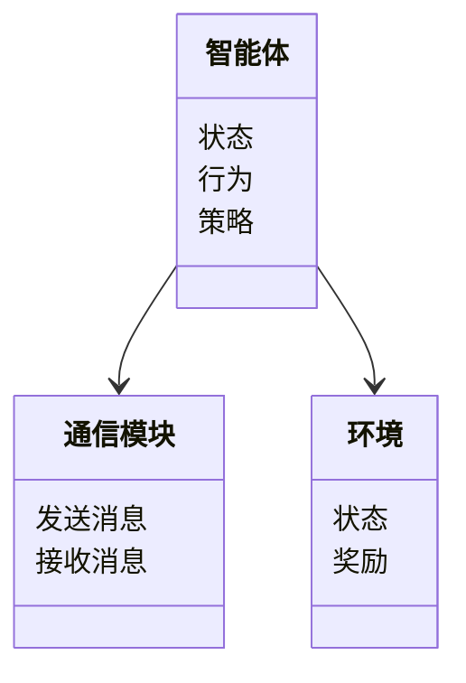
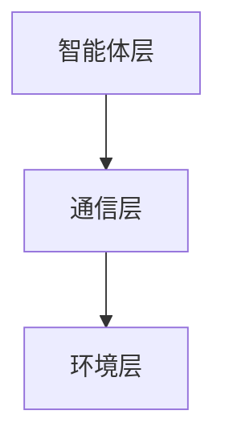
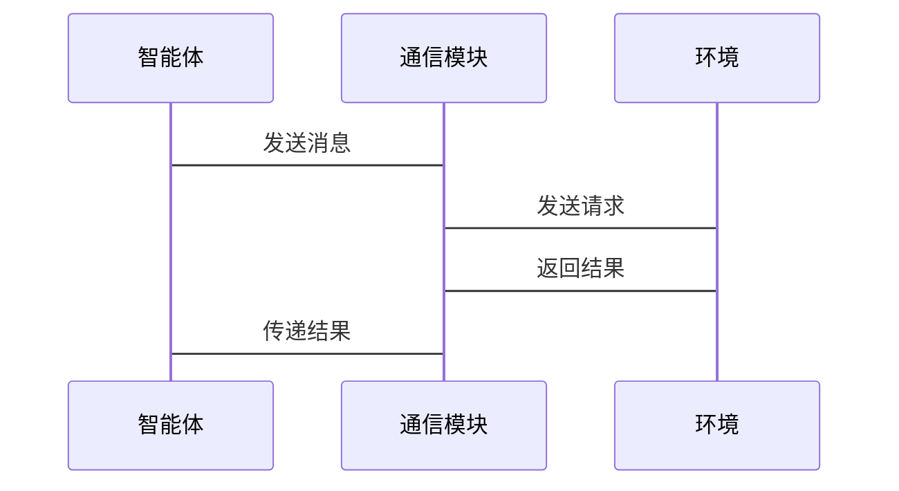

                 


# 《智能化护城河持久性评估：多智能体AI的新视角》

> 关键词：智能化护城河、多智能体AI、AI持久性评估、技术优势分析、系统架构设计、算法原理

> 摘要：本文从多智能体AI的新视角，系统阐述了智能化护城河的持久性评估方法。通过分析多智能体AI的核心概念、算法原理和系统架构设计，结合实际案例，详细探讨了多智能体AI如何提升企业智能化护城河的持久性，并为企业构建智能化护城河提供实用的策略建议。

---

# 第一章：智能化护城河的背景与意义

## 1.1 智能化护城河的概念

### 1.1.1 什么是智能化护城河
智能化护城河是指企业在智能化竞争中，通过技术创新和资源整合，构建的长期竞争优势。这种优势不仅依赖于技术的先进性，还依赖于技术的可扩展性和适应性。

### 1.1.2 智能化护城河的核心要素
智能化护城河的核心要素包括：
1. **技术优势**：企业的技术储备和创新能力。
2. **数据资源**：企业掌握的数据质量和数量。
3. **生态系统**：企业构建的合作伙伴生态和用户粘性。
4. **组织能力**：企业的组织结构和管理能力是否支持智能化转型。

### 1.1.3 智能化护城河的持久性特征
智能化护城河的持久性特征包括：
1. **技术的可迭代性**：技术能够不断迭代和优化。
2. **数据的持续积累**：企业能够持续获取和处理数据。
3. **生态系统的稳定性**：合作伙伴和用户粘性较强，不易被竞争对手取代。

---

## 1.2 多智能体AI的定义与特点

### 1.2.1 多智能体系统的定义
多智能体系统是由多个智能体组成的协作系统，这些智能体能够通过通信和协作完成复杂的任务。多智能体系统的核心在于智能体之间的协作与通信。

### 1.2.2 多智能体AI的独特优势
1. **分布式智能**：多个智能体协同工作，能够处理更复杂的问题。
2. **自适应性**：智能体能够根据环境变化自主调整策略。
3. **可扩展性**：系统能够根据需求扩展智能体的数量和功能。

### 1.2.3 多智能体AI与传统AI的对比

| 对比维度 | 多智能体AI | 传统AI |
|----------|------------|--------|
| 智能体数量 | 多个        | 单个    |
| 协作性     | 高          | 低      |
| 适应性     | 强          | 中      |

---

## 1.3 智能化护城河评估的必要性

### 1.3.1 数字化转型中的竞争压力
在数字化转型的背景下，企业之间的竞争日益激烈，智能化护城河的构建成为企业保持竞争优势的关键。

### 1.3.2 技术迭代对企业护城河的影响
技术的快速迭代使得传统的护城河可能迅速失效，企业需要通过持续的技术创新来维持护城河的持久性。

### 1.3.3 多智能体AI在护城河评估中的作用
多智能体AI能够从多个维度分析企业的智能化能力，帮助企业发现潜在的短板，并提出优化建议。

---

# 第二章：多智能体AI的核心概念与理论基础

## 2.1 多智能体系统的原理

### 2.1.1 多智能体系统的组成
多智能体系统由多个智能体、通信机制、协作机制和环境组成。智能体之间通过通信机制进行信息交换，并通过协作机制实现任务的协同完成。

### 2.1.2 多智能体系统的基本特性
1. **自主性**：智能体能够自主决策。
2. **反应性**：智能体能够根据环境变化调整行为。
3. **协作性**：智能体之间能够协作完成任务。

### 2.1.3 多智能体系统的通信与协作机制



---

## 2.2 多智能体AI的数学模型

### 2.2.1 多智能体系统的基本模型
多智能体系统的数学模型通常包括状态空间、动作空间和奖励函数。每个智能体都有自己的策略函数，用于决定动作。

### 2.2.2 多智能体AI的决策机制
多智能体AI的决策机制包括：
1. **单智能体决策**：每个智能体根据自身状态做出决策。
2. **协作决策**：智能体之间通过通信协商做出集体决策。

### 2.2.3 多智能体AI的优化算法
多智能体AI的优化算法通常基于强化学习，通过不断试错优化策略。

---

## 2.3 多智能体AI与护城河评估的关系

### 2.3.1 多智能体AI在护城河评估中的应用
多智能体AI可以用于评估企业的技术优势、数据资源和生态系统稳定性。

### 2.3.2 多智能体AI如何增强护城河的持久性
通过多智能体AI的协作机制，企业能够更有效地整合资源，提升技术的可扩展性和适应性。

### 2.3.3 多智能体AI对护城河评估的创新贡献
多智能体AI提供了全新的评估视角，能够从多个维度全面分析企业的智能化能力。

---

# 第三章：多智能体AI的算法原理

## 3.1 多智能体强化学习

### 3.1.1 强化学习的基本原理
强化学习通过智能体与环境的交互，学习最优策略。智能体通过试错获得奖励，逐步优化策略。

### 3.1.2 多智能体强化学习的挑战
多智能体强化学习的挑战包括：
1. **策略协调**：智能体之间的策略需要协调一致。
2. **通信开销**：智能体之间的通信可能会增加计算开销。

### 3.1.3 基于Q-learning的多智能体算法实现

```python
def q_learning(state, action):
    return r + gamma * max(Q(next_state, action))
```

---

## 3.2 多智能体协作机制

### 3.2.1 协作式强化学习
协作式强化学习通过智能体之间的协作，实现共同目标。

### 3.2.2 对抗式强化学习
对抗式强化学习通过智能体之间的对抗，优化整体策略。

### 3.2.3 基于博弈论的多智能体协作
博弈论为多智能体协作提供了理论基础，智能体通过博弈找到纳什均衡。

---

## 3.3 多智能体AI的数学模型

### 3.3.1 Q-learning算法的数学表达
$$ Q(s,a) = r + \gamma \max_{a'} Q(s',a') $$

### 3.3.2 多智能体协作的数学模型
$$ V(s) = \max_{a} [r + \gamma V(s')] $$

---

# 第四章：多智能体AI的系统架构设计

## 4.1 系统架构概述

### 4.1.1 系统整体架构
多智能体AI系统的整体架构包括智能体层、通信层和环境层。

### 4.1.2 系统模块划分
系统模块包括：
1. **智能体模块**：负责决策和行动。
2. **通信模块**：负责智能体之间的通信。
3. **环境模块**：模拟真实环境。

### 4.1.3 系统功能设计
系统功能包括：
1. **状态感知**：智能体感知环境状态。
2. **决策制定**：智能体根据状态制定决策。
3. **行动执行**：智能体执行决策并返回结果。

---

## 4.2 系统架构设计

### 4.2.1 领域模型类图


### 4.2.2 系统架构图


### 4.2.3 系统交互序列图


---

# 第五章：项目实战

## 5.1 环境安装

### 5.1.1 安装Python
```bash
python --version
pip install --upgrade pip
```

### 5.1.2 安装依赖
```bash
pip install gym numpy matplotlib
```

---

## 5.2 系统核心实现

### 5.2.1 Q-learning算法实现
```python
import numpy as np
import gym

class QLearning:
    def __init__(self, state_size, action_size):
        self.state_size = state_size
        self.action_size = action_size
        self.Q = np.zeros((state_size, action_size))

    def choose_action(self, state, epsilon=0.1):
        if np.random.random() < epsilon:
            return np.random.randint(self.action_size)
        return np.argmax(self.Q[state])

    def update_Q(self, state, action, reward, next_state, gamma=0.99):
        self.Q[state, action] = reward + gamma * np.max(self.Q[next_state])
```

---

## 5.3 案例分析与解读

### 5.3.1 案例分析
以一个简单的二维迷宫问题为例，通过多智能体协作完成迷宫导航。

### 5.3.2 代码实现
```python
env = gym.make('CustomEnv-v0')
agent = QLearning(env.observation_space.shape[0], env.action_space.n)
for episode in range(1000):
    state = env.reset()
    for step in range(100):
        action = agent.choose_action(state)
        next_state, reward, done, _ = env.step(action)
        agent.update_Q(state, action, reward, next_state)
        if done:
            break
```

---

## 5.4 项目小结

### 5.4.1 代码总结
通过Q-learning算法实现多智能体协作，完成迷宫导航任务。

### 5.4.2 实践收获
理解了多智能体AI的基本原理和实现方法，掌握了Q-learning算法的实现技巧。

---

# 第六章：总结与展望

## 6.1 最佳实践

### 6.1.1 系统设计
建议企业在构建智能化护城河时，注重多智能体AI的协作机制和通信效率。

### 6.1.2 算法优化
建议在实际应用中，不断优化多智能体AI的算法，提升系统的效率和性能。

### 6.1.3 数据安全
建议企业在构建智能化护城河时，重视数据安全和隐私保护。

---

## 6.2 小结

通过本文的分析，我们从多智能体AI的新视角，探讨了智能化护城河的持久性评估方法。通过系统的理论分析和实际案例，我们得出结论：多智能体AI能够有效提升企业智能化护城河的持久性。

---

## 6.3 注意事项

### 6.3.1 算法选择
选择合适的算法是多智能体AI应用成功的关键。

### 6.3.2 系统设计
系统设计需要充分考虑智能体之间的协作和通信效率。

### 6.3.3 数据质量
数据质量直接影响多智能体AI的性能，需要高度重视。

---

## 6.4 拓展阅读

1. 多智能体强化学习的经典论文
2. 多智能体协作的最新研究成果
3. 多智能体AI在实际应用中的案例分析

---

通过以上内容，我们从理论到实践，系统地探讨了多智能体AI在智能化护城河持久性评估中的应用。希望本文能够为企业的智能化转型提供有价值的参考和启示。

