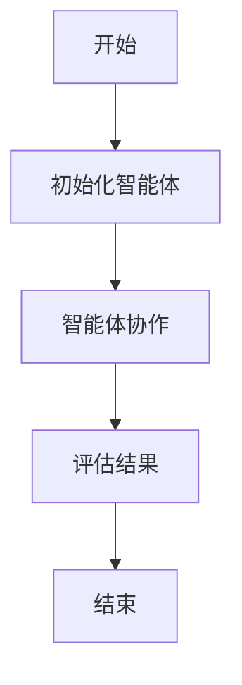
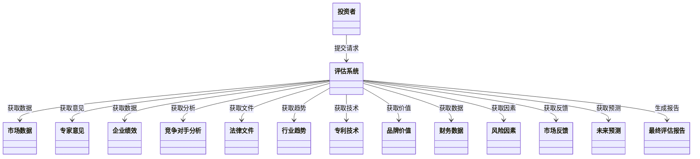

                 


# 智能化无形资产评估：多智能体AI在价值投资中的新方法

> 关键词：多智能体AI、无形资产评估、价值投资、协作机制、算法原理、系统设计、案例分析

> 摘要：本文探讨了多智能体AI在无形资产评估中的应用，提出了一种基于多智能体协作的新方法，旨在解决传统评估方法的局限性，提升评估的准确性和效率。通过详细分析多智能体AI的核心概念、算法原理、系统设计和实际案例，本文为价值投资者提供了新的思路和工具。

---

## 第一部分：背景介绍

### 第1章：问题背景与目标

#### 1.1 无形资产评估的传统方法
无形资产（如专利、品牌、技术）的传统评估方法依赖于财务数据和市场分析，但存在以下问题：
- 数据局限性：难以量化创新性和市场影响力。
- 主观性高：依赖专家判断，存在人为偏差。
- 静态评估：无法动态捕捉市场变化。

#### 1.2 技术进步带来的新机遇
多智能体AI的出现为无形资产评估带来了新思路：
- 分布式计算：多个AI协同工作，提高评估效率。
- 数据融合：整合多源数据，提升评估准确性。
- 实时分析：动态调整评估结果，捕捉市场趋势。

#### 1.3 问题描述与目标
本文旨在通过多智能体AI，解决传统评估方法的局限性，提出一种动态、精准的评估方法。目标是：
- 提升评估效率和准确性。
- 实现多维度数据的协同分析。
- 提供实时的市场洞察。

---

## 第二部分：多智能体AI的核心概念

### 第2章：多智能体AI的基本原理

#### 2.1 多智能体AI的定义与特点
- **定义**：多智能体AI由多个分布式智能体组成，通过协作完成复杂任务。
- **特点**：
  - 分布式：每个智能体独立运行。
  - 协作性：智能体之间通过通信协同工作。
  - 自适应性：能够动态调整策略。

#### 2.2 多智能体AI与单智能体AI的对比
| 对比维度       | 多智能体AI                     | 单智能体AI                     |
|----------------|-------------------------------|-------------------------------|
| 计算模式       | 分布式                        | 集中式                        |
| 协作能力       | 强                            | 弱                            |
| 应用场景       | 复杂任务，如金融分析          | 简单任务，如单一数据分析      |

#### 2.3 实体关系与概念结构
```mermaid
erDiagram
    actor 投资者
    actor 评估系统
    actor 市场数据
    actor 专家意见
    actor 企业绩效
    actor 竞争对手分析
    actor 法律文件
    actor 行业趋势
    actor 专利技术
    actor 品牌价值
    actor 财务数据
    actor 风险因素
    actor 市场反馈
    actor 未来预测
    actor 最终评估报告
    投资者 --> 评估系统: 提交评估请求
    评估系统 --> 市场数据: 获取市场数据
    评估系统 --> 专家意见: 获取专家意见
    评估系统 --> 企业绩效: 获取企业绩效
    评估系统 --> 竞争对手分析: 获取竞争对手分析
    评估系统 --> 法律文件: 获取法律文件
    评估系统 --> 行业趋势: 获取行业趋势
    评估系统 --> 专利技术: 获取专利技术
    评估系统 --> 品牌价值: 获取品牌价值
    评估系统 --> 财务数据: 获取财务数据
    评估系统 --> 风险因素: 获取风险因素
    评估系统 --> 市场反馈: 获取市场反馈
    评估系统 --> 未来预测: 获取未来预测
    评估系统 --> 最终评估报告: 生成报告
```

---

## 第三部分：多智能体AI的算法原理

### 第3章：多智能体协作机制

#### 3.1 协作机制的数学模型
- **评估函数**：$f(x) = \sum_{i=1}^{n} w_i x_i$
  - $w_i$：权重，表示数据的重要性。
  - $x_i$：输入数据。
- **协作模型**：$C = \{c_1, c_2, ..., c_n\}$
  - $c_i$：智能体协作的信息。

#### 3.2 分布式计算与优化
- **分布式计算**：每个智能体负责一部分数据的处理。
- **联合优化**：通过通信优化整体评估结果。

### 第4章：算法实现与代码示例

#### 4.1 算法流程图


#### 4.2 Python代码实现
```python
class Agent:
    def __init__(self, data):
        self.data = data
        self.weights = {}

    def compute(self):
        # 计算评估值
        total = 0
        for key, value in self.data.items():
            weight = self.get_weight(key)
            total += weight * value
        return total

    def get_weight(self, key):
        # 示例：简单线性权重
        return 0.5

# 初始化智能体
data = {'revenue': 100, 'profit': 20, 'growth': 1.2}
agent = Agent(data)
result = agent.compute()
print(f"评估结果：{result}")
```

---

## 第四部分：系统设计与实现

### 第5章：系统架构设计

#### 5.1 系统功能设计


#### 5.2 系统架构设计


---

## 第五部分：项目实战与案例分析

### 第6章：项目实战

#### 6.1 环境安装与配置
- **工具**：Python、TensorFlow、Kubernetes
- **依赖**：安装必要的库和框架。

#### 6.2 核心代码实现
```python
import tensorflow as tf
from tensorflow.keras import layers

# 定义评估模型
model = tf.keras.Sequential([
    layers.Dense(64, activation='relu', input_shape=(n_features,)),
    layers.Dense(1, activation='linear')
])

# 编译模型
model.compile(optimizer='adam', loss='mse')
```

#### 6.3 案例分析
- **案例背景**：评估某科技公司的专利价值。
- **数据来源**：专利数量、技术影响力、市场反馈。
- **评估结果**：通过多智能体协作，得出专利价值的动态评估。

---

## 第六部分：总结与展望

### 第7章：总结与展望

#### 7.1 最佳实践
- **数据质量**：确保输入数据的准确性和完整性。
- **模型优化**：定期更新权重和参数。
- **团队协作**：多智能体AI需要团队的有效配合。

#### 7.2 未来趋势
- **模型优化**：深度学习与强化学习的结合。
- **扩展应用**：更多领域的应用探索。
- **伦理问题**：数据隐私与模型透明度的平衡。

---

通过以上结构，本文系统地介绍了多智能体AI在无形资产评估中的应用，从理论到实践，为价值投资者提供了新的工具和方法。

