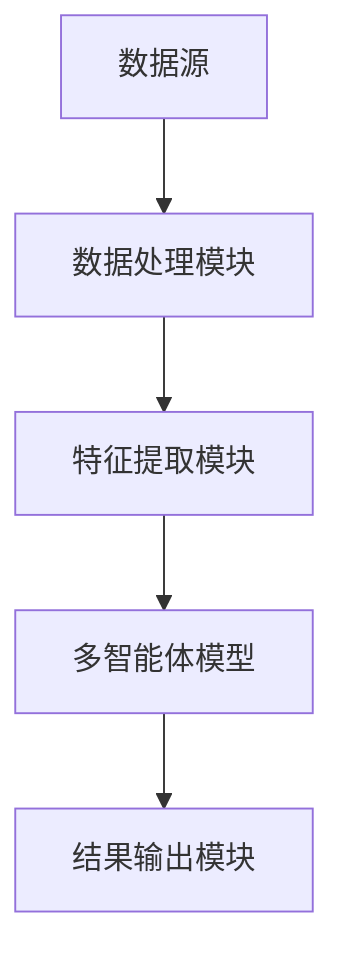
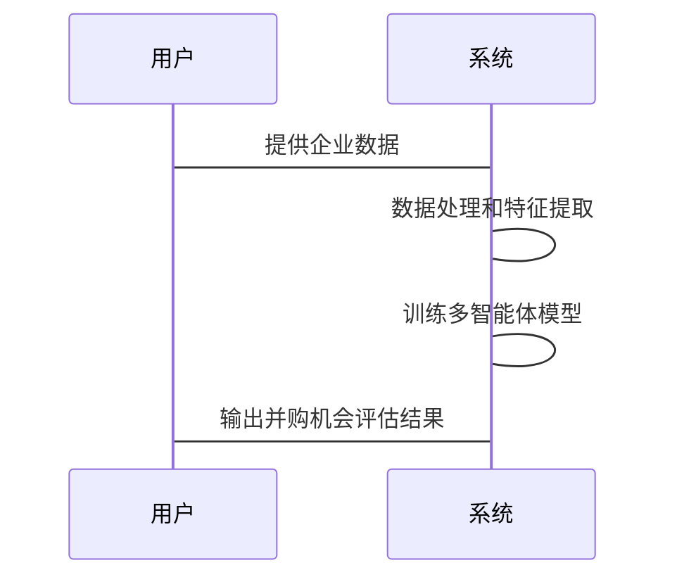

                 


# 智能化特殊情况投资：多智能体AI识别并购机会

## 关键词：多智能体AI，并购机会识别，智能化投资，强化学习，博弈论模型

## 摘要：本文深入探讨了多智能体AI在识别并购机会中的应用，通过分析多智能体系统的核心概念、算法原理、系统架构以及实际案例，展示了如何利用多智能体AI技术提升并购机会识别的准确性和效率。文章结合理论与实践，为投资决策提供了新的视角和方法。

---

# 第一部分: 智能化特殊情况投资与多智能体AI概述

## 第1章: 多智能体AI的定义与特点

### 1.1 多智能体AI的定义与特点

#### 1.1.1 多智能体AI的定义
多智能体AI（Multi-Agent AI）是指由多个相互作用的智能体组成的系统，这些智能体能够通过协作或竞争完成复杂的任务。与传统的单一智能体不同，多智能体系统强调智能体之间的交互和协作，能够处理动态、复杂的环境。

#### 1.1.2 多智能体AI的核心特点
- **分布式智能**：每个智能体负责一部分任务，通过协作完成整体目标。
- **自主性**：智能体能够自主决策，无需外部干预。
- **反应性**：智能体能够实时感知环境变化并做出反应。
- **协作性**：智能体之间可以通过通信和协调提高整体性能。

#### 1.1.3 多智能体AI与传统AI的区别
- **单一智能体 vs. 多智能体**：传统AI通常处理单一任务，而多智能体AI处理多个智能体的协作与竞争。
- **中心化 vs. 分布式**：传统AI依赖中心化的决策，而多智能体AI是分布式决策。
- **简单任务 vs. 复杂任务**：多智能体AI适用于复杂场景，如并购机会识别。

---

## 第2章: 并购机会识别的背景与挑战

### 1.2 并购机会识别的背景
- **并购市场的快速发展**：全球并购交易额持续增长，识别优质并购机会的需求日益增加。
- **数据驱动的决策**：通过大数据分析和AI技术，提高并购决策的准确性和效率。

### 1.3 多智能体AI在并购机会识别中的作用
- **多维度分析**：多智能体系统可以从财务、市场、技术等多个维度分析企业价值。
- **复杂场景处理**：在特殊情况下，如经济危机或行业整合，多智能体AI能够更好地识别潜在并购机会。

---

# 第二部分: 多智能体AI的核心概念与原理

## 第2章: 多智能体系统与并购机会识别的关系

### 2.1 多智能体系统的基本概念

#### 2.1.1 多智能体系统的定义
多智能体系统由多个智能体组成，这些智能体通过协作或竞争完成任务。系统的关键在于智能体之间的交互和协作。

### 2.2 多智能体系统与并购机会识别的关联

#### 2.2.1 多智能体系统在并购机会识别中的作用
多智能体系统可以模拟市场参与者的行为，分析企业之间的互动，帮助识别潜在的并购机会。

### 2.3 并购机会识别的核心要素

#### 2.3.1 并购机会识别的关键因素
- **财务指标**：如盈利能力、估值等。
- **市场环境**：如行业趋势、竞争状况等。
- **技术评估**：如技术创新能力、知识产权等。

---

# 第三部分: 多智能体AI算法原理与实现

## 第3章: 多智能体AI算法原理

### 3.1 多智能体强化学习

#### 3.1.1 强化学习的基本原理
强化学习通过智能体与环境的交互，学习策略以最大化累积奖励。

#### 3.1.2 多智能体强化学习的挑战
- **策略协调**：多个智能体之间的策略协调问题。
- **通信机制**：智能体之间的通信效率和安全性。

#### 3.1.3 多智能体强化学习的应用场景
在并购机会识别中，多智能体强化学习可以模拟多个市场的参与者，分析他们的行为模式。

### 3.2 并购机会识别中的博弈论模型

#### 3.2.1 博弈论的基本概念
博弈论研究理性决策者之间的策略互动，适用于分析并购中的竞争与合作。

#### 3.2.2 并购机会识别中的博弈论模型
- **纳什均衡**：分析并购中的稳定状态。
- **拍卖模型**：模拟并购交易中的竞价过程。

### 3.3 基于多智能体的生成对抗网络

#### 3.3.1 生成对抗网络的基本原理
生成对抗网络由生成器和判别器组成，通过对抗训练生成逼真的数据。

#### 3.3.2 多智能体生成对抗网络的实现
- **多智能体协作**：生成器和判别器由多个智能体组成，提高生成数据的多样性。

---

# 第四部分: 系统架构与实现

## 第4章: 系统架构设计

### 4.1 项目介绍
本项目旨在开发一个多智能体AI系统，用于识别并购机会。

### 4.2 系统功能设计

#### 4.2.1 数据流分析
- **数据输入**：包括企业财务数据、市场数据等。
- **数据处理**：清洗、特征提取。
- **模型训练**：训练多智能体模型，识别并购机会。

### 4.3 系统架构设计

#### 4.3.1 系统架构图


### 4.4 系统接口设计

#### 4.4.1 接口设计
- **输入接口**：接收企业数据。
- **输出接口**：输出并购机会的评估结果。

### 4.5 系统交互流程

#### 4.5.1 交互流程图


---

# 第五部分: 项目实战

## 第5章: 项目实战

### 5.1 环境安装

#### 5.1.1 安装Python
```bash
python --version
pip install --upgrade pip
```

#### 5.1.2 安装依赖
```bash
pip install numpy matplotlib tensorflow
```

### 5.2 核心实现

#### 5.2.1 多智能体模型实现
```python
import tensorflow as tf
import numpy as np

class Agent:
    def __init__(self, state_space, action_space):
        self.model = self.build_model(state_space, action_space)
    
    def build_model(self, state_space, action_space):
        model = tf.keras.Sequential([
            tf.keras.layers.Dense(64, activation='relu'),
            tf.keras.layers.Dense(action_space, activation='linear')
        ])
        return model
```

#### 5.2.2 强化学习算法实现
```python
class DQN:
    def __init__(self, state_space, action_space):
        self.agent = Agent(state_space, action_space)
    
    def train(self, batch_size):
        # 训练过程略
        pass
```

### 5.3 案例分析

#### 5.3.1 案例介绍
分析某公司的并购机会，使用多智能体模型进行预测。

#### 5.3.2 模型训练与评估
- 训练模型，评估准确率和召回率。
- 调整超参数，优化模型性能。

### 5.4 项目总结

#### 5.4.1 项目小结
多智能体AI能够有效识别并购机会，提升投资决策的准确性。

---

# 第六部分: 总结与展望

## 第6章: 总结与展望

### 6.1 总结
多智能体AI在并购机会识别中的应用具有重要意义，能够显著提升投资效率。

### 6.2 未来展望
- **模型优化**：进一步优化多智能体模型，提高识别精度。
- **应用场景扩展**：将多智能体AI应用于更多领域，如金融风险评估等。

---

# 附录

## 附录A: 术语表
- 多智能体AI：由多个智能体组成的系统。
- 并购机会识别：识别潜在的并购目标。

## 附录B: 参考文献
1. Russell, S., & Norvig, P. (2010). Artificial Intelligence: A Modern Approach.
2. 孙子兵法：博弈论的经典案例。

---

通过以上结构，您可以撰写一篇详细的博客文章，涵盖多智能体AI在并购机会识别中的各个方面，从理论到实践，帮助读者全面理解这一技术的应用和优势。

