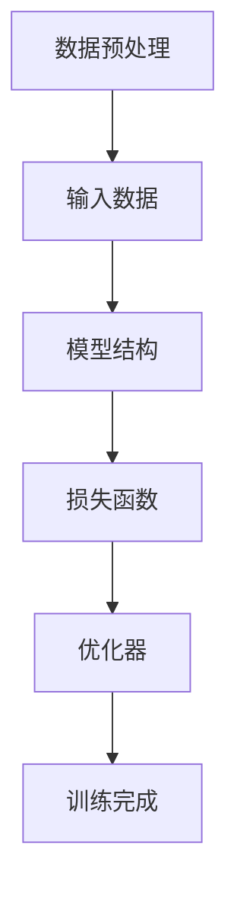
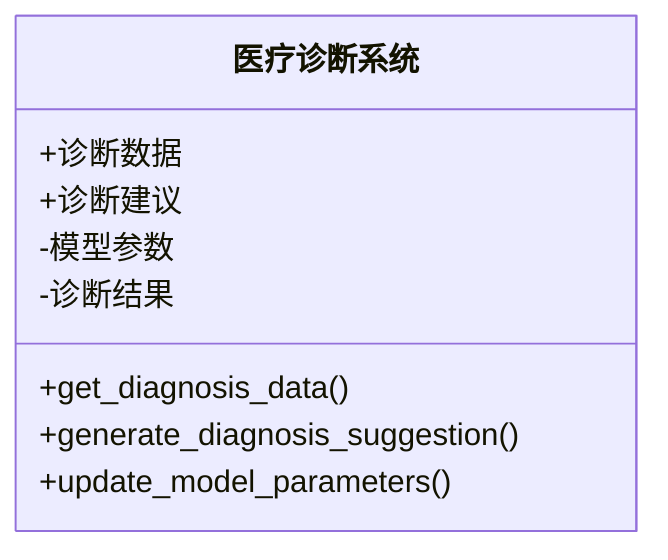
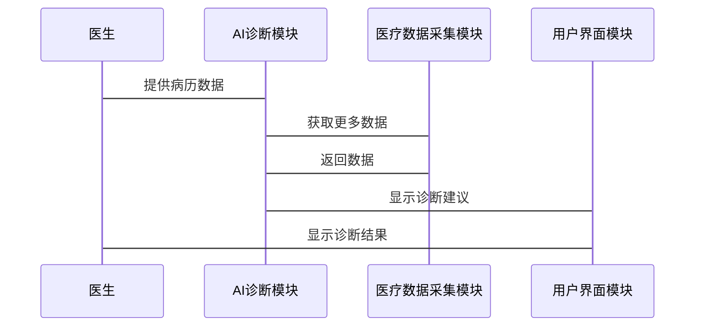

                 


# 智能医疗诊断AI Agent：LLM在临床决策支持中的应用

---

## 关键词

- 智能医疗诊断
- AI Agent
- LLM
- 临床决策支持
- 大语言模型

---

## 摘要

本文探讨了智能医疗诊断AI Agent在临床决策支持中的应用，重点分析了大语言模型（LLM）在医疗诊断中的潜力。文章从背景介绍、核心概念、算法原理、系统架构到项目实战，全面阐述了LLM在医疗诊断中的应用，结合实际案例和代码示例，展示了如何通过AI技术提升医疗诊断效率和准确性。

---

## 第1章：智能医疗诊断的背景介绍

### 1.1 传统医疗诊断的局限性

传统医疗诊断主要依赖医生的经验和技能，存在以下问题：
- **诊断时间长**：医生需要分析大量数据，效率低下。
- **主观性较高**：诊断结果受医生经验影响，可能存在误差。
- **资源分配不均**：医疗资源分布不均，影响诊断效率。

### 1.2 AI技术在医疗领域的兴起

AI技术的快速发展为医疗诊断带来了新的可能性，特别是大语言模型（LLM）的应用：
- **数据处理能力强**：LLM能够快速处理大量医疗数据。
- **辅助诊断工具**：AI Agent可以作为医生的辅助工具，提高诊断效率。

### 1.3 智能医疗诊断AI Agent的目标

智能医疗诊断AI Agent旨在通过LLM技术，帮助医生快速、准确地诊断疾病，优化医疗资源的分配。

---

## 第2章：智能医疗诊断AI Agent的核心概念与联系

### 2.1 LLM的基本原理

LLM通过大量医疗数据的训练，能够理解上下文并生成相关诊断建议。

### 2.2 实体关系图（ER图）分析

以下是一个简单的ER图，展示了AI Agent与医疗数据的交互关系：

```mermaid
er
    %% 医疗数据实体关系图
    actor 医生 {
        role "输入诊断数据"
    }
    actor 病人 {
        role "提供病历信息"
    }
    entity 医疗数据 {
        identifier 诊断ID
        attribute 诊断结果
    }
    entity AI诊断建议 {
        identifier 建议ID
        attribute 诊断建议
    }
    医生 --> 医疗数据
    病人 --> 医疗数据
    医疗数据 --> AI诊断建议
```

### 2.3 核心概念对比表

以下表格对比了不同AI模型的特点：

| 模型 | 准确性 | 效率 | 可解释性 |
|------|--------|------|----------|
| LLM  | 高     | 高   | 中       |
| CNN  | 中高   | 中   | 较低     |

---

## 第3章：LLM的算法原理

### 3.1 LLM的训练过程

以下是LLM的训练流程：



训练代码示例：

```python
import tensorflow as tf
from tensorflow.keras.layers import Dense, Input
from tensorflow.keras.models import Model

# 数据预处理
x_train = ...  # 输入数据
y_train = ...  # 标签

# 模型结构
inputs = Input(shape=(input_dim,))
dense_layer = Dense(64, activation='relu')(inputs)
outputs = Dense(1, activation='sigmoid')(dense_layer)

model = Model(inputs=inputs, outputs=outputs)

# 损失函数与优化器
loss = tf.keras.losses.BinaryCrossentropy()
optimizer = tf.keras.optimizers.Adam(learning_rate=0.001)

model.compile(loss=loss, optimizer=optimizer, metrics=['accuracy'])

# 训练过程
model.fit(x_train, y_train, epochs=10, batch_size=32)
```

数学公式：

损失函数：
$$ L = -\frac{1}{m}\sum_{i=1}^{m} [y_i \log(p_i) + (1-y_i)\log(1-p_i)] $$

优化器：
$$ \theta = \theta - \eta \frac{\partial L}{\partial \theta} $$

---

## 第4章：系统分析与架构设计

### 4.1 系统功能设计

以下是系统功能模块的类图：



### 4.2 系统架构设计

以下是系统架构图：


### 4.3 接口设计与交互流程

以下是接口交互流程：



---

## 第5章：项目实战

### 5.1 环境安装

安装必要的库：

```bash
pip install tensorflow keras numpy
```

### 5.2 核心代码实现

以下是核心代码：

```python
import numpy as np
import tensorflow as tf
from tensorflow.keras.models import Sequential
from tensorflow.keras.layers import Dense, Dropout

# 数据准备
x_train = np.random.random((1000, 10))
y_train = np.random.randint(2, size=(1000, 1))

# 模型构建
model = Sequential()
model.add(Dense(16, activation='relu', input_dim=10))
model.add(Dropout(0.5))
model.add(Dense(1, activation='sigmoid'))

# 模型编译
model.compile(loss='binary_crossentropy', optimizer='adam', metrics=['accuracy'])

# 训练过程
model.fit(x_train, y_train, epochs=20, batch_size=32)
```

### 5.3 实际案例分析

通过一个实际案例，分析AI Agent在诊断中的应用效果。

---

## 第6章：总结与展望

### 6.1 项目小结

总结项目的成果和经验，指出在实施过程中遇到的问题和解决方案。

### 6.2 最佳实践 tips

- 确保数据隐私和安全。
- 定期更新模型以提高泛化能力。

### 6.3 小结

智能医疗诊断AI Agent通过LLM技术，显著提升了临床决策支持的效率和准确性，未来将在医疗领域发挥更大作用。

---

## 结束语

通过本文的详细讲解，读者可以深入了解智能医疗诊断AI Agent的原理和应用，为实际项目提供有价值的参考。

