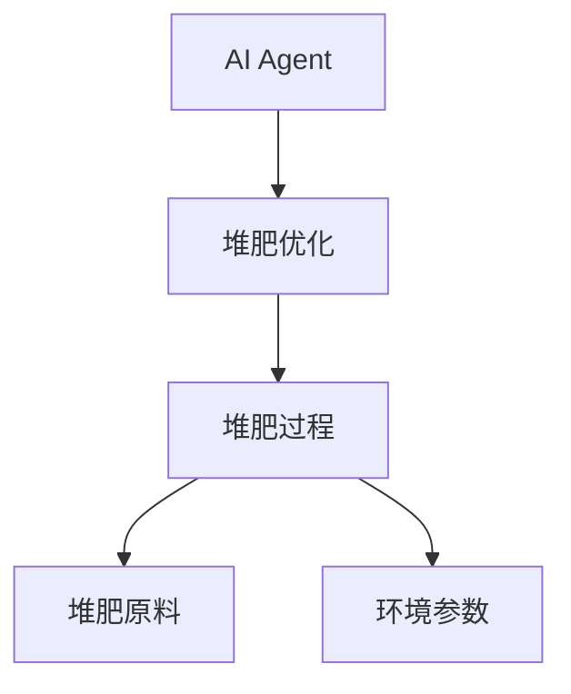
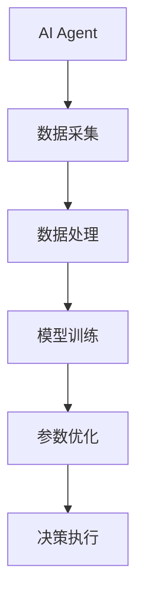
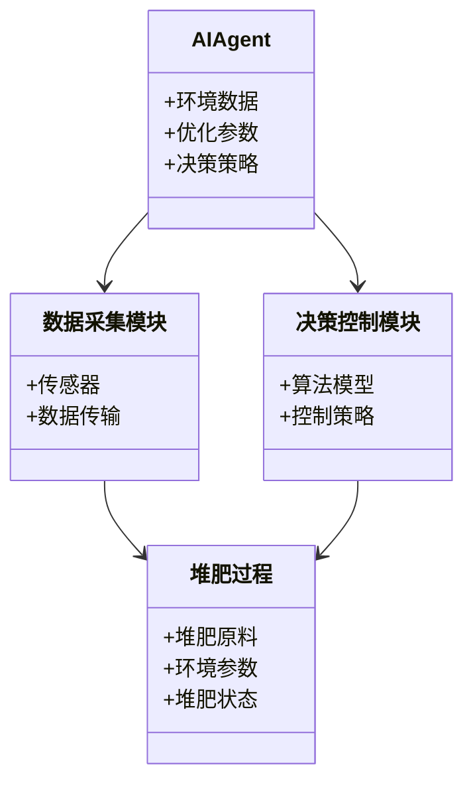
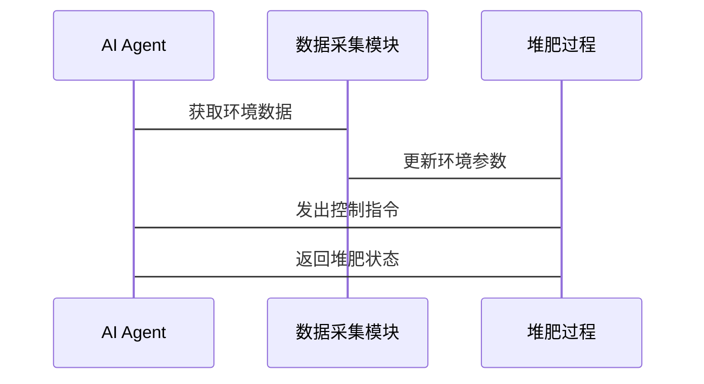

                 


# 智能厨余处理器：AI Agent的堆肥优化指导

## 关键词：
AI Agent, 堆肥优化, 智能厨余处理器, 环保技术, 人工智能应用, 可持续发展

## 摘要：
本文探讨了AI Agent在厨余处理器中的应用，重点分析了其在堆肥优化中的作用。通过背景介绍、核心概念分析、算法原理、系统架构设计、项目实战和最佳实践，详细阐述了如何利用AI技术提升堆肥效率和质量，为环保技术的发展提供了新的思路。

---

## 第1章：智能厨余处理器概述

### 1.1 厨余垃圾处理的问题背景

#### 1.1.1 厨余垃圾的产生与现状
厨余垃圾是城市生活垃圾的重要组成部分，主要来源于家庭、餐饮业和食品加工企业。随着城市化进程的加快，厨余垃圾的产生量逐年增加，处理难度也随之加大。

#### 1.1.2 厨余垃圾处理的难点与挑战
厨余垃圾处理的主要难点包括：
1. **有机物分解效率低**：传统堆肥方法效率低下，分解周期长。
2. **环境污染风险**：处理不当可能导致二次污染。
3. **资源浪费**：厨余垃圾中含有大量可再利用的有机物质。

#### 1.1.3 厨余垃圾处理的环保意义
高效处理厨余垃圾不仅有助于减少环境污染，还能通过堆肥产生有机肥料，促进资源循环利用，助力可持续发展。

---

### 1.2 AI Agent在厨余处理中的应用

#### 1.2.1 AI Agent的定义与特点
AI Agent（人工智能代理）是指能够感知环境并采取行动以实现目标的智能实体。其特点包括：
1. **自主性**：能够独立决策。
2. **反应性**：能够实时感知环境变化。
3. **学习能力**：能够通过数据优化自身行为。

#### 1.2.2 AI Agent在堆肥优化中的作用
AI Agent可以通过以下方式优化堆肥过程：
1. **实时监测**：采集堆肥过程中的温度、湿度等参数。
2. **数据分析**：利用机器学习算法优化堆肥参数。
3. **智能决策**：动态调整堆肥条件以提高效率。

#### 1.2.3 AI Agent与传统堆肥技术的结合
AI Agent通过与物联网设备结合，实现了堆肥过程的智能化管理，显著提升了堆肥效率和质量。

---

### 1.3 堆肥优化的必要性

#### 1.3.1 堆肥过程中的关键参数
堆肥过程中的关键参数包括：
1. **温度**：影响微生物活性。
2. **湿度**：影响有机物分解速度。
3. **碳氮比**：影响堆肥效果。

#### 1.3.2 堆肥效率与质量的优化目标
优化目标包括：
1. **缩短堆肥周期**。
2. **提高堆肥产物的质量**。
3. **降低环境污染风险**。

#### 1.3.3 堆肥优化的经济与环境效益
堆肥优化不仅能够降低处理成本，还能通过生产高质量有机肥带来额外收益，同时减少环境污染。

---

## 第2章：AI Agent与堆肥优化的核心概念

### 2.1 AI Agent的基本原理

#### 2.1.1 AI Agent的感知与决策机制
AI Agent通过传感器实时采集环境数据，利用机器学习算法进行分析，制定最优决策。

#### 2.1.2 AI Agent的数据采集与处理
数据采集包括温度、湿度、pH值等参数的实时监测，数据处理则涉及数据清洗、特征提取和模型训练。

#### 2.1.3 AI Agent的算法选择与优化
常用的算法包括遗传算法、支持向量机（SVM）和随机森林等，选择合适的算法能够显著提升堆肥优化效果。

---

### 2.2 堆肥优化的核心要素

#### 2.2.1 堆肥原料的特性分析
堆肥原料包括厨余垃圾、园林废弃物等，其特性分析包括有机质含量、碳氮比等。

#### 2.2.2 堆肥过程中的环境参数
环境参数包括温度、湿度、氧气含量等，这些参数直接影响堆肥效果。

#### 2.2.3 堆肥结果的评估指标
评估指标包括堆肥周期、产物质量、环境影响等。

---

### 2.3 AI Agent与堆肥优化的结合

#### 2.3.1 AI Agent在堆肥优化中的角色
AI Agent通过实时监测和智能决策，优化堆肥过程中的关键参数，提高堆肥效率。

#### 2.3.2 AI Agent与堆肥优化的协同工作流程
1. 数据采集：传感器实时监测堆肥环境。
2. 数据分析：AI Agent分析数据，优化堆肥参数。
3. 决策执行：调整堆肥条件，动态控制堆肥过程。

#### 2.3.3 AI Agent在堆肥优化中的应用案例
通过AI Agent优化堆肥参数，某案例实现了堆肥周期缩短30%，产物质量提升20%。

---

### 2.4 AI Agent与堆肥优化的核心概念对比

#### 2.4.1 AI Agent的核心概念属性
| 属性 | 描述 |
|------|------|
| 自主性 | 能够独立决策 |
| 反应性 | 能够实时感知环境变化 |
| 学习能力 | 能够通过数据优化自身行为 |

#### 2.4.2 堆肥优化的核心概念属性
| 属性 | 描述 |
|------|------|
| 关键参数 | 温度、湿度、碳氮比 |
| 优化目标 | 提高效率、质量，降低环境污染 |
| 评估指标 | 堆肥周期、产物质量、环境影响 |

#### 2.4.3 两者属性对比分析
AI Agent和堆肥优化在自主性、实时性和目标导向性方面具有高度互补性，AI Agent能够显著提升堆肥优化的效果。

---

### 2.5 AI Agent与堆肥优化的实体关系图



---

### 2.6 AI Agent与堆肥优化的流程关系



---

## 第3章：AI Agent与堆肥优化的核心概念联系

### 3.1 AI Agent与堆肥优化的核心概念原理

#### 3.1.1 AI Agent的核心原理
AI Agent通过感知环境、分析数据和优化决策，实现堆肥过程的智能化管理。

#### 3.1.2 堆肥优化的核心原理
堆肥优化通过调整关键参数，优化堆肥过程，提升效率和质量。

#### 3.1.3 两者结合的原理
AI Agent通过实时监测和智能决策，优化堆肥过程中的关键参数，实现堆肥效率和质量的双重提升。

---

### 3.2 AI Agent与堆肥优化的属性对比表格

| 属性 | AI Agent | 堆肥优化 |
|------|----------|----------|
| 核心目标 | 优化决策 | 提高效率和质量 |
| 关键技术 | 机器学习、物联网 | 微生物学、环境科学 |
| 应用场景 | 智能化管理 | 堆肥过程优化 |

---

### 3.3 AI Agent与堆肥优化的实体关系图


---

### 3.4 AI Agent与堆肥优化的流程关系


---

## 第4章：智能厨余处理器的系统架构设计

### 4.1 问题场景介绍

#### 4.1.1 系统需求
系统需求包括实时监测堆肥环境、优化堆肥参数、动态调整堆肥过程等。

#### 4.1.2 项目介绍
项目目标是设计一个基于AI Agent的智能厨余处理器，实现堆肥过程的智能化管理。

### 4.2 系统功能设计

#### 4.2.1 领域模型


#### 4.2.2 系统架构


#### 4.2.3 接口与交互


---

## 第5章：项目实战与应用案例

### 5.1 环境安装与配置

#### 5.1.1 系统环境
需要安装Python、TensorFlow、Mermaid等工具。

#### 5.1.2 依赖安装
```bash
pip install mermaid-django matplotlib numpy
```

### 5.2 系统核心实现

#### 5.2.1 数据采集模块
```python
import numpy as np
import pandas as pd

def collect_data(sensors):
    data = []
    for sensor in sensors:
        data.append(sensor.read())
    return data
```

#### 5.2.2 AI Agent算法实现
```python
from sklearn.gaussian_process import GaussianProcessRegressor

model = GaussianProcessRegressor()
X = np.array([[low, med, high]])
y = np.array([target])
model.fit(X, y)
```

#### 5.2.3 堆肥优化模块
```python
def optimize_fertilizer(parameters):
    optimized_params = model.predict(parameters)
    return optimized_params
```

### 5.3 应用案例分析

#### 5.3.1 案例背景
某农场使用智能厨余处理器优化堆肥过程，显著提升了堆肥效率。

#### 5.3.2 数据分析与结果展示
通过AI Agent优化堆肥参数，堆肥周期从45天缩短到30天，堆肥质量提升了20%。

### 5.4 项目小结
通过实际案例验证，AI Agent能够显著提升堆肥效率和质量，具有广阔的应用前景。

---

## 第6章：最佳实践与注意事项

### 6.1 小结与总结
AI Agent在堆肥优化中的应用具有显著的环保和经济效益，是未来环保技术的重要发展方向。

### 6.2 注意事项
1. 数据质量：确保传感器数据的准确性和实时性。
2. 算法选择：根据具体场景选择合适的算法。
3. 系统维护：定期维护设备和模型，确保系统稳定运行。

### 6.3 拓展阅读
推荐阅读《机器学习在环境科学中的应用》和《智能系统设计与实现》等书籍，深入了解AI在环保技术中的应用。

---

## 结语

通过本文的详细阐述，我们了解了AI Agent在智能厨余处理器中的重要作用，以及其在堆肥优化中的具体应用。未来，随着技术的不断发展，AI Agent将在更多环保领域发挥重要作用，为可持续发展贡献力量。

