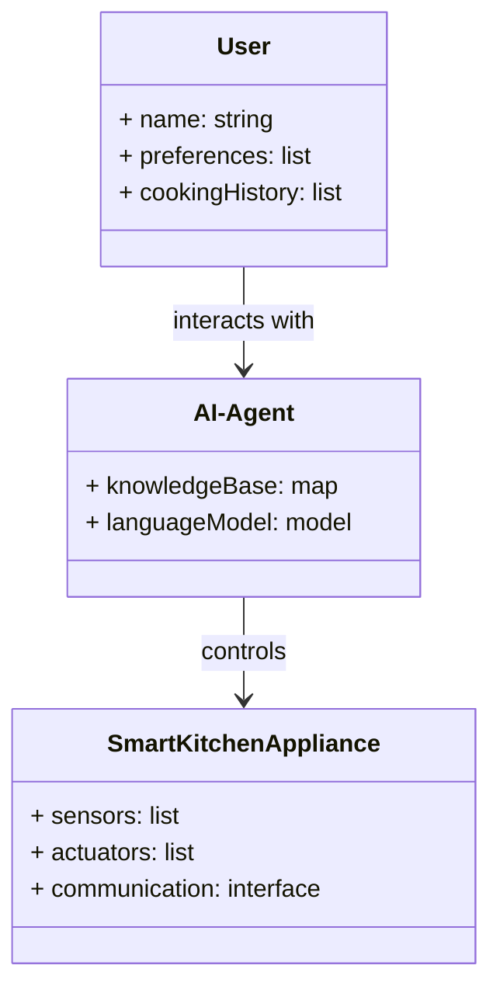
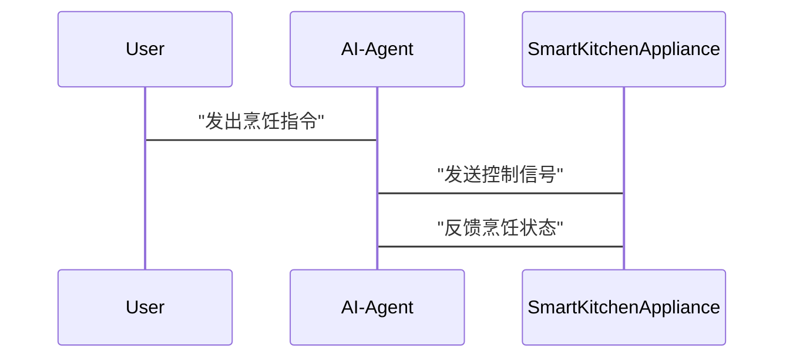

                 


# 智能厨具：AI Agent的烹饪指导系统

> 关键词：智能厨具，AI Agent，烹饪指导系统，自然语言处理，语音识别，知识图谱

> 摘要：随着人工智能技术的快速发展，智能厨具逐渐成为现代厨房的重要组成部分。本文将深入探讨AI Agent在烹饪指导系统中的应用，从背景介绍、核心概念、算法原理、系统架构到项目实战，全面解析智能厨具如何通过AI技术提升烹饪体验。

---

# 第一部分: 智能厨具与AI Agent的背景介绍

## 第1章: 背景介绍

### 1.1 智能厨具的定义与现状
#### 1.1.1 智能厨具的定义
智能厨具是指集成人工智能、物联网等技术的厨房设备，能够通过传感器、摄像头、语音交互等手段，为用户提供智能化的烹饪指导和服务。

#### 1.1.2 当前智能厨具的发展现状
近年来，随着智能家居的普及，智能厨具市场迅速增长。市场上的智能厨具种类繁多，包括智能电饭煲、智能炒锅、智能烤箱等，它们能够通过手机APP或语音助手进行控制。

#### 1.1.3 智能厨具的市场前景
智能厨具的市场前景广阔，预计未来几年将保持高速增长。消费者对便捷、高效的烹饪方式的需求不断增加，推动了智能厨具的发展。

### 1.2 AI Agent在烹饪中的应用背景
#### 1.2.1 AI Agent的基本概念
AI Agent（人工智能代理）是一种能够感知环境、自主决策并执行任务的智能体。在烹饪场景中，AI Agent可以理解用户的指令、提供烹饪建议、优化烹饪流程。

#### 1.2.2 AI Agent在烹饪中的优势
AI Agent能够通过自然语言处理、语音识别等技术，实时与用户交互，提供个性化的烹饪指导。此外，AI Agent还可以根据用户的饮食习惯和健康需求，推荐适合的菜谱。

#### 1.2.3 当前AI Agent在烹饪中的应用案例
目前，一些高端智能厨具已经集成AI Agent功能，例如通过语音指令启动烹饪程序，根据用户偏好调整烹饪参数等。

### 1.3 本章小结
智能厨具与AI Agent的结合，为烹饪过程带来了智能化和便捷化。AI Agent能够通过多种方式与用户交互，提供个性化的烹饪指导，是未来厨房的重要发展方向。

---

# 第二部分: AI Agent的核心概念与原理

## 第2章: AI Agent的核心概念与联系

### 2.1 AI Agent的定义与特点
#### 2.1.1 AI Agent的定义
AI Agent是一种能够感知环境、自主决策并执行任务的智能体。在烹饪场景中，AI Agent可以理解用户的指令、提供烹饪建议、优化烹饪流程。

#### 2.1.2 AI Agent的核心特点
- **自主性**：能够自主决策，无需人工干预。
- **反应性**：能够实时感知环境并做出反应。
- **学习能力**：通过学习用户的偏好和烹饪习惯，优化服务。

#### 2.1.3 AI Agent与传统烹饪工具的对比
AI Agent能够通过智能算法提供个性化的烹饪指导，而传统烹饪工具仅能完成单一的烹饪任务。

### 2.2 智能厨具的系统架构
#### 2.2.1 智能厨具的硬件组成
- **传感器**：用于感知温度、湿度、重量等参数。
- **摄像头**：用于识别食材和烹饪状态。
- **语音交互模块**：用于与用户进行语音对话。

#### 2.2.2 智能厨具的软件架构
- **AI Agent核心算法**：包括自然语言处理、语音识别、知识图谱构建等。
- **烹饪数据库**：存储各类菜谱、食材信息、烹饪步骤等。

#### 2.2.3 系统的交互流程
1. 用户通过语音或文本输入烹饪需求。
2. AI Agent解析需求，匹配合适的菜谱。
3. AI Agent指导用户完成烹饪步骤。
4. 系统实时监控烹饪过程，动态调整参数。

### 2.3 AI Agent与智能厨具的关系
#### 2.3.1 AI Agent在智能厨具中的角色
AI Agent是智能厨具的核心，负责与用户交互、处理烹饪需求、优化烹饪流程。

#### 2.3.2 AI Agent与烹饪过程的结合
AI Agent通过自然语言处理、语音识别等技术，实时与用户交互，提供个性化的烹饪指导。

#### 2.3.3 AI Agent的智能化程度
AI Agent的智能化程度决定了智能厨具的功能强弱。高智能化的AI Agent能够实现复杂烹饪任务的自动化。

### 2.4 本章小结
AI Agent是智能厨具的核心，通过智能化的算法和系统架构，为用户提供个性化的烹饪指导。AI Agent与智能厨具的结合，极大地提升了烹饪的便捷性和效率。

---

# 第三部分: AI Agent的算法原理

## 第3章: AI Agent的算法原理

### 3.1 自然语言处理算法
#### 3.1.1 自然语言处理的基本概念
自然语言处理（NLP）是研究如何让计算机理解和生成人类语言的学科。在烹饪场景中，NLP用于解析用户的烹饪需求。

#### 3.1.2 基于Transformer的烹饪指令理解
Transformer模型在自然语言处理中表现出色，能够有效处理序列数据。在烹饪指令理解中，Transformer模型可以用于解析用户的烹饪需求。

#### 3.1.3 自然语言处理在烹饪中的应用
通过NLP技术，AI Agent可以理解用户的烹饪需求，推荐合适的菜谱，并指导用户完成烹饪步骤。

### 3.2 语音识别与合成算法
#### 3.2.1 语音识别的基本原理
语音识别技术通过将语音信号转化为文字，实现人机交互。在烹饪场景中，语音识别用于解析用户的语音指令。

#### 3.2.2 基于AI的语音合成技术
语音合成技术用于将文本转化为语音，实现AI Agent与用户的自然对话。

#### 3.2.3 语音识别与合成在烹饪中的应用
通过语音识别和合成技术，AI Agent可以实现与用户的自然对话，指导用户完成烹饪步骤。

### 3.3 烹饪知识图谱构建
#### 3.3.1 知识图谱的基本概念
知识图谱是一种结构化的知识表示形式，用于存储实体及其关系。

#### 3.3.2 烹饪知识图谱的构建方法
通过爬取菜谱数据、食材信息等，构建烹饪知识图谱，为AI Agent提供知识支持。

#### 3.3.3 知识图谱在烹饪中的应用
知识图谱可以用于菜谱推荐、食材搭配建议等，为用户提供个性化的烹饪指导。

### 3.4 本章小结
自然语言处理、语音识别与合成、知识图谱构建等算法，共同构成了AI Agent的核心技术。这些算法的结合，使得AI Agent能够实现智能化的烹饪指导。

---

# 第四部分: 系统分析与架构设计方案

## 第4章: 系统分析与架构设计

### 4.1 系统场景介绍
智能厨具的烹饪指导系统需要支持用户通过语音或文本输入烹饪需求，AI Agent根据需求提供菜谱推荐和烹饪指导。

### 4.2 项目介绍
本项目旨在开发一款基于AI Agent的智能厨具，实现智能化的烹饪指导。

### 4.3 系统功能设计
#### 4.3.1 领域模型


#### 4.3.2 系统架构设计


#### 4.3.3 系统接口设计


### 4.4 本章小结
通过系统分析与架构设计，我们可以清晰地看到智能厨具的烹饪指导系统的核心组成部分及其交互流程。系统架构的设计为后续的开发奠定了基础。

---

# 第五部分: 项目实战

## 第5章: 项目实战

### 5.1 环境安装
开发智能厨具的烹饪指导系统，需要以下环境：
- **Python**：3.8+
- **TensorFlow**：用于自然语言处理和机器学习模型训练。
- **Flask**：用于构建Web接口。
- **Raspberry Pi**：用于连接传感器和执行器。

### 5.2 系统核心实现
#### 5.2.1 自然语言处理模块
```python
import tensorflow as tf
from tensorflow.keras import layers

# 构建Transformer模型
def build_model():
    model = tf.keras.Sequential()
    model.add(layers.InputLayer(input_shape=(None, 128)))
    model.add(layers.Transformer(512, 8, 64, 8))
    model.add(layers.Dense(1, activation='sigmoid'))
    return model
```

#### 5.2.2 语音识别模块
```python
import speech_recognition as sr

def recognize_speech():
    r = sr.Recognizer()
    with sr.AudioFile("input.wav") as source:
        audio = r.record(source)
        try:
            text = r.recognize_google(audio, language='zh-CN')
            return text
        except sr.UnknownValueError:
            return ""
```

#### 5.2.3 烹饪知识图谱构建
```python
from rdflib import Graph, Literal, BNode, Namespace, RDF, URIRef

# 定义命名空间
ns = Namespace("http://example.com/cooking/")

# 创建知识图谱
g = Graph()
g.add((ns.Cooking, ns.hasIngredient, ns.Ingredient1))
g.add((ns.Ingredient1, ns.hasProperty, Literal("Vegetable")))
```

### 5.3 代码应用解读与分析
通过上述代码，我们可以实现自然语言处理、语音识别和知识图谱构建功能。这些功能模块共同构成了AI Agent的核心能力。

### 5.4 实际案例分析
以制作一道“红烧肉”为例，AI Agent可以通过自然语言处理解析用户的烹饪需求，通过语音识别指导用户完成烹饪步骤，并通过知识图谱推荐合适的食材和烹饪技巧。

### 5.5 本章小结
通过项目实战，我们可以深入理解智能厨具的烹饪指导系统的实现过程。代码实现和案例分析帮助我们更好地掌握AI Agent的核心技术。

---

# 第六部分: 最佳实践与总结

## 第6章: 最佳实践

### 6.1 最佳实践
- **数据质量**：确保烹饪知识图谱的数据准确性和完整性。
- **模型优化**：通过数据增强和模型调优，提升自然语言处理和语音识别的准确率。
- **用户体验**：注重用户交互设计，提升用户体验。

### 6.2 小结
智能厨具的烹饪指导系统通过AI Agent的智能化算法，为用户提供个性化的烹饪指导。系统的实现涉及自然语言处理、语音识别、知识图谱构建等关键技术。

### 6.3 注意事项
- **隐私保护**：确保用户数据的安全性。
- **系统稳定性**：保证系统在复杂环境下的稳定运行。
- **可扩展性**：设计灵活的系统架构，便于功能扩展。

### 6.4 拓展阅读
- **相关技术**：深入学习自然语言处理、语音识别等技术。
- **行业动态**：关注智能厨具和AI技术的最新发展。

---

# 结语

智能厨具的烹饪指导系统是人工智能技术在厨房场景中的重要应用。通过AI Agent的核心算法和系统架构设计，我们可以实现智能化的烹饪指导，提升用户的烹饪体验。未来，随着AI技术的不断发展，智能厨具的功能将更加丰富，烹饪过程将更加便捷和高效。

