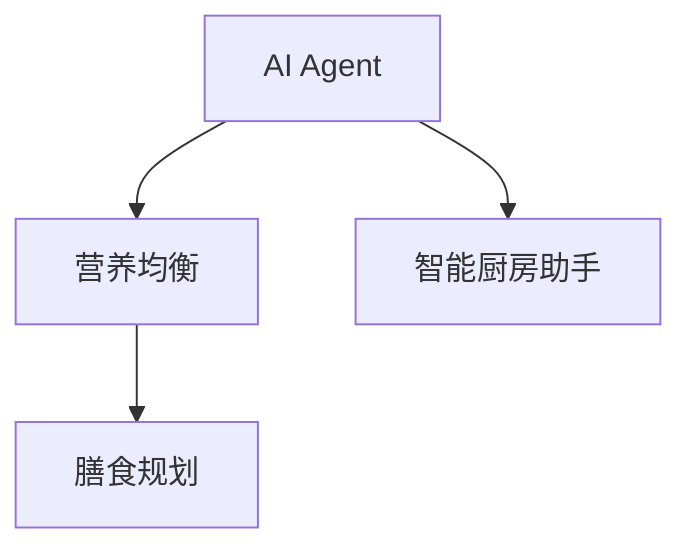
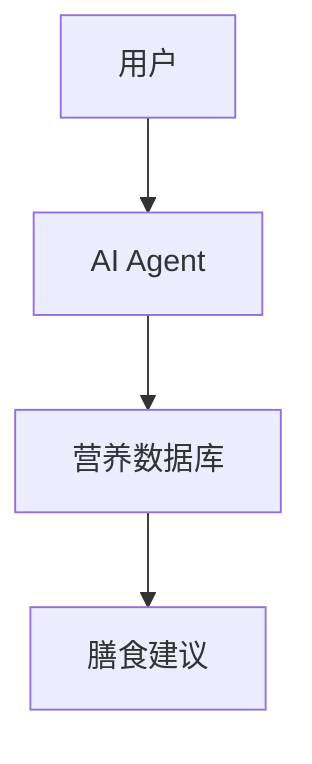
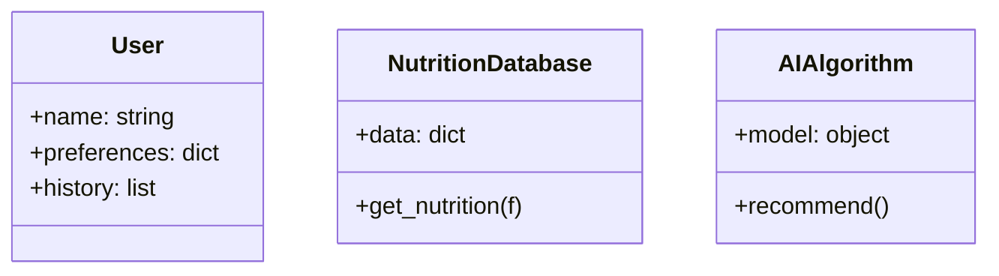
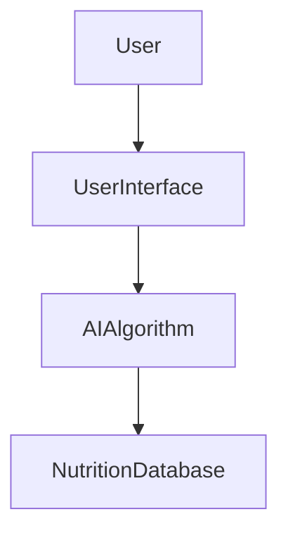
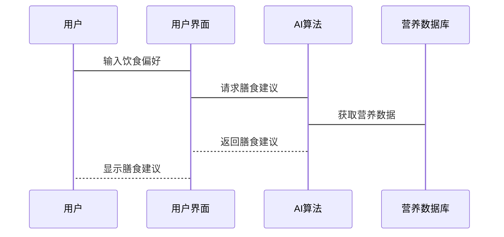

                 


# 智能厨房助手：AI Agent的营养均衡膳食规划

> **关键词**：AI Agent、营养均衡、膳食规划、智能厨房助手、推荐算法  
> **摘要**：本文探讨AI Agent在营养均衡膳食规划中的应用，通过系统分析、算法设计和项目实战，详细介绍智能厨房助手的实现过程，从理论到实践，帮助读者全面理解如何利用AI技术优化饮食健康。

---

## 第1章：背景介绍

### 1.1 问题背景
#### 1.1.1 当代饮食健康问题的现状
现代人生活节奏快，饮食不规律，营养失衡问题日益严重。世界卫生组织数据显示，超过60%的成年人存在营养摄入不均衡的情况，导致多种慢性疾病。

#### 1.1.2 营养失衡的普遍性与危害
营养失衡不仅影响身体健康，还可能导致肥胖、糖尿病、心血管疾病等问题，严重威胁个人生活质量。

#### 1.1.3 AI技术在健康领域的潜力
AI技术在医疗、健康管理等领域展现出巨大潜力，特别是在个性化健康解决方案方面，AI能够通过数据分析和模式识别，提供精准的营养建议。

### 1.2 问题描述
#### 1.2.1 营养均衡膳食规划的核心目标
通过AI技术，帮助用户制定科学合理的饮食计划，确保各类营养素的均衡摄入。

#### 1.2.2 用户需求分析
- 个性化需求：不同用户有不同的营养需求，如减肥、增肌、慢性病管理等。
- 实时性需求：用户需要快速获取膳食建议。
- 便捷性需求：用户希望在厨房中轻松获取建议，无需复杂操作。

#### 1.2.3 现有解决方案的局限性
传统膳食规划方法依赖人工计算，效率低且难以个性化。现有AI应用多集中于健康监测，缺乏针对厨房场景的膳食规划功能。

### 1.3 问题解决
#### 1.3.1 AI Agent在膳食规划中的作用
AI Agent能够实时分析用户需求，结合营养数据库，提供个性化的膳食建议。

#### 1.3.2 智能厨房助手的功能定位
作为用户的智能助手，智能厨房助手能够提供食材推荐、食谱建议、营养分析等服务。

#### 1.3.3 技术实现路径
通过数据采集、算法设计、系统集成等步骤，构建智能厨房助手的完整解决方案。

### 1.4 边界与外延
#### 1.4.1 功能边界
智能厨房助手仅专注于膳食规划，不涉及食材采购、烹饪指导等其他功能。

#### 1.4.2 与健康管理系统的区别
健康管理系统通常涵盖全面的健康监测，而智能厨房助手专注于厨房场景的膳食规划。

#### 1.4.3 与其他AI应用的联系
智能厨房助手与其他AI健康应用共享数据和技术，但专注于特定场景的应用。

### 1.5 概念结构与核心要素
#### 1.5.1 核心概念的层次化分解
- 层级1：AI Agent
- 层级2：营养均衡、膳食规划
- 层级3：智能厨房助手

#### 1.5.2 核心要素的系统性分析
- 数据输入：用户需求、营养数据库
- 核心处理：AI算法、营养分析
- 输出结果：膳食建议

#### 1.5.3 概念结构图


---

## 第2章：核心概念与联系

### 2.1 AI Agent的基本原理
#### 2.1.1 AI Agent的定义与特征
AI Agent是一种智能实体，能够感知环境并自主决策，执行特定任务。

#### 2.1.2 AI Agent的分类与应用场景
- 分类：基于智能水平分为简单反应式、基于模型的反思式等。
- 应用场景：智能助手、自动驾驶、推荐系统。

#### 2.1.3 AI Agent的核心算法
- 机器学习算法：监督学习、无监督学习。
- 优化算法：遗传算法、模拟退火。

### 2.2 营养均衡膳食规划的数学模型
#### 2.2.1 营养均衡的数学表达
$$\text{目标函数：} \sum_{i=1}^{n} w_i x_i = \text{目标值}$$
其中，$w_i$为营养成分权重，$x_i$为摄入量。

#### 2.2.2 食物分类与营养成分分析
- 食物分类：蛋白质、碳水化合物、脂肪等。
- 营养成分分析：每种食物的热量、维生素含量等。

#### 2.2.3 用户需求的参数化表示
- 参数化表示：用户的饮食偏好、健康目标等。

### 2.3 AI Agent与营养均衡膳食规划的结合
#### 2.3.1 数据流分析
用户输入 → 数据处理 → AI Agent处理 → 输出膳食建议。

#### 2.3.2 系统功能模块划分
- 数据采集模块：收集用户需求和营养数据库。
- 处理模块：AI算法生成膳食建议。
- 输出模块：呈现结果。

#### 2.3.3 实体关系图


---

## 第3章：算法原理讲解

### 3.1 营养均衡膳食推荐算法
#### 3.1.1 基于协同过滤的推荐算法
协同过滤通过分析用户行为相似性，推荐相似用户的饮食习惯。

#### 3.1.2 基于内容的推荐算法
基于食物的营养成分，推荐高相似度的食谱。

#### 3.1.3 混合推荐算法
结合协同过滤和内容推荐，提升推荐准确率。

### 3.2 AI Agent的决策树算法
#### 3.2.1 决策树的构建过程
- 数据预处理：清洗、特征选择。
- 模型训练：ID3、C4.5算法。
- 模型优化：剪枝处理。

#### 3.2.2 决策树的优化策略
- 参数调整：剪枝深度。
- 数据增强：防止过拟合。

#### 3.2.3 决策树的实现代码
```python
from sklearn.tree import DecisionTreeClassifier
import pandas as pd

# 加载数据
data = pd.read_csv('nutrition_data.csv')

# 特征与目标分离
X = data.drop('label', axis=1)
y = data['label']

# 训练模型
model = DecisionTreeClassifier()
model.fit(X, y)
```

### 3.3 算法的数学模型与公式
#### 3.3.1 营养均衡的数学模型
$$\text{目标函数：} \sum_{i=1}^{n} w_i x_i = \text{目标值}$$

#### 3.3.2 膳食推荐的优化目标
$$\text{目标：} \min \sum_{i=1}^{m} (d_i - p_i)^2$$
其中，$d_i$为用户需求，$p_i$为推荐值。

#### 3.3.3 算法的收敛性分析
- 收敛条件：目标函数值小于阈值。
- 收敛速度：与算法复杂度相关。

---

## 第4章：系统分析与架构设计方案

### 4.1 问题场景介绍
#### 4.1.1 用户需求分析
用户需要在厨房中快速获取营养均衡的膳食建议。

#### 4.1.2 系统功能需求
- 数据采集：用户输入饮食偏好。
- 数据处理：分析用户需求。
- 算法处理：生成膳食建议。

### 4.2 项目介绍
#### 4.2.1 项目目标
开发一个智能厨房助手，帮助用户制定营养均衡的膳食计划。

#### 4.2.2 项目范围
- 系统架构设计。
- 算法实现。
- 用户界面设计。

### 4.3 系统功能设计
#### 4.3.1 领域模型类图


### 4.4 系统架构设计
#### 4.4.1 系统架构图


#### 4.4.2 接口设计
- 输入接口：用户输入偏好。
- 输出接口：膳食建议。

#### 4.4.3 交互序列图


---

## 第5章：项目实战

### 5.1 环境安装
- 安装Python、NumPy、Pandas、Scikit-learn等库。

### 5.2 系统核心实现
#### 5.2.1 数据采集模块
```python
def collect_input():
    # 收集用户输入
    pass
```

#### 5.2.2 数据处理模块
```python
def preprocess_data(data):
    # 数据预处理
    pass
```

#### 5.2.3 算法实现模块
```python
def train_model(data):
    # 训练模型
    pass
```

#### 5.2.4 输出模块
```python
def display_recommendation(recommendation):
    # 显示结果
    pass
```

### 5.3 代码应用解读与分析
- 数据采集：用户输入饮食偏好。
- 数据处理：清洗、特征选择。
- 算法实现：基于协同过滤和内容的混合推荐。
- 输出：显示膳食建议。

### 5.4 实际案例分析
- 案例1：用户希望减肥，系统推荐低热量、高蛋白的膳食。
- 案例2：用户希望增肌，系统推荐高蛋白、适量碳水化合物的膳食。

### 5.5 项目小结
通过实际案例，验证系统的有效性和准确性。

---

## 第6章：最佳实践与小结

### 6.1 最佳实践 tips
- 数据质量：确保数据准确、全面。
- 算法优化：根据需求调整算法参数。
- 系统维护：定期更新营养数据库。

### 6.2 小结
智能厨房助手通过AI技术，为用户提供科学合理的膳食建议，帮助用户实现营养均衡。

### 6.3 注意事项
- 保护用户隐私。
- 确保系统稳定性。

### 6.4 拓展阅读
- 推荐系统优化。
- AI在健康领域的其他应用。

---

## 附录

### 附录A：营养数据库结构
- 数据表结构：食材名称、营养成分、热量等。

### 附录B：API接口文档
- 输入格式：JSON格式。
- 输出格式：JSON格式。

---

通过以上步骤，我们可以清晰地看到，智能厨房助手的实现过程从理论到实践，涵盖数据采集、算法设计、系统架构等多个方面。希望这篇文章能为读者提供深入的指导和启发，帮助大家更好地理解AI在营养均衡膳食规划中的应用。

