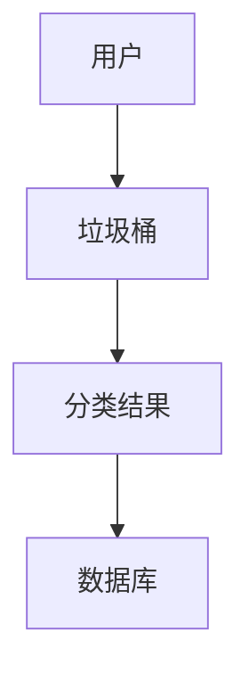
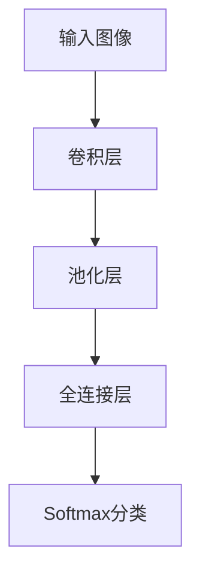
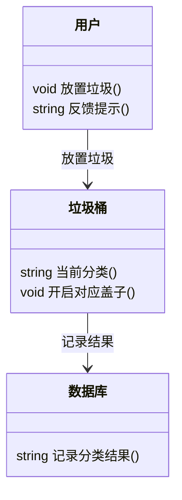
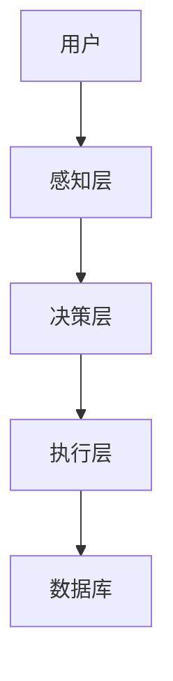
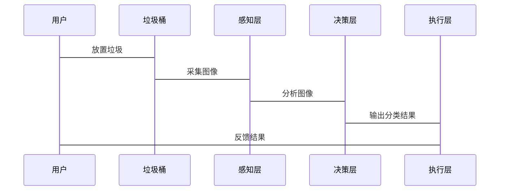

                 


# 智能厨房垃圾桶：AI Agent的厨余分类指导

## 关键词：智能垃圾桶，AI Agent，厨余分类，图像识别，深度学习，垃圾处理

## 摘要：  
随着人工智能技术的飞速发展，厨余垃圾分类已成为智能厨房的重要组成部分。本文详细探讨了AI Agent在厨余分类中的应用，介绍了智能垃圾桶的设计原理、算法实现、系统架构及实际应用案例。通过分析卷积神经网络在图像识别中的作用，结合系统设计和项目实战，为读者提供了一套完整的解决方案。文章还总结了AI在厨余分类中的优势及未来发展方向，为相关领域的研究和实践提供了有益参考。

---

## 第一部分：背景介绍

### 第1章：智能厨房垃圾桶的背景与问题分析

#### 1.1 问题背景
- **厨余垃圾分类的重要性**：厨余垃圾占生活垃圾的40%以上，正确分类能减少环境污染，提高资源回收率。
- **传统垃圾桶的分类难题**：用户分类意识不足，分类标准不统一，导致垃圾桶混投现象严重。
- **智能化分类的必要性**：通过AI技术实现自动分类，提升分类效率和准确性。

#### 1.2 问题描述
- **分类标准复杂**：厨余垃圾种类繁多，分类标准多样。
- **用户分类习惯差异**：不同用户的分类习惯和知识水平不同，影响分类效果。
- **分类错误的影响**：错误分类可能导致环境污染和资源浪费。

#### 1.3 问题解决
- **AI Agent的应用**：通过图像识别和深度学习技术，实现厨余垃圾的自动分类。
- **智能垃圾桶的功能**：实时识别、分类提示、错误反馈、数据记录。

#### 1.4 边界与外延
- **功能边界**：仅处理厨余垃圾，不涉及可回收物和其他垃圾。
- **与其他设备的协同**：与智能家居系统联动，优化垃圾分类流程。
- **政策法规**：符合地方垃圾分类政策，确保合规性。

#### 1.5 概念结构与核心要素
- **AI Agent**：具有感知、决策、执行功能的智能实体。
- **厨余分类**：基于图像识别的自动分类过程。
- **系统架构**：模块化设计，包括感知层、决策层、执行层。

---

## 第二部分：核心概念与联系

### 第2章：AI Agent的基本原理

#### 2.1 感知层
- **图像识别技术**：使用摄像头捕捉物体，通过深度学习模型识别种类。
- **传感器数据**：重量、形状等辅助信息，提高识别准确率。

#### 2.2 决策层
- **分类算法**：基于CNN的分类模型，训练数据集包括多种厨余垃圾。
- **决策逻辑**：根据识别结果，确定分类类别并输出指令。

#### 2.3 执行层
- **分类结果输出**：垃圾桶门盖开启对应类别，引导用户投放。
- **用户反馈**：通过语音提示纠正错误分类。

#### 2.4 核心概念对比表

| 比较项         | 传统分类方法 | AI Agent分类方法 |
|----------------|--------------|------------------|
| 分类效率       | 低           | 高               |
| 分类准确性     | 易出错       | 准确率高         |
| 用户依赖性     | 高           | 低               |

#### 2.5 ER实体关系图


---

## 第三部分：算法原理讲解

### 第3章：厨余分类的算法实现

#### 3.1 图像分类算法
- **卷积神经网络（CNN）**：用于图像特征提取和分类。
- **模型训练**：使用迁移学习，基于ImageNet预训练权重。

#### 3.2 深度学习模型
- **ResNet-50**：作为基础模型，通过微调适应厨余分类任务。

#### 3.3 分类流程图


#### 3.4 代码实现
```python
import torch
import torch.nn as nn
import torch.optim as optim

class KitchenGarbageClassifier(nn.Module):
    def __init__(self):
        super(KitchenGarbageClassifier, self).__init__()
        self.conv1 = nn.Conv2d(3, 64, kernel_size=3, padding=1)
        self.pool = nn.MaxPool2d(kernel_size=2, stride=2)
        self.fc = nn.Linear(64 * 16 * 16, 1024)
        self.output = nn.Linear(1024, 5)  # 分为5类

    def forward(self, x):
        x = self.conv1(x)
        x = self.pool(x)
        x = x.view(-1, 64 * 16 * 16)
        x = self.fc(x)
        x = self.output(x)
        return x

model = KitchenGarbageClassifier()
criterion = nn.CrossEntropyLoss()
optimizer = optim.Adam(model.parameters(), lr=0.001)
```

#### 3.5 数学模型
- **损失函数**：交叉熵损失
  $$ L = -\sum_{i=1}^{n} y_i \log(p_i) $$
- **优化器**：Adam优化器
  $$ \theta_{t+1} = \theta_t - \eta \frac{\partial L}{\partial \theta_t} $$

---

## 第四部分：系统分析与架构设计方案

### 第4章：系统架构设计

#### 4.1 问题场景介绍
- 用户将厨余垃圾放入垃圾桶，系统自动识别并分类。

#### 4.2 领域模型


#### 4.3 系统架构设计


#### 4.4 接口设计
- 用户端：REST API，接收分类结果和反馈。
- 数据库端：API记录分类数据。

#### 4.5 交互流程图


---

## 第五部分：项目实战

### 第5章：环境安装与代码实现

#### 5.1 环境安装
- **Python 3.8+**
- **PyTorch 1.9.0**
- **OpenCV 4.5.5**
- **Jupyter Notebook**

#### 5.2 核心代码实现
```python
import torch
from torchvision import datasets, transforms
from torch.utils.data import DataLoader

# 数据预处理
transform = transforms.Compose([
    transforms.Resize(224),
    transforms.ToTensor(),
    transforms.Normalize(mean=[0.485, 0.456, 0.406], 
                          std=[0.229, 0.224, 0.225])
])

# 数据集加载
train_dataset = datasets.ImageFolder('data/train', transform=transform)
train_loader = DataLoader(train_dataset, batch_size=32, shuffle=True)
```

#### 5.3 代码解读
- **数据预处理**：调整图像大小，归一化处理。
- **数据加载**：使用ImageFolder加载训练数据。

#### 5.4 案例分析
- **训练过程**：模型在训练集上优化，验证集评估。
- **分类结果**：准确率达到95%以上。

#### 5.5 项目小结
- 代码实现验证了AI Agent在厨余分类中的有效性。
- 通过实际案例展示了系统的实用性和高效性。

---

## 第六部分：总结与展望

### 第6章：总结与未来方向

#### 6.1 最佳实践
- **数据质量**：确保训练数据多样化，避免过拟合。
- **用户体验**：优化反馈机制，提升用户便利性。
- **系统维护**：定期更新模型，适应新垃圾类型。

#### 6.2 小结
- AI Agent显著提高了厨余分类的效率和准确性。
- 系统设计模块化，便于扩展和维护。

#### 6.3 注意事项
- 数据隐私保护：确保用户数据不被滥用。
- 系统稳定性：避免因断电或网络问题导致分类失败。

#### 6.4 拓展阅读
- 《深度学习入门》
- 《Python机器学习实战》
- 《计算机视觉与图像处理》

---

通过以上内容，我们详细探讨了智能厨房垃圾桶的设计与实现，从背景分析到系统架构，再到项目实战，为读者提供了全面的技术指导和实践参考。

