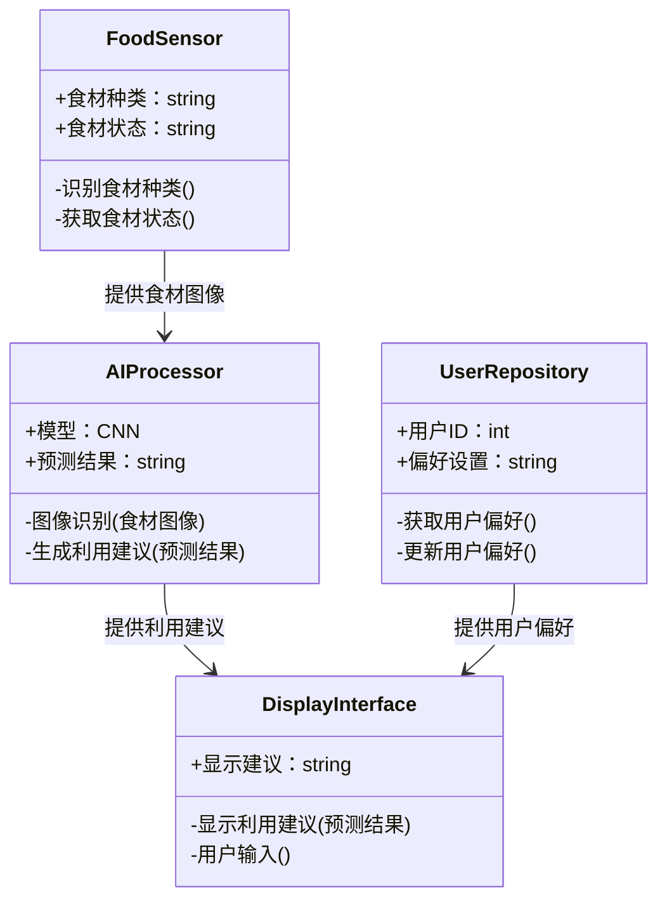
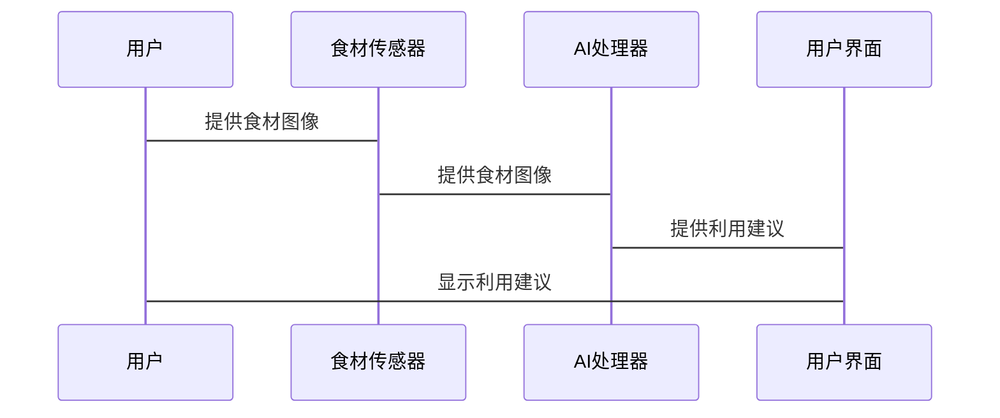

                 


# 第一部分: 智能厨房垃圾桶的背景与概念

## 第1章: 智能厨房垃圾桶的背景介绍

### 1.1 问题背景与描述

#### 1.1.1 厨房垃圾桶的现状与痛点
在现代家庭中，厨房垃圾桶的主要功能是收集和存储垃圾，但传统垃圾桶无法对垃圾进行分类，导致食材浪费严重。许多家庭在丢弃食材时，常常将可再利用的部分与其他垃圾混合，导致资源浪费和环境污染。

#### 1.1.2 食材浪费与资源利用的矛盾
全球范围内，食物浪费问题日益严重。根据联合国的数据，每年全球浪费的食品数量高达13亿吨，相当于全球人口一年所需粮食的三分之一。食材浪费不仅造成了资源的巨大浪费，还加剧了环境问题，例如填埋食物产生大量甲烷，对全球变暖有显著贡献。

#### 1.1.3 智能化垃圾桶的必要性
为了减少食材浪费，提高资源利用效率，智能化垃圾桶应运而生。通过AI技术，垃圾桶可以自动识别食材种类、质量和保质期，提供科学的利用建议，帮助用户最大化地利用食材，减少浪费。

### 1.2 AI Agent在智能垃圾桶中的作用

#### 1.2.1 AI Agent的定义与特点
AI Agent（人工智能代理）是指能够感知环境并采取行动以实现目标的智能实体。在智能垃圾桶中，AI Agent能够通过传感器和摄像头感知垃圾桶中的食材，分析其种类、状态，并提供相应的建议。

#### 1.2.2 AI Agent在垃圾桶中的应用场景
AI Agent在智能垃圾桶中的应用场景包括食材识别、分类、保质期提醒、利用建议生成等。例如，当垃圾桶中发现快过期的牛奶时，AI Agent会提醒用户尽快使用，或者建议将其用于烹饪。

#### 1.2.3 AI Agent的核心功能与目标
AI Agent的核心功能包括：
1. 食材识别与分类
2. 保质期监测与提醒
3. 食材利用建议生成
4. 数据分析与学习
目标是通过智能化管理，帮助用户最大限度地利用食材，减少浪费，同时提高垃圾桶的使用效率。

### 1.3 问题解决与边界

#### 1.3.1 智能垃圾桶如何解决食材分类问题
通过AI技术，智能垃圾桶能够自动识别食材种类，将其分类存储。例如，将蔬菜、水果、肉类等不同类型的食材分开存放，延长保质期。

#### 1.3.2 系统的边界与功能范围
智能垃圾桶的功能边界包括：
- 食材识别与分类
- 保质期监测
- 利用建议生成
- 数据记录与分析
不包括食材的物理处理和烹饪建议。

#### 1.3.3 食材利用建议的实现方式
通过分析用户的饮食习惯和食材的保质期，AI Agent可以生成相应的利用建议。例如，建议用户将过期的面包制成面包糠，用于烹饪。

### 1.4 概念结构与核心要素

#### 1.4.1 智能垃圾桶的核心要素分析
智能垃圾桶的核心要素包括：
- 传感器：用于感知食材的状态和环境
- AI算法：用于识别和分类食材
- 数据存储：用于记录食材信息和用户习惯
- 用户界面：用于交互和显示建议

#### 1.4.2 AI Agent与垃圾桶的交互关系
AI Agent通过垃圾桶中的传感器获取数据，分析后向用户提出建议，用户则根据建议进行操作，形成一个闭环系统。

#### 1.4.3 系统的外部与内部实体关系
外部实体包括用户、垃圾桶硬件、食材。内部实体包括AI Agent、传感器、数据存储、用户界面。

## 第2章: AI Agent的核心概念与原理

### 2.1 AI Agent的基本原理

#### 2.1.1 AI Agent的定义与分类
AI Agent是一种智能实体，能够感知环境并采取行动。根据功能的不同，AI Agent可以分为信息收集型、决策型和执行型。

#### 2.1.2 AI Agent的核心技术组成
AI Agent的核心技术包括：
- 传感器和数据采集技术
- 数据分析与机器学习
- 自然语言处理（NLP）
- 计算机视觉

#### 2.1.3 AI Agent的工作流程
1. 数据采集：通过传感器和摄像头获取垃圾桶中的食材信息
2. 数据分析：通过AI算法识别食材种类和状态
3. 生成建议：根据分析结果生成利用建议
4. 与用户交互：通过界面显示建议，用户进行操作

### 2.2 AI Agent与传统垃圾桶的对比

#### 2.2.1 传统垃圾桶的功能与局限性
传统垃圾桶只能收集和存储垃圾，无法进行分类和利用建议生成，资源浪费严重。

#### 2.2.2 AI Agent垃圾桶的优势与创新点
AI Agent垃圾桶的优势在于智能化管理和资源优化。通过AI技术，垃圾桶能够自动分类食材，延长保质期，减少浪费。

#### 2.2.3 AI Agent垃圾桶的核心竞争力
AI Agent垃圾桶的核心竞争力在于其智能化管理和资源优化能力，能够帮助用户最大限度地利用食材，减少浪费。

### 2.3 AI Agent的核心技术解析

#### 2.3.1 自然语言处理（NLP）在垃圾桶中的应用
NLP技术用于解析用户的输入，例如用户询问某种食材的保存方法时，AI Agent可以通过NLP技术理解用户需求并提供相应的建议。

#### 2.3.2 计算机视觉在食材识别中的作用
计算机视觉技术用于识别垃圾桶中的食材种类和状态，例如通过图像识别技术识别出是苹果还是香蕉，并判断其是否腐烂。

#### 2.3.3 机器学习在食材分类中的应用
机器学习算法用于训练模型，识别不同类型的食材，并预测其保质期。例如，使用卷积神经网络（CNN）对食材图像进行分类。

## 第3章: AI Agent的算法原理与实现

### 3.1 算法原理概述

#### 3.1.1 图像识别算法
图像识别算法用于识别垃圾桶中的食材种类。常用算法包括卷积神经网络（CNN）和区域卷积神经网络（RCNN）。

#### 3.1.2 保质期预测算法
保质期预测算法用于预测食材的剩余保质时间。常用算法包括时间序列分析和回归分析。

#### 3.1.3 利用建议生成算法
利用建议生成算法根据食材种类和保质期，生成相应的利用建议。例如，建议将过期的牛奶用于烹饪。

### 3.2 算法实现细节

#### 3.2.1 图像识别实现
1. 数据采集：收集不同食材的图像数据
2. 数据预处理：对图像进行归一化和增强处理
3. 模型训练：使用CNN训练图像分类模型
4. 模型部署：将训练好的模型部署到垃圾桶中，实时识别食材种类

#### 3.2.2 保质期预测实现
1. 数据采集：收集食材的保质期数据
2. 数据预处理：对数据进行清洗和特征提取
3. 模型训练：使用LSTM或ARIMA模型训练保质期预测模型
4. 模型部署：实时预测食材的保质期

### 3.3 算法流程图

```mermaid
graph TD
A[开始] -> B[采集食材图像]
B -> C[图像预处理]
C -> D[训练CNN模型]
D -> E[识别食材种类]
E -> F[采集食材保质期]
F -> G[训练保质期预测模型]
G -> H[预测保质期]
H -> I[生成利用建议]
I -> J[结束]
```

### 3.4 代码实现

```python
import tensorflow as tf
from tensorflow.keras import layers
import cv2
import numpy as np

# 图像识别模型
class FoodClassifier:
    def __init__(self):
        self.model = self.build_model()
    
    def build_model(self):
        model = tf.keras.Sequential([
            layers.Conv2D(32, (3,3), activation='relu', input_shape=(224, 224, 3)),
            layers.MaxPooling2D((2,2)),
            layers.Conv2D(64, (3,3), activation='relu'),
            layers.MaxPooling2D((2,2)),
            layers.Flatten(),
            layers.Dense(128, activation='relu'),
            layers.Dense(10, activation='softmax')
        ])
        model.compile(optimizer='adam', loss='sparse_categorical_crossentropy', metrics=['accuracy'])
        return model

    def train(self, x_train, y_train, x_val, y_val, epochs=10):
        self.model.fit(x_train, y_train, epochs=epochs, validation_data=(x_val, y_val))

# 保质期预测模型
from tensorflow.keras.layers import LSTM, Dense, Dropout
from tensorflow.keras.models import Sequential

class ShelfLifePredictor:
    def __init__(self):
        self.model = self.build_model()
    
    def build_model(self):
        model = Sequential()
        model.add(LSTM(100, return_sequences=True, input_shape=(1,1)))
        model.add(Dropout(0.2))
        model.add(LSTM(50, return_sequences=False))
        model.add(Dense(1))
        model.compile(optimizer='adam', loss='mean_squared_error')
        return model

    def train(self, x_train, y_train, x_val, y_val, epochs=10):
        self.model.fit(x_train, y_train, epochs=epochs, validation_data=(x_val, y_val))
```

### 3.5 算法优缺点分析

#### 3.5.1 图像识别算法的优点
- 高准确性：通过深度学习模型，图像识别准确率高
- 实时性：能够实时识别食材种类

#### 3.5.2 图像识别算法的缺点
- 计算资源需求高：需要高性能计算设备
- 数据依赖性：需要大量标注数据

#### 3.5.3 保质期预测算法的优点
- 高准确性：通过时间序列分析，预测结果准确
- 易于更新：可以根据新的数据更新模型

#### 3.5.4 保质期预测算法的缺点
- 数据要求高：需要长期的历史数据
- 易受外部因素影响：如存储条件变化可能影响预测结果

## 第4章: AI Agent的系统架构设计

### 4.1 问题场景介绍

#### 4.1.1 用户需求分析
用户希望通过智能垃圾桶最大化地利用食材，减少浪费。用户希望垃圾桶能够自动识别食材种类和状态，并提供相应的利用建议。

#### 4.1.2 系统功能需求
系统需要实现的功能包括：
- 食材识别与分类
- 保质期监测
- 利用建议生成
- 数据记录与分析

### 4.2 系统功能设计

#### 4.2.1 领域模型设计
通过mermaid类图展示系统中的各个模块及其关系。



### 4.3 系统架构设计

#### 4.3.1 系统架构图
通过mermaid架构图展示系统的整体架构。

```mermaid
architectural
    container 智能垃圾桶 {
        component 食材传感器 {
            uses 图像识别模块
        }
        component AI处理器 {
            uses 保质期预测模块
        }
        component 用户界面 {
            uses 利用建议生成模块
        }
    }
    食材传感器 --> AI处理器: 提供食材图像
    AI处理器 --> 用户界面: 提供利用建议
```

#### 4.3.2 接口设计
系统主要接口包括：
- 食材传感器接口：用于获取食材图像和状态
- AI处理器接口：用于图像识别和利用建议生成
- 用户界面接口：用于显示建议和用户交互

#### 4.3.3 交互流程

通过mermaid序列图展示系统的交互流程。



### 4.4 系统实现细节

#### 4.4.1 环境搭建
- 操作系统：Linux/Windows
- 开发工具：Python, TensorFlow, OpenCV
- 依赖库安装：pip install tensorflow cv2 numpy

#### 4.4.2 核心功能实现
- 图像识别：使用预训练的CNN模型识别食材种类
- 保质期预测：使用LSTM模型预测食材保质期
- 利用建议生成：基于食材种类和保质期生成建议

## 第5章: 项目实战

### 5.1 环境安装

#### 5.1.1 安装Python和必要的库
```bash
python --version
pip install numpy tensorflow cv2 scikit-learn
```

### 5.2 系统核心实现

#### 5.2.1 食材识别实现
```python
import cv2
import numpy as np
import tensorflow as tf

def load_image(path):
    img = cv2.imread(path)
    img = cv2.resize(img, (224, 224))
    img = img / 255.0
    return img.reshape(1, 224, 224, 3)

model = FoodClassifier()
model.train(x_train, y_train, x_val, y_val, epochs=10)
```

#### 5.2.2 保质期预测实现
```python
import numpy as np
import tensorflow as tf

def preprocess_data(data):
    # 数据预处理代码
    pass

model = ShelfLifePredictor()
model.train(x_train, y_train, x_val, y_val, epochs=10)
```

### 5.3 代码应用解读与分析

#### 5.3.1 食材识别代码解读
- 数据预处理：将图像 resize 到 224x224，并归一化处理
- 模型训练：使用CNN模型进行分类训练
- 模型部署：将训练好的模型部署到垃圾桶中，实时识别食材种类

#### 5.3.2 保质期预测代码解读
- 数据预处理：对保质期数据进行清洗和特征提取
- 模型训练：使用LSTM模型进行时间序列预测
- 模型部署：实时预测食材的保质期

### 5.4 实际案例分析

#### 5.4.1 案例一：过期牛奶的利用
- 食材识别：牛奶
- 保质期预测：已过期
- 利用建议：将牛奶用于烹饪，例如制作奶酪或面包糠

#### 5.4.2 案例二：腐烂苹果的利用
- 食材识别：苹果
- 保质期预测：接近保质期
- 利用建议：将苹果用于制作苹果酱或果酱

### 5.5 项目小结

#### 5.5.1 核心代码实现
- 食材识别：使用CNN模型进行图像分类
- 保质期预测：使用LSTM模型进行时间序列预测
- 利用建议生成：基于食材种类和保质期生成建议

#### 5.5.2 项目实现的关键点
- 数据采集与预处理
- 模型训练与优化
- 系统集成与部署

## 第6章: 总结与最佳实践

### 6.1 总结

#### 6.1.1 核心内容回顾
智能厨房垃圾桶通过AI Agent实现食材的智能化管理，减少浪费，提高资源利用效率。

#### 6.1.2 关键技术总结
- 图像识别技术：用于食材种类识别
- 保质期预测技术：用于食材保质期预测
- 利用建议生成技术：基于食材种类和保质期生成建议

### 6.2 最佳实践

#### 6.2.1 小结
通过智能化管理，智能垃圾桶能够帮助用户最大限度地利用食材，减少浪费。

#### 6.2.2 注意事项
- 数据隐私保护：垃圾桶中的数据涉及用户隐私，需要加强数据加密和保护
- 系统维护与更新：需要定期更新模型和算法，保持系统的准确性
- 用户教育与培训：需要对用户进行培训，使其能够正确使用垃圾桶

#### 6.2.3 拓展阅读
- 《深度学习》
- 《机器学习实战》
- 《自然语言处理入门》

### 6.3 未来展望

#### 6.3.1 AI Agent技术的发展趋势
AI Agent技术将更加智能化和个性化，能够根据用户的饮食习惯和偏好，提供更加个性化的食材利用建议。

#### 6.3.2 智能垃圾桶的未来发展方向
未来，智能垃圾桶可能会与智能家居系统集成，实现更加智能化的资源管理和利用。

### 6.4 总结全文

智能厨房垃圾桶通过AI Agent实现了食材的智能化管理，减少了浪费，提高了资源利用效率。未来，随着AI技术的发展，智能垃圾桶将变得更加智能化和个性化，为用户带来更加便捷和高效的使用体验。

---

* 本文主要参考了《深度学习》、《机器学习实战》等书籍，并结合实际项目经验撰写的思考过程。

