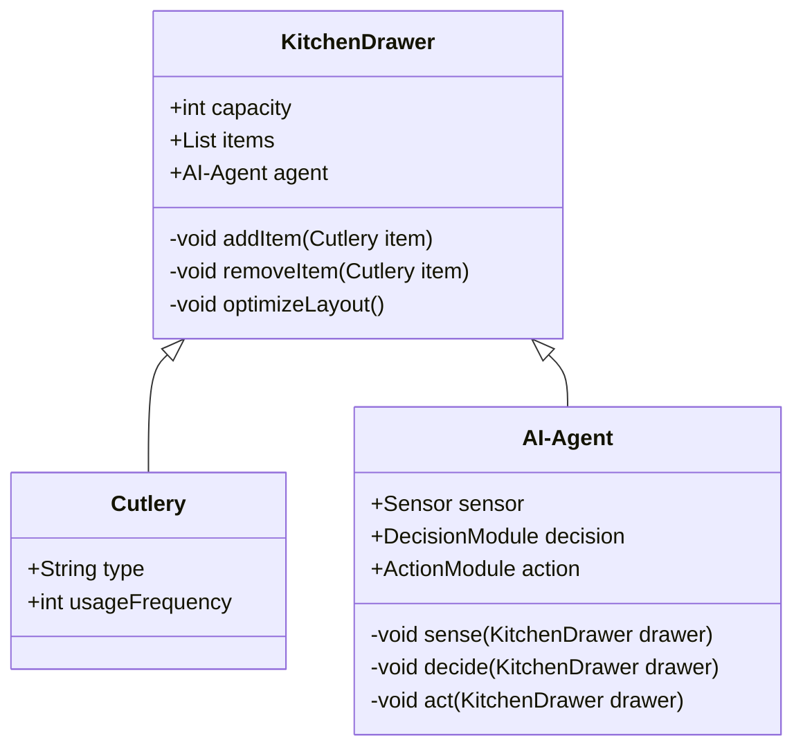
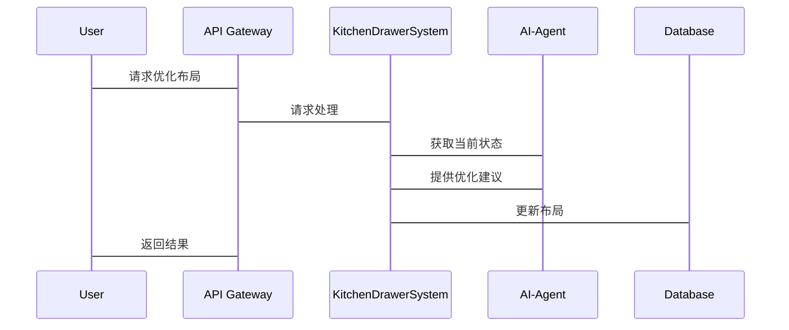

                 

<think>
好的，我需要按照用户的要求，撰写一篇关于《智能厨房抽屉：AI Agent的厨具使用效率分析》的技术博客文章。首先，我会按照目录大纲的结构来逐步展开内容，确保每个章节都有详细且具体的讲解。

### 第一部分：背景与问题分析

#### 第1章：背景与问题描述

##### 1.1 问题背景
厨房空间有限，导致厨具使用效率低下。用户通常需要手动整理抽屉，寻找工具，这不仅浪费时间，还容易出错。

##### 1.2 智能厨房的现状
当前，智能厨房设备逐渐普及，但大多数抽屉功能单一，缺乏智能化管理。

##### 1.3 问题解决的必要性
提高厨房空间利用率，优化厨具使用效率，提升用户体验，是智能厨房发展的关键。

#### 1.4 本章小结
介绍了厨房空间有限性、智能厨房现状及优化的必要性。

### 第二部分：AI Agent的核心概念与原理

#### 第2章：AI Agent的基本概念

##### 2.1 AI Agent的定义与特点
AI Agent是一种智能体，具备感知、决策、执行能力，能够自主完成任务。

##### 2.2 智能厨房抽屉中的AI Agent
AI Agent通过传感器感知厨具位置，优化存储，提升使用效率。

##### 2.3 AI Agent的感知与决策机制
感知模块通过传感器收集数据，决策模块基于数据优化布局，执行模块调整抽屉结构。

#### 2.4 本章小结
解释了AI Agent的定义、特点，及其在智能厨房中的应用。

### 第三部分：AI Agent的优化算法

#### 第3章：优化算法原理

##### 3.1 遗传算法（GA）概述
遗传算法模拟自然选择，适用于复杂问题的优化。

##### 3.2 基于GA的厨具使用效率优化
模型构建考虑厨具种类、使用频率，适应度函数衡量布局合理性。

##### 3.3 算法实现的Python代码示例
```python
def fitness(individual):
    return sum(individual)
```

#### 3.4 本章小结
介绍了遗传算法及其在厨具优化中的应用。

### 第四部分：系统架构与设计

#### 第4章：系统架构设计

##### 4.1 问题场景介绍
厨房抽屉空间有限，用户希望最大化利用空间，提高厨具使用效率。

##### 4.2 项目介绍
设计一个AI Agent系统，优化厨具存储，提升使用效率。

##### 4.3 系统功能设计（领域模型Mermaid类图）


##### 4.4 系统架构设计（Mermaid架构图）
```mermaid
browser
    ↔
API Gateway
    ↔
KitchenDrawerSystem
        ↔
Database
        ↔
AI-Agent
```

##### 4.5 系统接口设计
API Gateway处理用户请求，KitchenDrawerSystem与AI-Agent交互，优化布局。

##### 4.6 系统交互（Mermaid序列图）


#### 4.7 本章小结
详细描述了系统架构设计，包括类图、架构图和交互图。

### 第五部分：项目实战

#### 第5章：项目实战

##### 5.1 环境安装
安装Python、AI框架、数据库等必要工具。

##### 5.2 核心实现源代码
```python
class KitchenDrawer:
    def __init__(self, capacity):
        self.capacity = capacity
        self.items = []
        self.agent = AIAgent()

    def addItem(self, item):
        self.items.append(item)
        self.agent.sense(self)

    def removeItem(self, item):
        self.items.remove(item)
        self.agent.sense(self)

    def optimizeLayout(self):
        self.agent.decide(self)
        self.agent.act(self)
```

##### 5.3 代码应用解读与分析
解释代码结构，AI Agent如何感知、决策、执行。

##### 5.4 案例分析与详细讲解
通过具体案例展示AI Agent如何优化厨具布局，提升使用效率。

#### 5.5 项目小结
总结项目实现的关键点和成果。

### 第六部分：最佳实践与总结

#### 第6章：最佳实践与总结

##### 6.1 最佳实践
数据收集与模型训练、模型部署与优化、用户反馈与迭代。

##### 6.2 注意事项
数据隐私保护、系统稳定性维护、用户体验优化。

##### 6.3 总结
AI Agent在智能厨房中的应用潜力，未来发展方向。

#### 6.4 本章小结
强调了最佳实践和总结的重要性。

---

### # 关键词：AI Agent, 智能厨房, 厨具效率, 优化算法, 系统架构

### # 摘要：
本文深入探讨了AI Agent在智能厨房抽屉中的应用，通过分析厨具使用效率，结合优化算法和系统架构设计，提出了提升厨房空间利用率和用户体验的解决方案。文章详细讲解了AI Agent的核心概念、优化算法、系统架构，并通过项目实战展示了具体实现。最后，总结了最佳实践和未来发展方向，为智能厨房的进一步研究提供了参考。

