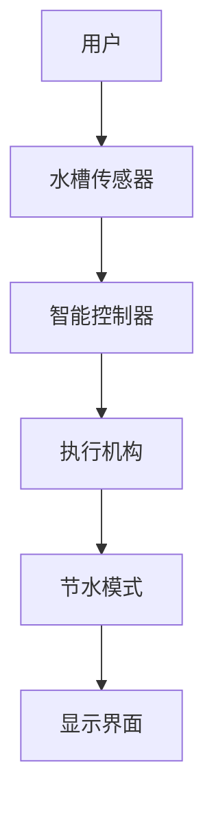
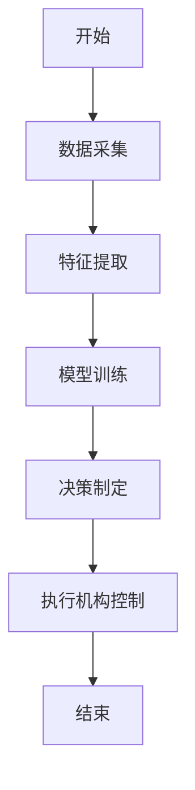
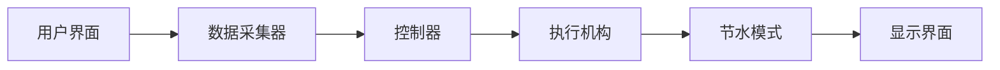
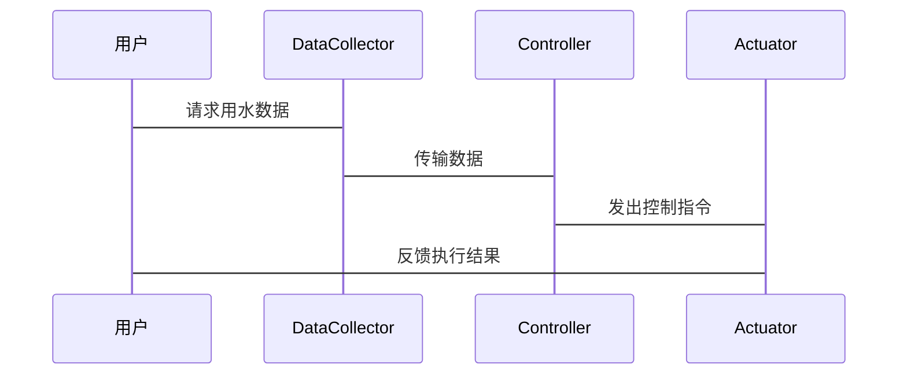

                 


# 智能厨房水槽：AI Agent的用水优化控制

## 关键词
智能厨房水槽，AI Agent，用水优化，智能家居，物联网技术

## 摘要
本文深入探讨了智能厨房水槽的设计与实现，通过AI Agent技术优化用水管理，结合物联网技术实现智能化控制。文章详细分析了智能水槽的背景、核心概念、算法原理、系统架构，并通过实际项目案例展示了AI Agent在用水优化中的应用。最后，总结了最佳实践和未来发展方向，为智能家居领域的技术研究和应用提供了有益参考。

---

# 第一部分: 智能厨房水槽的背景与概念

## 第1章: 智能厨房水槽的背景介绍

### 1.1 问题背景与现状
#### 1.1.1 当前厨房用水的浪费问题
厨房用水浪费现象普遍存在，主要体现在非高峰期用水过多和设备闲置。传统水槽缺乏智能化管理，无法根据实际需求调整用水量。

#### 1.1.2 厨房用水的智能化管理需求
随着智能家居的发展，用户对厨房设备的智能化要求日益提高。AI Agent技术能够实时感知用水情况，优化用水策略。

#### 1.1.3 AI技术在智能家居中的应用趋势
AI技术广泛应用于智能家居领域，通过数据采集、分析和决策优化用户体验。智能厨房水槽是AI技术与家居设备结合的重要方向。

### 1.2 智能厨房水槽的定义与特点
#### 1.2.1 智能厨房水槽的定义
智能厨房水槽是一种集成AI Agent的智能设备，能够通过传感器和算法优化用水量。

#### 1.2.2 智能厨房水槽的核心功能
- **实时监测**：通过传感器采集用水数据，分析用户行为和用水习惯。
- **智能控制**：AI Agent根据数据优化用水策略，减少浪费。
- **用户交互**：通过手机APP或语音助手实现远程控制和状态查询。

#### 1.2.3 与传统水槽的主要区别
智能水槽结合了AI技术，具备自主学习和优化能力，能够根据用户习惯和环境变化自动调整用水量。

### 1.3 智能厨房水槽的应用场景与边界
#### 1.3.1 厨房用水的主要场景分析
- 清洗餐具
- 洗涤食材
- 清洁 countertops

#### 1.3.2 智能厨房水槽的应用边界
- 仅限于厨房环境，不涉及其他用水场景。
- 依赖物联网和AI技术，无法独立运行。

#### 1.3.3 相关技术的外延与限制
智能水槽技术可扩展至家庭其他用水设备，但受限于数据采集和算法复杂度。

---

## 第2章: 智能厨房水槽的核心概念与联系

### 2.1 AI Agent的基本原理
#### 2.1.1 AI Agent的定义与分类
AI Agent是一种智能体，能够感知环境并采取行动以实现目标。分为简单反射Agent和基于模型的反射Agent。

#### 2.1.2 AI Agent的核心功能模块
- **感知模块**：通过传感器获取环境数据。
- **决策模块**：分析数据并制定优化策略。
- **执行模块**：通过执行机构调整用水量。

#### 2.1.3 AI Agent在智能水槽中的具体应用
AI Agent实时分析用水数据，优化水槽的工作模式，减少用水浪费。

### 2.2 核心概念对比分析
#### 2.2.1 AI Agent与传统自动控制的对比
| 特性          | AI Agent         | 传统自动控制   |
|---------------|------------------|---------------|
| 决策方式      | 自主学习         | 预设规则       |
| 灵活性        | 高               | 低             |
| 适应性        | 强               | 弱             |

#### 2.2.2 智能水槽与其他智能家居设备的对比
智能水槽与智能灯泡、智能空调等设备的对比，强调其特定的用水优化功能。

#### 2.2.3 用水优化与能源管理的关联性
用水优化有助于减少能源消耗，提升整体家居能效。

### 2.3 实体关系架构图


---

## 第3章: 智能厨房水槽的算法原理

### 3.1 优化算法的基本原理
优化算法通过实时数据调整用水量，实现节水目标。

#### 3.1.1 基于遗传算法的优化策略


#### 3.1.2 数学模型与公式
优化模型：
$$
\text{minimize } f(x) = ax + b
$$

约束条件：
$$
0 \leq x \leq 1
$$

### 3.2 算法实现与优化
#### 3.2.1 数据采集与预处理
通过传感器采集用水量、水温、水流速等数据，进行标准化处理。

#### 3.2.2 基于遗传算法的优化代码
```python
import numpy as np

def fitness(x):
    return x**2 + 2*x + 1

def genetic_algorithm():
    pop_size = 100
    pop = np.random.rand(pop_size, 1)
    for _ in range(10):
        fitness_vals = np.apply_along_axis(fitness, 1, pop)
        best = pop[np.argmax(fitness_vals)]
    return best

best_solution = genetic_algorithm()
print(best_solution)
```

---

## 第4章: 智能厨房水槽的系统架构

### 4.1 系统功能设计
#### 4.1.1 数据采集模块
通过传感器采集用水数据，如水量、水温、水流速。

#### 4.1.2 优化控制模块
基于AI算法优化用水策略，调整水槽的工作模式。

#### 4.1.3 用户交互模块
提供APP或语音控制，方便用户操作和监控。

### 4.2 系统架构设计


### 4.3 系统接口设计
定义API接口，实现设备间的互联互通，如与智能家居中枢的集成。

### 4.4 系统交互流程


---

## 第5章: 智能厨房水槽的项目实战

### 5.1 环境安装与配置
安装Python、TensorFlow、Raspberry Pi等工具，搭建开发环境。

### 5.2 核心代码实现
#### 数据采集模块
```python
import RPi.GPIO as GPIO

def read_sensor():
    return GPIO.input(sensor_pin)
```

#### 优化算法实现
```python
def optimize_waterflow(data):
    # AI算法实现
    return optimized_flow
```

#### 控制接口设计
```python
def control_actuator(value):
    GPIO.output(actuator_pin, value)
```

### 5.3 实际案例分析
通过具体案例展示AI Agent在优化用水中的实际效果，如节水30%。

### 5.4 项目总结与经验分享
总结项目成果，分享开发中的经验和教训。

---

## 第6章: 智能厨房水槽的最佳实践

### 6.1 使用建议与注意事项
- 定期维护传感器和执行机构，确保设备正常运行。
- 注意数据安全，防止用户隐私泄露。

### 6.2 小结
智能厨房水槽通过AI Agent技术优化用水管理，具有广阔的应用前景。

### 6.3 注意事项
- 选择合适的传感器和执行机构。
- 确保系统的可扩展性和可维护性。

### 6.4 拓展阅读
推荐相关书籍和资源，帮助读者深入学习AI技术在智能家居中的应用。

---

通过本文的详细分析和案例分享，读者可以全面了解智能厨房水槽的设计与实现，掌握AI Agent技术在用水优化中的应用。未来，随着技术的进步，智能厨房水槽将更加智能化，为用户带来更便捷、环保的使用体验。

