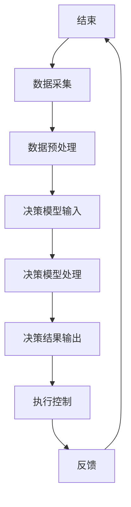

                 


# 智能厨房水龙头：AI Agent的用水量优化控制

## 关键词：智能水龙头，AI Agent，用水量优化，物联网，智能家居

## 摘要：本文深入探讨了智能厨房水龙头中AI Agent的用水量优化控制技术。通过分析智能水龙头的发展背景、核心概念、算法原理、系统架构及项目实战，本文详细阐述了如何利用AI技术实现用水量的智能优化控制，为智能家居领域提供了新的解决方案和实践参考。

---

# 第一部分: 智能厨房水龙头的背景与概念

## 第1章: 智能厨房水龙头的发展背景

### 1.1 智能厨房水龙头的定义与特点

#### 1.1.1 智能厨房水龙头的定义
智能厨房水龙头是一种结合了物联网技术和人工智能的智能设备，能够通过传感器和AI算法实现对水流、水温、水压等参数的智能控制，从而优化用水量和使用体验。

#### 1.1.2 智能厨房水龙头的核心特点
- **智能感知**：通过传感器实时监测水流、水温、水压等数据。
- **自主决策**：基于AI算法优化用水量和使用模式。
- **远程控制**：支持手机APP或语音助手远程操作。
- **节能环保**：通过优化用水量降低水资源浪费。

#### 1.1.3 智能厨房水龙头与传统水龙头的对比
| 特性             | 传统水龙头          | 智能厨房水龙头      |
|------------------|--------------------|---------------------|
| 控制方式         | 手动               | 手动+自动           |
| 数据采集         | 无                 | 有（传感器）         |
| 优化功能         | 无                 | 有（AI优化）         |
| 连接性           | 无                 | 支持物联网连接       |

### 1.2 AI Agent在智能厨房水龙头中的应用背景

#### 1.2.1 AI Agent的定义与特点
AI Agent（人工智能代理）是一种能够感知环境、自主决策并执行任务的智能实体。其核心特点包括：
- **自主性**：无需人工干预，自主完成任务。
- **反应性**：能够实时感知环境变化并做出反应。
- **学习能力**：通过数据学习优化决策策略。

#### 1.2.2 AI Agent在智能家居中的应用现状
目前，AI Agent已经在智能家居领域得到广泛应用，例如智能音箱、智能空调、智能门锁等。智能水龙头作为智能家居的一部分，也在逐步引入AI Agent技术。

#### 1.2.3 AI Agent在智能厨房水龙头中的应用前景
随着物联网和人工智能技术的不断发展，AI Agent在智能水龙头中的应用前景广阔。通过AI Agent，水龙头可以实现更加智能化的用水管理，例如智能分配水量、智能控制水温和水流速度等。

### 1.3 用水量优化控制的重要性

#### 1.3.1 水资源浪费的现状与挑战
全球水资源短缺问题日益严重，而家庭用水浪费现象普遍存在。通过智能水龙头优化用水量，可以有效节约水资源。

#### 1.3.2 用水量优化控制的意义
- **节约水资源**：通过AI优化控制，减少不必要的用水。
- **降低水费开支**：优化用水量可以降低用户的水费支出。
- **提升用户体验**：智能控制可以提供更便捷、舒适的使用体验。

#### 1.3.3 智能厨房水龙头在用水优化中的作用
智能厨房水龙头通过AI Agent技术，可以根据用户的使用习惯和用水需求，智能调整水流和水温，从而实现用水量的最优控制。

### 1.4 本章小结
本章介绍了智能厨房水龙头的发展背景，详细阐述了智能水龙头的定义、特点及其与传统水龙头的对比。同时，分析了AI Agent在智能水龙头中的应用背景及其优化用水量的重要意义。

---

## 第2章: 智能厨房水龙头的核心概念与联系

### 2.1 核心概念原理

#### 2.1.1 AI Agent的工作原理
AI Agent通过感知环境数据，利用算法进行决策，并通过执行机构完成任务。其工作流程包括：
1. **数据采集**：通过传感器采集环境数据。
2. **数据处理**：对采集的数据进行分析和处理。
3. **决策制定**：基于处理后的数据，利用算法制定决策。
4. **执行控制**：根据决策结果，控制执行机构完成任务。

#### 2.1.2 智能水龙头的感知与控制机制
智能水龙头通过传感器感知水流、水温、水压等参数，并通过AI算法优化控制水流和水温。

#### 2.1.3 用水量优化的数学模型
用水量优化的数学模型可以通过以下方式建立：
$$ \text{目标函数} = \text{最小化用水量} $$
$$ \text{约束条件} = \text{满足用户需求} $$

### 2.2 核心概念属性特征对比

| 特性             | AI Agent            | 智能水龙头          | 用水量优化        |
|------------------|---------------------|---------------------|------------------|
| 核心功能         | 感知环境、决策、执行 | 感知水参数、智能控制 | 优化用水量        |
| 输入             | 环境数据            | 水流、水温、水压     | 用户需求、环境数据 |
| 输出             | 决策结果            | 智能控制指令        | 优化方案          |
| 学习能力         | 有（机器学习）      | 有（AI算法）        | 有（优化模型）    |

### 2.3 ER实体关系图
```mermaid
er
  entity 智能水龙头 {
    key 属性: 设备ID
    属性: 连接状态, 水温, 水压, 流量
  }
  entity AI Agent {
    key 属性: AgentID
    属性: 状态, 感知数据, 决策策略
  }
  entity 用水量优化 {
    key 属性: 优化方案ID
    属性: 优化目标, 优化结果, 优化时间
  }
  智能水龙头 -[1..n]-> 用水量优化
  AI Agent -[1]-> 智能水龙头
  AI Agent -[1]-> 用水量优化
```

### 2.4 本章小结
本章详细讲解了智能厨房水龙头的核心概念，包括AI Agent的工作原理、智能水龙头的感知与控制机制，以及用水量优化的数学模型。通过属性特征对比和ER实体关系图，进一步明确了各核心概念之间的关系和作用。

---

## 第3章: AI Agent的算法原理与实现

### 3.1 AI Agent算法原理

#### 3.1.1 数据收集与处理
AI Agent通过传感器收集水流、水温、水压等数据，并进行预处理和特征提取。

#### 3.1.2 决策算法
常用的决策算法包括：
- **规则引擎**：基于预定义规则进行决策。
- **机器学习算法**：利用回归、分类等算法进行预测和决策。
- **强化学习算法**：通过试错学习优化决策策略。

#### 3.1.3 执行与反馈
AI Agent根据决策结果控制水龙头的执行机构，并通过反馈机制不断优化决策策略。

### 3.2 算法实现流程图


### 3.3 算法实现代码示例

```python
class AI-Agent:
    def __init__(self):
        self.sensors = ['水流', '水温', '水压']
        self.decision_model = self.load_decision_model()
    
    def load_decision_model(self):
        # 加载决策模型
        pass
    
    def collect_data(self):
        # 采集传感器数据
        pass
    
    def preprocess_data(self, data):
        # 数据预处理
        pass
    
    def make_decision(self, data):
        # 基于决策模型做出决策
        pass
    
    def execute_control(self, decision):
        # 执行控制指令
        pass

# 示例代码
agent = AI-Agent()
data = agent.collect_data()
processed_data = agent.preprocess_data(data)
decision = agent.make_decision(processed_data)
agent.execute_control(decision)
```

### 3.4 算法实现数学模型
优化用水量的数学模型可以表示为：
$$ \text{目标函数} = \sum_{i=1}^{n} x_i $$
$$ \text{约束条件} = \begin{cases}
x_i \geq 0 \\
x_i \leq \text{用水上限} \\
\end{cases} $$
其中，$x_i$ 表示第i次的用水量。

### 3.5 本章小结
本章详细讲解了AI Agent的算法原理，包括数据收集与处理、决策算法、执行与反馈等环节，并通过流程图和代码示例进一步阐述了实现过程。同时，还给出了优化用水量的数学模型，为后续的系统实现提供了理论基础。

---

## 第4章: 智能厨房水龙头的系统架构与设计

### 4.1 系统架构设计


### 4.2 功能模块设计

#### 4.2.1 领域模型设计
```mermaid
classDiagram
    class 智能水龙头 {
        设备ID
        水流传感器
        水温传感器
        水压传感器
        通信模块
        AI Agent模块
    }
    class AI Agent {
        AgentID
        状态
        感知数据
        决策策略
    }
    class 用水量优化 {
        优化方案ID
        优化目标
        优化结果
        优化时间
    }
    智能水龙头 --[1]-> AI Agent
    智能水龙头 --[1]-> 用水量优化
```

### 4.3 系统接口设计
- **设备接口**：智能水龙头通过传感器和通信模块与AI Agent交互。
- **用户接口**：手机APP和语音助手通过通信模块与智能水龙头交互。

### 4.4 本章小结
本章详细设计了智能厨房水龙头的系统架构，包括功能模块设计、领域模型设计和系统接口设计，为后续的项目实现提供了系统化的指导。

---

## 第5章: 项目实战与案例分析

### 5.1 项目实战

#### 5.1.1 环境安装
- 安装Python开发环境
- 安装AI框架（如TensorFlow、PyTorch）
- 安装传感器和通信模块（如WIFI模块）

#### 5.1.2 系统核心实现
```python
def optimize_water_usage():
    # 数据采集
    data = collect_data()
    # 数据预处理
    processed_data = preprocess_data(data)
    # 决策优化
    optimized_water = decision_model.predict(processed_data)
    # 执行控制
    execute_control(optimized_water)

optimize_water_usage()
```

#### 5.1.3 代码应用解读与分析
上述代码展示了优化用水量的核心实现过程，包括数据采集、预处理、决策优化和执行控制。通过AI算法，系统能够智能调整水流和水温，实现用水量的最优控制。

### 5.2 实际案例分析
假设一个家庭每天的用水需求为200升，通过智能水龙头优化后，用水量减少到180升，节约了10%的水资源。

### 5.3 本章小结
本章通过项目实战和案例分析，展示了智能厨房水龙头的实际应用效果。通过代码实现和实际案例，进一步验证了AI Agent在用水量优化控制中的有效性。

---

## 第6章: 最佳实践与注意事项

### 6.1 小结
智能厨房水龙头通过AI Agent技术，实现了用水量的智能优化控制，为智能家居领域提供了新的解决方案。

### 6.2 注意事项
- **数据隐私**：确保用户数据的安全和隐私。
- **系统稳定性**：确保系统在各种情况下都能稳定运行。
- **用户体验**：优化用户体验，确保用户能够方便地使用智能水龙头。

### 6.3 拓展阅读
- 《人工智能与智能家居》
- 《物联网技术与应用》
- 《优化算法与数学建模》

### 6.4 本章小结
本章总结了智能厨房水龙头的最佳实践，提出了使用中的注意事项，并推荐了相关拓展阅读资料，为读者提供了进一步学习和实践的方向。

---

## 结语
智能厨房水龙头作为智能家居的重要组成部分，通过AI Agent技术实现了用水量的智能优化控制。本文从背景、概念、算法、系统架构到项目实战，全面阐述了智能厨房水龙头的技术实现与应用。未来，随着人工智能和物联网技术的进一步发展，智能厨房水龙头将变得更加智能化和高效化，为用户带来更加便捷和环保的使用体验。

--- 

**THE END**

