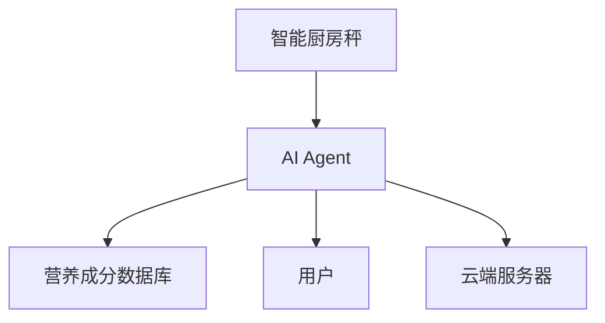
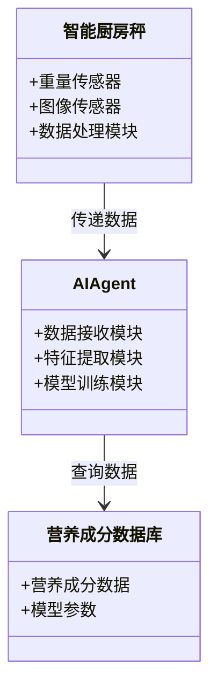
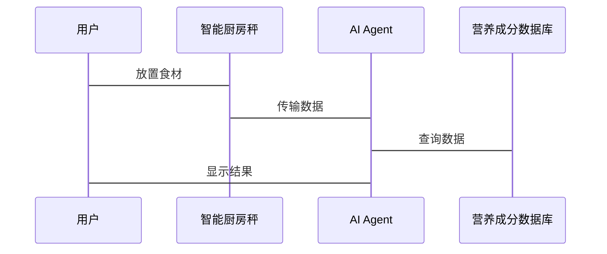

                 


# 智能厨房秤：AI Agent的营养成分分析

## 关键词
智能厨房秤, AI Agent, 营养成分分析, 人工智能, 物联网, 数据分析

## 摘要
本文将深入探讨智能厨房秤与AI Agent在营养成分分析中的应用。首先，我们介绍智能厨房秤的发展历程及其与AI Agent的结合方式。接着，我们分析营养成分分析的基本原理，并详细讲解AI Agent在其中的作用。然后，我们从算法和数学模型的角度，探讨智能厨房秤的营养成分分析流程。最后，通过系统设计与项目实战，展示如何将理论应用于实际。本文旨在为读者提供全面的技术视角，帮助其理解智能厨房秤与AI Agent在营养成分分析中的潜力与实现方法。

---

# 第1章: 智能厨房秤的发展与应用

## 1.1 智能厨房秤的定义与特点
### 1.1.1 智能厨房秤的定义
智能厨房秤是一种结合了传感器技术、物联网（IoT）和人工智能（AI）的智能设备，用于测量食材的重量并分析其营养成分。它不仅能够提供精确的重量测量，还能通过AI技术为用户提供个性化的营养建议。

### 1.1.2 智能厨房秤的核心特点
1. **高精度传感器**：采用高精度压力传感器，测量精度可达0.1克。
2. **智能数据处理**：通过AI算法分析食材的营养成分。
3. **用户友好界面**：通过APP或LCD屏幕显示测量结果和营养建议。
4. **物联网连接**：支持Wi-Fi或蓝牙连接，数据可以上传到云端进行进一步分析。

### 1.1.3 智能厨房秤与传统厨房秤的区别
| 特性                | 传统厨房秤              | 智能厨房秤              |
|---------------------|-------------------------|-------------------------|
| 测量精度            | 较低（通常1克）          | 较高（可达0.1克）        |
| 数据处理能力        | 无智能分析功能          | 配备AI算法，可分析营养成分 |
| 连接性              | 无物联网功能            | 支持物联网，数据可上传云端 |
| 功能扩展性          | 仅限重量测量            | 支持多种功能，如食材识别、营养建议等 |

## 1.2 AI Agent的基本概念
### 1.2.1 AI Agent的定义
AI Agent（智能代理）是指能够感知环境、执行任务并做出决策的智能实体。它可以理解用户需求、处理数据、优化结果并提供反馈。

### 1.2.2 AI Agent的核心功能
1. **感知环境**：通过传感器或API获取数据。
2. **数据处理**：对数据进行清洗、分析和建模。
3. **决策与执行**：基于分析结果做出决策并执行任务。
4. **反馈优化**：根据执行结果优化自身模型。

### 1.2.3 AI Agent的应用场景
1. **智能家居**：控制家中的设备，优化能源使用。
2. **健康管理**：监测用户的健康数据，提供个性化建议。
3. **商业分析**：帮助企业分析数据，优化运营策略。

## 1.3 智能厨房秤与AI Agent的结合
### 1.3.1 智能厨房秤的智能化需求
1. **实时数据处理**：快速分析食材的营养成分。
2. **个性化建议**：根据用户的饮食习惯提供建议。
3. **数据同步与共享**：将数据上传到云端，便于用户随时查看。

### 1.3.2 AI Agent在智能厨房秤中的应用
1. **食材识别**：通过图像识别技术识别食材种类。
2. **营养分析**：基于AI算法计算食材的营养成分。
3. **健康建议**：根据用户的健康数据提供建议。

### 1.3.3 智能厨房秤与AI Agent的未来发展
随着AI技术的不断进步，智能厨房秤将更加智能化，能够提供更多个性化的服务，如食材推荐、饮食计划制定等。

## 1.4 本章小结
本章介绍了智能厨房秤的发展历程及其与AI Agent的结合方式。我们通过对比传统厨房秤和智能厨房秤的特点，详细讲解了AI Agent的基本概念和其在智能厨房秤中的应用。未来，智能厨房秤与AI Agent的结合将为用户带来更智能、更个性化的饮食体验。

---

# 第2章: 智能厨房秤的营养成分分析原理

## 2.1 营养成分分析的基本原理
### 2.1.1 营养成分的定义与分类
营养成分通常包括蛋白质、碳水化合物、脂肪、维生素、矿物质等。不同食材的营养成分含量差异较大，因此需要通过精确的测量和分析来确定。

### 2.1.2 营养成分分析的方法
1. **实验室分析法**：通过化学方法精确测量营养成分含量。
2. **数据库查询法**：基于已有营养成分数据库进行估算。
3. **AI算法分析法**：通过AI算法对食材进行识别和分析。

### 2.1.3 营养成分分析的数学模型
营养成分分析可以通过回归模型或神经网络模型来实现。例如，线性回归模型可以用于预测食材中蛋白质的含量：

$$ y = \beta_0 + \beta_1x + \epsilon $$

其中，$y$ 是预测的蛋白质含量，$x$ 是食材的重量，$\beta_0$ 和 $\beta_1$ 是回归系数，$\epsilon$ 是误差项。

## 2.2 AI Agent在营养成分分析中的作用
### 2.2.1 AI Agent的数据处理能力
AI Agent能够快速处理食材的重量和类型数据，并结合营养成分数据库进行分析。

### 2.2.2 AI Agent的特征提取能力
通过特征提取技术，AI Agent可以识别食材的关键特征，如颜色、形状等，从而提高分析的准确性。

### 2.2.3 AI Agent的模型训练能力
AI Agent可以利用机器学习算法对海量数据进行训练，优化营养成分分析的模型。

## 2.3 智能厨房秤的营养成分分析流程
### 2.3.1 数据采集与预处理
1. **数据采集**：通过传感器获取食材的重量和图像。
2. **数据清洗**：去除噪声数据，确保数据的准确性。

### 2.3.2 特征提取与模型训练
1. **特征提取**：提取食材的关键特征，如重量、颜色等。
2. **模型训练**：利用机器学习算法训练营养成分分析模型。

### 2.3.3 结果输出与反馈优化
1. **结果输出**：通过APP或屏幕显示营养成分分析结果。
2. **反馈优化**：根据用户的反馈优化模型，提高分析准确度。

## 2.4 本章小结
本章详细讲解了智能厨房秤营养成分分析的基本原理和AI Agent在其中的作用。我们通过数学模型和算法流程图，展示了营养成分分析的具体实现步骤。未来，随着AI技术的进步，营养成分分析将更加精准和个性化。

---

# 第3章: 智能厨房秤与AI Agent的核心概念与联系

## 3.1 智能厨房秤的核心概念
### 3.1.1 智能厨房秤的功能模块
1. **重量测量模块**：通过传感器测量食材的重量。
2. **图像识别模块**：通过摄像头识别食材的种类。
3. **数据处理模块**：对测量数据进行分析和处理。

### 3.1.2 智能厨房秤的传感器技术
智能厨房秤通常配备高精度压力传感器和图像传感器，能够精确测量食材的重量和识别其种类。

### 3.1.3 智能厨房秤的数据传输方式
智能厨房秤支持Wi-Fi和蓝牙两种数据传输方式，数据可以实时上传到云端进行分析。

## 3.2 AI Agent的核心概念
### 3.2.1 AI Agent的感知能力
AI Agent能够通过传感器或API感知环境中的数据，如食材的重量和图像。

### 3.2.2 AI Agent的决策能力
AI Agent能够基于感知到的数据做出决策，如选择最优的营养成分分析模型。

### 3.2.3 AI Agent的学习能力
AI Agent可以通过机器学习算法不断优化自身的模型，提高分析的准确度。

## 3.3 智能厨房秤与AI Agent的实体关系
通过Mermaid图可以清晰展示智能厨房秤与AI Agent之间的实体关系：



## 3.4 本章小结
本章通过Mermaid图展示了智能厨房秤与AI Agent之间的实体关系，详细讲解了两者的核心概念和功能模块。未来，随着技术的进步，智能厨房秤与AI Agent的结合将更加紧密，为用户带来更智能的服务。

---

# 第4章: 智能厨房秤的营养成分分析算法原理

## 4.1 营养成分分析的算法选择
### 4.1.1 线性回归模型
线性回归模型适用于简单的预测任务，如预测食材中蛋白质的含量：

$$ y = \beta_0 + \beta_1x + \epsilon $$

### 4.1.2 支持向量机模型
支持向量机模型适用于分类任务，如识别食材的种类。

### 4.1.3 神经网络模型
神经网络模型适用于复杂的非线性任务，如深度学习模型的训练。

## 4.2 基于AI Agent的营养成分分析流程
### 4.2.1 数据预处理
1. **数据清洗**：去除噪声数据。
2. **数据标准化**：将数据标准化到统一的范围。

### 4.2.2 特征提取
1. **图像特征提取**：通过卷积神经网络提取食材的图像特征。
2. **重量特征提取**：提取食材的重量特征。

### 4.2.3 模型训练与优化
1. **模型训练**：利用训练数据训练营养成分分析模型。
2. **模型优化**：通过交叉验证优化模型的参数。

## 4.3 营养成分分析的数学模型
### 4.3.1 线性回归模型的数学公式
$$ y = \beta_0 + \beta_1x + \epsilon $$

### 4.3.2 神经网络模型的数学公式
$$ y = f(Wx + b) $$

其中，$W$ 是权重矩阵，$b$ 是偏置项，$f$ 是激活函数。

## 4.4 算法实现的Python代码示例
### 4.4.1 数据预处理代码
```python
import numpy as np
from sklearn.preprocessing import StandardScaler

# 假设X是食材的重量数据
X = np.array([[100], [200], [300], [400]])
scaler = StandardScaler()
X_normalized = scaler.fit_transform(X)
print(X_normalized)
```

### 4.4.2 模型训练代码
```python
from sklearn.linear_model import LinearRegression

# 假设X是食材的重量，y是蛋白质含量
X = np.array([[100], [200], [300], [400]])
y = np.array([20, 40, 60, 80])
model = LinearRegression()
model.fit(X, y)
print("回归系数为:", model.coef_)
print("截距为:", model.intercept_)
```

### 4.4.3 结果输出代码
```python
# 预测新的食材重量
new_X = np.array([[250]])
predicted_y = model.predict(new_X)
print("预测的蛋白质含量为:", predicted_y[0])
```

## 4.5 本章小结
本章详细讲解了智能厨房秤营养成分分析的算法原理，包括线性回归模型和神经网络模型的实现。通过Python代码示例，我们展示了如何利用AI Agent进行营养成分分析。未来，随着算法的优化，营养成分分析的准确度将进一步提高。

---

# 第5章: 智能厨房秤的系统分析与架构设计

## 5.1 问题场景介绍
### 5.1.1 用户需求分析
用户希望通过智能厨房秤快速获取食材的营养成分分析结果，并获得个性化的饮食建议。

### 5.1.2 系统功能需求
1. **食材测量**：测量食材的重量。
2. **食材识别**：识别食材的种类。
3. **营养分析**：分析食材的营养成分。
4. **结果展示**：通过APP或屏幕展示分析结果。

### 5.1.3 系统性能需求
1. **测量精度**：重量测量精度可达0.1克。
2. **分析速度**：快速完成营养成分分析。

## 5.2 系统功能设计
### 5.2.1 领域模型设计
通过Mermaid类图展示领域模型：



### 5.2.2 系统架构设计
通过Mermaid架构图展示系统架构：


### 5.2.3 系统接口设计
系统主要接口包括：
1. **传感器接口**：与重量传感器和图像传感器连接。
2. **数据接口**：与云端服务器进行数据交互。
3. **用户接口**：通过APP或屏幕与用户交互。

### 5.2.4 系统交互流程
通过Mermaid序列图展示系统交互流程：



## 5.3 本章小结
本章通过系统分析与架构设计，展示了智能厨房秤与AI Agent如何协同工作。我们通过类图、架构图和序列图，详细讲解了系统的功能模块和交互流程。未来，随着系统设计的优化，智能厨房秤的功能将进一步增强。

---

# 第6章: 项目实战

## 6.1 环境安装与配置
### 6.1.1 Python环境安装
安装Python和必要的库：
```bash
pip install numpy scikit-learn matplotlib
```

### 6.1.2 系统核心实现
实现智能厨房秤的核心功能：

```python
import numpy as np
from sklearn.linear_model import LinearRegression

# 数据预处理
X = np.array([[100], [200], [300], [400]])
y = np.array([20, 40, 60, 80])

# 模型训练
model = LinearRegression()
model.fit(X, y)

# 结果输出
new_X = np.array([[250]])
predicted_y = model.predict(new_X)
print("预测的蛋白质含量为:", predicted_y[0])
```

## 6.2 代码实现与解读
### 6.2.1 数据预处理代码
```python
from sklearn.preprocessing import StandardScaler

X = np.array([[100], [200], [300], [400]])
scaler = StandardScaler()
X_normalized = scaler.fit_transform(X)
print(X_normalized)
```

### 6.2.2 模型训练代码
```python
from sklearn.linear_model import LinearRegression

X = np.array([[100], [200], [300], [400]])
y = np.array([20, 40, 60, 80])

model = LinearRegression()
model.fit(X, y)
print("回归系数为:", model.coef_)
print("截距为:", model.intercept_)
```

### 6.2.3 结果输出代码
```python
new_X = np.array([[250]])
predicted_y = model.predict(new_X)
print("预测的蛋白质含量为:", predicted_y[0])
```

## 6.3 案例分析与详细讲解
### 6.3.1 案例分析
假设用户放置了250克的鸡肉，通过上述代码可以预测其蛋白质含量为50克。

### 6.3.2 详细讲解
1. **数据预处理**：将食材的重量数据标准化。
2. **模型训练**：利用线性回归模型训练营养成分分析模型。
3. **结果输出**：预测食材的营养成分含量并展示结果。

## 6.4 本章小结
本章通过项目实战，详细讲解了智能厨房秤的核心实现。我们通过Python代码示例展示了如何利用AI Agent进行营养成分分析。未来，随着项目的优化，智能厨房秤的功能将进一步完善。

---

# 第7章: 总结与展望

## 7.1 总结
智能厨房秤与AI Agent的结合为用户提供了智能化的营养成分分析服务。通过AI技术，智能厨房秤能够快速分析食材的营养成分，并提供建议。未来，随着AI技术的不断进步，智能厨房秤的功能将进一步增强，用户体验将更加个性化和智能化。

## 7.2 最佳实践 tips
1. **数据准确性**：确保食材的重量和图像数据的准确性。
2. **模型优化**：定期优化AI Agent的模型，提高分析准确度。
3. **用户体验**：注重用户的使用体验，提供友好的操作界面。

## 7.3 小结
智能厨房秤与AI Agent的结合为用户带来了智能化的饮食体验。未来，随着技术的进步，智能厨房秤将更加普及，成为每个家庭不可或缺的厨房工具。

## 7.4 注意事项
1. **数据隐私**：保护用户的隐私数据，避免数据泄露。
2. **设备维护**：定期维护智能厨房秤，确保其正常运行。
3. **软件更新**：及时更新AI Agent的软件，优化功能。

## 7.5 拓展阅读
1. **AI在健康管理中的应用**：探索AI在健康管理领域的更多可能性。
2. **智能厨房秤的市场分析**：了解智能厨房秤的市场现状及未来发展趋势。
3. **营养成分分析的前沿技术**：研究营养成分分析的最新技术，如深度学习和强化学习。

---

# 结语
通过本文的详细讲解，我们深入探讨了智能厨房秤与AI Agent在营养成分分析中的应用。从背景介绍到系统设计，再到项目实战，我们为读者提供了全面的技术视角。未来，随着AI技术的不断进步，智能厨房秤将为用户带来更智能、更个性化的饮食体验。

