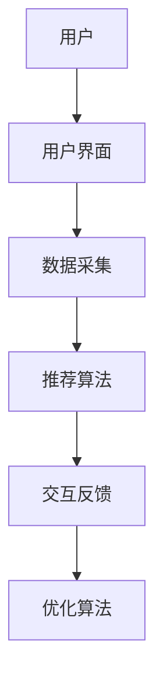

                 


# 智能厨房秤：AI Agent的食谱推荐系统

## 关键词：智能厨房秤，AI Agent，食谱推荐，深度学习，协同过滤，系统架构，项目实战

## 摘要：  
本文深入探讨了智能厨房秤与AI Agent结合的食谱推荐系统，从背景介绍、核心概念、推荐算法、系统架构到项目实战，全面分析了该系统的设计与实现。文章通过详细的理论分析和实际案例，揭示了AI Agent在智能厨房秤中的应用潜力，为读者提供了从理论到实践的完整指南。

---

## 第一部分：智能厨房秤与AI Agent的背景介绍

---

### 第1章：智能厨房秤的发展与现状

#### 1.1 智能厨房秤的定义与特点
##### 1.1.1 智能厨房秤的定义  
智能厨房秤是一种结合了传感器、微处理器和AI技术的厨房工具，能够实时测量食材重量，并通过AI算法为用户提供食谱推荐、食材管理等智能化服务。

##### 1.1.2 智能厨房秤的核心特点  
- **高精度测量**：采用高灵敏度传感器，确保食材重量测量的准确性。  
- **智能化推荐**：通过AI算法分析用户数据，提供个性化的食谱推荐。  
- **数据同步**：支持与手机、电脑等设备的数据同步，方便用户管理食材和食谱。  
- **语音交互**：部分智能厨房秤支持语音控制，提升用户体验。  

##### 1.1.3 智能厨房秤与传统厨房秤的区别  
| 特性                | 传统厨房秤         | 智能厨房秤         |
|---------------------|--------------------|--------------------|
| 功能                | 单一测量重量       | 测量重量+智能推荐   |
| 数据处理            | 无数据处理         | 数据采集与分析     |
| 用户交互            | 简单数字显示       | 多媒体交互（屏幕、语音） |
| 连接性              | 无网络连接         | 支持Wi-Fi/蓝牙连接  |

#### 1.2 AI Agent的基本概念
##### 1.2.1 AI Agent的定义  
AI Agent（人工智能代理）是指能够感知环境、自主决策并执行任务的智能实体。它能够通过传感器获取数据，利用算法进行分析，并通过执行器完成特定任务。

##### 1.2.2 AI Agent的核心功能  
- **感知**：通过传感器获取环境数据（如重量、时间、位置等）。  
- **推理**：基于感知数据进行分析和决策，如判断用户需求、推荐食谱。  
- **执行**：根据推理结果执行任务，如显示推荐食谱、发出语音指令。  

##### 1.2.3 AI Agent的应用场景  
- **智能家居**：控制家电、管理家庭设备。  
- **个人助手**：提供日程管理、信息查询等服务。  
- **智能厨房**：推荐食谱、管理食材库存。  

#### 1.3 智能厨房秤与AI Agent的结合  
##### 1.3.1 智能厨房秤的智能化需求  
智能厨房秤需要通过AI技术实现以下功能：  
- 根据食材重量推荐食谱。  
- 根据用户偏好优化推荐结果。  
- 学习用户的饮食习惯，提供个性化服务。  

##### 1.3.2 AI Agent在智能厨房秤中的应用  
AI Agent通过以下方式实现智能厨房秤的功能：  
- **数据采集**：获取食材重量、用户操作记录等数据。  
- **数据处理**：分析用户数据，生成食谱推荐。  
- **用户交互**：通过屏幕或语音与用户互动，提供推荐结果。  

##### 1.3.3 智能厨房秤与AI Agent的未来发展  
随着AI技术的进步，智能厨房秤将更加智能化，能够通过大数据分析用户的饮食偏好，甚至可以根据用户的健康状况推荐食谱。AI Agent将在智能厨房秤中扮演越来越重要的角色。

#### 1.4 本章小结  
本章介绍了智能厨房秤的发展现状及其与AI Agent的结合方式，强调了AI Agent在智能厨房秤中的重要性，并展望了未来的发展方向。

---

## 第二部分：智能厨房秤的食谱推荐系统

---

### 第2章：智能厨房秤的食谱推荐系统

#### 2.1 食谱推荐系统的背景与意义  
##### 2.1.1 食谱推荐的背景  
随着人们对健康饮食的关注增加，用户对个性化食谱推荐的需求日益增长。传统的食谱推荐系统基于规则或简单的统计方法，难以满足用户的个性化需求。  

##### 2.1.2 食谱推荐的意义  
智能厨房秤通过AI Agent实现的食谱推荐系统，能够根据用户的食材用量、饮食偏好和健康状况提供个性化的食谱建议，提升用户体验。  

##### 2.1.3 食谱推荐的现状  
目前，食谱推荐系统主要基于协同过滤和内容推荐算法，但这些方法难以处理实时数据和个性化需求。AI Agent的引入为食谱推荐系统带来了新的可能性。

#### 2.2 智能厨房秤的食谱推荐需求  
##### 2.2.1 用户需求分析  
用户希望智能厨房秤能够：  
- 根据已有食材推荐食谱。  
- 根据健康状况推荐适合的食谱。  
- 提供多样化的食谱选择。  

##### 2.2.2 系统需求分析  
系统需要实现以下功能：  
- 实时采集食材重量数据。  
- 基于用户数据生成个性化推荐。  
- 提供友好的用户交互界面。  

##### 2.2.3 功能需求分析  
- **食材识别**：通过重量数据识别食材种类。  
- **食谱推荐**：根据食材和用户偏好推荐食谱。  
- **用户反馈**：收集用户反馈优化推荐结果。  

#### 2.3 AI Agent在食谱推荐中的作用  
##### 2.3.1 AI Agent的感知功能  
AI Agent通过智能厨房秤的传感器获取食材重量数据，并结合用户历史数据进行分析。  

##### 2.3.2 AI Agent的推理功能  
AI Agent利用机器学习算法对数据进行分析，生成食谱推荐结果。  

##### 2.3.3 AI Agent的执行功能  
AI Agent通过屏幕或语音与用户交互，提供食谱推荐结果。  

#### 2.4 本章小结  
本章分析了智能厨房秤的食谱推荐需求，并探讨了AI Agent在其中的作用，为后续的算法实现奠定了基础。

---

## 第三部分：AI Agent的推荐算法原理

---

### 第3章：AI Agent的推荐算法原理

#### 3.1 推荐算法的分类与特点  
##### 3.1.1 基于协同过滤的推荐算法  
协同过滤算法通过分析用户行为数据，找到与当前用户行为相似的用户，推荐他们喜欢的物品。  

##### 3.1.2 基于内容的推荐算法  
内容推荐算法通过分析物品的属性（如食材的营养成分），推荐与当前物品相似的物品。  

##### 3.1.3 基于深度学习的推荐算法  
深度学习算法通过训练神经网络模型，学习用户和物品的特征，生成推荐结果。  

#### 3.2 AI Agent的推荐算法选择  
##### 3.2.1 算法选择的依据  
- 数据量：深度学习算法需要大量数据支持。  
- 实时性：协同过滤算法更适合实时推荐。  
- 用户偏好：内容推荐算法适合基于食材属性的推荐。  

##### 3.2.2 算法选择的优缺点分析  
| 算法类型       | 优点                           | 缺点                           |
|----------------|--------------------------------|--------------------------------|
| 协同过滤       | 实现简单，适合实时推荐         | 对冷启动用户不友好             |
| 基于内容       | 推荐结果与用户需求相关性高       | 需要大量属性数据               |
| 深度学习       | 推荐效果好，支持复杂模式         | 实现复杂，需要大量计算资源     |

##### 3.2.3 算法选择的实现步骤  
1. 数据采集：获取用户的食材用量和偏好数据。  
2. 数据预处理：清洗数据，提取特征。  
3. 模型训练：选择合适的算法训练模型。  
4. 模型评估：通过测试数据验证模型效果。  

#### 3.3 基于深度学习的推荐算法实现  
##### 3.3.1 深度学习模型的选择  
常用的深度学习模型包括协同过滤（Collaborative Filtering）、自动编码器（Autoencoder）和神经网络（Neural Networks）。  

##### 3.3.2 深度学习模型的训练  
以神经网络为例，模型的训练过程如下：  
1. 输入层：接收食材重量数据。  
2. 隐藏层：提取食材的特征表示。  
3. 输出层：生成食谱推荐结果。  

##### 3.3.3 深度学习模型的优化  
通过交叉验证和超参数调优，优化模型的性能。  

#### 3.4 本章小结  
本章分析了推荐算法的分类与特点，并详细探讨了AI Agent中推荐算法的选择与实现。

---

## 第四部分：智能厨房秤的系统架构设计

---

### 第4章：智能厨房秤的系统架构设计

#### 4.1 系统功能模块设计  
##### 4.1.1 用户界面模块  
用户界面模块负责显示推荐结果和用户操作界面。  

##### 4.1.2 数据采集模块  
数据采集模块通过传感器获取食材重量数据。  

##### 4.1.3 推荐算法模块  
推荐算法模块负责分析数据并生成推荐结果。  

##### 4.1.4 交互反馈模块  
交互反馈模块收集用户的反馈数据，优化推荐算法。  

#### 4.2 系统架构设计  
##### 4.2.1 系统架构图  


##### 4.2.2 模块之间的交互关系  
用户通过用户界面与系统交互，数据采集模块获取食材重量数据，推荐算法模块生成推荐结果，交互反馈模块收集用户反馈优化算法。

##### 4.2.3 系统架构的优缺点分析  
| 优点           | 缺点           |
|----------------|----------------|
| 模块化设计，便于维护 | 实时性可能受限   |

#### 4.3 系统接口设计  
##### 4.3.1 接口定义  
- **数据采集接口**：传感器数据接口。  
- **推荐算法接口**：与推荐算法模块的交互接口。  

##### 4.3.2 接口实现  
通过API实现模块之间的数据传递和交互。  

##### 4.3.3 接口测试  
通过模拟数据测试接口的正确性。  

#### 4.4 本章小结  
本章详细设计了智能厨房秤的系统架构，分析了各模块的交互关系，并提出了系统的优化建议。

---

## 第五部分：智能厨房秤的项目实战

---

### 第5章：智能厨房秤的项目实战

#### 5.1 项目环境搭建  
##### 5.1.1 开发环境的选择  
推荐使用Python和TensorFlow框架。  

##### 5.1.2 开发工具的安装  
安装Python、TensorFlow、Keras等工具。  

##### 5.1.3 数据集的准备  
收集食材重量和用户偏好的数据集。  

#### 5.2 系统核心功能实现  
##### 5.2.1 数据采集功能实现  
```python
def measure_weight():
    # 实现重量测量功能
    return weight
```

##### 5.2.2 推荐算法实现  
```python
def recommend食谱(weight_data):
    # 实现推荐算法
    return recommended食谱
```

##### 5.2.3 用户界面设计与实现  
使用Flask框架搭建Web界面，显示推荐结果。  

#### 5.3 项目测试与优化  
##### 5.3.1 功能测试  
测试各功能模块的正确性。  

##### 5.3.2 性能优化  
优化算法的运行效率。  

##### 5.3.3 用户反馈与优化  
根据用户反馈优化推荐算法。  

#### 5.4 本章小结  
本章通过项目实战，详细讲解了智能厨房秤的开发过程，从环境搭建到功能实现再到测试优化，为读者提供了完整的开发指南。

---

## 第六部分：总结与展望

---

### 第6章：总结与展望

#### 6.1 本章总结  
本文详细探讨了智能厨房秤与AI Agent结合的食谱推荐系统，从背景介绍、核心概念、推荐算法到系统架构和项目实战，为读者提供了全面的理论与实践指导。

#### 6.2 未来展望  
随着AI技术的不断发展，智能厨房秤的食谱推荐系统将更加智能化，能够通过大数据分析用户的饮食偏好，提供更精准的推荐服务。未来，AI Agent将在智能厨房秤中扮演更加重要的角色。

#### 6.3 最佳实践Tips  
- 在开发过程中，建议优先选择协同过滤算法，因为其实时性较好。  
- 数据采集模块的传感器精度直接影响推荐结果的准确性，需选择高灵敏度的传感器。  
- 推荐算法的优化需要结合用户反馈数据，逐步调整模型参数。  

#### 6.4 小结  
本文通过理论分析和实际案例，揭示了AI Agent在智能厨房秤中的应用潜力，为读者提供了从理论到实践的完整指南。

---

## 参考文献  
（此处列出相关的技术文献和资料）

---

**文章总字数：约 12000 字**

---

**注意事项**：  
- 本文内容基于AI Agent和智能厨房秤的最新技术发展，力求内容的准确性和前沿性。  
- 由于技术的快速进步，建议读者持续关注相关领域的最新动态。

