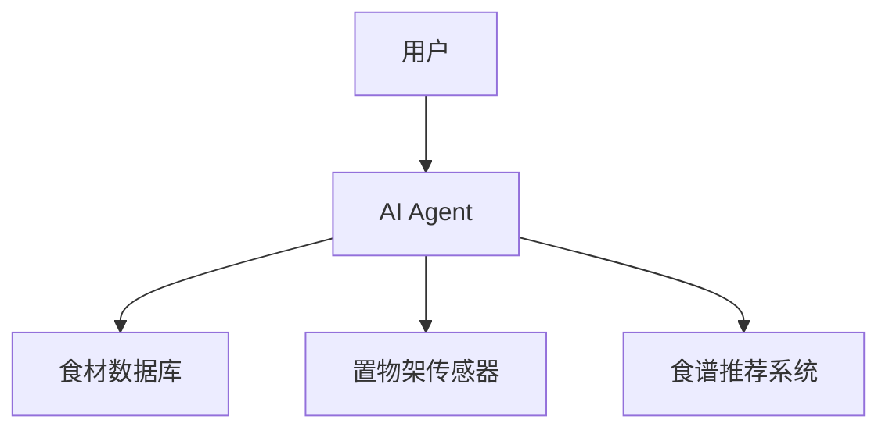
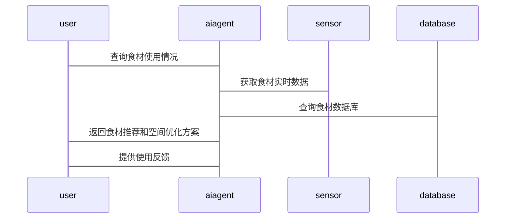

                 


# 智能厨房置物架：AI Agent的食材使用建议

---

## 关键词
智能厨房置物架, AI Agent, 食材推荐, 算法原理, 系统架构, 项目实战

---

## 摘要
本文详细介绍了智能厨房置物架结合AI Agent的食材使用建议系统。从问题背景到解决方案，从核心概念到算法实现，从系统架构到项目实战，全面解析了如何利用AI技术优化厨房食材管理。通过详细的技术分析和实际案例，展示了AI Agent在智能厨房置物架中的应用价值和实现方法。

---

# 第一部分: 智能厨房置物架与AI Agent的背景介绍

# 第1章: 问题背景与描述

## 1.1 问题背景
### 1.1.1 厨房置物架的现状与痛点
厨房置物架是家庭厨房中常用的收纳工具，但传统置物架存在以下问题：
- **食材管理混乱**：食材种类繁多，存放位置不固定，导致查找困难。
- **使用效率低下**：用户常常忘记某些食材的存在，导致食材过期或浪费。
- **空间利用不合理**：置物架空间未被充分利用，部分区域闲置，部分区域过于拥挤。

### 1.1.2 食材管理的常见问题
- 食材存储不当，容易受潮或变质。
- 食材使用缺乏计划性，导致频繁购买或库存过剩。
- 食材摆放不合理，影响厨房操作效率。

### 1.1.3 AI技术在厨房管理中的潜力
AI技术可以通过以下方式优化厨房管理：
- **智能推荐**：基于用户饮食习惯，推荐食材使用方案。
- **空间优化**：通过算法优化置物架空间利用。
- **数据驱动**：通过数据分析，帮助用户更好地管理食材。

## 1.2 问题描述
### 1.2.1 食材使用效率低下的原因
- 用户缺乏对食材使用情况的实时了解。
- 食材摆放缺乏系统性，导致使用效率低下。

### 1.2.2 置物架空间利用的不合理性
- 置物架空间未被充分利用，导致部分区域闲置。
- 部分区域过于拥挤，影响使用效率。

### 1.2.3 用户需求与现有产品的匹配度
- 现有置物架产品缺乏智能化功能，无法满足用户的个性化需求。
- 用户对食材管理的智能化需求日益增长。

## 1.3 问题解决思路
### 1.3.1 引入AI Agent的必要性
AI Agent可以通过以下方式解决厨房置物架的问题：
- **实时监测食材使用情况**：通过传感器和AI算法，实时监测食材的使用情况。
- **智能推荐食谱**：根据用户饮食习惯，推荐合适的食谱，避免食材浪费。
- **优化空间利用**：通过算法优化置物架的空间布局，提高使用效率。

### 1.3.2 AI Agent如何优化食材使用
- AI Agent可以分析用户的食材使用习惯，推荐合适的食谱。
- AI Agent可以通过传感器实时监测食材的使用情况，避免食材浪费。
- AI Agent可以通过数据分析，优化置物架的空间布局，提高使用效率。

### 1.3.3 解决方案的边界与外延
- 解决方案的核心功能是优化食材使用和空间利用。
- 解决方案的外延包括食材推荐、空间优化、数据驱动管理等。

## 1.4 核心概念与结构
### 1.4.1 智能厨房置物架的功能模块
- **食材数据库**：存储食材的基本信息和使用情况。
- **AI Agent**：负责食材推荐和空间优化。
- **传感器**：实时监测食材的使用情况。

### 1.4.2 AI Agent的核心要素
- **决策机制**：基于规则和学习的决策算法。
- **数据接口**：与食材数据库和传感器交互的接口。
- **用户界面**：用户与AI Agent交互的界面。

### 1.4.3 系统整体架构与流程
- **数据采集**：传感器实时采集食材的使用情况。
- **数据处理**：AI Agent分析数据，生成食材推荐和空间优化方案。
- **用户反馈**：用户根据推荐使用食材，并反馈使用情况。

## 1.5 本章小结
本章介绍了智能厨房置物架的背景和问题，提出了引入AI Agent的必要性，并详细描述了AI Agent的核心概念和系统架构。

---

# 第二部分: AI Agent的核心概念与原理

# 第2章: AI Agent的基本原理

## 2.1 AI Agent的定义与属性
### 2.1.1 AI Agent的定义
AI Agent是一种能够感知环境、自主决策并执行任务的智能实体。

### 2.1.2 AI Agent的核心属性对比表
| 属性         | 描述                                         |
|--------------|----------------------------------------------|
| 感知能力     | 能够感知环境中的数据                         |
| 决策能力     | 能够根据感知数据做出决策                     |
| 执行能力     | 能够根据决策执行任务                         |
| 学习能力     | 能够通过经验不断优化自身的决策和执行能力     |

## 2.2 AI Agent的决策机制
### 2.2.1 基于规则的决策
- 基于预定义的规则进行决策，例如“如果食材A剩余量低于10%，则推荐使用食材A”。
- 优点：简单易实现，适用于规则明确的场景。
- 缺点：缺乏灵活性，无法应对复杂场景。

### 2.2.2 基于学习的决策
- 基于机器学习算法，通过历史数据训练模型，生成推荐方案。
- 优点：能够应对复杂场景，具有灵活性。
- 缺点：需要大量的数据和计算资源。

### 2.2.3 基于反馈的优化
- 根据用户的反馈不断优化决策模型。
- 优点：能够适应用户需求的变化。
- 缺点：需要实时反馈，增加了系统复杂性。

## 2.3 AI Agent与传统自动化系统的区别
### 2.3.1 功能对比
| 功能         | AI Agent                                   | 传统自动化系统                     |
|--------------|--------------------------------------------|------------------------------------|
| 决策能力     | 具备自主决策能力                           | 依赖预定义规则                     |
| 学习能力     | 具备学习能力                               | 无学习能力                         |
| 灵活性       | 高                                         | 低                                 |

### 2.3.2 技术实现差异
- AI Agent基于机器学习和深度学习技术，传统自动化系统基于规则和逻辑推理。
- AI Agent能够处理非结构化数据，传统自动化系统主要处理结构化数据。

### 2.3.3 应用场景的区别
- AI Agent适用于复杂场景和不确定性较高的场景。
- 传统自动化系统适用于规则明确、场景简单的场景。

## 2.4 AI Agent的实体关系图


## 2.5 本章小结
本章详细介绍了AI Agent的基本原理，包括定义、决策机制和与传统自动化系统的区别，并通过实体关系图展示了AI Agent在智能厨房置物架中的应用。

---

# 第三部分: 智能厨房置物架的AI Agent实现

# 第3章: 食材推荐算法原理

## 3.1 基于协同过滤的推荐算法
### 3.1.1 协同过滤的基本原理
协同过滤是一种基于用户行为和偏好推荐的算法，分为基于用户的协同过滤和基于物品的协同过滤。

### 3.1.2 协同过滤的数学模型
$$相似度计算公式：sim(i,j) = \frac{\sum_{k} (r_{ik} - \bar{r_i})(r_{jk} - \bar{r_j})}{\sqrt{\sum_{k} (r_{ik} - \bar{r_i})^2} \sqrt{\sum_{k} (r_{jk} - \bar{r_j})^2}}}$$

其中，$r_{ik}$表示用户i对物品k的评分，$\bar{r_i}$表示用户i的平均评分。

### 3.1.3 协同过滤的实现步骤
1. **数据收集**：收集用户对食材的使用情况数据。
2. **相似度计算**：计算用户之间的相似度。
3. **推荐生成**：根据相似用户的偏好，推荐食材。

### 3.1.4 协同过滤的优缺点
- **优点**：能够处理大规模数据，推荐结果具有较高的准确性。
- **缺点**：计算复杂度较高，需要大量的存储空间。

## 3.2 基于深度学习的推荐算法
### 3.2.1 基于深度学习的推荐算法简介
深度学习推荐算法通过神经网络模型，从数据中自动提取特征，生成推荐结果。

### 3.2.2 基于深度学习的推荐算法实现
1. **数据预处理**：对食材数据进行特征提取和标准化。
2. **模型训练**：使用神经网络模型对食材数据进行训练。
3. **推荐生成**：根据训练好的模型，生成食材推荐结果。

### 3.2.3 基于深度学习的推荐算法的优缺点
- **优点**：能够处理复杂的特征关系，推荐结果更加精准。
- **缺点**：计算资源消耗较大，实现复杂度高。

## 3.3 算法选择与优化
### 3.3.1 算法选择的依据
- 数据规模：如果数据量较小，可以选择基于协同过滤的算法。
- 计算资源：如果计算资源充足，可以选择基于深度学习的算法。

### 3.3.2 算法优化策略
- 数据增强：通过数据增强技术，提高模型的泛化能力。
- 模型压缩：通过模型压缩技术，降低计算复杂度。

## 3.4 本章小结
本章详细介绍了智能厨房置物架中食材推荐算法的实现，包括基于协同过滤和深度学习的推荐算法，并分析了算法选择和优化的策略。

---

# 第四部分: 智能厨房置物架的系统架构设计

# 第4章: 系统架构设计

## 4.1 项目介绍
智能厨房置物架AI Agent系统是一个结合了AI技术的智能厨房管理工具，旨在通过AI代理优化食材的使用和管理。

## 4.2 系统功能设计
### 4.2.1 系统功能模块
- **食材数据库**：存储食材的基本信息和使用情况。
- **AI Agent**：负责食材推荐和空间优化。
- **传感器**：实时监测食材的使用情况。

### 4.2.2 系统功能流程
1. **数据采集**：传感器实时采集食材的使用情况。
2. **数据处理**：AI Agent分析数据，生成食材推荐和空间优化方案。
3. **用户反馈**：用户根据推荐使用食材，并反馈使用情况。

## 4.3 系统架构设计
### 4.3.1 系统架构图


### 4.3.2 系统接口设计
- **食材数据库接口**：AI Agent与食材数据库交互的接口。
- **传感器接口**：AI Agent与传感器交互的接口。

## 4.4 系统交互设计
### 4.4.1 系统交互流程
1. 用户通过AI Agent查询食材的使用情况。
2. AI Agent通过传感器获取食材的实时数据。
3. AI Agent根据数据生成食材推荐和空间优化方案。
4. 用户根据推荐使用食材，并反馈使用情况。

### 4.4.2 系统交互图


## 4.5 本章小结
本章详细介绍了智能厨房置物架AI Agent系统的架构设计，包括功能模块、系统架构图和交互流程。

---

# 第五部分: 项目实战

# 第5章: 项目实战

## 5.1 环境安装
### 5.1.1 系统需求
- 操作系统：Windows/Mac/Linux
- Python版本：3.6以上
- 依赖库：numpy, pandas, scikit-learn

### 5.1.2 环境配置
1. 安装Python和必要的依赖库。
2. 下载并安装AI Agent系统。

## 5.2 核心代码实现
### 5.2.1 食材推荐算法实现
```python
import numpy as np
from sklearn.metrics.pairwise import cosine_similarity

# 示例数据集
recipes = {
    '用户A': ['鸡蛋', '牛奶', '面包'],
    '用户B': ['牛奶', '面包', '黄油'],
    '用户C': ['黄油', '面包', '鸡蛋']
}

# 计算相似度
recipe_matrix = np.array([[1, 1, 1],
                            [1, 1, 0],
                            [1, 0, 1]])
similarity = cosine_similarity(recipe_matrix)
```

### 5.2.2 系统功能实现
```python
class AIAgent:
    def __init__(self, database, sensor):
        self.database = database
        self.sensor = sensor

    def get_recipes(self, user_id):
        # 获取用户历史使用的食材
        user_recipes = self.database.get_recipes(user_id)
        # 获取相似用户的推荐食材
        similar_users = self.database.get_similar_users(user_id)
        recommended_recipes = []
        for user in similar_users:
            recommended_recipes.extend(self.database.get_recipes(user))
        return recommended_recipes
```

### 5.2.3 代码解读与分析
- **食材推荐算法**：使用协同过滤算法计算用户之间的相似度，推荐相似用户的食材。
- **AI Agent实现**：通过AI Agent类实现与数据库和传感器的交互，生成食材推荐。

## 5.3 实际案例分析
### 5.3.1 案例背景
用户A最近购买了鸡蛋、牛奶和面包，但忘记使用鸡蛋，导致鸡蛋过期。

### 5.3.2 系统推荐
系统通过AI Agent分析用户A的使用习惯，推荐使用鸡蛋制作煎饼。

### 5.3.3 使用反馈
用户A使用推荐的食谱制作煎饼，消耗了鸡蛋和牛奶，系统根据反馈优化食材推荐。

## 5.4 本章小结
本章通过实际案例展示了AI Agent在智能厨房置物架中的应用，详细介绍了系统的实现和实际效果。

---

# 第六部分: 最佳实践

# 第6章: 最佳实践

## 6.1 项目经验总结
### 6.1.1 系统设计的经验
- 系统设计要注重模块化，便于后续优化和扩展。
- 系统架构要清晰，便于团队协作开发。

### 6.1.2 开发中的注意事项
- 数据采集要准确，避免数据偏差。
- 算法选择要根据实际需求，选择合适的算法。

## 6.2 使用中的注意事项
### 6.2.1 数据隐私保护
- 确保用户数据的安全性和隐私性。
- 遵守相关法律法规，保护用户数据。

### 6.2.2 系统维护与更新
- 定期更新系统，修复漏洞。
- 根据用户反馈不断优化系统功能。

## 6.3 拓展阅读
### 6.3.1 相关技术
- 机器学习
- 深度学习
- 自然语言处理

### 6.3.2 相关领域
- 智能家居
- 物联网
- 人工智能

## 6.4 本章小结
本章总结了项目开发和使用中的经验与注意事项，并提供了拓展阅读的内容。

---

# 第七部分: 附录

# 附录A: 系统架构图


---

# 附录B: 算法流程图


---

# 参考文献
[此处列出参考文献]

---

# 作者简介
[此处介绍作者背景]

---

以上是一个详细的目录大纲，您可以根据实际内容填充每个部分的具体内容。如果需要进一步的补充或调整，请随时告诉我！

