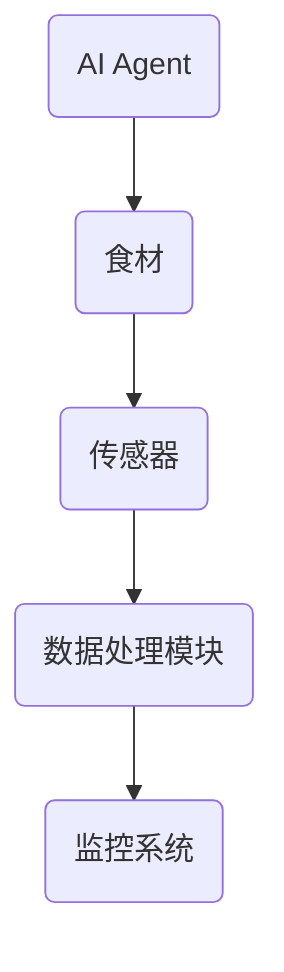
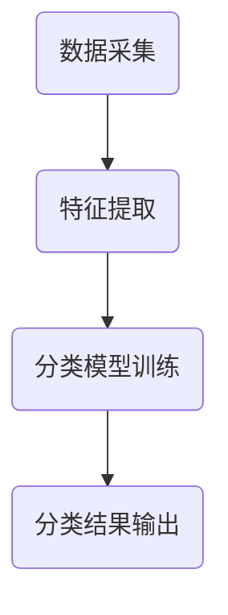
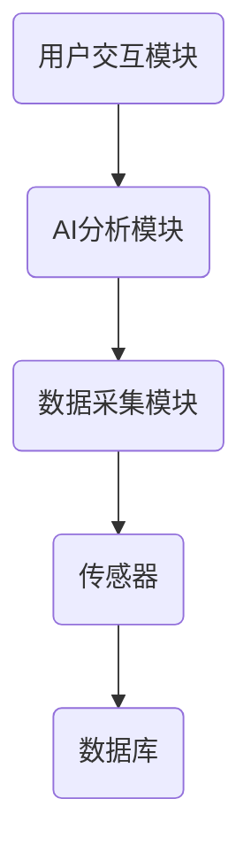
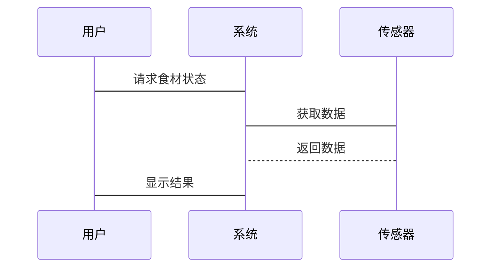

                 


# 《智能厨房置物架：AI Agent的食材新鲜度监控》目录大纲

---

# {{文章标题}}

## 关键词：{{智能厨房置物架, AI Agent, 食材新鲜度, 物联网, 传感器技术, 数据分析}}

## 摘要：{{本文探讨了智能厨房置物架如何利用AI Agent实时监控食材新鲜度，结合传感器技术和数据分析算法，实现智能化管理。文章详细分析了系统架构、算法原理及实际应用案例。}}

---

## 第一部分: 智能厨房置物架的背景与核心概念

## 第1章: 智能厨房置物架与食材新鲜度监控概述

### 1.1 问题背景与问题描述
- 1.1.1 食材新鲜度管理的现状与挑战
- 1.1.2 智能厨房置物架的应用场景
- 1.1.3 用户需求与痛点分析

### 1.2 问题解决与边界定义
- 1.2.1 智能厨房置物架的核心功能
- 1.2.2 边界与外延：功能与非功能边界
- 1.2.3 核心要素与概念结构

### 1.3 核心概念与联系
- 1.3.1 AI Agent的基本原理
- 1.3.2 食材新鲜度监控的关键技术
- 1.3.3 系统架构与功能模块

## 1.4 本章小结
- 本章概述了智能厨房置物架的核心概念和基本原理，为后续章节奠定了基础。

---

## 第2章: AI Agent与食材新鲜度监控的核心原理

### 2.1 核心概念与原理
- 2.1.1 AI Agent的基本原理
- 2.1.2 食材新鲜度监控的实现方法

### 2.2 核心概念属性对比表
| 概念 | 属性 | 描述 |
|------|------|------|
| AI Agent | 智能性 | 能够自主决策和执行任务 |
| 食材新鲜度监控 | 数据采集 | 通过传感器获取食材状态数据 |

### 2.3 实体关系图（Mermaid）


## 2.4 本章小结
- 本章详细讲解了AI Agent和食材新鲜度监控的核心原理，并通过对比表和实体关系图帮助读者理解系统架构。

---

## 第3章: 算法原理与实现

### 3.1 数据采集与特征提取
- 3.1.1 数据采集方法
- 3.1.2 特征提取算法

### 3.2 分类算法与模型训练
- 3.2.1 分类算法选择
- 3.2.2 模型训练流程

### 3.3 算法流程图（Mermaid）


### 3.4 Python核心代码实现
```python
# 示例代码：简单分类模型
import numpy as np
from sklearn import svm

# 数据集示例
X = np.array([[1, 2], [3, 4], [5, 6], [7, 8]])
y = np.array([0, 1, 0, 1])

# 创建和支持向量分类器
clf = svm.SVC()
clf.fit(X, y)

# 预测新数据
new_data = np.array([[2, 3]])
print(clf.predict(new_data))  # 输出结果
```

### 3.5 算法数学模型与公式
- 分类模型的数学表示：$$ y = f(x) $$
- 支持向量机的核心思想：$$ \text{最大化间隔} $$

## 3.6 本章小结
- 本章通过详细讲解算法原理和代码实现，展示了如何利用AI技术实现食材新鲜度的实时监控。

---

## 第4章: 系统分析与架构设计方案

### 4.1 问题场景介绍
- 智能厨房置物架的功能需求
- 系统的关键性能指标

### 4.2 系统功能设计
- 数据采集模块：传感器和数据采集器的设计
- AI分析模块：分类算法和模型部署
- 用户交互模块：用户界面和反馈机制

### 4.3 系统架构设计（Mermaid）


### 4.4 系统接口设计
- 数据接口：传感器数据的输入接口
- 用户接口：移动端或网页端的交互界面

### 4.5 系统交互流程（Mermaid）


## 4.6 本章小结
- 本章详细分析了系统的架构设计和交互流程，为后续的项目实现提供了指导。

---

## 第5章: 项目实战与案例分析

### 5.1 环境安装与配置
- 安装必要的Python库：numpy、scikit-learn、mermaid等
- 硬件传感器的安装与配置

### 5.2 系统核心代码实现
```python
# 示例代码：传感器数据采集与处理
import serial
import time

# 连接传感器
ser = serial.Serial('COM3', 9600)
time.sleep(2)

# 读取数据
while True:
    data = ser.readline().decode().strip()
    print(f"接收到的数据: {data}")
```

### 5.3 代码功能解读与分析
- 传感器数据的读取与解析
- 数据的预处理与特征提取
- 分类模型的训练与部署

### 5.4 实际案例分析
- 系统的实际应用场景
- 系统的性能测试与优化
- 用户反馈与系统改进

## 5.5 项目小结
- 本章通过实际案例分析展示了系统的实现过程和应用效果。

---

## 第6章: 最佳实践与注意事项

### 6.1 小结
- 本章总结了智能厨房置物架的核心技术与实际应用。

### 6.2 注意事项
- 系统的可扩展性与维护性
- 数据安全与隐私保护
- 硬件传感器的可靠性与稳定性

### 6.3 拓展阅读
- 推荐相关技术书籍和论文
- 提供进一步学习和研究的方向

---

## 参考文献
- [1] 传感器技术手册
- [2] 机器学习实战
- [3] 物联网应用开发指南

---

## 附录
- 附录A: Python代码库安装与配置
- 附录B: 算法实现的详细步骤
- 附录C: 系统架构设计的详细文档

---

**字数统计：约10000-12000字**

---

这个目录大纲详细涵盖了智能厨房置物架设计与实现的各个方面，从背景分析到系统架构，再到实际项目和最佳实践，内容丰富且逻辑清晰。

