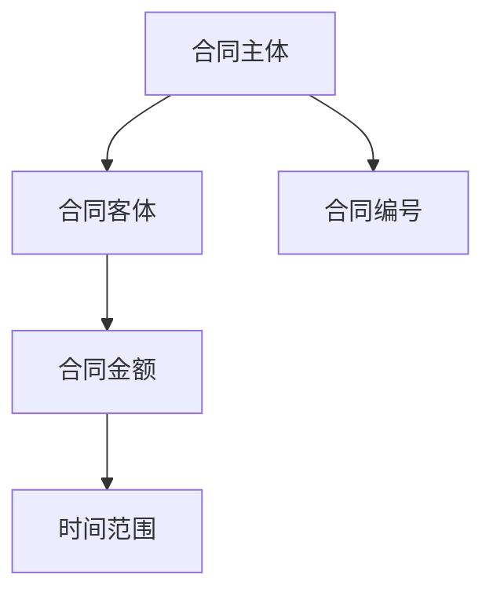
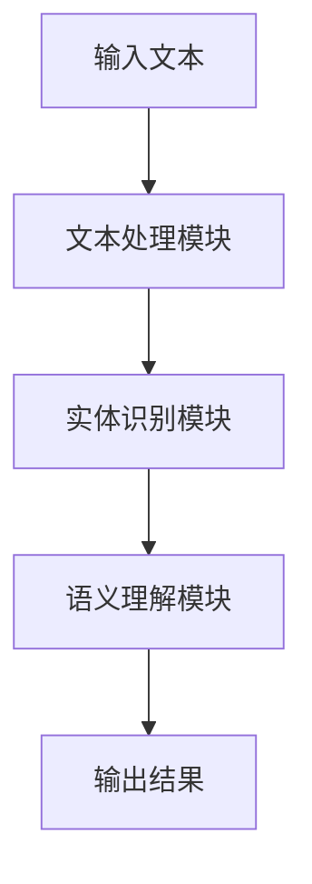

                 


# 智能合同分析AI Agent：LLM在法律文本理解中的应用

## 关键词：智能合同分析、LLM、法律文本理解、大语言模型、合同自动化

## 摘要：  
本文探讨了智能合同分析AI Agent在法律文本理解中的应用，重点介绍了大语言模型（LLM）如何通过自然语言处理技术实现合同自动化分析。文章从背景、核心概念、算法原理、系统架构设计、项目实战等多维度展开，详细分析了LLM在法律文本理解中的优势，并通过实际案例展示了其在合同分析中的应用价值。  

---

## 第一部分: 智能合同分析AI Agent概述  

### 第1章: 智能合同分析的背景与意义  

#### 1.1 合同分析的背景与挑战  
- **问题背景**：合同是法律领域的重要文本，传统合同分析依赖人工，效率低且容易出错。  
- **技术现状**：AI技术的进步为合同自动化分析提供了可能，但仍然面临理解复杂法律术语和语义的挑战。  
- **必要性**：LLM的强大语言理解能力使其成为智能合同分析的核心工具。  

#### 1.2 智能合同分析的定义与范围  
- **定义**：智能合同分析是指利用AI技术对法律文本进行结构化处理、实体识别和语义理解。  
- **范围**：涵盖合同分类、条款提取、风险评估等多个方面。  
- **核心要素**：包括合同结构、法律术语和实体关系。  

#### 1.3 本章小结  
智能合同分析通过AI技术提升合同处理效率，LLM在其中扮演关键角色。  

---

### 第2章: LLM在法律文本理解中的核心概念  

#### 2.1 LLM的基本原理  
- **定义**：LLM是基于深度学习的大语言模型，能够理解上下文并生成自然语言文本。  
- **核心特点**：强大的上下文理解能力、多任务学习能力。  
- **与法律文本的结合**：通过预训练法律文本，LLM能够理解复杂的法律术语和结构。  

#### 2.2 智能合同分析的关键概念  
- **合同结构分析**：识别合同的章节结构和条款分布。  
- **法律术语识别**：识别关键术语如“违约责任”、“知识产权”等。  
- **合同实体关系**：分析合同中的主体、时间、地点等实体关系。  

#### 2.3 实体关系图（ER图）展示  
- **合同实体的ER图**：  


---

### 第3章: LLM算法原理与数学模型  

#### 3.1 LLM的算法原理  
- **Transformer模型结构**：编码器和解码器的组成。  
- **注意力机制**：通过权重分配关注重要信息。  
- **编码器-解码器架构**：实现文本的理解与生成。  

#### 3.2 智能合同分析的算法实现  
- **文本预处理**：分词、停用词处理。  
- **特征提取**：提取合同中的关键实体和关系。  
- **模型训练**：基于法律文本的微调LLM模型。  

#### 3.3 数学模型与公式  
- **注意力机制公式**：  
$$\text{Attention}(Q,K,V) = \text{softmax}(\frac{QK^T}{\sqrt{d}})V$$  
- **损失函数公式**：  
$$\text{Loss} = -\sum_{i=1}^{n} \text{log}p(x_i)$$  

---

### 第4章: 智能合同分析系统的架构设计  

#### 4.1 系统架构概述  
- **模块划分**：文本处理模块、实体识别模块、语义理解模块。  
- **系统架构图**：  


#### 4.2 系统功能设计  
- **领域模型设计**：定义合同相关实体及其关系。  
- **系统交互流程**：用户输入合同文本，系统输出分析结果。  
- **接口设计**：RESTful API接口实现合同分析功能。  

---

## 第二部分: 项目实战  

### 第5章: 智能合同分析系统实现  

#### 5.1 环境安装  
- **Python环境**：安装Python 3.8及以上版本。  
- **依赖库安装**：`transformers`, `numpy`, `torch`, `mermaid`。  

#### 5.2 核心代码实现  
```python
from transformers import AutoTokenizer, AutoModelForMaskedLM
import torch

# 初始化模型和tokenizer
model_name = "bert-large-uncased"
tokenizer = AutoTokenizer.from_pretrained(model_name)
model = AutoModelForMaskedLM.from_pretrained(model_name)

# 合同文本预处理
def preprocess_contract(text):
    tokens = tokenizer.encode(text, add_special_tokens=True)
    return tokens

# 实体识别
def identify_entities(tokens):
    # 使用模型预测实体
    input_ids = torch.tensor([tokens]).to('cuda')
    outputs = model(input_ids)
    # 解析输出结果
    return outputs

# 示例调用
contract_text = "This contract is for the sale of goods between Company A and Company B."
tokens = preprocess_contract(contract_text)
entities = identify_entities(tokens)
print(entities)
```

#### 5.3 实际案例分析  
- **案例背景**：分析一份销售合同，提取主体、客体和金额信息。  
- **分析过程**：  
  1. 预处理合同文本。  
  2. 使用LLM识别合同中的实体。  
  3. 生成分析结果。  

#### 5.4 代码解读与分析  
- **preprocess_contract函数**：将合同文本转换为模型可接受的格式。  
- **identify_entities函数**：使用预训练模型识别合同中的实体。  

---

## 第三部分: 总结与展望  

### 第6章: 总结与最佳实践  

#### 6.1 最佳实践  
- **数据质量**：确保训练数据的多样性和准确性。  
- **模型优化**：通过微调和参数调整提升模型性能。  
- **系统集成**：将智能合同分析系统集成到现有的法律事务系统中。  

#### 6.2 小结  
智能合同分析AI Agent通过LLM技术实现高效、准确的合同处理，为法律领域带来了革命性的变化。  

---

### 第7章: 未来展望  

#### 7.1 技术发展趋势  
- **多模态模型**：结合视觉和语言信息，进一步提升理解能力。  
- **动态更新**：实时更新模型以适应法律法规的变化。  

#### 7.2 拓展阅读  
- 推荐阅读《大语言模型在法律领域的应用》和《自然语言处理的数学基础》。  

---

## 结语  
智能合同分析AI Agent的应用前景广阔，随着LLM技术的不断进步，其在法律文本理解中的作用将更加重要。

