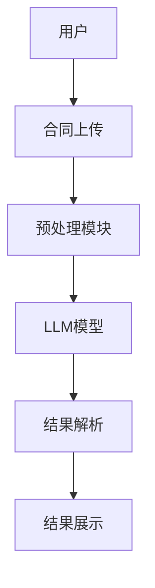

                 


# 智能合同审核 AI Agent：LLM 在法律文件处理中的应用

## 关键词：
智能合同审核, LLM, 法律文件处理, 人工智能, 自然语言处理, 法律文本分析

## 摘要：
本文深入探讨了如何利用大语言模型（LLM）进行智能合同审核，分析了LLM在法律文件处理中的应用，详细介绍了系统的背景、核心原理、架构设计、项目实现和最佳实践。

---

# 第1章: 智能合同审核的背景与问题

## 1.1 智能合同审核的背景

### 1.1.1 合同审核的传统方式与痛点
传统合同审核依赖人工，效率低、成本高且容易出错。法律专业人士需逐字检查，耗时且易遗漏关键条款。

### 1.1.2 AI技术在法律领域的应用趋势
AI技术，尤其是LLM，因其强大的自然语言处理能力，正在法律领域广泛应用，提升效率和准确性。

### 1.1.3 LLM在合同审核中的潜力
LLM能够快速理解合同内容，识别关键条款，发现潜在问题，极大提升审核效率和准确率。

---

## 1.2 问题背景与目标

### 1.2.1 合同审核的主要挑战
1. **复杂性**：合同涉及众多法律术语和条款，理解难度大。
2. **一致性**：确保合同内容符合法律法规。
3. **效率**：人工审核耗时长，成本高。

### 1.2.2 智能合同审核的目标
1. 提供高效、准确的合同审核服务。
2. 帮助非专业人士理解合同内容，降低法律风险。
3. 自动化处理，节省时间和成本。

### 1.2.3 LLM在合同审核中的核心任务
1. **识别关键条款**：如违约责任、支付条款等。
2. **风险评估**：识别潜在法律问题。
3. **生成建议**：提供修改建议，确保合同合规。

---

## 1.3 问题解决思路

### 1.3.1 基于LLM的合同审核流程
1. **输入合同文本**：用户上传合同。
2. **模型处理**：LLM分析文本，识别关键条款。
3. **结果输出**：生成审核报告和建议。

### 1.3.2 从传统到智能的转变
1. **效率提升**：自动化处理减少人工干预。
2. **准确性增强**：模型基于大量数据学习，降低错误率。
3. **扩展性增强**：支持多种合同类型和语言。

### 1.3.3 边界与外延
1. **边界**：仅处理合同内容，不涉及外部数据。
2. **外延**：未来可能扩展至合同生成、谈判支持。

---

## 1.4 核心概念与结构

### 1.4.1 智能合同审核的核心要素
1. **LLM模型**：负责理解和生成文本。
2. **预处理模块**：清洗和结构化合同文本。
3. **后处理模块**：生成审核结果和建议。

### 1.4.2 LLM在法律文本处理中的角色
1. **理解者**：解析合同内容。
2. **识别者**：识别关键条款和潜在风险。
3. **生成者**：提供修改建议。

### 1.4.3 系统架构与功能模块
1. **合同预处理**：文本清洗、分段。
2. **模型调用**：LLM处理并生成结果。
3. **结果分析**：展示审核结果，提供建议。

---

## 1.5 本章小结
本章介绍了智能合同审核的背景、问题、目标和解决思路，明确了LLM在其中的核心作用，为后续章节奠定了基础。

---

# 第2章: LLM 的核心原理

## 2.1 LLM 的基本原理

### 2.1.1 大语言模型的定义
LLM是基于深度学习的NLP模型，能够理解和生成人类语言，常用模型包括GPT、BERT等。

### 2.1.2 模型训练与推理机制
1. **训练**：基于大量文本数据进行监督学习，优化模型参数。
2. **推理**：根据输入生成输出，通过概率预测生成最可能的文本。

### 2.1.3 模型的可解释性
1. **可解释性差**：模型内部机制复杂，难以解释具体决策。
2. **处理方式**：通过分析输入输出关系，提供结果解释。

---

## 2.2 模型结构与法律文本处理

### 2.2.1 模型的输入与输出
1. **输入**：合同文本。
2. **输出**：审核结果和建议。

### 2.2.2 法律文本的特征提取
1. **术语提取**：识别法律术语。
2. **语义分析**：理解条款含义。

### 2.2.3 模型的法律语义理解能力
1. **理解法律逻辑**：模型需理解法律条文的逻辑关系。
2. **上下文处理**：处理长文本的上下文关系。

---

## 2.3 法律文本处理的特殊性

### 2.3.1 法律术语的复杂性
1. **术语多样性**：法律术语种类多，复杂性强。
2. **术语准确性**：术语必须严格准确。

### 2.3.2 法律逻辑的严谨性
1. **逻辑关系**：法律文本逻辑严密，需准确理解和处理。
2. **因果关系**：模型需识别法律条文的因果关系。

### 2.3.3 法律文本的结构化特征
1. **结构化处理**：将合同文本结构化，便于分析。
2. **数据清洗**：预处理步骤，去除干扰信息。

---

## 2.4 本章小结
本章详细介绍了LLM的基本原理和法律文本处理的特殊性，为后续章节的系统设计奠定了理论基础。

---

# 第3章: 基于 LLM 的智能合同审核系统

## 3.1 系统问题场景介绍

### 3.1.1 合同审核的典型场景
1. **合同审查**：识别关键条款和潜在风险。
2. **合规性检查**：确保合同符合法律法规。
3. **条款解释**：帮助用户理解合同内容。

### 3.1.2 系统的目标用户
1. **法律专业人士**：律师、法务人员。
2. **企业用户**：企业法务部门。
3. **个人用户**：普通用户。

### 3.1.3 系统的预期功能
1. **合同上传**：用户上传合同文本。
2. **自动审核**：系统调用LLM进行审核。
3. **结果展示**：生成审核报告和建议。

---

## 3.2 系统功能设计

### 3.2.1 合同预处理模块
1. **文本清洗**：去除干扰信息。
2. **文本分段**：将合同分成条款和段落。

### 3.2.2 LLM模型调用模块
1. **模型选择**：选择合适的LLM模型。
2. **参数设置**：设置模型参数，如温度、长度等。

### 3.2.3 结果分析与反馈
1. **结果解析**：将模型输出解析为可读格式。
2. **反馈机制**：收集用户反馈，优化模型。

---

## 3.3 系统架构设计

### 3.3.1 系统架构图


### 3.3.2 系统模块功能
1. **用户界面**：用户上传合同，查看结果。
2. **预处理模块**：清洗和分段合同文本。
3. **LLM调用模块**：调用模型进行审核。
4. **结果解析模块**：将模型输出解析为用户友好的格式。
5. **结果展示模块**：展示审核结果和建议。

---

## 3.4 本章小结
本章详细描述了智能合同审核系统的功能设计和架构，为后续的实现提供了清晰的蓝图。

---

# 第4章: 算法原理

## 4.1 算法原理概述

### 4.1.1 模型训练过程
1. **数据准备**：收集和标注法律文本数据。
2. **模型训练**：使用监督学习优化模型参数。
3. **模型评估**：通过测试集评估模型性能。

### 4.1.2 推理过程
1. **输入处理**：将合同文本输入模型。
2. **生成输出**：模型生成审核结果和建议。
3. **结果处理**：将模型输出处理为用户可读的格式。

---

## 4.2 数学模型与公式

### 4.2.1 损失函数
$$ \text{损失函数} = -\sum_{i=1}^{n} \text{标签}_i \cdot \log(\text{预测}_i) $$

### 4.2.2 概率计算
$$ P(\text{输出}) = \prod_{i=1}^{m} P(\text{输出}_i | \text{输出}_{i-1}, \ldots, \text{输出}_1) $$

---

## 4.3 实际案例分析

### 4.3.1 案例描述
某公司合同中的违约条款未明确，模型识别并建议补充相关条款。

### 4.3.2 模型处理步骤
1. **输入合同文本**。
2. **模型识别问题**。
3. **生成修改建议**。

---

## 4.4 本章小结
本章详细讲解了智能合同审核系统的算法原理，包括模型训练、推理过程和数学公式，为后续的系统实现提供了技术基础。

---

# 第5章: 项目实战

## 5.1 环境安装

### 5.1.1 安装Python
```bash
# 安装Python
sudo apt-get install python3 python3-pip
```

### 5.1.2 安装依赖库
```bash
pip install openai transformers
```

---

## 5.2 系统核心实现源代码

### 5.2.1 合同预处理模块
```python
def preprocess_contract(contract_text):
    # 去除特殊字符
    cleaned = contract_text.replace('\n', ' ').replace('\r', ' ')
    # 分段
    paragraphs = cleaned.split('.')
    return paragraphs
```

### 5.2.2 LLM模型调用模块
```python
import openai

def call_llm(model, prompt):
    client = openai.Client(model)
    response = client.chat.completions.create(
        model=model,
        messages=[{"role": "user", "content": prompt}]
    )
    return response.choices[0].message.content
```

### 5.2.3 结果分析模块
```python
def analyze_result(result):
    # 解析结果
    return {
        'status': 'success',
        'message': result
    }
```

---

## 5.3 实际案例分析

### 5.3.1 案例描述
用户上传一份商业合同，模型识别出其中的违约责任条款不明确。

### 5.3.2 代码实现
```python
contract_text = "违约责任：若一方违约，需支付违约金。"
preprocessed = preprocess_contract(contract_text)
result = call_llm('gpt-3.5-turbo', preprocessed)
analyze_result(result)
```

---

## 5.4 项目小结
本章通过实际案例展示了智能合同审核系统的实现过程，包括环境搭建、代码实现和结果分析。

---

# 第6章: 总结与展望

## 6.1 总结
本文详细介绍了智能合同审核系统的设计与实现，探讨了LLM在法律文本处理中的应用，展示了系统的实际应用价值。

## 6.2 未来展望
1. **模型优化**：优化LLM模型，提升准确性和效率。
2. **功能扩展**：扩展合同生成、谈判支持等功能。
3. **多语言支持**：支持更多语言，拓展国际市场。

---

## 6.3 注意事项
1. **数据隐私**：处理法律文本时需注意数据隐私。
2. **模型选择**：根据需求选择合适的LLM模型。
3. **持续学习**：定期更新模型，保持其准确性。

---

## 6.4 拓展阅读
1. **相关论文**：深入学习大语言模型的原理。
2. **技术博客**：了解最新的法律AI应用案例。
3. **工具文档**：熟悉OpenAI和其他LLM工具的使用。

---

## 6.5 本章小结
本文总结了智能合同审核系统的实现，并展望了未来的发展方向，为读者提供了进一步学习和研究的方向。

---

# 结语
智能合同审核AI Agent的实现展示了LLM在法律领域的巨大潜力，未来随着技术的进步，AI在法律文本处理中的应用将更加广泛和深入。

--- 

感谢您的阅读，希望本文对您有所帮助！

