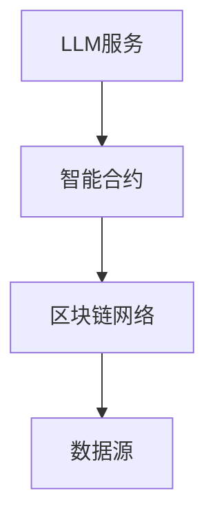
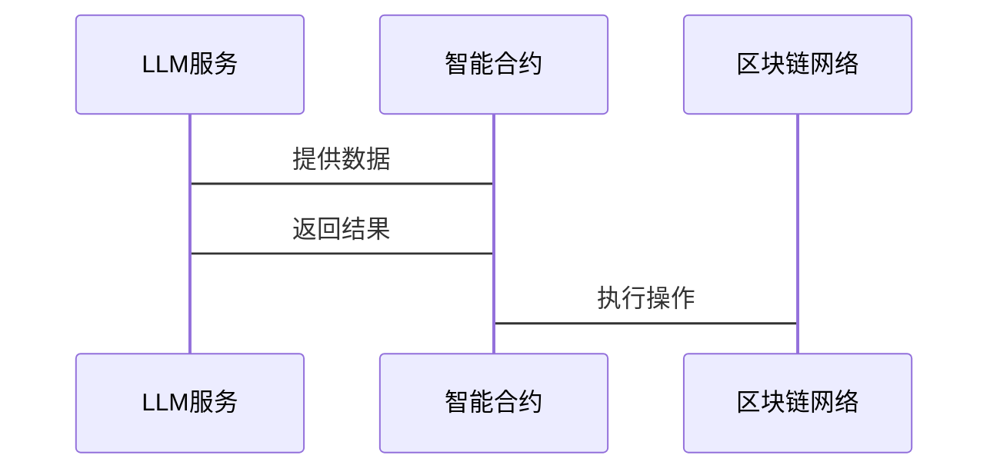

                 


# 智能合约 AI Agent：LLM 在区块链应用中的角色

> 关键词：智能合约，AI Agent，LLM，区块链，人工智能，分布式系统

> 摘要：本文深入探讨了智能合约与AI Agent的结合，特别是LLM在区块链中的应用角色。通过分析LLM在区块链中的技术实现、系统架构设计和实际案例，展示了如何利用LLM提升智能合约的智能化水平，为区块链应用带来新的可能性。

---

# 第一部分: 智能合约与AI Agent概述

## 第1章: 智能合约与AI Agent的基本概念

### 1.1 智能合约的定义与特点

#### 1.1.1 智能合约的定义
智能合约是一种基于区块链技术的自动执行合同，其特点是去中心化、透明性和不可篡改性。智能合约通过区块链网络中的代码自动执行交易或操作，无需中间人。

#### 1.1.2 智能合约的核心特点
- **去中心化**：智能合约运行在区块链上，不依赖任何中心化机构。
- **自动执行**：智能合约根据预设的条件自动触发操作。
- **透明性**：所有交易记录在区块链上，可供任何人查阅。
- **不可篡改性**：区块链的特性确保数据的安全性和不可篡改性。

#### 1.1.3 智能合约的运行机制
智能合约的运行机制包括合约部署、状态管理、事件触发和结果输出。智能合约通过区块链的共识机制确保代码的执行是安全可靠的。

### 1.2 AI Agent的定义与特点

#### 1.2.1 AI Agent的定义
AI Agent是一种能够感知环境、做出决策并执行任务的智能体。它能够通过与环境的交互，动态调整自身行为以达到目标。

#### 1.2.2 AI Agent的核心特点
- **自主性**：AI Agent能够自主决策，无需外部干预。
- **反应性**：能够根据环境变化实时调整行为。
- **学习能力**：通过数据和经验不断优化自身性能。
- **协作性**：能够与其他AI Agent或系统协同工作。

#### 1.2.3 AI Agent与传统智能合约的区别
传统智能合约是静态的，仅根据预设条件执行操作，而AI Agent具有动态性和学习能力，能够适应复杂多变的环境。

### 1.3 LLM在智能合约中的角色

#### 1.3.1 LLM的定义与特点
LLM（Large Language Model）是一种基于深度学习的自然语言处理模型，能够理解和生成人类语言。LLM具有强大的文本处理能力，包括文本生成、问答、摘要和翻译等。

#### 1.3.2 LLM在智能合约中的应用潜力
LLM可以用于智能合约的自动化编写、条款分析、风险评估和执行优化。通过LLM的自然语言处理能力，智能合约能够更好地理解和处理复杂的法律条款和业务逻辑。

#### 1.3.3 LLM与区块链技术的结合
区块链提供了安全、去中心化的环境，而LLM提供了强大的文本处理能力。两者的结合使得智能合约更加智能化和自动化，能够处理复杂的业务逻辑和动态变化的环境。

---

## 第2章: 区块链与智能合约的背景介绍

### 2.1 区块链技术的基本原理

#### 2.1.1 区块链的定义与特点
区块链是一种去中心化的分布式账本技术，具有去中心化、不可篡改和透明性等特点。区块链通过共识机制确保数据的安全性和一致性。

#### 2.1.2 区块链的核心技术
- **共识机制**：确保所有节点达成一致。
- **区块结构**：数据以区块形式存储，每个区块包含交易数据和哈希指针。
- **智能合约**：区块链上的自动执行代码。

#### 2.1.3 区块链的分类与应用场景
区块链可以分为公链、私链和联盟链。应用场景包括金融、供应链、医疗和法律等多个领域。

### 2.2 智能合约的起源与发展

#### 2.2.1 智能合约的历史背景
智能合约的概念最早由尼克·萨博在1995年提出，但真正实现是在区块链技术出现之后。以以太坊为例，智能合约在区块链上的应用取得了显著进展。

#### 2.2.2 智能合约的发展现状
智能合约目前主要应用于去中心化金融（DeFi）、供应链管理和数字身份验证等领域。随着技术的发展，智能合约的功能和复杂性也在不断增加。

#### 2.2.3 智能合约的未来趋势
未来的智能合约将更加智能化和自动化，通过结合AI和大数据技术，实现更复杂的业务逻辑和动态调整。

### 2.3 LLM在区块链中的应用背景

#### 2.3.1 区块链中的数据处理需求
区块链上的数据通常是结构化的交易记录，但实际应用中需要处理大量的非结构化数据，如合同文本、法律条款和用户反馈。

#### 2.3.2 LLM在区块链数据处理中的优势
LLM能够处理和分析大量的非结构化数据，帮助区块链系统更好地理解和处理复杂的信息。

#### 2.3.3 LLM与区块链技术的结合趋势
随着LLM技术的成熟和区块链应用的扩展，两者结合的应用场景将越来越广泛，尤其是在智能合约和去中心化应用中。

---

# 第二部分: LLM在区块链中的技术实现

## 第3章: LLM与区块链技术的结合原理

### 3.1 LLM在区块链中的核心作用

#### 3.1.1 数据处理与分析
LLM能够对区块链中的非结构化数据进行处理和分析，帮助智能合约更好地理解和执行任务。

#### 3.1.2 智能合约的自动化执行
通过LLM的自然语言处理能力，智能合约可以自动化地编写、优化和执行复杂的业务逻辑。

#### 3.1.3 区块链的安全性保障
LLM可以辅助验证区块链中的交易数据，确保数据的合法性和完整性。

### 3.2 LLM在区块链中的技术架构

#### 3.2.1 LLM与区块链的交互流程
1. **数据输入**：智能合约将数据输入LLM。
2. **LLM处理**：LLM对数据进行分析和生成响应。
3. **结果输出**：LLM将结果返回智能合约，执行相应的操作。

#### 3.2.2 LLM在区块链中的数据流分析
- 数据输入：智能合约触发LLM处理。
- 数据处理：LLM对输入数据进行分析和生成文本。
- 数据输出：LLM的输出结果被智能合约用于执行操作。

#### 3.2.3 LLM与区块链的集成方案
通过API接口将LLM集成到区块链系统中，智能合约通过调用API与LLM进行交互。

### 3.3 LLM在区块链中的算法原理

#### 3.3.1 LLM的训练与推理过程
- **训练阶段**：LLM通过大量的文本数据进行训练，学习语言模型的参数。
- **推理阶段**：LLM根据输入的上下文生成响应。

#### 3.3.2 LLM在区块链中的数学模型
LLM的训练和推理过程涉及复杂的数学模型，如Transformer架构和注意力机制。

#### 3.3.3 LLM与区块链技术的协同优化
通过优化LLM的训练和推理过程，提升其在区块链中的性能和效率。

---

## 第4章: LLM在智能合约中的具体应用

### 4.1 智能合约中的LLM实现

#### 4.1.1 LLM在智能合约中的功能模块
- 文本生成：生成智能合约的条款和条件。
- 问答系统：回答用户关于智能合约的问题。
- 风险评估：评估智能合约的风险。

#### 4.1.2 LLM与智能合约的交互接口设计
- 输入接口：智能合约将数据输入LLM。
- 输出接口：智能合约接收LLM的输出结果。

#### 4.1.3 LLM在智能合约中的数据处理流程
1. 智能合约触发LLM处理。
2. LLM分析数据并生成响应。
3. 智能合约根据响应执行操作。

### 4.2 LLM在区块链中的应用案例

#### 4.2.1 智能合约的自动化执行
通过LLM自动编写和优化智能合约，提升开发效率和代码质量。

#### 4.2.2 LLM在区块链中的数据验证
LLM可以辅助验证区块链中的交易数据，确保数据的合法性和完整性。

#### 4.2.3 LLM在区块链中的智能决策
LLM能够根据区块链中的数据做出智能决策，帮助智能合约更好地执行任务。

### 4.3 LLM在区块链中的系统架构设计

#### 4.3.1 系统功能设计
- LLM服务：提供LLM的训练和推理功能。
- 智能合约：负责与LLM交互并执行操作。
- 区块链网络：提供去中心化的环境。

#### 4.3.2 系统架构图


#### 4.3.3 系统交互图


---

## 第5章: 项目实战

### 5.1 环境安装
安装必要的软件和库，包括区块链框架（如以太坊）、LLM框架（如Hugging Face）和相关开发工具。

### 5.2 核心代码实现

#### 5.2.1 智能合约代码
```solidity
// SPDX-License-Identifier: MIT
pragma solidity ^0.8.0;

contract LLMSmartContract {
    function processLLM(string memory input) public returns (string memory) {
        // 调用LLM API进行处理
        return _callLLM(input);
    }

    function _callLLM(string memory input) internal returns (string memory) {
        // 模拟LLM调用
        return "LLM处理结果";
    }
}
```

#### 5.2.2 LLM调用代码
```python
from transformers import pipeline

def call_llm(input_text):
    llm_pipeline = pipeline('text-generation', model='gpt2')
    result = llm_pipeline(input_text)
    return result[0]['generated_text']
```

### 5.3 实际案例分析
通过具体案例展示LLM在智能合约中的应用，分析其优缺点和实际效果。

### 5.4 项目小结
总结项目实现的过程和成果，指出可能的优化方向和未来的发展趋势。

---

## 第六章: 总结与展望

### 6.1 总结
总结本文的核心内容，强调LLM在区块链中的重要性及其在智能合约中的潜力。

### 6.2 未来展望
展望LLM与区块链结合的未来发展，提出可能的研究方向和应用场景。

---

# 结语

智能合约与AI Agent的结合，特别是LLM在区块链中的应用，为区块链技术带来了新的可能性。通过本文的分析和实践，我们看到LLM在智能合约中的巨大潜力，也展望了未来的发展方向。希望本文能够为读者提供有价值的参考和启发。

