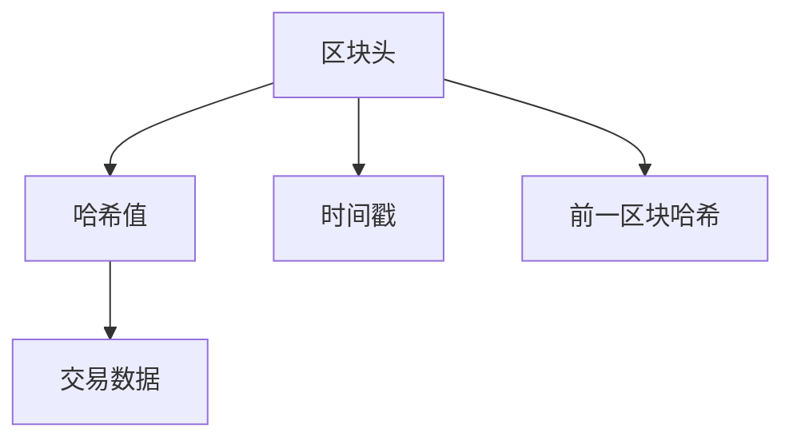
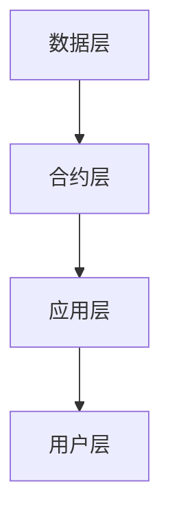

                 


# 第一部分: 智能合约与区块链技术概述

# 第1章: 区块链技术基础

## 1.1 区块链的基本概念
### 1.1.1 区块链的定义与特点
区块链是一种分布式账本技术，通过去中心化的方式记录数据，具有不可篡改、可追溯、去信任化等特性。

### 1.1.2 区块链的核心要素
- 数据结构：区块、链式结构、 Merkel树
- 共识机制：工作量证明（PoW）、权益证明（PoS）、拜占庭共识
- 加密技术：哈希函数、数字签名、椭圆曲线加密

### 1.1.3 区块链的分类与应用场景
- 按照去中心化程度：公有链、联盟链、私有链
- 按照性能：主链、侧链
- 典型应用：比特币、以太坊、供应链管理、智能合约

## 1.2 区块链的技术原理
### 1.2.1 区块链的数据结构
使用Merkle树实现高效的区块数据验证和存储，每个区块包含交易数据、时间戳、前一区块哈希等信息。



### 1.2.2 共识机制的原理
- 工作量证明（PoW）：通过计算找到有效的哈希值，确保网络安全。
- 权益证明（PoS）：根据节点持有代币的数量分配记账权。
- 拜占庭共识：通过数学算法实现 Byzantine Fault Tolerance（BFT）。

### 1.2.3 加密技术与安全性
- 哈希函数：确保数据完整性，常使用的哈希函数有 SHA-256、SHA-3 等。
- 数字签名：使用公钥和私钥对数据进行签名，确保数据来源和完整性。

## 1.3 区块链的去中心化特性
### 1.3.1 去中心化的优势
- 抗审查性：没有单点故障，难以被攻击。
- 增加信任：通过技术手段实现无需信任的多方协作。
- 提高透明度：所有交易记录公开可查。

### 1.3.2 去中心化的挑战
- 可扩展性问题：随着节点数和交易量的增加，网络性能下降。
- 交易速度问题：区块链的交易速度通常远低于传统数据库。
- 成本问题：某些共识机制（如PoW）需要大量计算资源。

### 1.3.3 去中心化与智能合约的关系
智能合约是区块链去中心化的一种实现方式，通过代码自动执行预设的规则，进一步增强区块链的去中心化特性。

## 1.4 本章小结
本章介绍了区块链的基本概念、技术原理和去中心化特性，为后续章节理解智能合约打下基础。

# 第2章: 智能合约的基本概念

## 2.1 智能合约的定义
### 2.1.1 智能合约的起源
智能合约的概念最早由尼克·萨博（Nick Szabo）在1994年提出。

### 2.1.2 智能合约的定义与特点
智能合约是一种自动执行的数字协议，存储在区块链上，通过代码自动执行预设的规则。

### 2.1.3 智能合约的核心要素
- 自动性：无需人工干预自动执行。
- 可编程性：可以根据需求编写不同的合约。
- 去信任性：通过区块链技术实现信任传递。

## 2.2 智能合约的工作原理
### 2.2.1 智能合约的执行流程
1. 初始化：智能合约部署到区块链上。
2. 触发：外部事件（如交易）触发智能合约执行。
3. 执行：智能合约代码按照预设规则处理事务。
4. 结束：交易完成或合约终止。

### 2.2.2 智能合约的触发条件
- 时间触发：在特定时间自动执行。
- 事件触发：特定事件发生后执行。
- 数值触发：达到某个数值条件后执行。

### 2.2.3 智能合约的编译与部署
- 编译：将智能合约代码（如Solidity）编译为 bytecode。
- 部署：将 byte code 部署到区块链上。
- 调用：通过交易调用智能合约的方法。

## 2.3 智能合约的优势与局限性
### 2.3.1 智能合约的优势
- 自动化：减少人为干预，提高效率。
- 透明性：所有交易记录在区块链上，可追溯。
- 可靠性：智能合约代码经过严格验证，减少人为错误。

### 2.3.2 智能合约的局限性
- 开发难度：需要掌握智能合约编程语言和区块链技术。
- 安全性：存在代码漏洞，可能导致重大损失。
- 扩展性：部分区块链平台的性能有限，影响智能合约的广泛应用。

### 2.3.3 智能合约的应用场景
- 金融领域：智能合约可以用于自动化支付、借贷等。
- 供应链管理：智能合约可以实现自动化的货物跟踪和支付。
- 版权保护：智能合约可以用于自动化的版权分发和支付。

## 2.4 本章小结
本章详细介绍了智能合约的基本概念、工作原理、优势与局限性，以及应用场景。

# 第3章: 区块链与智能合约的关系

## 3.1 区块链为智能合约提供信任机制
### 3.1.1 区块链的去中心化信任
区块链通过去中心化和加密技术，确保智能合约的执行环境安全可靠。

### 3.1.2 智能合约的自动执行
智能合约在区块链上自动执行，无需信任第三方机构。

### 3.1.3 区块链的安全性保障
区块链的去中心化和加密技术，确保智能合约的安全性和不可篡改性。

## 3.2 智能合约在区块链中的作用
### 3.2.1 智能合约作为区块链的智能层
智能合约是区块链的智能层，赋予区块链可编程的能力。

### 3.2.2 智能合约的自动化执行
智能合约通过代码自动执行，实现复杂的业务逻辑。

### 3.2.3 智能合约的可编程性
智能合约的可编程性，使得区块链能够支持多种应用场景。

## 3.3 区块链与智能合约的结合应用
### 3.3.1 智能合约在金融领域的应用
- 自动化支付：智能合约可以自动执行转账。
- 自动化借贷：智能合约可以自动处理借贷流程。

### 3.3.2 智能合约在供应链管理中的应用
- 货物跟踪：智能合约可以自动跟踪货物的位置和状态。
- 自动化支付：智能合约可以实现供应链中的自动支付。

### 3.3.3 智能合约在法律领域的应用
- 自动化合同：智能合约可以自动执行合同条款。
- 自动化纠纷处理：智能合约可以自动处理合同履行中的纠纷。

## 3.4 本章小结
本章探讨了区块链与智能合约的关系，分析了区块链如何为智能合约提供信任机制，以及智能合约在区块链中的作用和应用场景。

# 第4章: 智能合约的安全性与风险管理

## 4.1 智能合约的安全性问题
### 4.1.1 智能合约的安全漏洞
- 重入攻击：攻击者利用智能合约的漏洞，绕过授权直接调用合约函数。
- 拖延攻击：攻击者利用时间差，破坏合约的正常执行。

### 4.1.2 智能合约的代码漏洞
- 逻辑漏洞：智能合约的逻辑设计存在缺陷，导致合约执行不符合预期。
- 代码漏洞：智能合约代码中存在语法错误或逻辑错误，导致合约无法正常执行。

### 4.1.3 智能合约的治理问题
- 治理机制：智能合约的治理机制不完善，可能导致合约无法及时修复漏洞。
- 治理风险：智能合约的治理风险，可能导致合约被恶意篡改或攻击。

## 4.2 智能合约的安全风险管理
### 4.2.1 智能合约的安全测试
- 静态分析：通过代码静态分析，发现潜在的安全漏洞。
- 动态分析：通过模拟攻击，测试智能合约的抗攻击能力。

### 4.2.2 智能合约的漏洞修复
- 代码审计：对智能合约代码进行详细审查，发现并修复漏洞。
- 安全测试：通过安全测试，验证智能合约的安全性。

### 4.2.3 智能合约的安全规范
- 编码规范：制定智能合约编码规范，确保代码的安全性。
- 安全培训：对智能合约开发人员进行安全培训，提高开发人员的安全意识。

## 4.3 本章小结
本章分析了智能合约的安全性问题，探讨了智能合约的安全风险管理，提出了智能合约的安全测试和漏洞修复方法。

# 第5章: 智能合约的法律与伦理问题

## 5.1 智能合约的法律问题
### 5.1.1 智能合约的法律地位
智能合约作为一种数字化协议，其法律地位尚未明确。

### 5.1.2 智能合约的合规性
智能合约需要符合相关法律法规，确保其合法合规。

### 5.1.3 智能合约的纠纷处理
智能合约的纠纷处理需要通过法律手段，确保智能合约的合法性和可执行性。

## 5.2 智能合约的伦理问题
### 5.2.1 智能合约的透明性
智能合约的透明性可能导致隐私问题。

### 5.2.2 智能合约的公平性
智能合约的公平性需要通过合理的代码设计来实现。

### 5.2.3 智能合约的滥用风险
智能合约可能被滥用，用于非法活动，如洗钱、逃税等。

## 5.3 智能合约的法律与伦理风险管理
### 5.3.1 合规性管理
智能合约需要符合相关法律法规，确保其合法合规。

### 5.3.2 伦理管理
智能合约的设计需要考虑伦理因素，确保其公平性和透明性。

### 5.3.3 风险管理
智能合约的使用需要进行全面的风险管理，确保其安全性和合规性。

## 5.4 本章小结
本章分析了智能合约的法律与伦理问题，探讨了智能合约的法律地位、合规性、纠纷处理以及伦理问题，并提出了智能合约的法律与伦理风险管理策略。

# 第6章: 智能合约的未来发展

## 6.1 智能合约的技术发展趋势
### 6.1.1 智能合约的可扩展性
未来的智能合约需要更加高效、可扩展。

### 6.1.2 智能合约的可编程性
未来的智能合约需要支持更加复杂的业务逻辑。

### 6.1.3 智能合约的互操作性
未来的智能合约需要实现不同区块链平台之间的互操作性。

## 6.2 智能合约的应用场景扩展
### 6.2.1 智能合约在物联网中的应用
智能合约可以用于物联网设备的自动化管理。

### 6.2.2 智能合约在教育领域的应用
智能合约可以用于自动化学位认证、课程支付等。

### 6.2.3 智能合约在医疗领域的应用
智能合约可以用于自动化医疗数据共享、医疗支付等。

## 6.3 智能合约的挑战与机遇
### 6.3.1 智能合约的挑战
- 技术挑战：智能合约的技术复杂性需要进一步简化。
- 安全挑战：智能合约的安全性需要进一步提高。
- 法律挑战：智能合约的法律地位需要进一步明确。

### 6.3.2 智能合约的机遇
- 技术进步：智能合约技术的不断进步，为智能合约的应用提供了更多可能性。
- 市场需求：智能合约在多个行业的广泛应用，为智能合约的发展提供了市场动力。

## 6.4 本章小结
本章探讨了智能合约的未来发展，分析了智能合约的技术发展趋势、应用场景扩展、面临的挑战与机遇。

# 第7章: 智能合约的系统设计与实现

## 7.1 系统设计概述
### 7.1.1 系统目标
设计和实现一个基于智能合约的分布式应用系统。

### 7.1.2 系统需求
- 可扩展性：系统需要支持大量的智能合约部署和执行。
- 可靠性：系统需要保证智能合约的安全性和稳定性。
- 易用性：系统需要提供友好的用户界面和开发工具。

### 7.1.3 系统架构设计
采用分层架构，包括数据层、合约层、应用层和用户层。



## 7.2 智能合约的开发与部署
### 7.2.1 智能合约的开发流程
1. 需求分析：明确智能合约的功能需求。
2. 代码编写：使用Solidity语言编写智能合约代码。
3. 单元测试：对智能合约进行单元测试，确保代码正确性。
4. 部署测试：将智能合约部署到测试环境中，进行测试。
5. 上线部署：将智能合约部署到生产环境。

### 7.2.2 智能合约的部署与配置
- 部署环境：选择合适的区块链平台（如以太坊、Hyperledger等）。
- 配置参数：设置智能合约的初始参数和配置。

### 7.2.3 智能合约的版本管理
- 版本控制：使用版本控制系统（如Git）管理智能合约代码。
- 版本回滚：当智能合约出现问题时，可以回滚到之前的版本。

## 7.3 智能合约的运行与监控
### 7.3.1 智能合约的运行环境
- 区块链平台：智能合约运行在区块链平台上。
- 节点分布：智能合约在多个节点上分布式运行。

### 7.3.2 智能合约的运行监控
- 日志监控：监控智能合约的运行日志，发现异常情况。
- 性能监控：监控智能合约的运行性能，确保系统稳定。

### 7.3.3 智能合约的异常处理
- 错误处理：智能合约出现错误时，需要进行错误处理。
- 异常恢复：智能合约出现异常时，需要进行异常恢复。

## 7.4 智能合约的系统优化
### 7.4.1 智能合约的性能优化
- 代码优化：通过代码优化提高智能合约的执行效率。
- 并行处理：通过并行处理提高智能合约的执行速度。

### 7.4.2 智能合约的资源优化
- 资源分配：合理分配智能合约的资源，提高系统的资源利用率。
- 资源回收：智能合约不再使用时，及时释放资源。

### 7.4.3 智能合约的安全优化
- 安全审计：定期对智能合约进行安全审计，发现潜在的安全漏洞。
- 安全加固：通过代码加固提高智能合约的安全性。

## 7.5 本章小结
本章详细介绍了智能合约的系统设计与实现，包括系统架构设计、智能合约的开发与部署、运行与监控、系统优化等方面。

# 第8章: 智能合约的项目实战

## 8.1 项目背景与目标
### 8.1.1 项目背景
随着区块链技术的快速发展，智能合约的应用越来越广泛。

### 8.1.2 项目目标
通过开发一个基于智能合约的分布式应用系统，验证智能合约的技术可行性和应用潜力。

## 8.2 项目需求分析
### 8.2.1 功能需求
- 智能合约部署：支持智能合约的部署和配置。
- 智能合约调用：支持智能合约的调用和执行。
- 系统监控：监控智能合约的运行状态和性能。

### 8.2.2 非功能需求
- 性能需求：系统需要支持高并发的智能合约调用。
- 安全需求：系统需要保证智能合约的安全性和稳定性。
- 用户界面：系统需要提供友好的用户界面和开发工具。

## 8.3 项目系统设计
### 8.3.1 系统架构设计
采用分层架构，包括数据层、合约层、应用层和用户层。


### 8.3.2 智能合约的设计
- 合约功能：智能合约需要实现特定的业务逻辑。
- 合约接口：智能合约需要提供特定的接口供外部调用。

### 8.3.3 系统接口设计
- 接口定义：定义智能合约的调用接口。
- 接口实现：实现智能合约的调用接口。

## 8.4 项目核心实现
### 8.4.1 环境安装
- 安装区块链平台：如以太坊、Hyperledger等。
- 安装智能合约开发工具：如Remix、Solidity等。

### 8.4.2 智能合约实现
```solidity
// SPDX-License-Identifier: MIT
pragma solidity ^0.8.0;

contract HelloWorld {
    string public greeting = "Hello, World!";

    function setGreeting(string memory newGreeting) public {
        greeting = newGreeting;
    }

    function getGreeting() public view returns (string memory) {
        return greeting;
    }
}
```

### 8.4.3 系统实现
- 部署智能合约：将智能合约部署到区块链上。
- 调用智能合约：通过编写代码或使用工具调用智能合约的方法。

## 8.5 项目测试与部署
### 8.5.1 单元测试
对智能合约进行单元测试，确保代码正确性。

### 8.5.2 集成测试
对智能合约进行集成测试，确保系统整体功能正常。

### 8.5.3 部署上线
将智能合约部署到生产环境，正式投入使用。

## 8.6 项目小结
本章通过一个实际项目展示了智能合约的开发与实现过程，包括项目背景、需求分析、系统设计、核心实现、测试与部署等。

# 第9章: 智能合约的未来展望与最佳实践

## 9.1 智能合约的未来展望
### 9.1.1 技术进步
智能合约的技术将更加成熟，功能更加完善。

### 9.1.2 应用场景扩展
智能合约将在更多领域得到广泛应用，如物联网、医疗、教育等。

### 9.1.3 行业合作
智能合约的发展需要行业内的广泛合作，共同推动技术进步和应用落地。

## 9.2 智能合约的最佳实践
### 9.2.1 安全开发
智能合约开发需要遵循安全开发规范，避免代码漏洞。

### 9.2.2 合规性
智能合约的开发和应用需要遵守相关法律法规，确保合法合规。

### 9.2.3 用户教育
加强对智能合约的用户教育，提高用户的智能合约安全意识。

## 9.3 本章小结
本章展望了智能合约的未来发展方向，并提出了智能合约的最佳实践建议，为智能合约的未来发展提供了指导。

# 参考文献
- 区块链和智能合约相关的技术文档和论文。
- 相关书籍和研究报告。

# 索引
- 智能合约、区块链、去中心化、加密技术、共识机制等。

# 致谢
感谢所有参与本书编写和支持的人员和机构。

