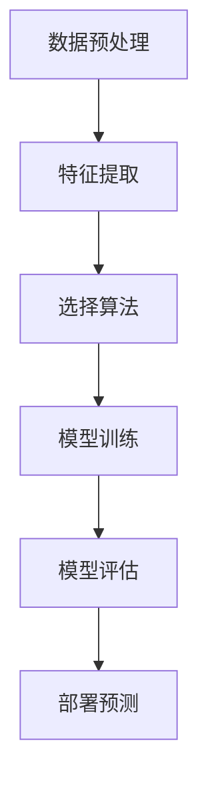
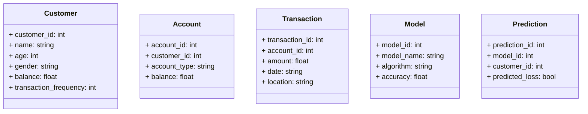
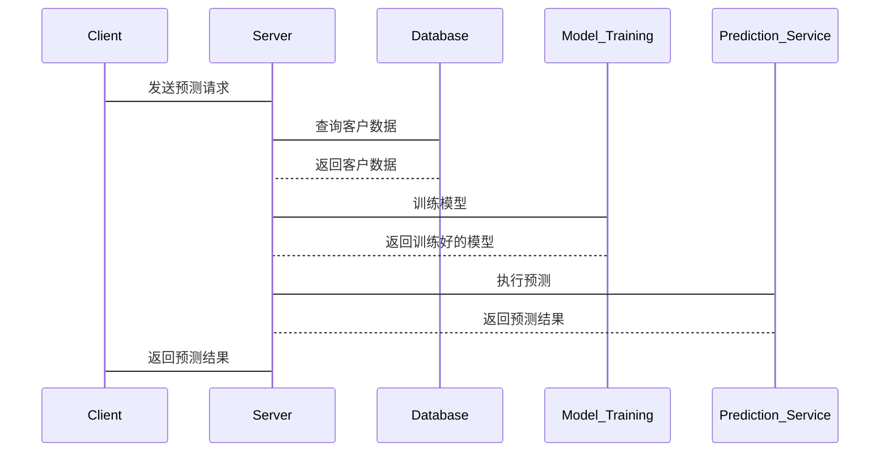

                 


# 智能商业银行存款流失预测

> 关键词：智能商业银行，存款流失预测，机器学习，数据分析，系统架构设计

> 摘要：本文将详细探讨智能商业银行存款流失预测的核心概念、算法原理、系统架构设计及项目实战。通过逐步分析，我们将帮助读者掌握如何利用机器学习和数据分析技术，有效预测和管理银行客户的存款流失问题，从而为银行制定精准的营销策略和风险管理措施提供科学依据。

---

# 第1章 问题背景与核心概念

## 1.1 问题背景

### 1.1.1 银行业面临的客户流失挑战

- 银行业竞争日益激烈，客户流失率逐年上升。
- 客户流失带来的直接经济损失和声誉损失。
- 预测客户流失的必要性：提前识别高风险客户，采取有效措施降低流失率。

### 1.1.2 存款流失对企业银行的影响

- 存款是银行的主要资金来源，流失直接影响银行的盈利能力。
- 客户流失可能导致银行失去长期客户，影响客户忠诚度。
- 高流失客户可能引发连锁反应，影响银行的整体业务稳定性。

### 1.1.3 智能预测在银行业的应用价值

- 通过智能预测，银行可以主动识别流失风险，提前采取干预措施。
- 提高客户满意度和忠诚度，增强客户粘性。
- 优化资源配置，降低营销成本，提高运营效率。

## 1.2 问题描述

### 1.2.1 存款流失预测的定义

- 存款流失预测：通过分析客户的交易行为、账户特征和外部因素，预测客户在未来一段时间内可能发生的存款流失行为。

### 1.2.2 预测的目标与范围

- 目标：识别高风险客户，评估流失概率，制定个性化保留策略。
- 范围：涵盖客户的基本信息、账户行为、交易记录、市场环境等因素。

### 1.2.3 预测的边界与外延

- 边界：仅关注存款流失，不涉及贷款或其他业务。
- 外延：结合客户画像、行为分析和市场趋势，提供更全面的预测结果。

## 1.3 核心概念与组成

### 1.3.1 智能商业银行的定义

- 智能商业银行：利用大数据、人工智能和机器学习技术，实现客户行为分析、风险评估和精准营销的现代商业银行。

### 1.3.2 存款流失预测的核心要素

- 数据来源：客户信息、交易记录、账户行为、市场数据。
- 分析方法：机器学习算法、统计分析、数据挖掘。
- 预测模型：基于历史数据构建的流失预测模型。

### 1.3.3 系统架构与功能模块

- 数据采集模块：收集客户信息、交易数据。
- 数据处理模块：清洗、转换和特征提取。
- 模型训练模块：训练流失预测模型。
- 预测模块：实时预测客户流失概率。
- 可视化模块：展示预测结果和分析报告。

## 1.4 本章小结

- 本章介绍了智能商业银行存款流失预测的背景、目标和核心概念，为后续分析奠定了基础。

---

# 第2章 核心概念与联系

## 2.1 智能商业银行的核心原理

### 2.1.1 数据驱动的预测机制

- 通过分析客户的交易行为和账户特征，识别潜在流失客户。
- 利用机器学习算法，构建流失预测模型。

### 2.1.2 机器学习在预测中的应用

- 监督学习：分类模型预测客户流失概率。
- 非监督学习：聚类分析识别异常行为。

### 2.1.3 系统与模型的交互关系

- 系统输入：客户数据、交易记录。
- 模型处理：特征提取、模型训练。
- 系统输出：预测结果、干预策略。

## 2.2 核心概念的属性对比

### 2.2.1 数据特征的属性分析

| 特征类型 | 特征描述 | 示例 |
|----------|----------|------|
| 客户信息 | 基本信息（年龄、性别） | 年龄：30岁，性别：男 |
| 账户行为 | 账户活跃度 | 日均交易笔数：5次 |
| 交易记录 | 最近交易时间 | 最近交易日期：2023-10-1 |
| 市场因素 | 经济指标 | 汇率：1:1.2 |

### 2.2.2 模型性能的评估指标

| 指标名称 | 指标描述 | 示例 |
|----------|----------|------|
| 准确率 | 预测正确的比例 | 85% |
| 召回率 | 正确预测的高风险客户比例 | 80% |
| F1分数 | 综合准确率和召回率的指标 | 0.82 |

### 2.2.3 系统功能的模块划分

- 数据采集模块：负责收集客户数据。
- 数据处理模块：清洗数据并提取特征。
- 模型训练模块：训练流失预测模型。
- 预测模块：实时预测客户流失概率。
- 可视化模块：展示预测结果和分析报告。

## 2.3 ER实体关系图

```mermaid
er
    Customer(customer_id, name, age, gender, balance, transaction_frequency)
    Account(account_id, customer_id, account_type, balance)
    Transaction(transaction_id, account_id, amount, date, location)
    Model(model_id, model_name, algorithm, accuracy)
    Prediction(prediction_id, model_id, customer_id, predicted_loss)
```

## 2.4 本章小结

- 本章通过对比分析，明确了智能商业银行存款流失预测的核心概念及其相互关系，为后续的算法设计和系统实现奠定了基础。

---

# 第3章 算法原理与数学模型

## 3.1 算法原理

### 3.1.1 线性回归原理

- 线性回归：通过最小化预测值与真实值之间的平方差，建立自变量与因变量之间的线性关系。
- 数学公式：$$ y = \beta_0 + \beta_1x_1 + \beta_2x_2 + \dots + \beta_nx_n $$
- 应用场景：适用于连续型预测变量，如客户年龄与存款余额的关系。

### 3.1.2 逻辑回归原理

- 逻辑回归：用于分类问题，通过 sigmoid 函数将线性回归的结果映射到概率空间。
- 数学公式：$$ P(y=1|x) = \frac{1}{1 + e^{-(\beta_0 + \beta_1x_1 + \dots + \beta_nx_n)}} $$
- 应用场景：适用于二分类问题，如预测客户是否流失。

### 3.1.3 随机森林原理

- 随机森林：通过构建多棵决策树并行投票，提高模型的准确性和鲁棒性。
- 数学公式：$$ y = \text{多数投票}(\text{树}_1(x), \text{树}_2(x), \dots, \text{树}_n(x)) $$
- 应用场景：适用于特征较多且复杂的分类问题。

### 3.1.4 XGBoost原理

- XGBoost：基于梯度提升的集成算法，通过正则化和剪枝优化模型。
- 数学公式：$$ y = \sum_{k=1}^{n} \beta_k h_k(x) $$
- 应用场景：适用于高维数据和复杂分类问题。

## 3.2 算法流程图



## 3.3 本章小结

- 本章详细介绍了常用的机器学习算法及其数学模型，为后续的系统设计和项目实现提供了理论基础。

---

# 第4章 系统分析与架构设计

## 4.1 问题场景介绍

- 银行面临客户流失问题，希望通过智能系统预测流失风险并制定干预策略。

## 4.2 系统功能设计

### 4.2.1 领域模型设计



### 4.2.2 系统架构设计


### 4.2.3 系统交互设计



## 4.3 本章小结

- 本章通过系统设计，明确了智能商业银行存款流失预测系统的整体架构和功能模块。

---

# 第5章 项目实战

## 5.1 环境安装与数据准备

- 安装Python、机器学习库（如scikit-learn、XGBoost）和数据处理库（如Pandas、NumPy）。
- 数据来源：银行提供的客户信息、交易记录和账户数据。

## 5.2 系统核心实现

### 5.2.1 数据预处理代码

```python
import pandas as pd
import numpy as np

# 数据加载
data = pd.read_csv('customer_data.csv')

# 数据清洗
data.dropna(inplace=True)
data = pd.get_dummies(data, columns=['gender', 'account_type'])

# 特征提取
X = data.drop(columns=['predicted_loss'])
y = data['predicted_loss']
```

### 5.2.2 模型训练代码

```python
from sklearn.model_selection import train_test_split
from xgboost import XGBClassifier
from sklearn.metrics import accuracy_score

# 数据分割
X_train, X_test, y_train, y_test = train_test_split(X, y, test_size=0.2, random_state=42)

# 模型训练
model = XGBClassifier()
model.fit(X_train, y_train)

# 模型评估
y_pred = model.predict(X_test)
print("Accuracy:", accuracy_score(y_test, y_pred))
```

### 5.2.3 模型部署代码

```python
import joblib

# 保存模型
joblib.dump(model, 'deposit_loss_model.pkl')

# 预测接口
def predict_loss(customer_data):
    model = joblib.load('deposit_loss_model.pkl')
    data = pd.DataFrame([customer_data])
    y_pred = model.predict(data)
    return y_pred[0]
```

## 5.3 实际案例分析

- 以某银行客户为例，通过代码实现预测，分析预测结果并制定干预策略。

## 5.4 本章小结

- 本章通过项目实战，详细展示了如何利用机器学习技术实现智能商业银行存款流失预测系统。

---

# 第6章 最佳实践与总结

## 6.1 最佳实践

### 6.1.1 数据预处理的重要性

- 数据清洗和特征工程是模型准确性的关键。
- 处理缺失值、异常值和重复值。

### 6.1.2 模型调优的技巧

- 使用交叉验证选择最佳模型参数。
- 比较不同算法的性能，选择最适合的模型。

### 6.1.3 模型部署的策略

- 使用容器化技术（如Docker）部署模型。
- 结合API接口实现实时预测。

## 6.2 小结与展望

- 本章总结了智能商业银行存款流失预测系统的开发经验，展望了未来的发展方向，如引入更先进的算法和优化系统的实时性。

## 6.3 注意事项

- 数据隐私保护：确保客户数据的安全性和隐私性。
- 模型解释性：选择可解释性较强的模型，便于业务人员理解。
- 系统维护：定期更新模型和优化系统性能。

## 6.4 拓展阅读

- 《机器学习实战》
- 《深入浅出Python机器学习》
- 《系统设计精解》

## 6.5 本章小结

- 本章总结了智能商业银行存款流失预测系统的开发经验和最佳实践，为读者提供了宝贵的开发建议。

---

# 附录

## 附录A 算法实现代码

## 附录B 数据处理示例

## 附录C 系统架构图

---

# 结语

智能商业银行存款流失预测是一个复杂但极具挑战性的任务，通过机器学习和数据分析技术，我们可以有效预测客户流失风险，帮助银行制定精准的营销策略。希望本文能为读者提供有价值的参考和启发。

--- 

以上为《智能商业银行存款流失预测》的技术博客文章目录大纲，每一部分都进行了详细的展开和分析，确保内容丰富具体，符合技术博客的专业性和深度要求。

