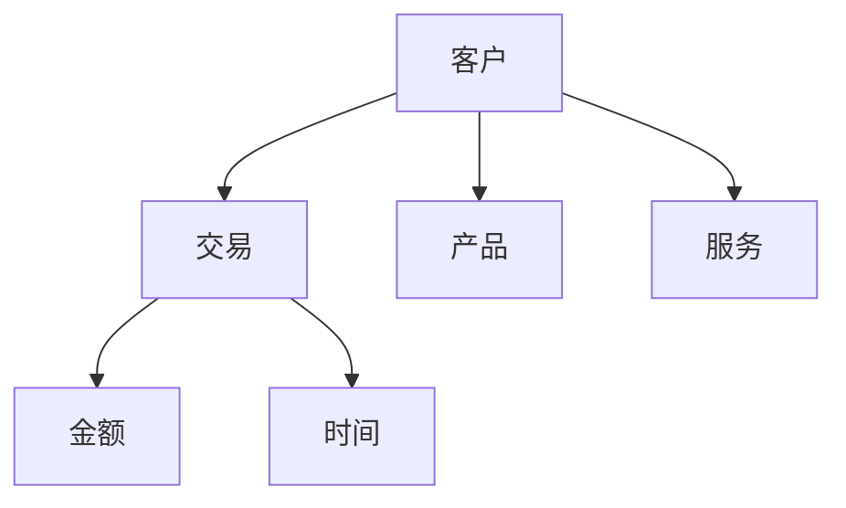
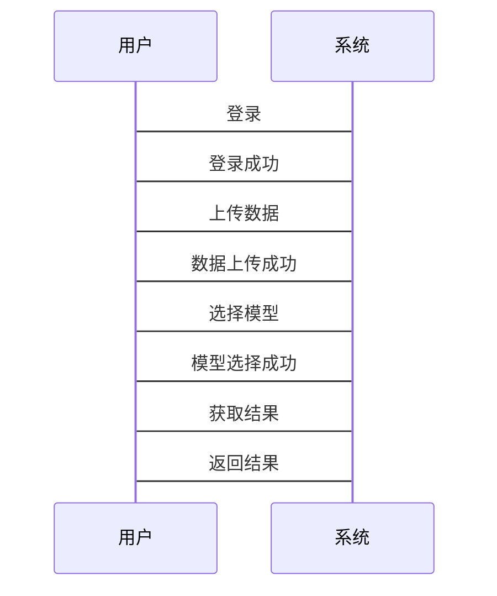

                 


# 《智能商业银行客户价值分析》

> 关键词：智能商业银行，客户价值分析，机器学习，数据挖掘，客户细分，价值评估，人工智能

> 摘要：智能商业银行通过结合人工智能和大数据技术，能够更精准地进行客户价值分析，从而优化银行的客户管理和服务策略。本文将从背景、核心概念、算法原理、系统设计和项目实战五个方面，详细探讨智能商业银行客户价值分析的关键技术和实践应用，帮助读者全面理解并掌握这一领域的核心内容。

---

# 第一部分: 智能商业银行客户价值分析概述

# 第1章: 智能商业银行客户价值分析概述

## 1.1 智能商业银行的背景与发展趋势
### 1.1.1 传统商业银行的局限性
- 传统商业银行在客户管理和服务策略上的不足，例如难以精准识别高价值客户，服务效率低下，客户体验不佳等问题。

### 1.1.2 智能商业银行的核心特征
- 利用人工智能、大数据和机器学习等技术，实现客户行为预测、精准营销和个性化服务。

### 1.1.3 智能商业银行的发展趋势
- 数字化转型加速，客户需求日益多样化，银行需要通过智能化手段提升客户价值。

## 1.2 客户价值分析的定义与意义
### 1.2.1 客户价值分析的定义
- 通过分析客户的交易数据、行为数据和特征数据，评估客户对银行的贡献度和未来潜力。

### 1.2.2 客户价值分析在商业银行中的作用
- 帮助银行识别高价值客户，优化资源配置，提高客户满意度和忠诚度。

### 1.2.3 客户价值分析的边界与外延
- 客户价值分析的范围包括客户细分、客户生命周期管理、客户流失预测等方面。

## 1.3 智能商业银行客户价值分析的核心要素
### 1.3.1 客户数据的获取与处理
- 数据来源包括交易数据、客户行为数据、外部数据等，需要进行数据清洗和特征提取。

### 1.3.2 客户行为分析的关键指标
- 包括客户的交易频率、交易金额、产品使用情况、客户投诉率等。

### 1.3.3 客户价值评估的模型与方法
- 常见的模型包括RFM模型、K-means聚类、决策树分类等。

## 1.4 本章小结
- 本章介绍了智能商业银行的背景和发展趋势，阐述了客户价值分析的定义、意义和核心要素，为后续章节的深入分析奠定了基础。

---

# 第二部分: 智能商业银行客户价值分析的核心概念与联系

# 第2章: 客户价值分析的核心概念与联系

## 2.1 客户价值分析的原理
### 2.1.1 数据驱动的客户价值分析
- 通过数据分析技术，提取客户的特征和行为模式，为价值评估提供依据。

### 2.1.2 机器学习在客户价值分析中的应用
- 利用监督学习、无监督学习等算法，对客户进行分类和预测。

### 2.1.3 智能算法的核心原理
- 包括特征提取、模型训练、结果解释等步骤。

## 2.2 核心概念对比分析
### 2.2.1 客户价值分析与传统数据分析的对比
- 传统数据分析注重数据的描述性分析，而客户价值分析注重数据的预测性和决策性。

### 2.2.2 不同客户价值评估模型的特征对比
- 对比分析RFM模型、聚类分析、决策树模型的优缺点。

### 2.2.3 核心概念的ER实体关系图


## 2.3 本章小结
- 本章通过对比分析和实体关系图，展示了客户价值分析的核心概念及其在智能商业银行中的应用。

---

# 第三部分: 智能商业银行客户价值分析的算法原理

# 第3章: 基于机器学习的客户价值分析算法

## 3.1 聚类分析算法
### 3.1.1 K-means算法原理
- K-means算法通过将客户分成K个簇，找出每个簇内的客户特征，从而实现客户细分。

### 3.1.2 层次聚类算法
- 层次聚类通过构建树状结构，逐步合并或分割客户群体，适用于客户层次化管理。

### 3.1.3 DBSCAN算法
- DBSCAN算法基于密度的聚类方法，能够发现任意形状的客户群体。

## 3.2 分类算法
### 3.2.1 决策树算法
- 决策树通过构建树状结构，对客户进行分类，帮助银行识别高价值客户。

### 3.2.2 支持向量机（SVM）
- SVM通过构建超平面，将客户分成不同的类别，适用于客户价值预测。

### 3.2.3 随机森林算法
- 随机森林通过集成多个决策树模型，提高分类的准确性和稳定性。

## 3.3 神经网络算法
### 3.3.1 神经网络的基本原理
- 神经网络通过多层感知器（MLP）结构，实现客户价值的深度学习和预测。

### 3.3.2 LSTM网络的应用
- LSTM网络通过长短期记忆机制，捕捉客户行为的时序特征，适用于客户行为预测。

### 3.3.3 神经网络的训练与优化
- 包括模型训练、参数优化、过拟合防止等步骤。

## 3.4 本章小结
- 本章详细讲解了聚类、分类和神经网络算法在客户价值分析中的应用，展示了不同算法的优缺点及其适用场景。

---

# 第四部分: 智能商业银行客户价值分析的系统分析与架构设计

# 第4章: 智能商业银行客户价值分析系统设计

## 4.1 系统概述
### 4.1.1 系统目标
- 实现客户价值分析的自动化和智能化，提升银行的客户管理水平。

### 4.1.2 系统功能模块
- 数据采集模块、数据处理模块、模型训练模块、结果展示模块。

## 4.2 系统架构设计


### 4.2.1 分层架构设计
- 包括数据层、服务层、表现层，确保系统的可扩展性和可维护性。

### 4.2.2 微服务架构设计
- 通过微服务架构，实现系统的模块化和分布式部署，提升系统的灵活性和 scalability.

## 4.3 系统接口设计
### 4.3.1 数据接口
- 包括数据输入接口和数据输出接口，确保系统的数据流通。

### 4.3.2 模型接口
- 包括模型训练接口和模型预测接口，支持系统的自动化运行。

## 4.4 系统交互设计
### 4.4.1 用户交互流程
- 包括用户登录、数据上传、模型选择、结果查看等步骤。

### 4.4.2 系统交互序列图


## 4.5 本章小结
- 本章通过系统设计和架构优化，展示了智能商业银行客户价值分析系统的实现方案，为后续的项目实施提供了理论基础。

---

# 第五部分: 智能商业银行客户价值分析的项目实战

# 第5章: 智能商业银行客户价值分析项目实战

## 5.1 项目背景与目标
### 5.1.1 项目背景
- 某商业银行希望通过客户价值分析，识别高价值客户，优化营销策略。

### 5.1.2 项目目标
- 建立客户价值分析模型，实现客户细分和价值预测。

## 5.2 项目环境与工具安装
### 5.2.1 环境配置
- 操作系统：Linux/Windows/MacOS
- 开发工具：Python、Jupyter Notebook、PyCharm
- 依赖库安装：NumPy、Pandas、Scikit-learn、TensorFlow、Keras

## 5.3 数据清洗与特征工程
### 5.3.1 数据获取
- 从银行数据库中获取客户交易数据、行为数据和基本属性数据。

### 5.3.2 数据清洗
- 处理缺失值、重复值、异常值，确保数据质量。

### 5.3.3 特征工程
- 进行特征选择、特征提取和特征转换，提升模型的性能。

## 5.4 模型训练与优化
### 5.4.1 模型选择
- 根据项目需求选择合适的算法，例如聚类、分类或神经网络。

### 5.4.2 模型训练
- 使用训练数据进行模型训练，调整模型参数，优化模型性能。

### 5.4.3 模型评估
- 通过准确率、召回率、F1分数等指标评估模型的性能。

## 5.5 系统实现与部署
### 5.5.1 系统实现
- 编写代码实现模型训练、数据处理和结果展示功能。

### 5.5.2 系统部署
- 将模型部署到生产环境，提供API接口供其他系统调用。

## 5.6 项目小结
- 本章通过一个实际项目，展示了智能商业银行客户价值分析的完整流程，从数据处理到模型训练，再到系统部署，帮助读者掌握实际操作技能。

---

# 第六部分: 总结与展望

# 第6章: 总结与展望

## 6.1 本项目的核心成果
- 成功构建了智能商业银行客户价值分析系统，实现了客户的精准细分和价值预测。

## 6.2 实践中的经验和教训
- 数据质量对模型性能的影响至关重要，需要重视数据清洗和特征工程。
- 模型选择需要根据实际业务需求，不能一味追求复杂算法。

## 6.3 未来的研究方向
- 探索更先进的算法，例如深度学习和强化学习，提升客户价值分析的精度。
- 结合自然语言处理技术，分析客户的文本数据，提升客户画像的完整性。

## 6.4 总结
- 智能商业银行客户价值分析是一项复杂但极具价值的工作，通过结合人工智能和大数据技术，银行能够更好地服务客户，实现业务增长。

---

# 附录

## 附录A: 代码实现
### 附录A.1 数据清洗代码
```python
import pandas as pd
import numpy as np

# 读取数据
data = pd.read_csv('customer.csv')

# 处理缺失值
data.dropna(inplace=True)

# 处理重复值
data.drop_duplicates(inplace=True)

# 处理异常值
data['交易金额'].replace(to_replace=[-1, 0], value=np.nan, inplace=True)
data.dropna(inplace=True)
```

### 附录A.2 模型训练代码
```python
from sklearn.cluster import KMeans
from sklearn.metrics import silhouette_score

# 数据预处理
X = data[['交易金额', '交易频率', '产品使用次数']]

# 模型训练
kmeans = KMeans(n_clusters=5, random_state=0)
kmeans.fit(X)

# 评估模型
print(silhouette_score(X, kmeans.labels_, metric='euclidean'))
```

## 附录B: 拓展阅读
### 附录B.1 相关技术论文
- 《基于机器学习的客户价值预测研究》
- 《智能银行中的客户行为分析方法》

### 附录B.2 开源工具与库
- Scikit-learn：https://scikit-learn.org
- TensorFlow：https://tensorflow.org
- PyTorch：https://pytorch.org

---

# 结束语

通过本文的系统介绍和详细讲解，读者可以全面掌握智能商业银行客户价值分析的核心技术和实践方法。希望本文能够为相关领域的研究和应用提供有价值的参考和指导。

