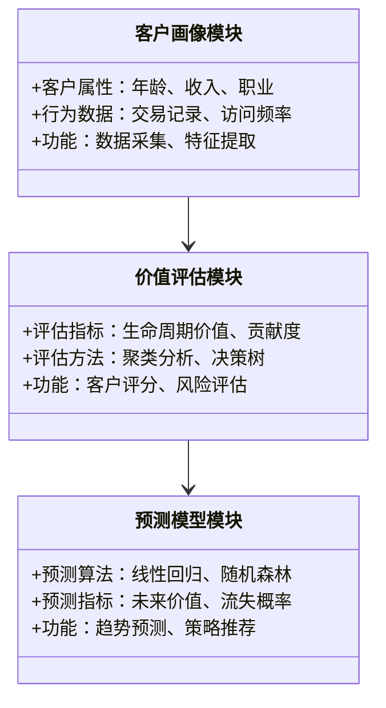
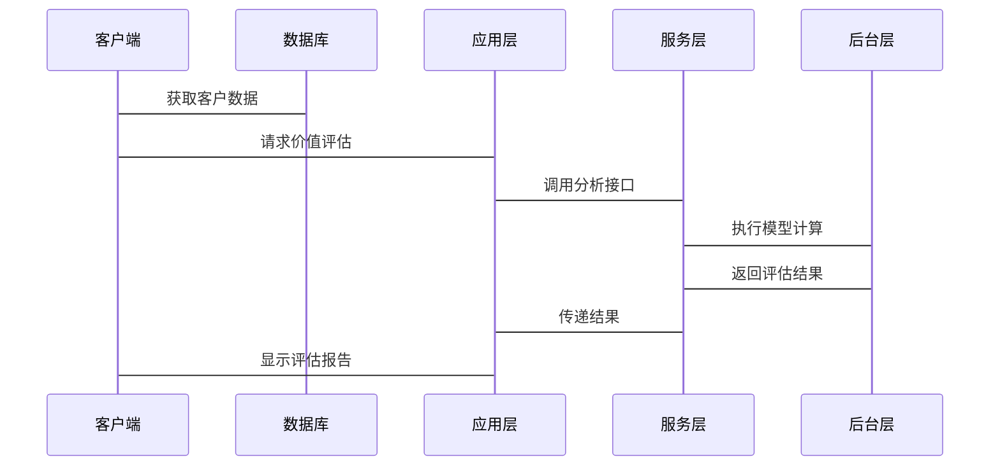

                 


# 智能商业银行客户价值分析系统

## 关键词：
智能银行、客户价值分析、人工智能、大数据分析、预测模型、系统架构、项目实战

## 摘要：
本文深入探讨了智能商业银行客户价值分析系统的构建与应用，结合人工智能和大数据分析技术，系统地介绍了客户价值分析的核心概念、算法原理、系统架构设计及项目实战。文章详细阐述了从数据采集到模型构建的全过程，并通过实际案例分析展示了系统的应用价值，为商业银行提升客户管理和服务质量提供了理论和实践指导。

---

## 第四章 系统分析与架构设计方案

### 4.1 问题场景介绍
商业银行在客户价值分析中面临诸多挑战，如数据分散、分析效率低、实时性差等。传统方法难以处理海量数据和复杂关系，导致客户画像不准确，价值评估不够精细。智能系统通过整合多源数据，利用先进算法，实现客户价值的精准分析和实时预测，有效解决这些问题。

### 4.2 系统功能设计
系统功能模块包括：
- **客户画像模块**：采集并分析客户的年龄、收入、职业等属性，结合交易记录、访问频率等行为数据，构建详细的客户画像。
- **价值评估模块**：通过聚类分析和决策树等算法，评估客户的生命周期价值和贡献度，识别高价值客户。
- **预测模型模块**：使用线性回归和随机森林等算法，预测客户未来价值和流失概率，制定精准营销策略。



### 4.3 系统架构设计
采用分层架构，各层职责分明：


### 4.4 系统接口设计
- 数据接口：负责与数据库交互，获取客户数据。
- 分析接口：提供价值评估和预测模型的调用接口。

### 4.5 系统交互设计
展示客户数据采集、评估结果展示的交互流程：



---

## 第五章 项目实战

### 5.1 环境安装与配置
- **工具安装**：安装Python、Jupyter Notebook、TensorFlow、Scikit-learn等。
- **数据准备**：获取商业银行客户数据，包括基本属性、交易记录等。

### 5.2 核心功能实现
以客户画像模块为例，实现数据预处理和特征提取：

```python
import pandas as pd
from sklearn.preprocessing import StandardScaler

# 数据加载
data = pd.read_csv('customer_data.csv')

# 数据预处理
# 假设'age', 'income', 'transactions'是关键特征
features = data[['age', 'income', 'transactions']]

# 标准化处理
scaler = StandardScaler()
features_scaled = scaler.fit_transform(features)

print(features_scaled)
```

### 5.3 代码解读与分析
上述代码展示了数据预处理的步骤，包括加载数据、选择特征和标准化处理。标准化确保了各特征在模型中的权重一致，提升算法性能。

### 5.4 实际案例分析
使用客户数据训练聚类模型，识别高价值客户群，并制定针对性营销策略。

---

## 第六章 最佳实践、小结、注意事项与拓展阅读

### 6.1 最佳实践
- 数据预处理是关键，需注意数据清洗和特征选择。
- 模型选择应结合业务需求，考虑计算效率和准确性。

### 6.2 小结
本文系统介绍了智能商业银行客户价值分析系统的构建，从背景到架构，从算法到实战，全面覆盖了系统开发的各个环节，展示了其在提升客户管理中的重要价值。

### 6.3 注意事项
- 数据隐私保护是重点，需遵守相关法律法规。
- 模型的可解释性需重视，避免“黑箱”操作。

### 6.4 拓展阅读
- 《Python机器学习实战》：深入学习机器学习算法。
- 《大数据分析与应用》：了解大数据在金融领域的应用。

---

## 总结

智能商业银行客户价值分析系统通过整合先进的人工智能和大数据分析技术，为客户价值的精准评估和预测提供了有力工具。本文系统地探讨了系统的构建过程，为商业银行提升客户管理能力提供了理论支持和实践指导。未来，随着技术的不断进步，智能系统将在金融领域发挥更大作用，为客户和银行创造更多价值。

