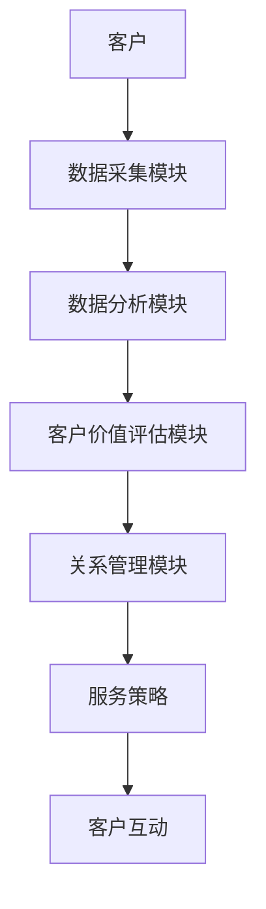
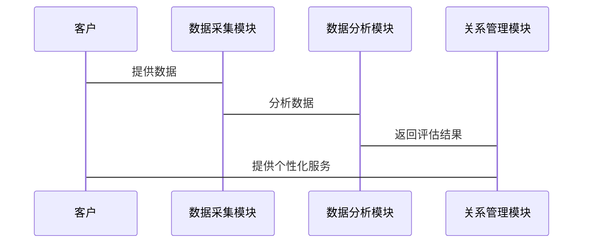
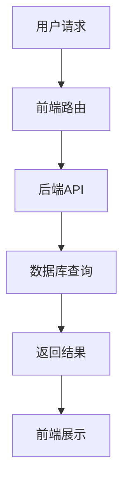

                 


# 智能商业银行客户价值评估与关系管理

## 关键词：
智能商业银行，客户价值评估，关系管理，人工智能，大数据，RFM模型，聚类分析

## 摘要：
本文探讨了智能商业银行中客户价值评估与关系管理的创新方法，结合AI技术和大数据分析，通过RFM模型和聚类算法，优化客户管理策略。文章详细分析了系统设计、算法原理及项目实战，为商业银行的智能化转型提供了理论支持和实践指导。

---

## 正文

### 第一部分：智能商业银行客户价值评估与关系管理概述

#### 第1章：智能商业银行客户价值评估与关系管理背景

##### 1.1 智能商业银行的定义与特点
- **1.1.1 智能商业银行的定义**  
  智能商业银行是通过AI技术优化传统银行业务的金融机构，具备数据驱动、智能决策和个性化服务的特点。

- **1.1.2 智能商业银行的核心特点**  
  - 数据驱动决策：利用大数据分析客户行为，优化服务策略。  
  - 智能化服务：通过AI算法实现自动化、个性化的客户交互。  
  - 高效运营：提升业务处理效率，降低运营成本。

- **1.1.3 智能商业银行与传统商业银行的区别**  
  - 技术基础：传统银行依赖人工处理，智能银行则借助AI和大数据技术。  
  - 服务模式：传统银行服务标准化，智能银行提供个性化、动态化的服务。  
  - 运营效率：智能银行通过自动化流程提高效率，降低成本。

##### 1.2 客户价值评估与关系管理的重要性
- **1.2.1 客户价值评估的定义**  
  通过数据分析，评估客户对银行的贡献度，帮助银行制定精准的营销策略。

- **1.2.2 客户关系管理的定义**  
  通过与客户建立、维护和强化关系，提高客户忠诚度和满意度的过程。

- **1.2.3 智能商业银行中客户价值评估与关系管理的结合**  
  智能银行利用客户价值评估结果，动态调整关系管理策略，优化客户体验和银行收益。

##### 1.3 问题背景与问题描述
- **1.3.1 传统商业银行客户管理的痛点**  
  - 数据分析能力有限，难以精准评估客户价值。  
  - 客户分层粗放，难以制定个性化服务策略。  
  - 缺乏实时反馈机制，客户体验不佳。

- **1.3.2 智能化客户管理的需求**  
  - 提高数据分析能力，实现精准客户画像。  
  - 利用AI技术，优化客户分层和关系管理。  
  - 实现动态调整，提升客户满意度和忠诚度。

- **1.3.3 智能商业银行客户价值评估与关系管理的目标**  
  通过AI技术，优化客户分层、服务策略和关系维护，提升客户价值和银行收益。

##### 1.4 问题解决与边界外延
- **1.4.1 通过AI技术解决客户管理问题的方法**  
  - 数据收集与清洗：整合多源数据，建立客户数据库。  
  - 模型构建：利用机器学习算法，构建客户价值评估模型。  
  - 策略优化：根据评估结果，动态调整客户关系管理策略。

- **1.4.2 智能商业银行客户管理的边界**  
  - 数据范围：仅限于客户行为数据，不涉及交易数据。  
  - 应用场景：主要用于客户分层和营销策略制定。  
  - 技术限制：AI算法的选择和实现受到数据质量和模型复杂度的限制。

- **1.4.3 客户价值评估与关系管理的外延**  
  - 应用范围：可扩展至风险评估、产品推荐等领域。  
  - 技术扩展：结合区块链技术，提升数据安全性和透明度。  
  - 战略层面：整合到整体业务战略中，推动银行数字化转型。

##### 1.5 核心概念与组成要素
- **1.5.1 核心概念的结构**  
  客户价值评估与关系管理由数据采集、数据分析、模型构建、策略制定和执行反馈五个环节构成。

- **1.5.2 核心要素的组成**  
  - 数据源：客户行为数据、交易数据、反馈数据。  
  - 分析工具：机器学习算法、统计分析工具。  
  - 管理策略：客户分层策略、个性化服务策略、动态调整策略。  
  - 执行渠道：线上渠道（App、网站）和线下渠道（柜面、客服）。  

- **1.5.3 核心概念之间的关系**  
  数据驱动分析，分析结果指导策略制定，策略执行通过渠道反馈，形成闭环优化。

---

#### 第2章：客户价值评估的核心概念与联系

##### 2.1 客户价值评估的原理
- **2.1.1 价值评估的基本原理**  
  客户价值评估基于客户的历史行为数据，预测其未来贡献，分为数据收集、特征提取、模型训练和评估预测四个步骤。

- **2.1.2 AI在客户价值评估中的应用**  
  利用聚类分析、回归分析和分类算法，识别高价值客户，预测客户流失风险。

- **2.1.3 数据驱动的客户价值评估方法**  
  通过数据挖掘技术，提取关键特征，构建客户价值评估模型。

##### 2.2 核心概念的属性特征对比
- **2.2.1 对比表格展示**

| 概念       | 数据驱动 | 人工评估 | 综合评估 |
|------------|----------|----------|----------|
| **客户价值评估** | 高效精准 | 粗放低效 | 平衡效率与准确性 |
| **关系管理** | 数据驱动 | 依赖经验 | 个性化动态调整 |

##### 2.3 ER实体关系图
```mermaid
erDiagram
    customer [客户] {
        id : integer
        name : string
        age : integer
        gender : string
        transactionHistory : string
        riskScore : float
    }
    transaction [交易] {
        id : integer
        customerId : integer
        amount : float
        time : datetime
    }
    interaction [互动] {
        id : integer
        customerId : integer
        type : string
        time : datetime
    }
    customer <---- transaction : "参与的交易"
    customer <---- interaction : "参与的互动"
```

---

#### 第3章：客户关系管理的核心概念与联系

##### 3.1 客户关系管理的原理
- **3.1.1 数据驱动的客户关系管理**  
  利用客户行为数据，识别高潜力客户，制定个性化服务策略。

- **3.1.2 AI在客户关系管理中的应用**  
  通过自然语言处理技术，分析客户反馈，优化服务质量。

##### 3.2 核心概念的属性特征对比
- **3.2.1 对比表格展示**

| 概念       | 数据驱动 | 人工评估 | 综合评估 |
|------------|----------|----------|----------|
| **客户关系管理** | 高效精准 | 粗放低效 | 平衡效率与准确性 |
| **客户价值评估** | 数据驱动 | 依赖经验 | 个性化动态调整 |

##### 3.3 ER实体关系图
```mermaid
erDiagram
    customer [客户] {
        id : integer
        name : string
        age : integer
        gender : string
        transactionHistory : string
        riskScore : float
    }
    interaction [互动] {
        id : integer
        customerId : integer
        type : string
        time : datetime
    }
    feedback [反馈] {
        id : integer
        customerId : integer
        score : integer
        comment : string
        time : datetime
    }
    customer <---- interaction : "参与的互动"
    customer <---- feedback : "参与的反馈"
```

---

#### 第4章：智能商业银行客户价值评估与关系管理的系统分析

##### 4.1 系统功能设计
- **4.1.1 数据采集模块**  
  从交易系统、CRM系统中获取客户行为数据。

- **4.1.2 数据分析模块**  
  使用机器学习算法，构建客户价值评估模型，识别高价值客户。

- **4.1.3 关系管理模块**  
  根据评估结果，制定个性化服务策略，优化客户关系。

##### 4.2 系统架构设计


##### 4.3 接口设计与交互流程
- **4.3.1 接口设计**  
  - 数据采集接口：从交易系统获取数据。  
  - 分析结果接口：返回客户评估结果。  
  - 服务策略接口：根据评估结果制定策略。

- **4.3.2 交互流程图**


---

#### 第5章：智能商业银行客户价值评估与关系管理的项目实战

##### 5.1 环境安装与配置
- **5.1.1 安装Python**  
  下载并安装Python 3.x，确保环境变量配置正确。

- **5.1.2 安装必要的库**  
  使用pip安装numpy、pandas、scikit-learn、matplotlib。

##### 5.2 核心代码实现
```python
import pandas as pd
from sklearn.cluster import KMeans
from sklearn.preprocessing import StandardScaler

# 数据预处理
data = pd.read_csv('customer_data.csv')
data.dropna(inplace=True)
features = data[['交易金额', '交易频率', '客户年龄']]
scaler = StandardScaler()
scaled_features = scaler.fit_transform(features)

# 聚类分析
model = KMeans(n_clusters=3, random_state=0)
model.fit(scaled_features)
clusters = model.predict(scaled_features)
data['客户群'] = clusters

# 客户价值评估
from sklearn.linear_model import LogisticRegression
from sklearn.metrics import accuracy_score

X = data[['交易金额', '交易频率', '客户年龄']]
y = data['高价值客户']
model = LogisticRegression()
model.fit(X, y)
predicted = model.predict(X)
print("准确率:", accuracy_score(y, predicted))
```

##### 5.3 代码解读与分析
- 数据预处理：清洗数据，提取关键特征。  
- 聚类分析：使用K-Means算法将客户分成不同的群体。  
- 客户价值评估：利用逻辑回归模型预测客户是否为高价值客户。

##### 5.4 实际案例分析
- 某银行客户数据：交易金额、频率、年龄等特征。  
- 聚类结果：分为高、中、低价值客户群。  
- 评估结果：准确识别高价值客户，优化服务策略。

##### 5.5 项目总结
- 项目目标：实现客户价值评估与关系管理的智能化。  
- 实现步骤：数据采集、预处理、模型构建、结果分析。  
- 成果展示：通过模型优化客户管理策略，提升客户满意度和银行收益。

---

#### 第6章：智能商业银行客户价值评估与关系管理的最佳实践

##### 6.1 小结
- 智能商业银行通过AI技术和大数据分析，优化客户价值评估与关系管理。  
- 系统设计和算法选择是项目成功的关键。

##### 6.2 注意事项
- 数据隐私保护：确保客户数据的安全性和合规性。  
- 模型解释性：选择易于解释的算法，便于业务人员理解。  
- 持续优化：定期更新模型，适应市场变化和客户需求。

##### 6.3 拓展阅读
- 推荐书籍：《Python机器学习实战》、《数据分析的art》。  
- 在线资源：Coursera上的机器学习课程，Kaggle的数据科学项目。

---

### 第二部分：智能商业银行客户价值评估与关系管理的系统实现

#### 第7章：系统实现细节

##### 7.1 系统实现概述
- 系统架构：基于微服务架构，模块化设计。  
- 数据存储：使用分布式数据库，支持高并发访问。  
- 接口设计：RESTful API，便于前后端分离开发。

##### 7.2 系统实现步骤
- 数据库设计：根据实体关系图，建立客户、交易、互动等表结构。  
- 前端开发：使用React框架，构建用户友好的界面。  
- 后端开发：使用Django框架，实现API接口和业务逻辑。  
- 集成测试：测试系统各模块的交互，确保功能正常。

##### 7.3 系统实现代码
```python
from django.urls import path
from .views import CustomerViewSet

urlpatterns = [
    path('api/customers/', CustomerViewSet.as_view({'get': 'list', 'post': 'create'})),
    path('api/customers/<int:pk>/', CustomerViewSet.as_view({'get': 'retrieve', 'put': 'update', 'delete': 'destroy'})),
]
```

##### 7.4 系统实现流程图


---

#### 第8章：系统优化与维护

##### 8.1 系统优化
- 性能优化：使用缓存技术，减少数据库访问次数。  
- 可扩展性优化：采用分布式架构，支持高并发请求。  
- 可用性优化：使用负载均衡，确保系统稳定运行。

##### 8.2 系统维护
- 数据备份：定期备份数据，防止数据丢失。  
- 日志监控：实时监控系统日志，及时发现并解决问题。  
- 安全维护：定期更新系统补丁，防止安全漏洞。

---

### 第三部分：智能商业银行客户价值评估与关系管理的未来发展

#### 第9章：未来发展趋势

##### 9.1 技术趋势
- AI技术的深入应用：利用深度学习模型，提升客户价值评估的准确性。  
- 区块链技术的应用：提升数据安全性和可信度。  
- 自然语言处理的优化：提升客户互动的智能化水平。

##### 9.2 市场趋势
- 数字化转型加速：更多银行将采用智能技术优化客户管理。  
- 客户需求多样化：客户期望更个性化的服务体验。  
- 数据隐私保护：数据安全和隐私保护成为行业关注的重点。

##### 9.3 机遇与挑战
- 机遇：技术进步为银行带来新的增长点。  
- 挑战：数据隐私和模型解释性问题需要持续关注。

---

#### 第10章：总结与展望

##### 10.1 总结
- 智能商业银行客户价值评估与关系管理是银行业数字化转型的重要方向。  
- 通过AI技术和大数据分析，银行可以实现更精准的客户管理，提升客户满意度和银行收益。

##### 10.2 展望
- 随着技术的不断进步，智能商业银行将更加智能化、个性化。  
- 未来，银行将更注重客户体验，利用先进技术优化服务流程。

---

### 结语
智能商业银行客户价值评估与关系管理是银行业在数字化时代的重要课题。通过本文的探讨，我们深入了解了这一领域的核心概念、算法原理和系统实现。未来，随着技术的不断进步，智能商业银行将为客户和银行创造更大的价值。

---

**感谢您的阅读！如果文章对您有所帮助，欢迎点赞、分享和关注。**

