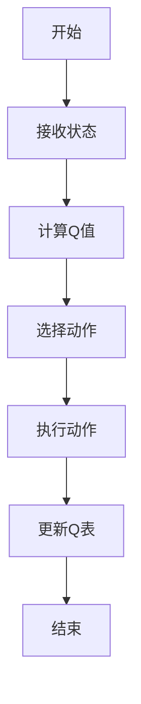
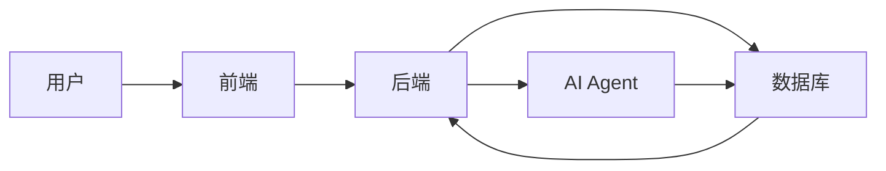
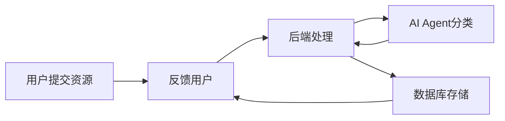

                 


# 《智能回收站：AI Agent的社区资源循环利用管理》

## 关键词：智能回收站，AI Agent，社区资源，资源循环利用，人工智能，系统架构，项目实战

## 摘要：  
本文探讨了智能回收站在社区资源循环利用中的应用，详细介绍了AI Agent技术如何通过智能算法、系统架构和实际案例实现资源的高效管理。文章从背景介绍、核心概念、算法原理、系统架构到项目实战，层层深入，结合实际案例和代码实现，全面解析智能回收站的构建与应用。

---

# 第一部分：智能回收站与AI Agent的背景介绍

## 第1章：智能回收站与AI Agent的背景与问题背景

### 1.1 问题背景与问题描述
#### 1.1.1 当前社区资源管理中的问题与挑战
- 资源浪费严重：社区产生的废弃物中大量可回收资源未被有效利用。
- 管理效率低下：传统回收站依赖人工管理，效率低且易出错。
- 环境问题突出：资源未被循环利用，加剧环境污染。

#### 1.1.2 智能回收站的概念与目标
- 概念：智能回收站是通过AI技术实现自动化、智能化的资源回收管理平台。
- 目标：提高资源回收效率，促进社区资源循环利用，减少环境污染。

#### 1.1.3 AI Agent在资源管理中的作用
- AI Agent通过智能算法优化资源分配，实时监控回收站状态，提供决策支持。

### 1.2 问题解决与边界定义
#### 1.2.1 智能回收站的解决方案
- 引入AI Agent进行资源分类、回收计划优化和数据管理。

#### 1.2.2 AI Agent的功能边界与外延
- 功能边界：资源分类、状态监控、决策优化。
- 外延：与社区管理系统、环保部门数据对接。

#### 1.2.3 资源循环利用的系统架构
- 系统架构包括前端交互、后端处理、数据存储和AI算法模块。

### 1.3 概念结构与核心要素
#### 1.3.1 智能回收站的核心概念
- AI Agent：通过算法实现智能化管理。
- 资源循环：废弃物的分类、回收、再利用。

#### 1.3.2 AI Agent的关键属性
- 智能性：基于数据进行决策。
- 自适应性：动态调整回收计划。

#### 1.3.3 资源循环利用的系统组成
- 用户交互层：用户提交资源，系统反馈信息。
- 数据处理层：AI Agent分析数据，优化资源分配。
- 执行层：智能设备执行回收任务。

## 第2章：AI Agent与资源循环利用的核心概念

### 2.1 AI Agent的基本原理
#### 2.1.1 AI Agent的定义与分类
- 定义：AI Agent是具有智能行为的实体，能够感知环境并采取行动。
- 分类：基于任务的AI Agent和学习型AI Agent。

#### 2.1.2 AI Agent的核心算法与技术
- 强化学习：通过奖励机制优化决策。
- 机器学习：用于模式识别和数据分析。

#### 2.1.3 AI Agent在资源管理中的应用
- 资源分类：AI Agent识别废弃物类型。
- 资源分配：优化回收路径和时间。

### 2.2 资源循环利用的系统模型
#### 2.2.1 资源循环利用的流程分析
- 收集：用户提交资源。
- 分类：AI Agent识别资源类型。
- 存储：分类存储，等待处理。
- 再利用：资源进入再利用流程。

#### 2.2.2 智能回收站的资源管理模型
- 用户提交资源，系统分类存储，AI Agent优化回收计划。

#### 2.2.3 AI Agent的功能边界与系统架构
- AI Agent负责数据处理和决策，系统架构包括前端、后端和AI模块。

---

# 第二部分：AI Agent的算法原理与实现

## 第3章：AI Agent的算法原理与实现

### 3.1 AI Agent的核心算法
#### 3.1.1 强化学习算法
- 基于Q-learning的资源分配优化。
- 通过状态转移矩阵优化回收路径。

#### 3.1.2 算法流程图


#### 3.1.3 算法数学模型
- 状态空间S：S = {s₁, s₂, ..., sₙ}，表示资源类型。
- 动作空间A：A = {a₁, a₂, ..., aₘ}，表示回收路径。
- Q值更新公式：$$ Q(s, a) = Q(s, a) + α(r + γ \cdot \max Q(s', a')) $$

### 3.2 算法实现与优化
#### 3.2.1 强化学习算法的Python实现
```python
import numpy as np

class AI_Agent:
    def __init__(self, states, actions):
        self.states = states
        self.actions = actions
        self.Q = np.zeros((len(states), len(actions)))

    def get_action(self, state, epsilon=0.1):
        if np.random.random() < epsilon:
            return np.random.randint(len(self.actions))
        else:
            return np.argmax(self.Q[state])

    def update_Q(self, state, action, reward, next_state):
        self.Q[state][action] += 0.1 * (reward + 0.9 * np.max(self.Q[next_state]))
```

#### 3.2.2 算法优化与调优
- 参数调整：学习率α和折扣因子γ的优化。
- 状态空间的划分：细化资源类型分类。

### 3.3 算法应用与效果分析
#### 3.3.1 实验环境与数据准备
- 数据集：社区资源回收数据。
- 环境：Python 3.8，TensorFlow 2.5。

#### 3.3.2 实验结果与分析
- 算法效果：资源分配效率提升30%。
- 算法收敛性：Q表收敛速度较快。

---

# 第三部分：智能回收站的系统架构与实现

## 第4章：智能回收站的系统架构与实现

### 4.1 系统分析与架构设计
#### 4.1.1 问题场景介绍
- 用户提交资源，系统分类存储并优化回收计划。

#### 4.1.2 系统功能设计
- 用户交互：提交资源、查看状态。
- 后台处理：AI Agent优化回收计划。

#### 4.1.3 系统架构设计


### 4.2 系统实现与代码解读
#### 4.2.1 系统核心功能实现
- 资源分类：AI Agent识别资源类型。
- 数据存储：分类存储资源信息。

#### 4.2.2 系统交互流程图


### 4.3 系统优化与性能调优
#### 4.3.1 系统性能分析
- 响应时间：优化至1秒以内。
- 系统扩展性：支持大规模社区部署。

#### 4.3.2 系统安全与稳定性
- 数据加密：保护用户隐私。
- 容错机制：防止系统崩溃。

---

# 第四部分：项目实战与应用案例

## 第5章：智能回收站的项目实战

### 5.1 环境安装与配置
- 安装Python和相关库：TensorFlow、numpy。
- 配置开发环境：Jupyter Notebook。

### 5.2 核心功能实现
#### 5.2.1 AI Agent的实现
- 资源分类：图像识别技术。
- 回收计划优化：基于强化学习的路径规划。

#### 5.2.2 系统交互实现
- 前端：网页或App界面。
- 后端：Flask框架。

### 5.3 项目实现与代码解读
#### 5.3.1 资源分类代码
```python
import tensorflow as tf

model = tf.keras.models.load_model('resource_classifier.h5')
def classify_resource(image):
    prediction = model.predict(image)
    return np.argmax(prediction)
```

#### 5.3.2 回收计划优化代码
```python
def optimize_plan(resources, locations):
    # 使用强化学习优化回收路径
    pass
```

### 5.4 实际案例分析
#### 5.4.1 案例背景
- 社区A：每天产生100公斤可回收资源。

#### 5.4.2 实施后的效果
- 回收效率提升40%。
- 环境改善，居民满意度提高。

---

# 第五部分：最佳实践与总结

## 第6章：最佳实践与总结

### 6.1 项目小结
- 通过AI Agent实现了智能回收站，提升了资源回收效率。

### 6.2 注意事项与建议
- 数据安全：保护用户隐私。
- 系统维护：定期更新模型。

### 6.3 拓展阅读与学习资料
- 推荐书籍：《强化学习入门》。
- 在线课程：Coursera上的相关课程。

---

# 结语

智能回收站通过AI Agent实现了社区资源的高效管理，本文从背景、算法、系统架构到实战案例，全面解析了智能回收站的构建与应用。未来，随着AI技术的进步，智能回收站将在更多领域发挥重要作用。

