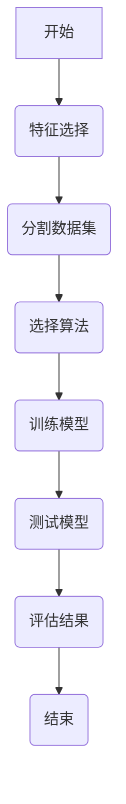
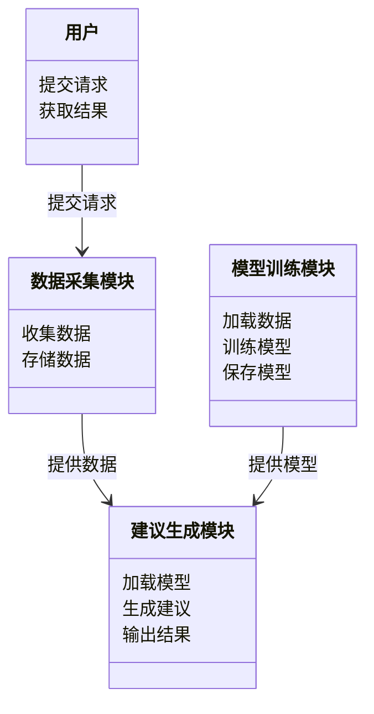
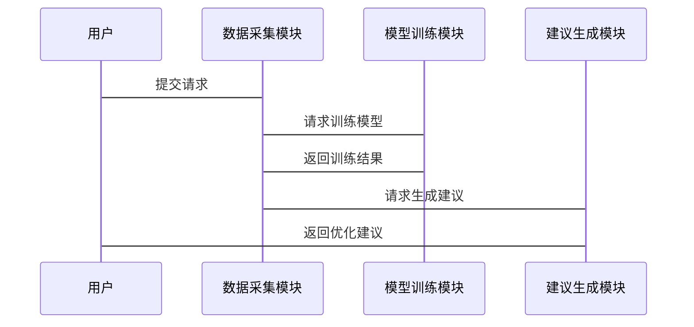

                 


# 智能国际税收筹划建议生成系统

## 关键词：智能税收筹划，国际税务，人工智能，机器学习，系统架构

## 摘要：本文介绍了一种基于人工智能的智能国际税收筹划建议生成系统，该系统利用机器学习算法和法律规则推理，为用户提供个性化的国际税务优化建议。文章详细阐述了系统的背景、核心概念、算法原理、系统架构和项目实战，并提供了最佳实践建议，帮助用户更好地理解和应用该系统。

---

# 第三章: 算法原理与数学模型

## 3.1 算法原理

智能国际税收筹划系统结合了多种算法，包括基于规则的推理、机器学习模型以及混合算法。以下是详细分析：

### 3.1.1 基于规则的推理算法
基于规则的推理算法依赖于预先定义的法律和财务规则，通过逻辑推理生成税收优化建议。其优点是简单易懂，但缺点是灵活性差，难以应对复杂的国际税务环境。

### 3.1.2 基于机器学习的预测模型
机器学习模型通过历史数据和标签训练，预测最优的税收筹划方案。常用的模型包括线性回归、决策树和随机森林等。

### 3.1.3 综合推理与预测的混合算法
混合算法结合了规则推理和机器学习模型的优势，通过先应用规则缩小候选方案范围，再利用机器学习模型进行优化。

## 3.2 算法流程图

以下是一个简单的决策树模型流程图：



## 3.3 数学模型与公式

### 3.3.1 线性回归模型
线性回归用于预测连续型变量，公式如下：
$$y = \beta_0 + \beta_1x + \epsilon$$
其中，$\beta_0$是截距，$\beta_1$是回归系数，$\epsilon$是误差项。

### 3.3.2 决策树模型
决策树是一种树状结构，用于分类和回归。决策树的生成过程包括特征选择、分割数据集和剪枝等步骤。

### 3.3.3 随机森林
随机森林是一种集成学习方法，通过构建多个决策树并进行投票或平均，提高模型的准确性和鲁棒性。

## 3.4 Python代码实现

以下是使用Scikit-learn库实现一个简单的决策树分类器的代码：

```python
from sklearn.tree import DecisionTreeClassifier
from sklearn.model_selection import train_test_split
from sklearn.metrics import accuracy_score

# 示例数据集
X = [[0, 0], [0, 1], [1, 0], [1, 1]]
y = [0, 1, 1, 0]

# 数据分割
X_train, X_test, y_train, y_test = train_test_split(X, y, test_size=0.25)

# 创建决策树分类器
clf = DecisionTreeClassifier()

# 训练模型
clf.fit(X_train, y_train)

# 预测
y_pred = clf.predict(X_test)

# 计算准确率
print("Accuracy:", accuracy_score(y_test, y_pred))
```

---

# 第四章: 系统分析与架构设计

## 4.1 问题场景介绍

跨国企业需要在全球范围内优化税务负担，但面对复杂的国际税法和多变的政策，传统的手动方法效率低下，容易出错。智能国际税收筹划系统通过自动化处理和智能分析，帮助用户制定最优的税务策略。

## 4.2 系统功能设计

### 4.2.1 数据采集模块
数据采集模块负责收集企业的财务数据、跨国业务信息和相关税收政策。

### 4.2.2 模型训练模块
模型训练模块利用机器学习算法，基于历史数据训练税收优化模型。

### 4.2.3 建议生成模块
建议生成模块结合规则推理和机器学习模型，生成个性化的税收筹划建议。

## 4.3 系统架构设计

以下是系统的类图：



## 4.4 系统接口设计

系统主要接口包括数据输入接口、模型训练接口和结果输出接口。

## 4.5 系统交互流程图

以下是系统交互的流程图：



---

# 第五章: 项目实战

## 5.1 环境安装

安装必要的Python库：

```bash
pip install pandas numpy scikit-learn
```

## 5.2 核心代码实现

以下是核心代码实现：

```python
import pandas as pd
from sklearn.tree import DecisionTreeClassifier
from sklearn.model_selection import train_test_split

# 加载数据集
data = pd.read_csv('tax_data.csv')

# 数据预处理
X = data.drop('tax_amount', axis=1)
y = data['tax_amount']

# 数据分割
X_train, X_test, y_train, y_test = train_test_split(X, y, test_size=0.2)

# 创建决策树分类器
clf = DecisionTreeClassifier()

# 训练模型
clf.fit(X_train, y_train)

# 预测
y_pred = clf.predict(X_test)

# 评估准确率
print("Accuracy:", accuracy_score(y_test, y_pred))
```

## 5.3 案例分析

假设我们有一个跨国企业，需要在多个国家进行税务优化。系统会分析企业的收入、成本和业务模式，结合当地的税收政策，生成最优的税务规划建议。

---

# 第六章: 最佳实践

## 6.1 小结

智能国际税收筹划系统通过结合规则推理和机器学习算法，能够有效提高税收优化的效率和准确性。

## 6.2 注意事项

- 数据隐私和合规性是系统设计的重要考虑因素。
- 系统需要定期更新法律法规库，以应对政策变化。
- 在处理跨国业务时，需考虑不同国家的税收协定和特殊规定。

## 6.3 拓展阅读

- 《机器学习实战》
- 《Python机器学习》
- 国际税收相关法规和协定

---

# 结语

智能国际税收筹划建议生成系统通过人工智能技术，为跨国企业和个人提供高效、精准的税务优化服务。随着技术的不断进步，未来系统将更加智能化和个性化，帮助用户在全球化的经济环境中获得更大的竞争优势。

