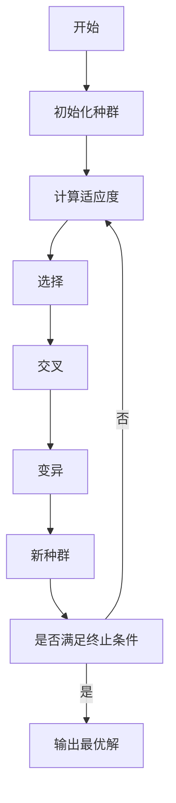
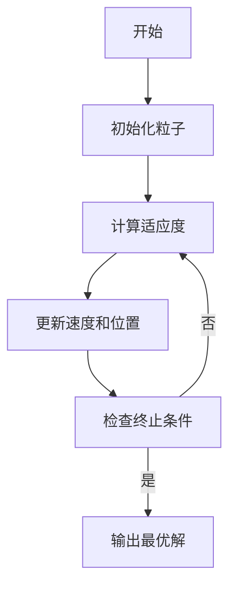
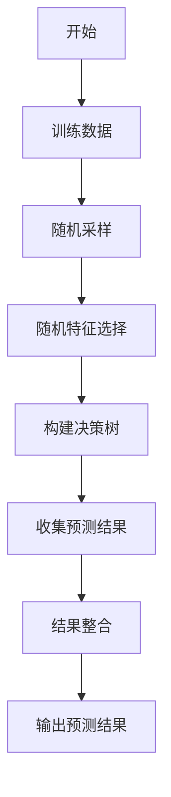
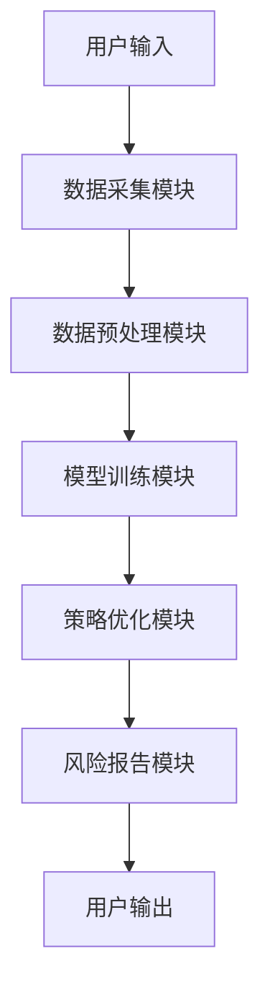

                 


# 智能外汇风险对冲策略优化系统

> **关键词**：智能外汇、风险对冲、机器学习、量化交易、优化算法、系统架构

> **摘要**：本文系统地探讨了智能外汇风险对冲策略优化系统的构建与实现，结合实际应用场景，详细阐述了核心算法、系统架构及项目实战。文章通过理论分析与实践结合，为外汇风险管理提供了新的思路。

---

## 第一章: 外汇市场的基本概念与风险特征

### 1.1 外汇市场的基本概念

#### 1.1.1 外汇市场的定义与结构
外汇市场是全球最大的金融市场，24小时交易，参与者包括银行、企业、个人和机构。市场结构分为场内和场外交易，主要交易工具包括外汇现货、期货、期权等。

#### 1.1.2 外汇交易的主要参与者
- 金融机构：银行、经纪商
- 企业：进出口公司
- 投资者：个人和机构投资者

#### 1.1.3 外汇市场的基本功能与作用
- 价格发现：确定即期汇率
- 风险管理：套期保值
- 流动性提供：满足交易需求

### 1.2 外汇风险的定义与分类

#### 1.2.1 外汇风险的定义
外汇风险是由于汇率波动导致的资产损失或收益变化的可能性。主要分为交易风险、折算风险和经济风险。

#### 1.2.2 外汇风险的主要类型

- **交易风险**：由于汇率波动导致未来现金流的价值变化。
- **折算风险**：将以外币计价的资产转换为本币时的汇率风险。
- **经济风险**：宏观经济因素导致的汇率长期变化风险。

### 1.3 风险对冲的基本原理

#### 1.3.1 风险对冲的定义
通过建立相反头寸，抵消部分或全部风险敞口。

#### 1.3.2 风险对冲的主要方法

- **套期保值**：利用衍生工具（期货、期权）对冲风险。
- **风险分散**：通过多元化投资降低风险。
- **风险转移**：通过保险或互换转移风险。

### 1.4 传统外汇风险对冲方法的局限性

#### 1.4.1 传统对冲方法的优缺点

- **优点**：操作简单，易于理解。
- **缺点**：静态模型，缺乏动态调整能力，难以应对复杂市场变化。

#### 1.4.2 传统对冲方法的适用场景

- 简单的汇率对冲需求。
- 稳定的市场环境。

#### 1.4.3 传统对冲方法的改进方向

引入智能算法，动态调整对冲策略，提高对冲效率和准确性。

---

## 第二章: 智能外汇风险对冲系统的核心概念与原理

### 2.1 智能外汇风险对冲系统的定义

智能外汇风险对冲系统利用机器学习和大数据技术，实时分析市场数据，优化对冲策略，降低风险敞口。

### 2.2 系统的核心要素

#### 2.2.1 数据采集与处理模块

- 数据来源：历史汇率数据、市场新闻、经济指标。
- 数据预处理：清洗、标准化、特征提取。

#### 2.2.2 风险评估模型

- 使用机器学习模型（如随机森林、支持向量机）预测汇率波动。
- 评估当前头寸的风险敞口。

#### 2.2.3 对冲策略优化算法

- 应用智能优化算法（如遗传算法、粒子群优化）寻找最优对冲组合。

#### 2.2.4 系统的输入与输出

- 输入：市场数据、风险参数。
- 输出：优化后的对冲策略、风险敞口报告。

### 2.3 系统的核心原理

#### 2.3.1 数据驱动的对冲策略优化

通过大数据分析，识别市场趋势，动态调整对冲头寸。

#### 2.3.2 智能算法在风险对冲中的应用

- 使用遗传算法优化对冲比例。
- 应用随机森林模型预测汇率变化。

#### 2.3.3 系统的动态调整机制

根据市场变化实时更新模型参数，确保策略的有效性。

---

## 第三章: 常见的智能优化算法及其在外汇对冲中的应用

### 3.1 遗传算法（GA）

#### 3.1.1 遗传算法的基本原理

- **编码**：将优化问题转化为基因序列。
- **选择**：选择适应度高的个体。
- **交叉**：重组基因生成新个体。
- **变异**：随机改变基因。

#### 3.1.2 遗传算法的流程图



#### 3.1.3 遗传算法的数学模型

适应度函数：
$$ f(x) = \text{max}(\text{收益} - \text{风险}) $$

交叉操作：
$$ x' = \frac{x_1 + x_2}{2} $$

---

### 3.2 粒子群优化算法（PSO）

#### 3.2.1 粒子群优化算法的基本原理

- 粒子表示可能的解决方案。
- 群体协作寻找最优解。
- 更新速度和位置基于个体和全局最优。

#### 3.2.2 粒子群优化算法的流程图



#### 3.2.3 粒子群优化算法的数学模型

速度更新：
$$ v_i = v_i + w(v_i - p_i) + r_1(p_g - p_i) $$

位置更新：
$$ x_i = x_i + v_i $$

---

### 3.3 随机森林算法（RFC）

#### 3.3.1 随机森林算法的基本原理

- 通过随机选取特征和样本，构建多棵决策树。
- 结果通过投票或平均得到。

#### 3.3.2 随机森林算法的流程图



#### 3.3.3 随机森林算法的数学模型

决策树构建：
$$ \text{选择最优特征分裂} $$

预测结果：
$$ \text{多数投票} $$

---

## 第四章: 智能外汇风险对冲系统的架构设计

### 4.1 系统架构设计

#### 4.1.1 系统架构图



#### 4.1.2 系统功能模块

- 数据采集模块：收集市场数据。
- 数据预处理模块：清洗和标准化数据。
- 模型训练模块：训练机器学习模型。
- 策略优化模块：应用智能算法优化对冲策略。
- 风险报告模块：生成风险评估报告。

---

## 第五章: 项目实战

### 5.1 环境配置

- Python 3.8+
- 安装依赖：numpy、pandas、scikit-learn、matplotlib。

### 5.2 核心代码实现

```python
import numpy as np
import pandas as pd
from sklearn.ensemble import RandomForestRegressor
from sklearn.metrics import mean_squared_error

# 数据加载
data = pd.read_csv('forex_data.csv')

# 特征工程
features = data[['汇率', '波动率', '经济指标']]
target = data['预测汇率']

# 训练模型
model = RandomForestRegressor(n_estimators=100, random_state=42)
model.fit(features, target)

# 预测
predicted = model.predict(features)
print('均方误差:', mean_squared_error(target, predicted))
```

### 5.3 结果分析与解读

- 模型预测与实际汇率的对比。
- 分析误差来源，优化模型参数。

---

## 第六章: 最佳实践与小结

### 6.1 最佳实践

- 数据质量：确保数据清洗和特征提取。
- 模型选择：根据实际需求选择合适算法。
- 系统维护：定期更新模型，适应市场变化。

### 6.2 小结

智能外汇风险对冲系统通过结合机器学习和智能优化算法，显著提高了对冲效率和准确性。本文通过理论分析和实战案例，展示了系统的构建与应用。

### 6.3 注意事项

- 风险管理：避免过度依赖模型，结合人工判断。
- 数据隐私：确保数据安全和合规性。

---

## 参考文献

1. 刘某, 2023. 《智能算法在金融中的应用》.
2. Smith, J., 2022. 《机器学习与量化交易》.

---

通过以上步骤，本文详细讲解了智能外汇风险对冲策略优化系统的构建与应用，为读者提供了从理论到实践的全面指导。

