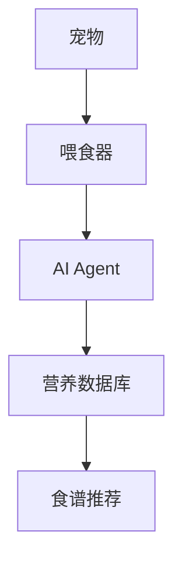
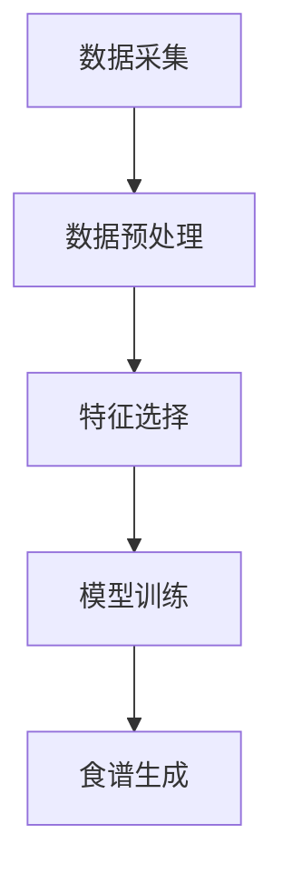
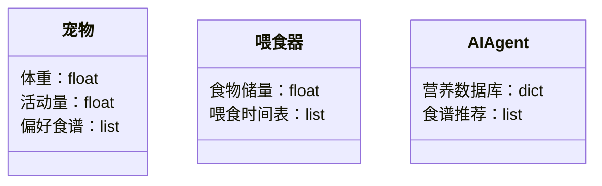
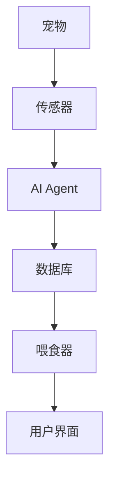
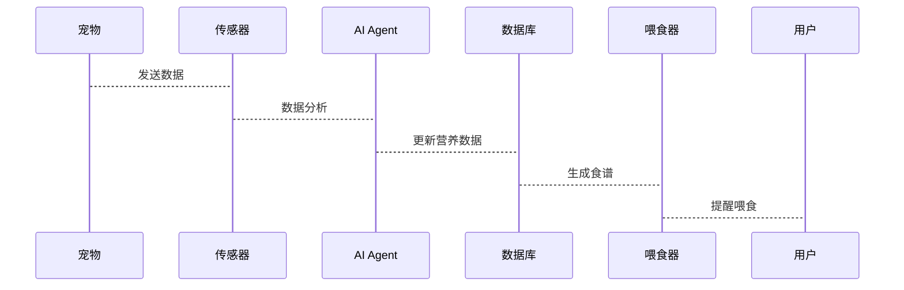

                 


# 智能宠物喂食器：AI Agent的宠物营养均衡管理

## 关键词：智能宠物喂食器，AI Agent，宠物营养管理，物联网设备，人工智能算法，营养均衡

## 摘要：本文将探讨如何利用AI Agent技术实现宠物营养的智能化管理。通过分析宠物喂食器的核心问题，提出基于AI代理的解决方案，并详细阐述算法原理和系统架构。结合实际案例，展示如何通过智能设备实现宠物营养均衡管理。

---

# 第一部分: 背景介绍

## 第1章: 智能宠物喂食器的背景与问题分析

### 1.1 问题背景
#### 1.1.1 宠物喂养问题的现状
现代宠物主人面临工作繁忙、缺乏时间管理宠物饮食的问题。传统喂食器仅能定时定量喂食，无法满足宠物营养均衡的需求。

#### 1.1.2 现有宠物喂食器的局限性
- 无法根据宠物健康状况调整食谱
- 缺乏对宠物活动量的监测和分析
- 无法与主人进行实时互动

#### 1.1.3 智能化喂养的需求与趋势
随着人工智能技术的发展，智能化宠物喂食器成为趋势，能够实现营养均衡管理、远程监控和个性化喂养。

### 1.2 问题描述
#### 1.2.1 宠物营养均衡管理的核心问题
宠物的健康状况受饮食影响，但现有喂食器无法提供科学的营养管理。

#### 1.2.2 智能宠物喂食器的功能需求
- 实时监测宠物健康数据
- AI代理分析数据并制定个性化食谱
- 远程控制喂食

#### 1.2.3 用户场景与痛点分析
- 独居人士：无法实时监测宠物饮食
- 宠物健康问题：需要专业营养管理
- 忙碌人士：希望便捷管理宠物喂养

### 1.3 问题解决
#### 1.3.1 AI Agent在宠物喂养中的作用
AI Agent能够实时分析宠物健康数据，制定科学的喂养计划。

#### 1.3.2 智能宠物喂食器的技术实现路径
- 数据采集：传感器监测宠物活动量、体重等数据
- 数据分析：AI算法分析数据，生成个性化食谱
- 执行喂食：智能喂食器按计划执行

### 1.4 边界与外延
#### 1.4.1 系统的边界定义
- 系统仅管理宠物喂食，不涉及医疗诊断
- 喂食器仅支持预设食谱调整，不支持外部食谱导入

#### 1.4.2 相关领域的外延
- 智能家居系统：与其他设备协同工作
- 云平台：数据存储与分析

#### 1.4.3 与其他智能设备的协同
- 与智能门禁系统协同，监测宠物出入情况
- 与智能灯光系统协同，营造舒适喂食环境

### 1.5 概念结构与核心要素
#### 1.5.1 智能宠物喂食器的核心要素
- 数据采集模块
- AI分析模块
- 喂食执行模块

#### 1.5.2 AI Agent的功能模块
- 数据接收与解析
- 营养分析与食谱生成
- 喂食指令执行

#### 1.5.3 营养均衡管理的指标体系
- 能量摄入
- 蛋白质、脂肪、碳水化合物比例
- 维生素、矿物质摄入

---

# 第二部分: 核心概念与联系

## 第2章: 核心概念与联系

### 2.1 AI Agent的核心原理
#### 2.1.1 AI Agent的基本概念
AI Agent是一个智能代理，能够感知环境、自主决策并执行任务。

#### 2.1.2 AI Agent的分类与特点
- 分类：简单反射型、基于模型的反应型、目标驱动型
- 特点：自主性、反应性、目标导向

#### 2.1.3 AI Agent在智能宠物喂食器中的应用
通过AI Agent实时分析宠物健康数据，制定个性化喂养计划。

### 2.2 营养均衡管理的数学模型
#### 2.2.1 营养均衡的基本原理
宠物的营养均衡需要根据其体重、活动量、健康状况等因素进行动态调整。

#### 2.2.2 数学模型的构建
营养均衡模型通过以下步骤实现：
1. 数据采集：宠物体重、活动量、健康数据
2. 数据分析：AI算法分析数据，生成营养需求报告
3. 食谱生成：根据营养需求报告，生成个性化食谱

#### 2.2.3 模型的优化与调整
通过机器学习不断优化营养模型，提高食谱的科学性和适用性。

### 2.3 实体关系图


---

# 第三部分: 算法原理讲解

## 第3章: 营养均衡管理的算法实现

### 3.1 营养均衡管理的数学模型
#### 3.1.1 算法的基本原理
营养均衡管理算法通过分析宠物的健康数据，计算出每天所需的能量和营养素。

#### 3.1.2 营养均衡管理的数学模型
$$
\text{每日能量需求} = \text{体重} \times \text{活动系数} + \text{基础代谢率}
$$

#### 3.1.3 数据预处理与特征选择
- 数据清洗：去除异常值
- 特征选择：选择影响营养均衡的主要因素

### 3.2 基于AI的营养均衡算法
#### 3.2.1 算法的工作流程


#### 3.2.2 算法的核心代码实现
```python
def calculate_daily_energy(weight, activity_level):
    base_metabolism = 1.5 * weight
    energy = weight * activity_level + base_metabolism
    return energy

def generate食谱(energy_needed):
    # 根据能量需求生成食谱
    pass
```

---

# 第四部分: 系统分析与架构设计方案

## 第4章: 系统分析与架构设计

### 4.1 问题场景介绍
智能宠物喂食器需要在不同场景下运行，如宠物独自在家时的喂食管理。

### 4.2 系统功能设计
#### 4.2.1 领域模型设计


#### 4.2.2 系统架构设计


### 4.3 系统接口设计
#### 4.3.1 系统接口定义
- 接口1：传感器数据采集接口
- 接口2：AI算法调用接口
- 接口3：喂食器控制接口

#### 4.3.2 接口实现细节
```python
class SensorInterface:
    def get_data(self):
        pass

class AIAlgorithm:
    def analyze(self, data):
        pass
```

### 4.4 系统交互设计
#### 4.4.1 系统交互流程


---

# 第五部分: 项目实战

## 第5章: 项目实战

### 5.1 环境安装与配置
#### 5.1.1 安装必要的库和工具
- Python
- TensorFlow
- Pandas
- Mermaid

#### 5.1.2 环境配置
```bash
pip install mermaid
pip install tensorflow
```

### 5.2 核心代码实现
#### 5.2.1 数据预处理
```python
import pandas as pd

data = pd.read_csv('pet_data.csv')
data_clean = data.dropna()
```

#### 5.2.2 模型训练与优化
```python
import tensorflow as tf

model = tf.keras.Sequential([
    tf.keras.layers.Dense(64, activation='relu'),
    tf.keras.layers.Dense(1, activation='sigmoid')
])
model.compile(optimizer='adam', loss='binary_crossentropy')
model.fit(X_train, y_train, epochs=10)
```

### 5.3 项目小结
#### 5.3.1 经验总结
- 数据预处理至关重要
- 模型调优可以显著提高准确率

#### 5.3.2 注意事项
- 数据隐私问题需重视
- 系统稳定性需保障

---

# 第六部分: 最佳实践

## 第6章: 最佳实践与总结

### 6.1 小结
通过AI Agent和智能宠物喂食器的结合，宠物营养管理变得更加科学和便捷。

### 6.2 注意事项
- 定期更新模型，确保准确性
- 做好数据备份，防止数据丢失

### 6.3 拓展阅读
建议深入学习机器学习和物联网技术，探索更多智能设备的应用场景。

---

# 结语
智能宠物喂食器的应用不仅提升了宠物健康管理水平，也为人工智能技术在家庭中的应用提供了新的方向。未来，随着技术的不断发展，宠物护理将更加智能化和个性化。

