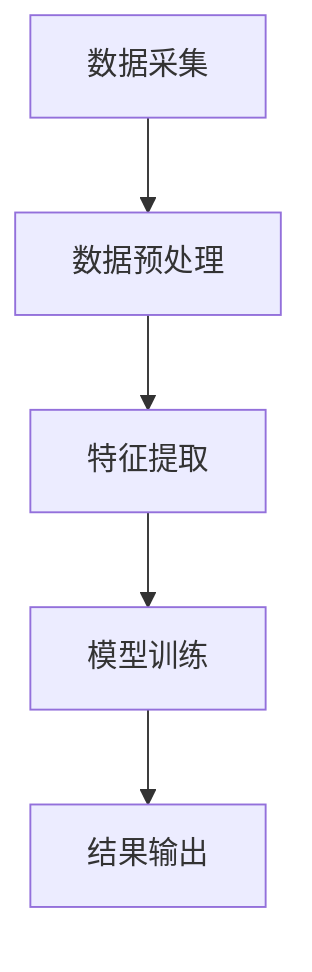
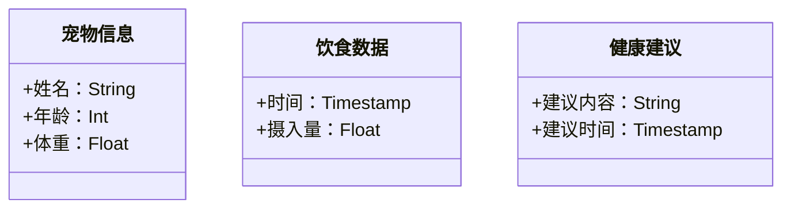

                 


# 智能宠物碗：AI Agent的宠物饮食健康管理

> 关键词：AI Agent, 智能宠物碗, 宠物饮食管理, 物联网技术, 健康监测

> 摘要：本文探讨了AI Agent在宠物饮食健康管理中的应用，详细介绍了智能宠物碗的背景、核心概念、算法原理、系统架构设计、项目实战以及最佳实践。通过结合物联网技术和AI算法，智能宠物碗能够实时监测宠物的饮食情况，提供个性化的健康建议，帮助宠物主人更好地管理宠物的健康。

---

## 目录

1. **背景介绍**  
   1.1 智能宠物碗的概念与定义  
   1.2 宠物饮食健康管理的重要性  
   1.3 智能宠物碗的技术背景  

2. **AI Agent的核心概念与原理**  
   2.1 AI Agent的基本原理  
   2.2 智能宠物碗的系统架构  
   2.3 算法原理与流程  

3. **算法原理与数学模型**  
   3.1 线性回归模型  
   3.2 决策树模型  

4. **系统架构设计**  
   4.1 问题场景介绍  
   4.2 系统功能设计  
   4.3 系统架构设计  

5. **项目实战：智能宠物碗的实现**  
   5.1 环境安装与配置  
   5.2 核心代码实现  
   5.3 实际案例分析  

6. **最佳实践与注意事项**  
   6.1 数据隐私与安全  
   6.2 系统维护与更新  
   6.3 拓展阅读与学习资源  

---

## 正文内容

### 1. 背景介绍

#### 1.1 智能宠物碗的概念与定义
智能宠物碗是一种结合了AI技术的宠物用品，旨在通过智能化的方式管理宠物的饮食健康。它通过传感器、AI算法和物联网技术，实时监测宠物的饮食情况，并根据数据提供个性化的健康建议。

#### 1.2 宠物饮食健康管理的重要性
宠物的健康与饮食密切相关。不合理的饮食习惯可能导致肥胖、营养不良等健康问题。智能宠物碗通过实时监测和分析宠物的饮食数据，帮助宠物主人更好地管理宠物的健康。

#### 1.3 智能宠物碗的技术背景
智能宠物碗的技术背景主要包括物联网技术、AI技术和大数据分析。通过这些技术的结合，智能宠物碗能够实现数据的采集、分析和反馈，为宠物主人提供科学的饮食管理方案。

---

### 2. AI Agent的核心概念与原理

#### 2.1 AI Agent的基本原理
AI Agent是一种能够感知环境、做出决策并执行动作的智能体。在智能宠物碗中，AI Agent主要用于分析宠物的饮食数据，并提供相应的健康建议。

#### 2.2 智能宠物碗的系统架构
智能宠物碗的系统架构包括以下几个部分：
1. **数据采集模块**：通过传感器采集宠物的饮食数据。
2. **数据处理模块**：对采集到的数据进行预处理和特征提取。
3. **AI算法模块**：使用机器学习算法对数据进行分析，生成健康建议。
4. **反馈模块**：将健康建议反馈给宠物主人。

#### 2.3 算法原理与流程
AI算法的核心流程包括数据采集、预处理、特征提取、模型训练和结果输出。以下是一个简单的流程图：



---

### 3. 算法原理与数学模型

#### 3.1 线性回归模型
线性回归是一种常用的回归分析方法，用于预测连续型变量。其数学模型如下：

$$ y = \beta_0 + \beta_1x + \epsilon $$

其中，$y$ 是目标变量，$x$ 是自变量，$\beta_0$ 和 $\beta_1$ 是回归系数，$\epsilon$ 是误差项。

#### 3.2 决策树模型
决策树是一种基于树结构的分类和回归方法。其核心思想是通过特征分裂来构建决策树，最终生成决策规则。决策树的熵公式如下：

$$ entropy = -\sum p_i \log p_i $$

其中，$p_i$ 是第$i$个类别的概率。

---

### 4. 系统架构设计

#### 4.1 问题场景介绍
智能宠物碗的主要应用场景包括宠物饮食监测、健康建议生成和数据管理。通过这些功能，宠物主人可以实时了解宠物的饮食情况，并根据系统的建议调整宠物的饮食计划。

#### 4.2 系统功能设计
系统的功能模块包括：
1. **数据采集模块**：通过传感器采集宠物的饮食数据。
2. **数据处理模块**：对数据进行预处理和特征提取。
3. **AI算法模块**：使用机器学习算法生成健康建议。
4. **反馈模块**：将健康建议反馈给宠物主人。

#### 4.3 系统架构设计
系统的架构设计如下：



---

### 5. 项目实战：智能宠物碗的实现

#### 5.1 环境安装与配置
为了实现智能宠物碗，需要安装以下环境：
- Python 3.6+
- NumPy
- Scikit-learn
- Mermaid

#### 5.2 核心代码实现
以下是智能宠物碗的核心代码实现：

```python
import numpy as np
from sklearn.tree import DecisionTreeRegressor

# 示例数据
X = np.array([[1], [2], [3], [4]])
y = np.array([2, 3, 5, 6])

# 训练模型
model = DecisionTreeRegressor()
model.fit(X, y)

# 预测
print(model.predict(np.array([[5]])))
```

#### 5.3 实际案例分析
通过实际案例分析，我们可以看到智能宠物碗在宠物饮食健康管理中的实际应用。例如，通过传感器采集宠物的饮食数据，结合AI算法生成健康建议，帮助宠物主人更好地管理宠物的健康。

---

### 6. 最佳实践与注意事项

#### 6.1 数据隐私与安全
在智能宠物碗的开发中，需要注意数据的隐私与安全问题。宠物的饮食数据可能包含敏感信息，需要采取加密和访问控制等措施。

#### 6.2 系统维护与更新
为了保证系统的正常运行，需要定期对系统进行维护和更新。例如，及时修复系统漏洞，更新AI算法模型。

#### 6.3 拓展阅读与学习资源
为了进一步学习智能宠物碗的相关知识，可以参考以下资源：
- 《机器学习实战》
- 《物联网技术入门与应用》
- 《AI在宠物健康管理中的应用》

---

## 结语
通过本文的介绍，我们可以看到AI Agent在宠物饮食健康管理中的巨大潜力。智能宠物碗作为一种结合了物联网技术和AI算法的智能设备，能够为宠物主人提供科学的饮食管理方案，帮助宠物保持健康。未来，随着技术的不断发展，智能宠物碗的功能和性能将更加智能化和个性化。

