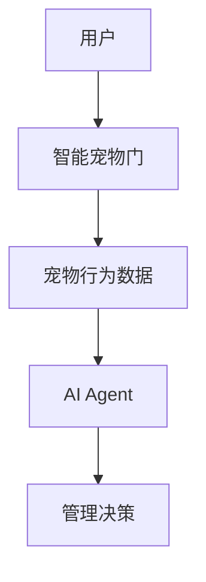
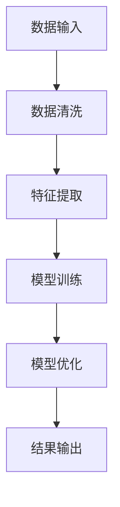
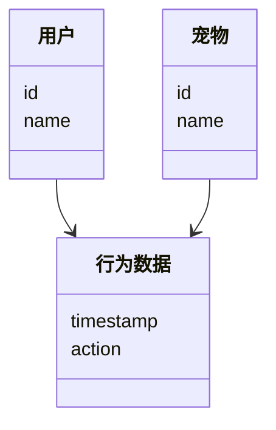
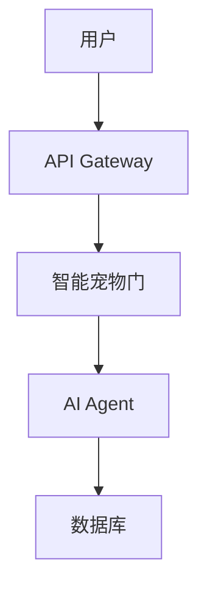
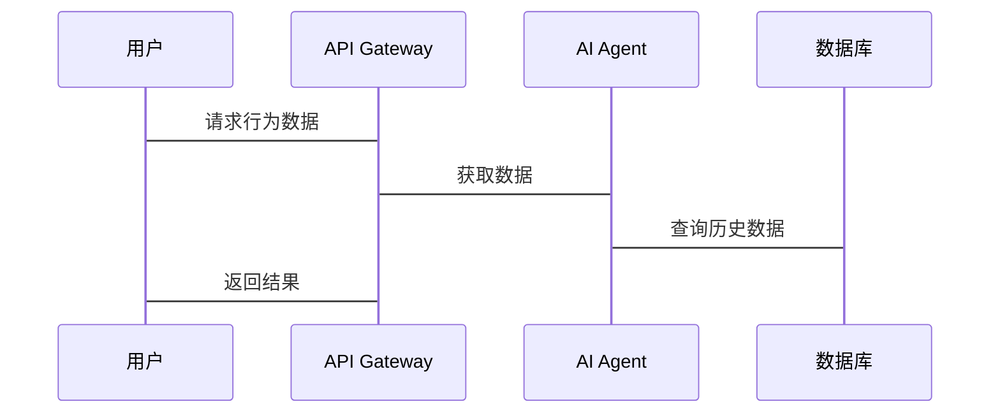

                 


# 智能宠物门：AI Agent的宠物行为分析与管理

> 关键词：智能宠物门，AI Agent，宠物行为分析，系统架构，算法原理，项目实战

> 摘要：本文探讨了智能宠物门的设计与实现，通过AI Agent对宠物行为进行分析与管理，结合背景介绍、核心概念、算法原理、系统架构、项目实战和优化建议，为读者提供全面的技术解析。

---

# 第一部分: 背景介绍

## 第1章: 智能宠物门的背景与问题背景

### 1.1 问题背景

#### 1.1.1 宠物行为管理的现状与挑战

在现代社会，宠物已成为许多家庭的重要成员。然而，宠物行为的管理却面临诸多挑战：宠物的活动范围难以实时监控，行为数据难以记录和分析，传统管理方式效率低下且缺乏智能化支持。

#### 1.1.2 智能化宠物管理的需求

随着人工智能技术的发展，智能化宠物管理的需求日益增长。通过AI Agent实时分析宠物行为，提供个性化管理方案，成为现代宠物管理的重要方向。

#### 1.1.3 AI Agent在宠物行为管理中的作用

AI Agent能够实时感知宠物行为，通过数据分析和模型预测，帮助主人更好地理解和管理宠物行为，提升宠物生活质量。

### 1.2 问题描述

#### 1.2.1 宠物行为分析的核心问题

如何准确捕捉宠物行为数据，建立有效的行为分析模型。

#### 1.2.2 智能宠物门的功能需求

智能宠物门需要具备实时监测、行为识别、智能决策等功能。

#### 1.2.3 系统边界与外延

智能宠物门不仅是一个硬件设备，更是一个集数据采集、分析和决策于一体的智能系统。

### 1.3 问题解决

#### 1.3.1 AI Agent的核心解决方案

AI Agent通过数据采集、分析和决策，实现宠物行为的智能化管理。

#### 1.3.2 智能宠物门的设计思路

采用AI技术对宠物行为进行实时分析，结合硬件设备实现智能门禁控制。

#### 1.3.3 系统功能的实现路径

数据采集→行为分析→智能决策→系统控制。

## 第2章: 核心概念与联系

### 2.1 核心概念原理

#### 2.1.1 AI Agent的基本原理

AI Agent通过感知环境、分析数据并执行任务，实现智能化管理。

#### 2.1.2 宠物行为分析的关键技术

包括数据采集、特征提取、行为识别和模型训练等技术。

#### 2.1.3 智能宠物门的工作机制

通过传感器采集宠物行为数据，AI Agent分析数据并触发相应的门禁控制。

### 2.2 核心概念对比表

| 比较维度 | AI Agent | 传统宠物管理工具 |
|----------|-----------|------------------|
| 数据处理 | 实时分析   | 离线记录         |
| 系统集成 | 高度集成   | 低度集成         |
| 智能性   | 高度智能   | 低度智能         |

### 2.3 ER实体关系图



---

# 第二部分: 算法原理讲解

## 第3章: 算法原理讲解

### 3.1 算法原理概述

#### 3.1.1 数据收集与预处理

通过摄像头和传感器采集宠物的行为数据，进行清洗和标准化处理。

#### 3.1.2 特征提取与模型训练

提取宠物的行为特征，构建机器学习模型进行训练。

#### 3.1.3 算法优化与调参

通过调整模型参数和优化算法，提升模型的准确性和效率。

### 3.2 算法流程图



### 3.3 数学模型与公式

#### 3.3.1 损失函数

$$ L = \frac{1}{n}\sum_{i=1}^{n}(y_i - \hat{y_i})^2 $$

#### 3.3.2 优化算法

采用随机梯度下降优化：

$$ \theta = \theta - \eta \frac{\partial L}{\partial \theta} $$

---

# 第三部分: 系统分析与架构设计方案

## 第4章: 系统分析与架构设计

### 4.1 问题场景介绍

智能宠物门需要实时监测宠物行为，根据分析结果控制门禁。

### 4.2 项目介绍

智能宠物门系统包括硬件设备和软件平台两部分。

### 4.3 系统功能设计

#### 4.3.1 领域模型



### 4.4 系统架构设计



### 4.5 系统接口设计

- 用户接口：REST API，提供行为数据查询和控制门禁。
- 数据库接口：提供数据存储和查询功能。

### 4.6 系统交互流程图



---

# 第四部分: 项目实战

## 第5章: 项目实战

### 5.1 环境安装

- 安装Python和相关库（如TensorFlow、OpenCV）。
- 配置硬件设备（摄像头、传感器）。

### 5.2 核心实现

#### 5.2.1 数据采集代码

```python
import cv2

def collect_data():
    cap = cv2.VideoCapture(0)
    while True:
        ret, frame = cap.read()
        # 处理帧
        # ...
    cap.release()
```

#### 5.2.2 行为分析代码

```python
def analyze_behavior(data):
    # 数据分析逻辑
    return result
```

### 5.3 案例分析

通过实际案例分析，验证系统功能的正确性和有效性。

### 5.4 项目小结

总结项目实现过程中的经验与教训。

---

# 第五部分: 总结与展望

## 第6章: 总结与展望

### 6.1 总结

智能宠物门通过AI Agent实现宠物行为的智能化管理，提升了宠物管理的效率和精准度。

### 6.2 未来展望

未来，智能宠物门将更加智能化，具备更多功能，如健康监测和行为预测。

---

# 第六部分: 最佳实践 tips

## 第7章: 最佳实践 tips

### 7.1 小结

智能宠物门的实现结合了AI技术与硬件设备，为宠物管理提供了新的解决方案。

### 7.2 注意事项

- 数据安全：确保宠物数据的隐私性。
- 系统维护：定期更新模型和硬件设备。

### 7.3 拓展阅读

建议阅读相关AI和物联网技术的书籍，深入了解智能系统的设计与实现。

---

通过以上结构，本文详细讲解了智能宠物门的设计与实现过程，为读者提供了从理论到实践的全面指导。

