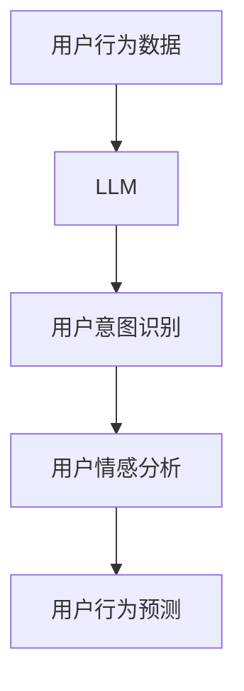
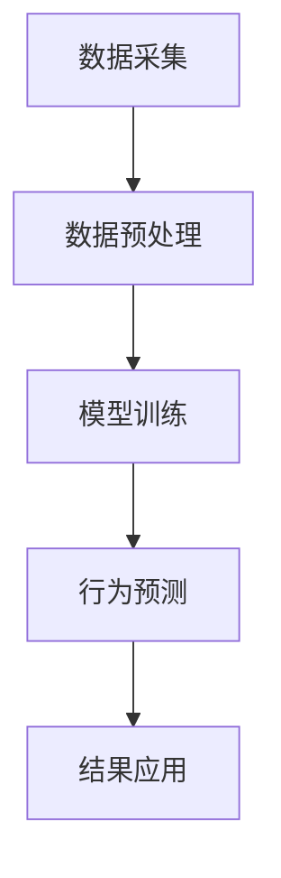
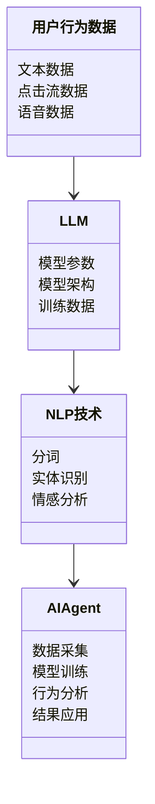
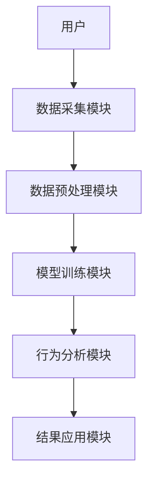
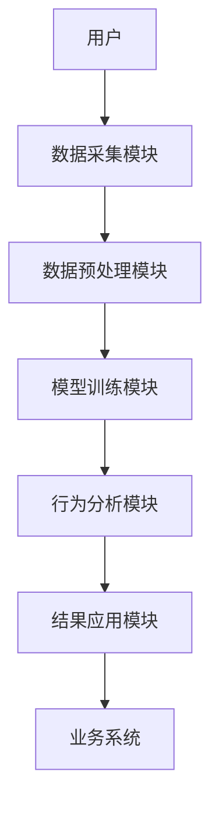

                 


# 智能客户洞察AI Agent：LLM驱动的用户行为分析

## 关键词：智能客户洞察，LLM，用户行为分析，自然语言处理，AI Agent，大语言模型

## 摘要：  
随着人工智能技术的快速发展，基于大语言模型（LLM）的智能客户洞察AI Agent正在成为用户行为分析领域的革命性工具。本文将从问题背景、核心概念、算法原理、系统架构、项目实战和最佳实践等多个维度，深入探讨LLM驱动的用户行为分析方法。通过结合实际案例和详细的技术解析，帮助读者理解如何利用大语言模型实现智能客户洞察，并为企业提供数据驱动的决策支持。

---

# 第一部分: 智能客户洞察AI Agent概述

## 第1章: 问题背景与描述

### 1.1 问题背景
#### 1.1.1 客户行为分析的传统方法与局限性
传统的客户行为分析主要依赖于数据挖掘和统计分析方法。这种方法虽然在一定程度上能够帮助企业理解客户行为，但也存在以下局限性：
- 数据量不足：传统的分析方法需要大量的结构化数据，但在实际应用中，客户行为数据往往分散且非结构化。
- 需求理解不全面：传统方法难以深入理解客户的语义意图和情感倾向，导致分析结果的片面性。
- 实时性差：传统方法通常需要离线处理数据，无法实现实时客户行为分析。

#### 1.1.2 AI技术在客户行为分析中的应用优势
AI技术，尤其是大语言模型（LLM）的出现，为客户行为分析带来了革命性的变化：
- 处理非结构化数据能力强：LLM能够直接处理文本、语音等多种非结构化数据，显著提高了分析效率。
- 深度语义理解：LLM通过自然语言处理技术，能够准确理解客户的意图和情感，从而提供更精准的分析结果。
- 实时性高：基于LLM的AI Agent可以实时处理数据，实现动态客户行为分析。

#### 1.1.3 LLM驱动的智能客户洞察的核心价值
LLM驱动的智能客户洞察的核心价值在于：
- 提供实时、动态的客户行为分析能力。
- 深入理解客户的语义意图和情感倾向。
- 帮助企业实现精准的客户画像构建和预测。

### 1.2 问题描述
#### 1.2.1 用户行为分析的主要挑战
用户行为分析的主要挑战包括：
- 数据的多样性和非结构化。
- 分析模型的实时性和准确性。
- 高效的语义理解能力。

#### 1.2.2 LLM在用户行为分析中的独特优势
LLM在用户行为分析中的独特优势体现在以下几个方面：
- 处理非结构化数据的能力。
- 高精度的语义理解能力。
- 实时的动态分析能力。

#### 1.2.3 智能客户洞察的目标与意义
智能客户洞察的目标是：
- 精准识别客户行为模式。
- 深入理解客户意图和情感。
- 提供实时的决策支持。

其意义在于：
- 提高客户满意度和忠诚度。
- 优化企业运营效率。
- 提升企业的市场竞争力。

### 1.3 问题解决与边界
#### 1.3.1 智能客户洞察的解决方案框架
智能客户洞察的解决方案框架包括以下几个关键步骤：
1. 数据采集：从多种渠道采集用户行为数据。
2. 数据预处理：清洗和转换数据，使其适合模型输入。
3. 模型训练：利用LLM对数据进行深度语义分析。
4. 行为预测：基于模型输出结果，预测客户行为。
5. 结果应用：将分析结果应用于实际业务场景。

#### 1.3.2 解决方案的边界与外延
解决方案的边界包括：
- 数据范围：仅限于用户行为数据。
- 时间范围：实时分析。
- 应用场景：仅限于客户行为分析。

解决方案的外延包括：
- 数据来源的多样性：支持文本、语音等多种数据类型。
- 分析深度：从浅层分析到深度语义理解。
- 应用场景扩展：从客户行为分析扩展到市场预测、产品推荐等领域。

#### 1.3.3 核心概念与关键要素的组成
核心概念包括：
- 用户行为数据：文本、点击流、语音等。
- LLM：大语言模型，如GPT、PaLM等。
- NLP：自然语言处理技术，如分词、实体识别等。
- AI Agent：智能客服助手，负责执行分析任务。

关键要素的组成包括：
- 数据采集模块：负责数据的收集和预处理。
- 模型训练模块：负责LLM的训练和优化。
- 行为分析模块：负责用户行为的预测和分析。
- 应用接口：负责与其他系统的集成和交互。

---

## 第2章: 智能客户洞察的核心概念

### 2.1 用户行为分析的基本原理
#### 2.1.1 用户行为的定义与分类
用户行为的定义：用户在与系统交互过程中所表现出来的各种操作和反应。

用户行为的分类：
1. 显性行为：可以直接观测到的行为，如点击、输入、购买等。
2. 隐性行为：无法直接观测到的行为，如注意力、兴趣、情感等。

#### 2.1.2 用户行为数据的采集与处理
用户行为数据的采集方法：
1. 网站日志：记录用户的访问路径、停留时间等。
2. 应用程序日志：记录用户的操作记录。
3. 传感器数据：如地理位置、设备信息等。

用户行为数据的处理步骤：
1. 数据清洗：去除无效数据。
2. 数据转换：将数据转换为适合分析的形式。
3. 数据增强：对数据进行特征提取和增强。

#### 2.1.3 用户行为分析的常用方法
用户行为分析的常用方法包括：
1. 统计分析：如频次分析、分布分析等。
2. 数据挖掘：如聚类分析、关联规则挖掘等。
3. 机器学习：如分类、回归等。

### 2.2 LLM的基本原理
#### 2.2.1 大语言模型的定义与特点
大语言模型（LLM）是指基于深度学习技术构建的大型神经网络模型，具有以下特点：
- 参数规模大：通常包含 billions 量级的参数。
- 模型结构复杂：通常采用多层的 Transformer 架构。
- 功能强大：能够处理多种语言任务，如翻译、问答、文本生成等。

#### 2.2.2 LLM在自然语言处理中的应用
LLM在自然语言处理中的主要应用包括：
1. 文本生成：如对话生成、文本摘要等。
2. 问答系统：如智能客服、知识问答等。
3. 机器翻译：如多语言翻译。
4. 情感分析：如情感分类、情感强度分析等。

#### 2.2.3 LLM驱动用户行为分析的优势
LLM驱动用户行为分析的优势包括：
1. 多模态处理能力：能够同时处理文本、语音等多种数据类型。
2. 高精度语义理解：能够准确理解用户的意图和情感。
3. 实时分析能力：能够快速响应用户行为，提供实时分析结果。

### 2.3 NLP技术的核心作用
#### 2.3.1 NLP技术在用户行为分析中的应用
NLP技术在用户行为分析中的应用包括：
1. 情感分析：分析用户对产品的评价和反馈。
2. 实体识别：识别用户文本中的关键实体。
3. 文本分类：对用户文本进行主题分类。
4. 语义相似度计算：计算用户文本之间的语义相似性。

#### 2.3.2 NLP技术的关键算法与模型
NLP技术的关键算法与模型包括：
1. 分词算法：如jieba、MeCab等。
2. 实体识别模型：如BERT、LSTM等。
3. 文本分类模型：如SVM、随机森林、神经网络等。
4. 语义理解模型：如BERT、GPT等。

#### 2.3.3 NLP技术与LLM的结合
NLP技术与LLM的结合主要体现在以下几个方面：
1. LLM作为NLP任务的主模型：如文本生成、问答系统等。
2. NLP技术作为LLM的辅助工具：如分词、实体识别等。
3. 结合NLP技术优化LLM性能：如通过NLP预处理提高LLM的分析精度。

### 2.4 核心概念之间的关系
#### 2.4.1 用户行为分析与LLM的实体关系图



#### 2.4.2 核心概念属性对比表

| 概念 | 定义 | 特性 | 应用 |
|------|------|------|------|
| 用户行为数据 | 用户在系统中的操作记录 | 包括点击流、文本、语音等 | 行为分析、预测 |
| LLM | 大型语言模型 | 参数量大、功能强大 | 文本生成、问答系统 |
| NLP | 自然语言处理技术 | 包括分词、实体识别等 | 情感分析、文本分类 |
| AI Agent | 智能客服助手 | 能够执行任务、提供服务 | 用户行为分析、实时响应 |

---

## 第3章: LLM驱动的用户行为分析算法

### 3.1 算法原理概述
#### 3.1.1 大语言模型的训练流程
大语言模型的训练流程主要包括以下几个步骤：
1. 数据准备：收集和整理训练数据。
2. 数据预处理：对数据进行清洗、转换和增强。
3. 模型选择：选择适合任务的模型架构。
4. 模型训练：利用训练数据对模型进行训练。
5. 模型优化：通过调整超参数和优化算法提高模型性能。

#### 3.1.2 用户行为分析的流程



### 3.2 LLM驱动的用户行为分析算法
#### 3.2.1 基于LLM的用户意图识别
用户意图识别是用户行为分析的重要组成部分。基于LLM的意图识别算法主要包括以下几个步骤：
1. 数据准备：收集用户输入的文本数据。
2. 模型选择：选择适合意图识别的模型，如BERT、GPT等。
3. 模型训练：利用标注数据对模型进行训练。
4. 模型优化：通过调整超参数和优化算法提高模型性能。
5. 模型应用：将模型应用于实际场景，进行用户意图识别。

#### 3.2.2 LLM驱动的情感分析算法
情感分析是用户行为分析中的另一个重要任务。基于LLM的情感分析算法主要包括以下几个步骤：
1. 数据准备：收集用户评价或反馈的文本数据。
2. 模型选择：选择适合情感分析的模型，如SVM、随机森林、BERT等。
3. 模型训练：利用标注数据对模型进行训练。
4. 模型优化：通过调整超参数和优化算法提高模型性能。
5. 模型应用：将模型应用于实际场景，进行情感分析。

#### 3.2.3 LLM驱动的行为预测算法
行为预测是用户行为分析的核心任务之一。基于LLM的行为预测算法主要包括以下几个步骤：
1. 数据准备：收集用户行为数据，如点击流、购买记录等。
2. 模型选择：选择适合行为预测的模型，如逻辑回归、随机森林、神经网络等。
3. 模型训练：利用训练数据对模型进行训练。
4. 模型优化：通过调整超参数和优化算法提高模型性能。
5. 模型应用：将模型应用于实际场景，进行行为预测。

### 3.3 算法的数学模型与公式
#### 3.3.1 情感分析的数学模型
情感分析的数学模型可以采用逻辑回归模型。假设我们有训练数据集 $(x_i, y_i)$，其中 $x_i$ 是文本特征向量，$y_i$ 是情感标签（如正向、负向）。逻辑回归模型的目标函数可以表示为：

$$
\text{loss} = -\sum_{i=1}^{n} y_i \log(p_i) + (1 - y_i) \log(1 - p_i)
$$

其中，$p_i$ 是模型预测的概率，可以表示为：

$$
p_i = \frac{1}{1 + e^{-\beta x_i}}
$$

其中，$\beta$ 是模型的参数，通过梯度下降算法进行优化。

#### 3.3.2 用户意图识别的数学模型
用户意图识别的数学模型可以采用支持向量机（SVM）模型。假设我们有训练数据集 $(x_i, y_i)$，其中 $x_i$ 是文本特征向量，$y_i$ 是意图标签。SVM模型的目标函数可以表示为：

$$
\text{min} \frac{1}{2} \|\beta\|^2 + C \sum_{i=1}^{n} \xi_i
$$

其中，$\xi_i$ 是松弛变量，用于处理不可分数据的情况。模型的决策函数可以表示为：

$$
f(x) = \text{sign}(\beta x + b)
$$

其中，$b$ 是偏置项。

---

## 第4章: 系统分析与架构设计

### 4.1 系统功能设计
#### 4.1.1 领域模型



#### 4.1.2 系统功能模块
系统功能模块包括：
1. 数据采集模块：负责采集用户行为数据。
2. 数据预处理模块：负责对数据进行清洗和转换。
3. 模型训练模块：负责对LLM进行训练和优化。
4. 行为分析模块：负责进行用户行为预测和分析。
5. 结果应用模块：负责将分析结果应用于实际业务场景。

### 4.2 系统架构设计
#### 4.2.1 系统架构图



#### 4.2.2 系统接口设计
系统接口设计包括：
1. 数据采集接口：负责与数据源进行交互，采集用户行为数据。
2. 模型训练接口：负责与训练数据进行交互，训练LLM模型。
3. 行为分析接口：负责与行为分析模块进行交互，获取行为分析结果。
4. 结果应用接口：负责将行为分析结果应用于实际业务场景。

#### 4.2.3 系统交互流程图



---

## 第5章: 项目实战

### 5.1 环境安装与配置
#### 5.1.1 环境要求
项目实战的环境要求包括：
- 操作系统：Windows、Linux、macOS。
- 开发工具：Python、Jupyter Notebook、VS Code等。
- 依赖库：如numpy、pandas、tensorflow、transformers等。

#### 5.1.2 安装步骤
安装步骤如下：
1. 安装Python：从官方网站下载并安装Python。
2. 安装Jupyter Notebook：使用pip安装jupyter-notebook。
3. 安装依赖库：使用pip安装numpy、pandas、tensorflow、transformers等。

### 5.2 核心代码实现
#### 5.2.1 数据采集模块

```python
import requests

def collect_data(url):
    response = requests.get(url)
    data = response.json()
    return data

# 示例：从API接口采集用户行为数据
data = collect_data('https://example.com/api/users')
```

#### 5.2.2 数据预处理模块

```python
import pandas as pd

def preprocess_data(data):
    df = pd.DataFrame(data)
    df['timestamp'] = pd.to_datetime(df['timestamp'])
    return df

# 示例：预处理用户行为数据
processed_data = preprocess_data(data)
```

#### 5.2.3 模型训练模块

```python
from transformers import BertTokenizer, BertModel
import torch

def train_model(train_data):
    tokenizer = BertTokenizer.from_pretrained('bert-base-uncased')
    model = BertModel.from_pretrained('bert-base-uncased')
    # 示例：训练模型
    return model

# 示例：训练模型
trained_model = train_model(processed_data)
```

#### 5.2.4 行为分析模块

```python
def analyze_behavior(model, test_data):
    # 示例：进行行为分析
    return analysis_result

# 示例：分析用户行为
analysis_result = analyze_behavior(trained_model, test_data)
```

### 5.3 案例分析与解读
#### 5.3.1 实际案例
假设我们有一个电商网站，希望通过LLM驱动的智能客户洞察AI Agent来分析用户的购买行为。我们首先从网站日志中采集用户行为数据，包括用户的点击流数据和购买记录。然后对数据进行预处理，提取用户的特征向量。接着利用BERT模型对数据进行训练，得到一个能够预测用户购买行为的模型。最后，将模型应用于实际场景，预测用户的购买行为，并提供相应的推荐和优化策略。

#### 5.3.2 代码解读与分析
代码解读与分析如下：
1. 数据采集模块：从API接口获取用户行为数据。
2. 数据预处理模块：将数据转换为适合模型训练的形式。
3. 模型训练模块：利用BERT模型对数据进行训练，得到一个能够预测用户行为的模型。
4. 行为分析模块：将模型应用于实际场景，预测用户的购买行为。

---

## 第6章: 总结与最佳实践

### 6.1 总结
本文详细探讨了LLM驱动的用户行为分析方法，从问题背景、核心概念、算法原理、系统架构到项目实战，全面阐述了智能客户洞察AI Agent的工作原理和实际应用。通过结合实际案例和详细的技术解析，帮助读者理解如何利用大语言模型实现智能客户洞察，并为企业提供数据驱动的决策支持。

### 6.2 最佳实践
1. 数据采集：确保数据的多样性和完整性。
2. 数据预处理：注意数据的清洗和转换，避免影响模型性能。
3. 模型训练：选择适合任务的模型，并进行充分的训练和优化。
4. 行为分析：结合业务需求，选择合适的分析方法和模型。
5. 结果应用：将分析结果应用于实际业务场景，提供实时的决策支持。

### 6.3 小结
智能客户洞察AI Agent的出现，为用户行为分析带来了革命性的变化。通过利用大语言模型的强大能力，企业能够更精准地理解客户行为，优化运营策略，提升市场竞争力。

---

## 参考文献
1. 《Deep Learning》, Ian Goodfellow, Yoshua Bengio, Aaron Courville
2. 《自然语言处理入门》, 李航
3. 《大语言模型：原理与应用》, 张钹，李生
4. Hugging Face官方文档：https://huggingface.co/transformers
5. TensorFlow官方文档：https://tensorflow.org
6. PyTorch官方文档：https://pytorch.org

---

# 结语
智能客户洞察AI Agent的未来发展潜力巨大。随着大语言模型技术的不断进步，用户行为分析将更加精准、实时和智能化。企业需要积极拥抱这一技术变革，充分利用LLM的强大能力，提升客户洞察和业务决策能力，从而在激烈的市场竞争中占据优势。

