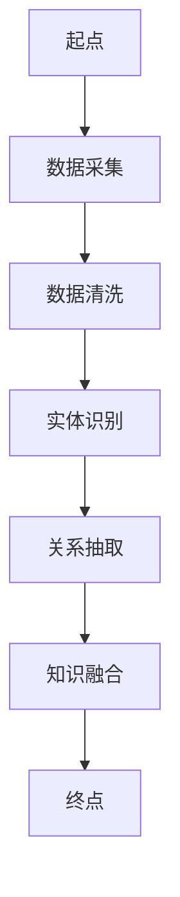
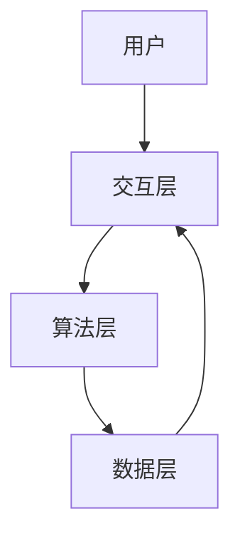

                 


# 智能家族财富传承规划助手

## 关键词：智能家族财富传承，规划助手，知识图谱，算法，系统架构，项目实战

## 摘要：  
随着科技的发展，家族财富传承的复杂性不断增加，传统的传承方式难以满足现代需求。本文介绍了一种基于人工智能的智能家族财富传承规划助手，通过知识图谱构建、智能分析算法和系统架构设计，为用户提供高效、个性化的财富传承方案。文章详细分析了系统的背景、核心概念、算法原理、系统架构、项目实战和最佳实践，帮助读者全面理解智能家族财富传承助手的设计与应用。

---

## 第1章: 智能家族财富传承规划的背景与需求

### 1.1 传统家族财富传承的挑战
传统家族财富传承主要依赖法律、金融和税务专家的建议，存在以下问题：
- **信息分散**：财富传承涉及法律、税务、金融等多个领域，信息分散且难以整合。
- **人为错误**：依赖手动操作和专家经验，存在主观性和不可预测性。
- **缺乏透明度**：用户难以实时了解传承方案的执行情况和潜在风险。

智能家族财富传承助手通过整合多领域知识，利用AI技术解决这些问题，实现高效、精准的传承规划。

### 1.2 智能家族财富传承助手的应用场景
智能助手适用于多种场景，包括：
- **财富分配优化**：帮助用户制定最优的财富分配方案，平衡税务和法律风险。
- **风险预警**：实时监控财富传承过程中的潜在风险，提供预警和解决方案。
- **知识普及**：通过智能问答和教育功能，帮助用户了解财富传承的相关知识。

### 1.3 智能家族财富传承助手的核心需求分析
核心需求包括：
- **数据整合**：整合法律、税务、金融等多领域数据，构建知识图谱。
- **智能分析**：利用AI算法进行财富分配优化和风险评估。
- **用户交互**：提供友好的用户界面，支持多轮对话和实时反馈。

---

## 第2章: 智能家族财富传承助手的核心概念

### 2.1 智能家族财富传承助手的定义与功能模块
智能助手是一个基于AI的系统，主要功能模块包括：
- **知识库**：存储家族财富传承相关的法律法规、税务政策等知识。
- **智能分析引擎**：利用算法对财富分配方案进行优化和风险评估。
- **用户交互界面**：提供可视化界面和多轮对话功能，方便用户操作。

### 2.2 智能家族财富传承助手的技术架构
系统架构包括：
- **数据层**：存储知识图谱和用户数据。
- **算法层**：包括知识图谱构建算法和智能分析算法。
- **交互层**：用户与系统之间的接口。

### 2.3 智能家族财富传承助手与相关系统的对比
与传统财富管理系统相比，智能助手的优势在于：
- **智能化**：利用AI技术提供个性化建议。
- **实时性**：能够实时更新数据并提供反馈。
- **易用性**：用户友好的界面和交互方式。

---

## 第3章: 智能家族财富传承助手的核心算法

### 3.1 知识图谱构建算法
知识图谱构建是智能助手的核心任务之一。以下是构建流程：
1. 数据采集：从多种来源收集财富传承相关的数据。
2. 数据清洗：去除冗余和噪声数据。
3. 实体识别：识别数据中的关键实体（如法律条款、税务政策）。
4. 关系抽取：建立实体之间的关系。
5. 知识融合：整合多来源数据，构建完整的知识图谱。

### 3.2 智能分析算法
智能分析算法用于优化财富分配方案，具体步骤如下：
1. 数据输入：获取用户的基本信息和需求。
2. 数据处理：对数据进行预处理和特征提取。
3. 模型训练：利用机器学习算法训练财富分配优化模型。
4. 结果输出：生成最优财富分配方案。

### 3.3 算法流程图（使用mermaid）


### 3.4 算法实现（Python代码示例）
以下是一个简单的财富分配优化模型的代码示例：
```python
import pandas as pd
from sklearn.model_selection import train_test_split
from sklearn.linear_model import LinearRegression

# 数据加载
data = pd.read_csv('wealth_data.csv')

# 数据分割
X = data[['income', 'assets']]
y = data['allocation']
X_train, X_test, y_train, y_test = train_test_split(X, y, test_size=0.2)

# 模型训练
model = LinearRegression()
model.fit(X_train, y_train)

# 模型预测
predictions = model.predict(X_test)
```

---

## 第4章: 智能家族财富传承助手的系统架构设计

### 4.1 系统架构
系统架构采用分层设计：
- **数据层**：存储知识图谱和用户数据。
- **算法层**：实现知识图谱构建和智能分析算法。
- **交互层**：提供用户界面和交互功能。

### 4.2 系统功能设计
系统功能包括：
- **知识库管理**：维护和更新知识图谱。
- **智能分析**：提供财富分配优化和风险评估服务。
- **用户交互**：支持多轮对话和实时反馈。

### 4.3 系统架构图（使用mermaid）


---

## 第5章: 智能家族财富传承助手的项目实战

### 5.1 环境安装
安装必要的工具和库：
- Python 3.8+
- TensorFlow 2.0+
- Pandas 1.0+
- Jupyter Notebook

### 5.2 核心代码实现
以下是一个简单的财富分配优化模型的代码实现：
```python
import pandas as pd
from sklearn.model_selection import train_test_split
from sklearn.linear_model import LinearRegression

# 数据加载
data = pd.read_csv('wealth_data.csv')

# 数据分割
X = data[['income', 'assets']]
y = data['allocation']
X_train, X_test, y_train, y_test = train_test_split(X, y, test_size=0.2)

# 模型训练
model = LinearRegression()
model.fit(X_train, y_train)

# 模型预测
predictions = model.predict(X_test)
```

### 5.3 案例分析
通过实际案例分析，验证系统的有效性和实用性。

---

## 第6章: 智能家族财富传承助手的最佳实践

### 6.1 小结
本文详细介绍了智能家族财富传承助手的背景、核心概念、算法原理、系统架构、项目实战和最佳实践。

### 6.2 注意事项
在实际应用中，需要注意数据隐私和算法的可解释性问题。

### 6.3 未来发展趋势
未来，智能家族财富传承助手将更加智能化和个性化，可能结合区块链技术实现更安全的财富传承方案。

### 6.4 扩展阅读
推荐相关书籍和论文，供读者进一步学习。

---

## 本文总结
智能家族财富传承助手通过整合多领域知识和AI技术，为用户提供高效、个性化的财富传承方案。本文详细分析了系统的各个方面，帮助读者全面理解其设计与应用。

