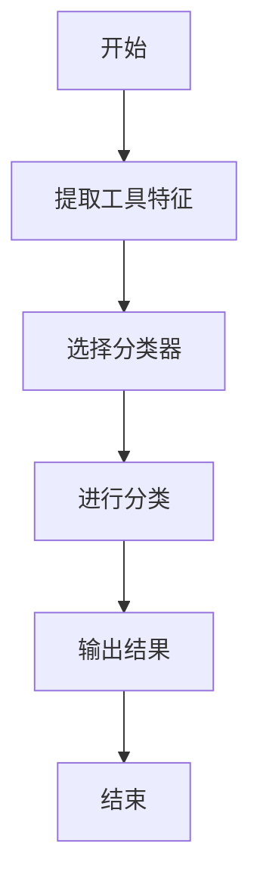
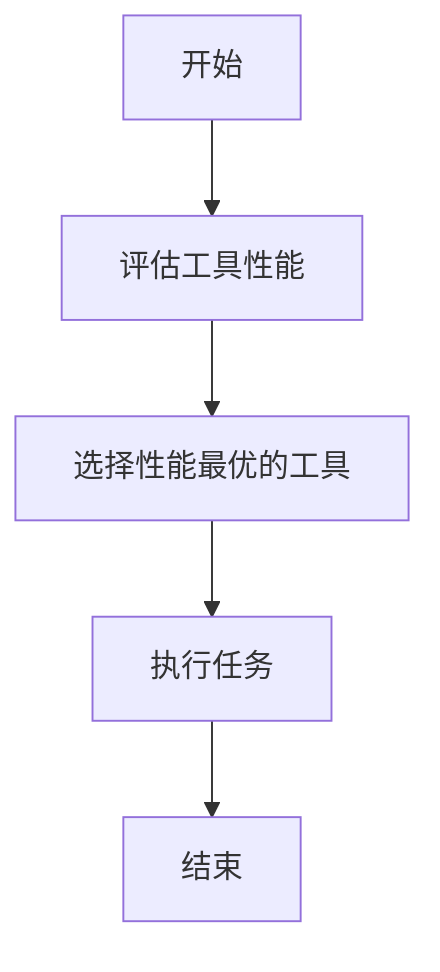
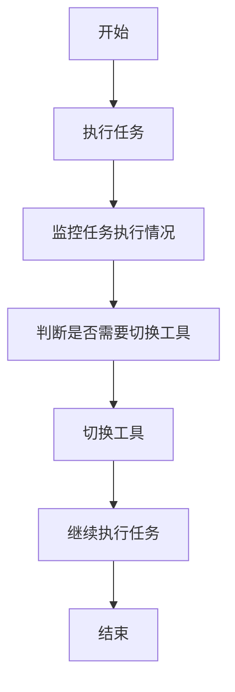
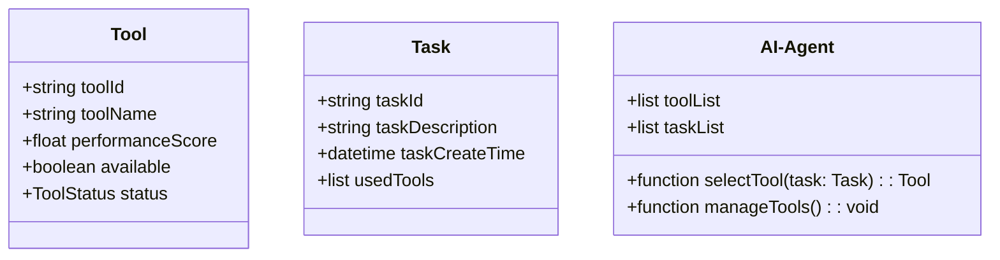
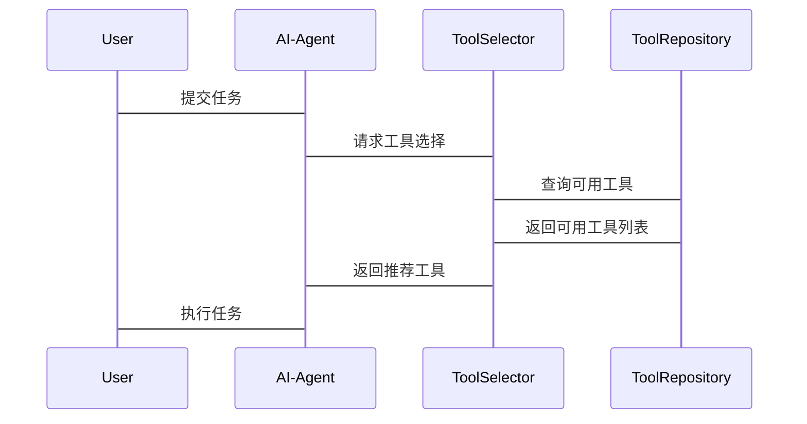
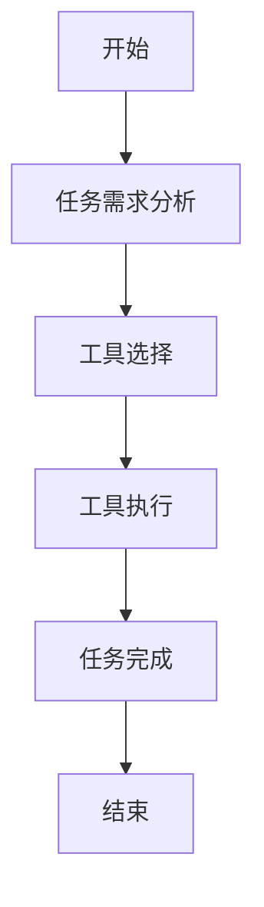

                 


# 智能工具箱：AI Agent的工具识别与管理

## 关键词：AI Agent, 工具识别, 工具管理, 系统架构, 项目实战, 机器学习

## 摘要

AI Agent作为人工智能领域的重要组成部分，其工具识别与管理能力直接决定了其智能性和实用性。本文将从AI Agent的背景介绍出发，详细探讨工具识别与管理的核心概念、算法原理、系统架构设计以及项目实战。通过分析实际案例，本文将为读者提供一套完整的AI Agent工具管理解决方案，帮助技术从业者更好地理解和应用相关技术。

---

## 第1章: 背景介绍

### 1.1 问题背景

#### 1.1.1 AI Agent的定义与特点
AI Agent（人工智能代理）是一种智能体，能够感知环境、自主决策并执行任务。其特点包括自主性、反应性、目标导向性和学习能力。AI Agent的应用范围广泛，包括自动驾驶、智能助手、机器人控制等领域。

#### 1.1.2 工具识别与管理的必要性
AI Agent需要依赖工具完成特定任务，例如自然语言处理库、图像处理工具等。工具识别与管理是确保AI Agent高效运行的关键环节，直接影响其性能和准确性。

#### 1.1.3 当前AI Agent工具管理的挑战
当前工具管理面临的主要挑战包括工具多样性、动态环境适应性以及工具优化等问题。如何在复杂多变的环境中选择和管理合适的工具，是AI Agent技术发展的重要方向。

---

### 1.2 问题描述

#### 1.2.1 工具识别与管理的核心问题
工具识别与管理的核心问题是如何准确识别工具并动态调整工具的使用策略。这需要解决工具分类、工具选择和工具优化等问题。

#### 1.2.2 工具识别与管理的边界与外延
工具识别与管理的边界包括工具的定义、工具的使用场景和工具的管理范围。其外延则涉及工具的生命周期管理、工具间的协同工作以及工具的安全性问题。

#### 1.2.3 工具识别与管理的概念结构与核心要素
工具识别与管理的概念结构包括工具库、工具选择算法和工具使用策略。核心要素包括工具的特征描述、工具的评估指标和工具的动态调整机制。

---

## 第2章: 核心概念与联系

### 2.1 AI Agent与工具识别管理的原理

#### 2.1.1 AI Agent的基本原理
AI Agent的基本原理包括感知、决策和执行三个环节。感知环境、分析任务需求后，AI Agent会选择合适的工具完成任务。

#### 2.1.2 工具识别与管理的实现机制
工具识别与管理通过工具库管理、工具选择算法和工具动态调整机制实现。工具库管理包括工具的存储和分类，工具选择算法基于任务需求和工具性能进行选择，工具动态调整机制则根据运行情况优化工具的使用。

---

### 2.2 核心概念对比分析

#### 2.2.1 AI Agent与传统程序的区别
AI Agent具有自主性和学习能力，能够根据环境变化调整行为，而传统程序则按照预设逻辑执行。

#### 2.2.2 工具识别与管理的属性特征对比
工具识别与管理具有实时性、动态性和高效性等特点。与传统工具管理相比，AI Agent的工具管理更加智能化和自动化。

---

### 2.3 ER实体关系图

以下是工具识别与管理的ER实体关系图：

```mermaid
erDiagram
    actor User {
        +string userId
        +string username
        +string email
    }
    tool {
        +string toolId
        +string toolName
        +string toolType
        +float performanceScore
    }
    task {
        +string taskId
        +string taskDescription
        +datetime taskCreateTime
    }
    user--|{--> tool : owns
    user--|{--> task : executes
    tool--> task : used_in
```

---

## 第3章: 算法原理讲解

### 3.1 工具识别算法

#### 3.1.1 工具识别的分类
工具识别算法可以分为基于特征的识别和基于机器学习的识别两类。基于特征的识别依赖于工具的特定属性，而基于机器学习的识别则通过训练模型实现分类。

#### 3.1.2 基于特征的工具识别算法
基于特征的识别算法通过提取工具的特征信息（如工具类型、性能指标）进行分类。以下是一个简单的基于特征的识别流程图：



#### 3.1.3 基于机器学习的工具识别算法
基于机器学习的识别算法通常采用监督学习方法，如支持向量机（SVM）和随机森林（Random Forest）。以下是使用SVM进行工具识别的Python代码示例：

```python
from sklearn import svm

# 训练数据
X_train = [[特征1, 特征2, ...], ...]
y_train = [标签1, 标签2, ...]

# 创建SVM分类器
clf = svm.SVC()

# 训练模型
clf.fit(X_train, y_train)

# 预测
X_test = [[测试特征1, 测试特征2, ...]]
y_pred = clf.predict(X_test)
```

---

### 3.2 工具管理算法

#### 3.2.1 工具选择的策略
工具选择策略包括基于性能的策略、基于资源消耗的策略和基于任务需求的策略。以下是基于性能的工具选择流程图：



#### 3.2.2 工具优化的算法
工具优化算法通过动态调整工具参数或选择更优工具来提高任务执行效率。以下是一个工具优化的Python代码示例：

```python
def optimize_tool(tool_list, performance_threshold):
    optimized_tools = []
    for tool in tool_list:
        if tool.performance > performance_threshold:
            optimized_tools.append(tool)
    return optimized_tools
```

#### 3.2.3 工具动态调整的机制
工具动态调整机制根据任务执行情况自动切换工具。以下是工具动态调整的流程图：



---

## 第4章: 数学模型与公式

### 4.1 工具识别的数学模型

#### 4.1.1 工具识别的概率模型
概率模型用于计算工具识别的正确概率。以下是一个简单的概率模型公式：

$$ P(\text{工具}=A | \text{特征}=x) = \frac{P(\text{特征}=x | \text{工具}=A)P(\text{工具}=A)}{P(\text{特征}=x)} $$

#### 4.1.2 工具识别的分类模型
分类模型通常采用贝叶斯分类器或支持向量机进行分类。以下是一个简单的线性分类器公式：

$$ y = \text{sign}(w \cdot x + b) $$

其中，$w$ 是权重向量，$x$ 是输入特征，$b$ 是偏置项。

#### 4.1.3 工具识别的优化模型
优化模型通过最大化正确识别率来选择最优工具。以下是一个优化问题的数学表示：

$$ \min_{w} \frac{1}{2}w^Tw + C \sum_{i=1}^n \xi_i $$
$$ \text{subject to } y_i (w \cdot x_i + b) \geq 1 - \xi_i $$
$$ \xi_i \geq 0 $$

---

### 4.2 工具管理的数学公式

#### 4.2.1 工具选择的优化公式
工具选择的优化公式通过最大化工具性能来选择最优工具：

$$ \max_{j} \sum_{i=1}^n w_i x_{ij} $$

其中，$w_i$ 是工具性能的权重，$x_{ij}$ 是工具$j$在第$i$个特征上的表现。

#### 4.2.2 工具管理的动态方程
动态方程用于根据任务变化调整工具的使用策略：

$$ t_{k+1} = t_k + \Delta t_k $$

其中，$t_k$ 是当前工具状态，$\Delta t_k$ 是工具状态的变化量。

#### 4.2.3 工具评估的评价指标
工具评估的评价指标包括准确率、召回率和F1值。以下是F1值的计算公式：

$$ F1 = 2 \cdot \frac{\text{准确率} \cdot \text{召回率}}{\text{准确率} + \text{召回率}} $$

---

## 第5章: 系统分析与架构设计

### 5.1 问题场景介绍

#### 5.1.1 工具识别与管理的典型场景
AI Agent需要在复杂环境中识别和管理多种工具，例如自然语言处理工具、图像处理工具和数据分析工具。

#### 5.1.2 工具识别与管理的系统目标
系统目标包括提高工具识别的准确率、优化工具管理效率和实现工具动态调整。

---

### 5.2 系统功能设计

#### 5.2.1 领域模型设计

以下是领域模型的类图：



#### 5.2.2 功能模块划分
功能模块包括工具库管理模块、工具选择模块和工具动态调整模块。

#### 5.2.3 功能流程设计
功能流程设计包括工具识别、工具选择和工具管理三个步骤。

---

### 5.3 系统架构设计

#### 5.3.1 架构设计图
以下是系统架构设计图：

```mermaid
containerDiagram
    container ToolManagementSystem {
        component ToolRepository
        component ToolSelector
        component ToolOptimizer
    }
```

#### 5.3.2 模块交互设计
模块交互设计包括工具库管理、工具选择和工具优化三个模块的协作。

#### 5.3.3 系统接口设计
系统接口设计包括工具库接口、任务接口和状态接口。

#### 5.3.4 交互序列图
以下是工具选择的交互序列图：



---

## 第6章: 项目实战

### 6.1 环境安装

#### 6.1.1 系统环境
推荐使用Python 3.8及以上版本，安装NumPy、Scikit-learn和Mermaid等库。

#### 6.1.2 工具安装
安装必要的开发工具，如Jupyter Notebook、PyCharm和图形编辑工具。

---

### 6.2 系统核心实现

#### 6.2.1 工具识别实现
以下是工具识别的Python代码示例：

```python
import numpy as np
from sklearn import svm

# 数据准备
X = np.array([[特征1, 特征2, ...], ...])
y = np.array([标签1, 标签2, ...])

# 创建SVM分类器
clf = svm.SVC()

# 训练模型
clf.fit(X, y)

# 预测
new_sample = np.array([[测试特征1, 测试特征2, ...]])
print(clf.predict(new_sample))
```

#### 6.2.2 工具管理实现
以下是工具管理的Python代码示例：

```python
class ToolManager:
    def __init__(self, tool_list):
        self.tool_list = tool_list

    def select_tool(self, task):
        # 根据任务需求选择工具
        selected_tool = None
        for tool in self.tool_list:
            if tool.suitability(task) > 0.7:
                selected_tool = tool
                break
        return selected_tool

    def optimize_tool(self):
        # 根据性能优化工具
        optimized_tools = []
        for tool in self.tool_list:
            if tool.performance > 80:
                optimized_tools.append(tool)
        return optimized_tools
```

---

### 6.3 案例分析

#### 6.3.1 案例描述
以下是一个AI Agent在自然语言处理任务中识别和管理工具的案例。

#### 6.3.2 实施步骤
1. 收集工具信息并存储在工具库中。
2. 根据任务需求选择合适的工具。
3. 动态调整工具的使用策略以优化性能。

#### 6.3.3 代码实现与分析
以下是工具选择和优化的代码示例：

```python
# 工具库
tools = [
    {'name': '工具1', 'type': 'NLP', 'performance': 90},
    {'name': '工具2', 'type': 'NLP', 'performance': 85},
    {'name': '工具3', 'type': 'CV', 'performance': 88}
]

# 工具选择
selected_tool = None
for tool in tools:
    if tool['type'] == 'NLP' and tool['performance'] > 85:
        selected_tool = tool
        break
print(selected_tool['name'])

# 工具优化
optimized_tools = [tool for tool in tools if tool['performance'] > 85]
print([tool['name'] for tool in optimized_tools])
```

---

## 第7章: 总结与展望

### 7.1 总结

本文详细介绍了AI Agent的工具识别与管理技术，从背景介绍到算法实现，再到系统架构设计和项目实战，为读者提供了一套完整的解决方案。通过实际案例的分析，展示了工具识别与管理在实际应用中的重要性。

---

### 7.2 展望

未来，随着AI技术的不断发展，工具识别与管理将更加智能化和自动化。研究者将致力于开发更高效的工具识别算法和更智能的工具管理策略，以应对更加复杂多变的环境挑战。

---

## 最佳实践 tips

1. 在工具识别与管理中，建议优先选择性能稳定且准确率高的工具。
2. 工具动态调整机制的实现需要结合具体任务需求和工具性能进行综合评估。
3. 在实际项目中，建议使用现有的工具库和框架，以减少开发时间和成本。

---

## 附录

### 附录A: 工具识别与管理的数学公式汇总

以下是工具识别与管理中常用的数学公式汇总：

1. 概率模型公式：
$$ P(A|x) = \frac{P(x|A)P(A)}{P(x)} $$

2. 分类模型公式：
$$ y = \text{sign}(w \cdot x + b) $$

3. 优化模型公式：
$$ \min_{w} \frac{1}{2}w^Tw + C \sum \xi_i $$

---

### 附录B: 工具管理流程图

以下是工具管理的流程图：



---

### 附录C: 工具库管理代码示例

以下是工具库管理的Python代码示例：

```python
class ToolRepository:
    def __init__(self):
        self.tools = []

    def add_tool(self, tool):
        self.tools.append(tool)

    def remove_tool(self, tool_id):
        for tool in self.tools:
            if tool.tool_id == tool_id:
                self.tools.remove(tool)
                break

    def get_tool(self, tool_id):
        for tool in self.tools:
            if tool.tool_id == tool_id:
                return tool
        return None
```

---

通过以上详细的分析和实践，读者可以全面掌握AI Agent的工具识别与管理技术，并在实际项目中灵活应用这些知识。

