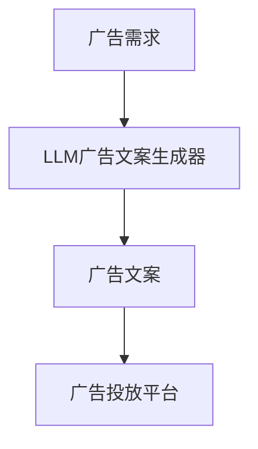
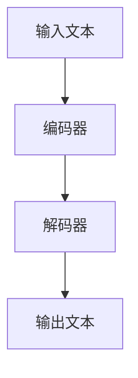

                 

# 智能广告文案 AI Agent：LLM 在广告创意中的应用

> 关键词：智能广告、AI Agent、LLM、广告创意、大语言模型

> 摘要：本文深入探讨了智能广告文案生成中AI Agent的应用，重点分析了LLM（大语言模型）在广告创意中的核心作用。通过系统介绍LLM的算法原理、广告文案生成的系统架构设计以及实际案例分析，详细阐述了LLM在广告创意领域的潜力与挑战。文章从背景介绍、算法解析、系统设计到实战应用，全面剖析了智能广告文案生成的技术细节，为广告行业和技术从业者提供了深刻的洞察与实践指导。

---

## 第一章：智能广告文案与AI Agent概述

### 1.1 问题背景与描述

#### 1.1.1 广告创意的痛点与挑战
现代广告行业面临创意需求的急剧增长，广告文案的创作需要兼顾创意性、吸引力和精准性。然而，传统广告创意过程中存在以下痛点：
- **创意瓶颈**：广告文案的创作需要不断尝试和调整，但创意枯竭的问题屡见不鲜。
- **效率低下**：从创意构思到落地实施的周期长，难以满足快速变化的市场需求。
- **个性化需求**：消费者对广告内容的个性化需求日益增加，传统广告难以实现精准匹配。

#### 1.1.2 AI技术在广告领域的应用前景
人工智能（AI）技术的快速发展为广告行业带来了新的可能性。AI能够通过数据驱动的方式，快速生成符合目标受众需求的广告文案，大幅提升了广告创作的效率和精准度。特别是大语言模型（LLM）的出现，为广告文案的智能化生成提供了强大的技术支持。

#### 1.1.3 LLM在广告文案中的独特优势
大语言模型（LLM）在广告创意中的独特优势主要体现在以下方面：
- **强大的语言处理能力**：LLM能够理解和生成自然语言，具备生成多样化广告文案的能力。
- **数据驱动的精准性**：通过海量数据的训练，LLM能够生成符合目标受众偏好的广告内容。
- **高效迭代能力**：LLM可以在短时间内生成多个创意方案，帮助广告从业者快速筛选最优解。

### 1.2 问题解决与边界

#### 1.2.1 AI Agent在广告创意中的具体应用
AI Agent（智能代理）在广告创意中的具体应用包括：
- **智能文案生成**：通过LLM生成广告文案初稿。
- **创意优化**：基于数据分析，优化广告文案的吸引力和转化率。
- **个性化推荐**：根据用户行为数据，推荐适合的广告文案风格。

#### 1.2.2 LLM在广告文案生成中的边界与限制
尽管LLM在广告文案生成中表现出色，但其应用也存在一定的边界和限制：
- **创意的独特性**：LLM生成的内容可能存在一定的重复性，难以完全替代人类的创造性思维。
- **数据质量依赖**：生成效果依赖于训练数据的质量和多样性，数据偏差可能影响广告文案的准确性。
- **上下文理解**：LLM对特定领域知识的理解可能存在局限性，需要结合领域知识进行微调。

#### 1.2.3 智能广告文案的实现路径与方法
实现智能广告文案的关键路径包括：
1. **需求分析**：明确广告目标、目标受众和核心信息。
2. **数据准备**：收集与广告主题相关的海量数据，包括文本、图像、用户行为数据等。
3. **模型选择与训练**：选择适合的LLM模型，并进行针对性的微调。
4. **生成与优化**：利用AI Agent生成广告文案初稿，并通过多轮优化提升文案质量。
5. **效果评估**：通过A/B测试等方式评估广告文案的效果，并进行数据反馈，持续优化模型。

### 1.3 核心概念与结构

#### 1.3.1 智能广告文案的定义与组成
智能广告文案是指通过AI技术生成的、具备高度个性化和精准性的广告内容。其组成主要包括：
- **广告标题**：吸引用户注意的核心内容。
- **广告描述**：详细描述产品或服务的核心价值。
- **关键词优化**：优化广告文案中的关键词，提高搜索广告的点击率。

#### 1.3.2 AI Agent的基本构成与功能
AI Agent在广告创意中的基本构成包括：
- **输入模块**：接收广告需求、目标受众信息等输入数据。
- **处理模块**：利用LLM生成广告文案初稿。
- **优化模块**：基于数据分析和反馈，优化广告文案。
- **输出模块**：输出优化后的广告文案。

#### 1.3.3 LLM在广告文案生成中的角色与作用
在广告文案生成过程中，LLM主要承担以下角色：
- **内容生成器**：生成广告文案初稿。
- **创意辅助工具**：为广告从业者提供创意灵感和优化建议。
- **数据驱动的优化器**：通过数据分析优化广告文案的吸引力和转化率。

---

## 第二章：LLM与广告创意的核心联系

### 2.1 LLM的基本原理与特点

#### 2.1.1 大语言模型的定义与核心特征
大语言模型（LLM）是指基于Transformer架构的大规模预训练语言模型。其核心特征包括：
- **大规模训练数据**：通常基于数百万甚至数十亿的文本数据进行预训练。
- **自注意力机制**：能够捕捉文本中的长距离依赖关系。
- **生成能力**：具备生成多样化文本的能力。

#### 2.1.2 LLM在广告文案生成中的优势
LLM在广告文案生成中的优势主要体现在：
- **多样性**：能够生成多种风格和主题的广告文案。
- **精准性**：通过数据驱动的方式，生成符合目标受众偏好的内容。
- **高效性**：能够在短时间内生成大量广告文案初稿。

#### 2.1.3 LLM与传统广告创意工具的对比分析
以下是LLM与传统广告创意工具的对比分析表：

| 对比维度         | LLM                          | 传统广告创意工具                 |
|------------------|----------------------------|---------------------------------|
| 创作效率         | 高，可以快速生成多版本       | 低，依赖人工创意                 |
| 数据依赖         | 高，依赖高质量训练数据       | 低，依赖创意人员的经验           |
| 个性化能力       | 强，能够实现精准的个性化推荐   | 弱，难以快速满足个性化需求       |
| 成本             | 低，自动化生成降低成本       | 高，需要大量人工投入             |

### 2.2 核心概念的属性对比

#### 2.2.1 LLM与传统广告创意工具的对比表格
如上表所示，LLM在广告文案生成中的优势明显。

#### 2.2.2 LLM在广告文案生成中的独特性
LLM的独特性主要体现在其强大的语言理解和生成能力，能够通过上下文理解广告需求，并生成符合语境的广告文案。

#### 2.2.3 LLM与其他AI技术的协同作用
LLM可以与其他AI技术协同作用，例如：
- **计算机视觉**：结合图像识别技术，生成图文结合的广告内容。
- **数据分析**：结合用户行为分析，优化广告文案的投放策略。

### 2.3 实体关系与架构

#### 2.3.1 实体关系图
以下是LLM广告文案生成系统的实体关系图：

---

## 第三章：LLM的算法原理

### 3.1 模型结构与训练方法

#### 3.1.1 大语言模型的基本结构
大语言模型的基本结构包括：
- **编码器**：将输入文本编码为向量表示。
- **解码器**：根据编码后的向量生成输出文本。

#### 3.1.2 基于Transformer的LLM训练流程
以下是基于Transformer的LLM训练流程：

#### 3.1.3 LLM的预训练与微调过程
预训练过程使用大规模通用数据进行无监督学习，微调过程则使用特定领域的数据进行有监督优化。

---

通过以上分析，我们可以看到，智能广告文案生成是一个复杂但充满潜力的领域，LLM的应用为广告行业带来了革命性的变化。接下来，我们将深入探讨广告文案生成的算法原理、系统架构设计以及实际案例分析，帮助读者更好地理解和应用这一技术。

