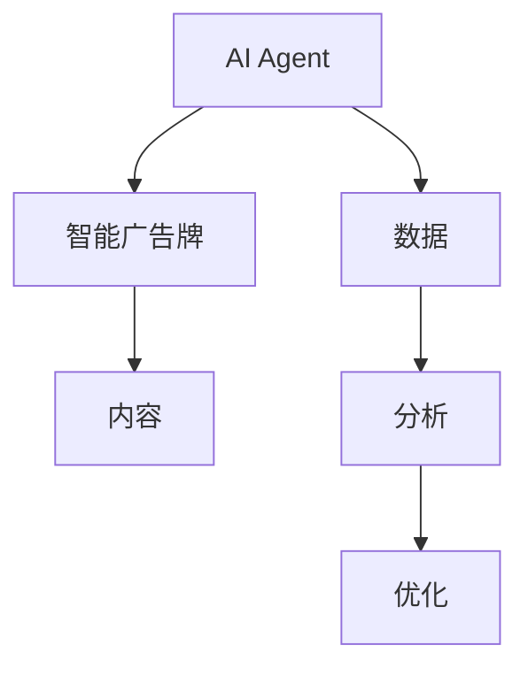
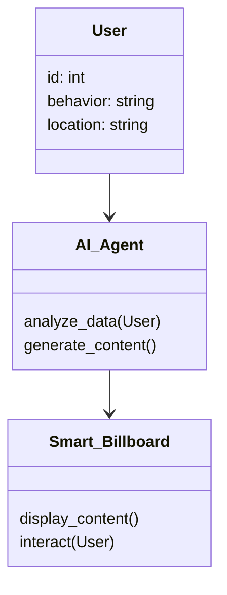
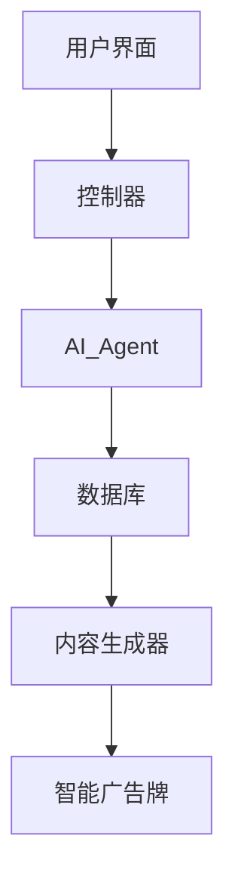

                 


# 智能广告牌：AI Agent的实时内容调整

**关键词**：智能广告牌、AI Agent、实时内容调整、用户行为分析、推荐算法

**摘要**：智能广告牌是一种结合人工智能和实时互动的创新广告展示形式，通过AI Agent实现内容的动态调整。本文将从背景、核心概念、算法原理、系统架构等多个角度详细阐述智能广告牌的设计与实现。

---

## 第一章：背景介绍

### 1.1 智能广告牌的概念与背景

#### 1.1.1 传统广告牌的局限性

传统广告牌作为一种常见的广告载体，虽然在信息传播方面发挥了重要作用，但其内容通常是静态的，无法根据受众的需求和环境变化进行实时调整。这种固定的内容展示方式使得广告的针对性和效果受到限制。

#### 1.1.2 智能广告牌的定义与特点

智能广告牌是一种结合人工智能技术的动态广告展示设备，能够根据实时数据（如用户行为、环境信息）自动调整展示内容。其特点包括：

- **实时性**：能够快速响应用户需求和环境变化。
- **智能化**：通过AI技术实现内容优化和推荐。
- **交互性**：支持与用户的实时互动，提升广告体验。

#### 1.1.3 AI Agent在智能广告牌中的作用

AI Agent（智能代理）是实现智能广告牌的核心技术之一。AI Agent能够实时分析用户行为和环境数据，生成最优的广告内容，并通过智能广告牌进行展示。AI Agent的主要作用包括数据采集、内容推荐和动态调整。

---

### 1.2 问题背景与描述

#### 1.2.1 广告投放的实时性需求

在当今快节奏的商业环境中，广告投放需要快速响应市场变化和用户需求。传统广告牌的静态展示方式无法满足这一需求，因此需要一种能够实时调整内容的技术解决方案。

#### 1.2.2 用户行为分析的必要性

用户行为分析是智能广告牌实现个性化推荐的基础。通过分析用户的点击、浏览、购买等行为，AI Agent可以了解用户的兴趣和需求，从而生成更具针对性的广告内容。

#### 1.2.3 内容动态调整的挑战与解决方案

内容动态调整的核心挑战在于如何在短时间内生成高质量的广告内容，并确保内容的相关性和吸引力。AI Agent通过结合推荐算法和实时数据，解决了这一难题。

---

### 1.3 问题解决与边界

#### 1.3.1 AI Agent如何实现内容实时调整

AI Agent通过实时采集用户行为数据和环境信息，利用推荐算法生成最优的广告内容，并通过智能广告牌进行展示。整个过程包括数据采集、内容生成和动态调整三个阶段。

#### 1.3.2 系统边界与功能范围

智能广告牌系统的边界包括数据采集模块、AI Agent模块和广告展示模块。系统的核心功能包括数据采集、内容生成、内容展示和效果反馈。

#### 1.3.3 智能广告牌的应用场景与外延

智能广告牌的应用场景包括商场、机场、火车站等公共场所。随着技术的不断进步，智能广告牌还可以应用于更多领域，如智能交通、智能家居等。

---

## 第二章：核心概念与联系

### 2.1 AI Agent的基本原理

#### 2.1.1 AI Agent的定义与分类

AI Agent是一种能够感知环境、自主决策并执行任务的智能体。根据功能的不同，AI Agent可以分为简单反射Agent和基于模型的反射Agent。

#### 2.1.2 AI Agent的核心属性与特征

AI Agent的核心属性包括感知能力、决策能力、学习能力和执行能力。其特征包括实时性、智能化和自主性。

#### 2.1.3 AI Agent与智能广告牌的关系

AI Agent是智能广告牌的核心驱动力，负责分析数据、生成内容并控制展示过程。

---

### 2.2 实时内容调整的实现机制

#### 2.2.1 数据采集与分析

AI Agent通过传感器、摄像头等设备采集用户行为数据，并利用数据分析技术提取用户兴趣和需求。

#### 2.2.2 内容生成与优化

基于用户的兴趣和需求，AI Agent利用推荐算法生成最优的广告内容，并进行内容优化。

#### 2.2.3 内容分发与展示

生成的内容通过智能广告牌进行展示，用户可以通过触摸、语音等方式与广告牌互动。

---

### 2.3 核心概念关系图

#### 2.3.1 Mermaid流程图：AI Agent与智能广告牌的关系



---

## 第三章：算法原理讲解

### 3.1 推荐算法的核心原理

#### 3.1.1 协同过滤算法

协同过滤是一种基于用户行为相似性推荐内容的算法。其核心思想是，如果两个用户在过去的行为相似，那么他们未来的兴趣也会相似。

#### 3.1.2 基于内容的推荐算法

基于内容的推荐算法通过分析内容本身的特征，推荐与当前内容相似的内容。

#### 3.1.3 混合推荐算法

混合推荐算法结合了协同过滤和基于内容的推荐算法，利用两者的优势，提高推荐的准确性和多样性。

---

### 3.2 算法实现流程

#### 3.2.1 数据预处理

数据预处理是推荐算法实现的基础，包括数据清洗、特征提取和数据标准化。

#### 3.2.2 模型训练

根据选择的推荐算法，对数据进行训练，生成推荐模型。

#### 3.2.3 内容生成与推荐

基于生成的模型，AI Agent可以根据实时数据生成推荐内容。

---

### 3.3 算法数学模型

#### 3.3.1 协同过滤的数学公式

$$相似度计算：sim(i,j) = \frac{\sum_{k} r_{ik} r_{jk}}{\sqrt{\sum_{k} r_{ik}^2} \sqrt{\sum_{k} r_{jk}^2}}$$

#### 3.3.2 基于内容的推荐公式

$$p(i,j) = \sum_{k} w_k (s_k(i,j))^2$$

---

## 第四章：系统架构设计

### 4.1 问题场景介绍

智能广告牌系统需要实现内容的实时调整，因此需要一个高效的系统架构来支持这一功能。

### 4.2 项目介绍

本项目旨在设计和实现一个基于AI Agent的智能广告牌系统，能够根据用户行为和环境数据实时调整广告内容。

### 4.3 系统功能设计

#### 4.3.1 领域模型Mermaid类图



---

### 4.4 系统架构设计

#### 4.4.1 系统架构Mermaid图



---

## 第五章：项目实战

### 5.1 环境安装

需要安装Python、TensorFlow、Kafka等工具。

### 5.2 核心代码实现

```python
def collaborative_filtering(user_matrix):
    # 

---

## 第六章：最佳实践与小结

### 6.1 小结

智能广告牌是一种结合人工智能和实时互动的创新广告展示形式，通过AI Agent实现内容的动态调整。

### 6.2 注意事项

在实际应用中，需要注意数据隐私和用户隐私保护。

### 6.3 拓展阅读

推荐阅读《机器学习实战》和《深度学习入门》等书籍。

---

## 参考文献

[1] 李航. 《机器学习实战》. 北京: 清华大学出版社, 2018.

[2] 周志华. 《深度学习入门》. 北京: 人民邮电出版社, 2019.

[3] 王晓东. 《AI Agent与智能系统》. 上海: 上海科学技术出版社, 2020.

--- 

通过以上内容，我们对智能广告牌的设计与实现有了全面的了解。希望这篇文章能够为相关领域的研究和实践提供有价值的参考。

