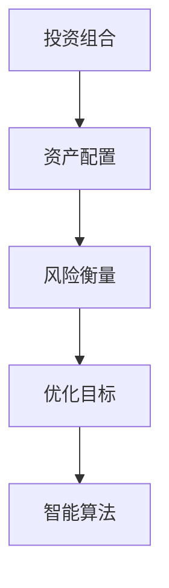

                 


# 智能投资组合再平衡策略优化与执行

> 关键词：智能投资组合、再平衡策略、优化算法、系统架构、风险管理

> 摘要：本文系统地探讨了智能投资组合再平衡策略的优化与执行，从背景分析、核心概念、数学模型、算法实现到系统架构和项目实战，全面解析了智能再平衡策略的设计与应用，旨在为读者提供一套高效、可靠的解决方案。

---

## 第一部分：智能投资组合再平衡的背景与核心概念

### 第1章：智能投资组合再平衡的背景与问题描述

#### 1.1 投资组合再平衡的背景

**1.1.1 传统投资组合管理概述**

投资组合管理是金融领域的重要组成部分，传统的投资组合管理依赖于定期检查和调整资产配置，以维持预期的风险和收益水平。然而，这种方法在面对市场波动和复杂的投资环境时显得力不从心。传统方法通常采用固定的时间间隔（如每月或每季度）进行再平衡，这种静态的方法难以适应市场变化的动态性。

**1.1.2 再平衡的定义与作用**

再平衡是指根据市场变化和投资者的财务状况调整投资组合的过程，以确保资产配置与投资目标一致。其作用包括：

1. **维持目标资产配置**：防止偏离预期的投资比例。
2. **优化风险收益比**：通过调整资产权重，降低风险或提高收益。
3. **应对市场波动**：及时捕捉市场机会，避免重大损失。

**1.1.3 智能投资组合的兴起**

随着科技的发展，智能投资组合借助算法和大数据分析，能够实时监控市场变化并动态调整资产配置。智能再平衡通过自动化和智能化的方法，提高了效率和准确性，降低了人为干预带来的误差。

#### 1.2 智能投资组合再平衡的必要性

**1.2.1 市场波动与资产配置变化**

市场波动频繁，传统再平衡方法难以及时捕捉变化，可能导致收益损失或风险增加。智能再平衡能够实时跟踪市场动态，及时调整配置，抓住市场机会。

**1.2.2 传统再平衡方法的局限性**

传统方法通常基于固定的时间间隔，导致以下问题：

- **反应迟钝**：无法及时应对短期市场波动。
- **交易成本高**：频繁的调整可能导致高昂的交易费用和滑点损失。
- **缺乏个性化**：未能根据投资者的具体情况定制策略。

**1.2.3 智能再平衡的优势与应用场景**

智能再平衡的优势包括：

- **实时监控**：能够快速响应市场变化。
- **降低成本**：通过优化交易策略，减少不必要的交易。
- **个性化定制**：根据投资者的风险偏好和财务状况，制定专属策略。

应用场景包括：

- **机构投资**：优化大型投资组合的管理。
- **个人理财**：为散户提供个性化的投资服务。
- **风险管理**：在市场剧烈波动时，保护投资者的资产安全。

#### 1.3 智能投资组合再平衡的核心问题

**1.3.1 动态资产配置问题**

动态资产配置要求根据市场变化不断调整资产权重，以实现最优的收益和风险比。这需要精确的市场预测和高效的计算能力。

**1.3.2 交易成本与滑点优化**

频繁的交易可能导致高额的交易成本和滑点损失。智能再平衡需要在调整时机和频率上进行优化，平衡成本和收益。

**1.3.3 风险管理与收益最大化**

在再平衡过程中，如何在控制风险的同时最大化收益是核心挑战。需要建立有效的风险衡量指标和优化模型。

### 第2章：智能投资组合再平衡的核心概念与联系

#### 2.1 现代投资组合理论（MPT）

**2.1.1 MPT的基本原理**

MPT由Harry Markowitz提出，认为最优投资组合是在有效前沿上，即在给定风险下收益最高，或在给定收益下风险最小的投资组合。

**2.1.2 有效前沿的概念**

有效前沿是所有可行投资组合中风险-收益比最优的点的集合。投资者可以通过调整资产权重，在有效前沿上找到最适合自己的投资组合。

**2.1.3 风险与收益的权衡**

MPT通过均值-方差优化，帮助投资者找到最优风险和收益的平衡点。

#### 2.2 风险衡量与优化目标

**2.2.1 风险衡量指标**

- **VaR（在险值）**：特定置信水平下可能的损失。
- **CVaR（条件在险值）**：VaR的平均损失，更适用于风险厌恶型投资者。

**2.2.2 优化目标的数学表达**

优化目标通常是最小化风险或最大化收益，可以表示为：

$$ \text{目标函数} = \min_{w} w^T \Sigma w $$

其中，\( w \) 是资产权重向量，\( \Sigma \) 是资产的协方差矩阵。

**2.2.3 不同风险偏好下的优化策略**

- **风险中性型**：平衡风险和收益。
- **风险厌恶型**：优先选择低风险高收益的投资组合。
- **风险偏好型**：愿意承担更高风险以追求更高收益。

#### 2.3 智能优化算法

**2.3.1 常见优化算法概述**

- **遗传算法**：模拟自然选择，通过适应度函数进行筛选和变异。
- **粒子群优化（PSO）**：通过粒子群体的运动寻找最优解。
- **模拟退火**：通过逐步降温减少局部最优，寻找全局最优。

**2.3.2 智能算法的特点**

- **全局搜索能力**：能够跳出局部最优，找到全局最优。
- **自适应性**：能够根据环境变化调整搜索策略。
- **并行性**：多个个体或粒子同时搜索，提高效率。

**2.3.3 算法选择与应用场景**

选择算法时需要考虑问题的规模、约束条件和计算能力。例如，遗传算法适用于组合优化，粒子群优化适用于路径规划。

#### 2.4 核心概念的关系图

使用 Mermaid 绘制核心概念关系图：



### 第3章：智能投资组合再平衡的数学模型与算法原理

#### 3.1 投资组合优化的数学模型

**3.1.1 优化目标的数学表达**

优化目标通常是最小化风险或最大化收益，可以用以下公式表示：

$$ \text{目标函数} = \min_{w} w^T \Sigma w $$

其中，\( \Sigma \) 是资产的协方差矩阵，\( w \) 是资产权重向量。

**3.1.2 约束条件**

优化问题需要满足以下约束：

$$ \sum_{i=1}^{n} w_i = 1 $$

$$ w_i \geq 0 \quad \forall i $$

这些约束确保了权重的和为1，并且每个资产的权重非负。

#### 3.2 智能优化算法的原理

**3.2.1 遗传算法的步骤**

1. 初始化种群：随机生成一组初始解。
2. 计算适应度：评估每个解的优劣。
3. 选择与交叉：根据适应度选择优秀解，并进行交叉生成新解。
4. 变异：对新解进行随机变异，增加多样性。
5. 重复步骤2-4，直到满足收敛条件。

**3.2.2 粒子群优化的流程**

1. 初始化粒子群：随机生成一群粒子。
2. 计算适应度：评估每个粒子的适应度。
3. 更新记忆：记录每个粒子的最优位置和全局最优位置。
4. 更新速度：根据当前位置、个人最优和全局最优更新速度。
5. 更新位置：根据速度更新位置。
6. 重复步骤2-5，直到收敛。

#### 3.3 算法实现的流程图

使用 Mermaid 绘制遗传算法流程图：

```mermaid
graph TD
A[开始] --> B[初始化种群]
B --> C[计算适应度]
C --> D[选择与交叉]
D --> E[变异与适应度计算]
E --> F[检查收敛条件]
F --> G[收敛？]
G --> H[结束]

