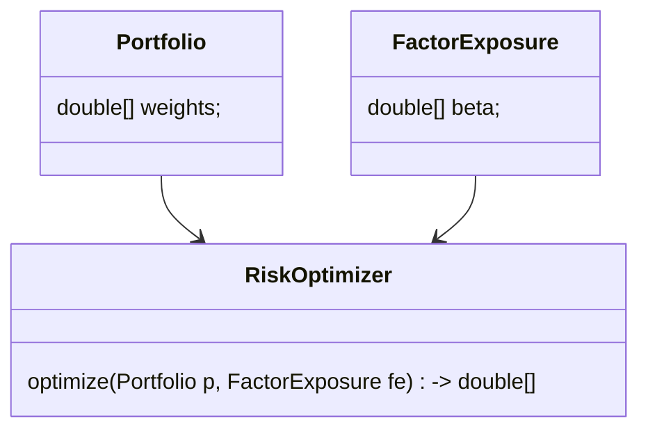
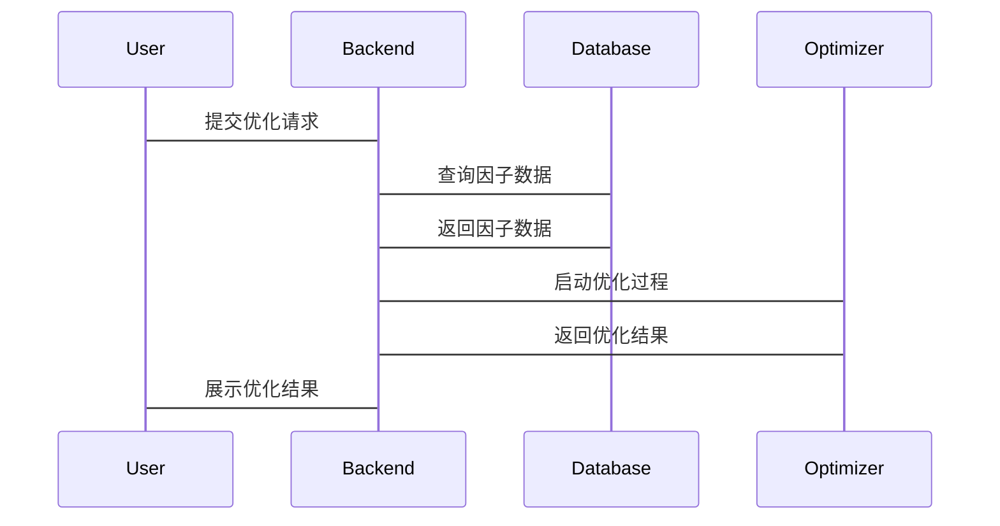

                 


# 智能投资组合因子暴露优化模型

## 关键词：智能投资组合，因子暴露，风险优化，投资组合管理，智能算法，金融建模

## 摘要：本文介绍了一种基于智能算法的优化模型，用于投资组合中因子暴露的优化，通过数学建模和算法设计，解决了传统投资组合管理中的风险控制问题，提升了投资组合的风险收益比。文章详细讲解了因子暴露优化的核心概念、算法原理、系统架构以及实际应用案例，为金融从业者和研究人员提供了理论支持和实践指导。

---

# 第1章: 投资组合因子暴露优化的背景与问题

## 1.1 投资组合管理与风险控制

### 1.1.1 投资组合管理的基本概念
投资组合管理是金融领域的重要组成部分，涉及对资产的配置、监控和调整，以实现投资目标。现代投资组合理论（MPT）强调通过分散化投资来降低风险。

### 1.1.2 风险控制的重要性
风险控制是投资组合管理的核心任务之一。通过优化因子暴露，可以有效降低投资组合对特定风险因素的敏感性，提高整体的稳定性。

### 1.1.3 因子暴露在投资组合管理中的作用
因子暴露反映了投资组合对特定风险因子的敏感程度，是风险管理和优化的重要依据。

## 1.2 因子暴露的定义与特点

### 1.2.1 因子暴露的定义
因子暴露是衡量投资组合对某一风险因子的敏感程度的指标，通常用Beta系数来表示。

### 1.2.2 因子暴露的核心特点
- **可量化性**：可以通过数学模型计算。
- **动态性**：受市场环境和资产权重的影响。
- **风险导向性**：直接关联投资组合的总体风险。

## 1.3 智能投资组合优化的必要性

### 1.3.1 传统投资组合优化的局限性
传统方法依赖于均值-方差模型，但在实际应用中，因子暴露的优化往往被忽视。

### 1.3.2 智能优化的优势
智能算法能够处理复杂的非线性优化问题，提高优化效率和精度。

### 1.3.3 智能因子暴露优化的场景与应用
在多因子模型、风险对冲、资产配置等领域具有广泛的应用。

## 1.4 本章小结
本章介绍了投资组合管理与风险控制的基本概念，详细讲解了因子暴露的定义和特点，分析了智能优化的必要性和应用场景。

---

# 第2章: 因子暴露优化的核心概念

## 2.1 因子暴露的数学定义

### 2.1.1 因子暴露的公式表示
因子暴露可以表示为：
$$
\beta_i = \frac{\sum_{j=1}^{n} w_j \cdot Cov(r_j, r_k)}{\sigma_k^2}
$$
其中，$w_j$是资产j的权重，$Cov(r_j, r_k)$是资产j与因子k的协方差，$\sigma_k^2$是因子k的方差。

### 2.1.2 因子权重的计算方法
通过多元回归分析，计算每个资产对各个因子的暴露程度。

### 2.1.3 因子暴露与投资组合风险的关系
因子暴露是投资组合风险的重要组成部分，直接影响整体风险水平。

## 2.2 因子暴露优化的目标

### 2.2.1 最小化风险暴露
通过调整资产权重，降低投资组合对高风险因子的暴露。

### 2.2.2 最大化收益与风险的平衡
在控制风险的前提下，实现收益的最大化。

### 2.2.3 符合监管要求的优化目标
满足相关监管机构对投资组合风险敞口的限制。

## 2.3 因子暴露优化的关键因素

### 2.3.1 因子权重的调整
通过智能算法优化因子权重，降低整体风险。

### 2.3.2 投资组合的分散化
通过分散化投资降低单一因子的风险影响。

### 2.3.3 市场风险与流动性风险的平衡
在优化过程中，需同时考虑市场风险和流动性风险的平衡。

## 2.4 本章小结
本章详细阐述了因子暴露优化的核心概念，包括数学定义、优化目标和关键因素，为后续的模型构建奠定了基础。

---

# 第3章: 因子暴露优化的数学模型

## 3.1 优化目标函数

### 3.1.1 风险最小化目标函数
$$
\min \sum_{i=1}^{n} w_i \cdot \beta_i
$$
其中，$w_i$是资产i的权重，$\beta_i$是资产i的因子暴露。

### 3.1.2 收益最大化目标函数
$$
\max \sum_{i=1}^{n} w_i \cdot r_i
$$
其中，$r_i$是资产i的预期收益。

### 3.1.3 综合目标函数
$$
\min \left( \lambda \sum_{i=1}^{n} w_i \cdot \beta_i - (1 - \lambda) \sum_{i=1}^{n} w_i \cdot r_i \right)
$$
其中，$\lambda$是风险权重。

## 3.2 约束条件

### 3.2.1 投资组合权重约束
$$
\sum_{i=1}^{n} w_i = 1
$$
### 3.2.2 风险暴露约束
$$
\sum_{i=1}^{n} w_i \cdot \beta_i \leq \text{threshold}
$$
### 3.2.3 流动性约束
$$
w_i \geq 0
$$

## 3.3 数学模型的构建与求解

### 3.3.1 模型构建步骤
1. 确定因子暴露的计算方法。
2. 定义优化目标函数和约束条件。
3. 使用优化算法求解模型。

### 3.3.2 模型求解方法
使用拉格朗日乘数法或智能算法求解优化问题。

### 3.3.3 示例计算与分析
通过具体案例，展示模型的计算过程和结果。

## 3.4 本章小结
本章构建了因子暴露优化的数学模型，详细讲解了目标函数和约束条件，并通过示例分析了模型的应用。

---

# 第4章: 智能优化算法的设计与实现

## 4.1 常见智能优化算法

### 4.1.1 遗传算法
- **编码**：将变量表示为基因序列。
- **适应度函数**：目标函数。
- **选择**：基于适应度值选择优秀个体。
- **交叉**：生成子代。
- **变异**：随机改变基因。

### 4.1.2 模拟退火算法
- **初始化**：随机选择初始解。
- **降温**：逐步降低温度。
- **邻域搜索**：随机扰动当前解。
- **接受概率**：基于能量差决定是否接受新解。

### 4.1.3 蚁群算法
- **信息素**：路径选择的依据。
- **启发式函数**：考虑路径的自然属性。
- **更新规则**：根据最优路径更新信息素。

### 4.1.4 粒子群优化算法
- **初始化**：随机生成粒子位置。
- **更新**：根据粒子自身经验和全局最优调整速度和位置。
- **收敛**：达到终止条件停止。

## 4.2 选择合适算法的依据
- **问题规模**：大规模问题适合粒子群算法。
- **优化目标**：多目标优化适合遗传算法。
- **约束条件**：非线性约束适合模拟退火算法。

## 4.3 本章小结
本章介绍了几种常见的智能优化算法，分析了选择算法的依据，为后续实现提供了理论基础。

---

# 第5章: 系统分析与架构设计方案

## 5.1 问题场景介绍
因子暴露优化系统用于帮助投资机构管理风险，优化投资组合。

## 5.2 系统功能设计

### 5.2.1 领域模型（Mermaid类图）


### 5.2.2 系统架构设计（Mermaid架构图）


### 5.2.3 系统交互设计（Mermaid序列图）


## 5.3 本章小结
本章通过系统分析和架构设计，展示了因子暴露优化系统的整体结构和关键模块的协作关系。

---

# 第6章: 项目实战

## 6.1 环境安装
- 安装Python和相关库（如numpy、pandas、scipy）。
- 安装优化算法库（如scipy.optimize、pygmo）。

## 6.2 系统核心实现源代码

### 6.2.1 遗传算法实现
```python
import numpy as np
from numpy import random

def fitness(w, beta):
    return np.sum(w * beta)

def evolve(pop, beta, fitness_func):
    # 计算适应度
    fit = np.apply_along_axis(fitness_func, 1, pop, beta)
    # 选择
    pop = pop[fit.argsort()[-10:]]  # 选择前10优的个体
    # 交叉
    new_pop = []
    for i in range(len(pop)):
        for j in range(i+1, len(pop)):
            new_ind = (pop[i] + pop[j])/2
            new_pop.append(new_ind)
    return new_pop

# 示例
beta = np.array([0.5, 0.3, 0.2])
pop = random.random((100, 3))
new_pop = evolve(pop, beta, fitness)
```

### 6.2.2 模拟退火算法实现
```python
import numpy as np
import random

def simulated_annealing(beta, initial_temp=1000, final_temp=0.1, steps=1000):
    current = np.random.random(len(beta))
    for t in np.logspace(initial_temp, final_temp, steps):
        # 随机扰动
        candidate = current + np.random.normal(0, 1/t, len(beta)) * current
        # 计算适应度
        current_fitness = np.sum(current * beta)
        candidate_fitness = np.sum(candidate * beta)
        # 接受概率
        if candidate_fitness < current_fitness or random.random() < np.exp((current_fitness - candidate_fitness)/t):
            current = candidate
    return current

# 示例
beta = np.array([0.5, 0.3, 0.2])
optimal_weights = simulated_annealing(beta)
```

## 6.3 案例分析与详细解读
通过具体案例，展示如何使用上述算法优化因子暴露。

## 6.4 本章小结
本章通过实际项目，展示了因子暴露优化模型的实现过程和应用场景。

---

# 第7章: 最佳实践、小结与展望

## 7.1 最佳实践 tips
- 合理选择优化算法，根据问题特点调整参数。
- 定期更新因子暴露模型，适应市场变化。
- 结合实际需求，灵活调整优化目标。

## 7.2 小结
本文详细介绍了智能投资组合因子暴露优化模型，从理论到实践，全面阐述了模型的构建、算法设计和实际应用。

## 7.3 注意事项
- 确保数据质量和完整性。
- 合理设置约束条件，避免过优化。
- 定期监控和调整优化模型。

## 7.4 拓展阅读
推荐相关书籍和文献，供读者深入学习。

---

# 参考文献
[此处列出相关文献和参考书籍]

---

# 附录
[此处列出代码示例、数据表格等补充材料]

---

# 结束语
感谢您的阅读，希望本文能为投资组合管理领域的研究和实践提供有价值的参考。

