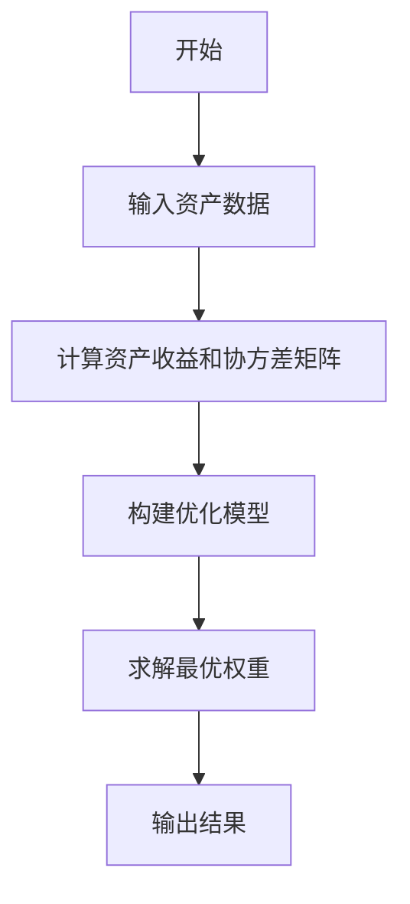
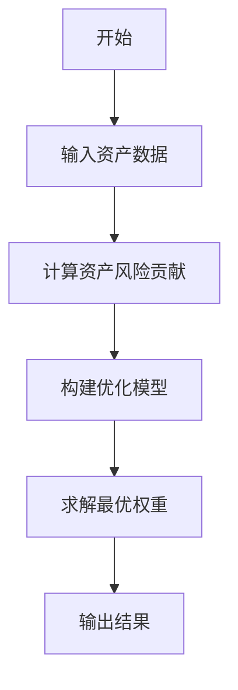
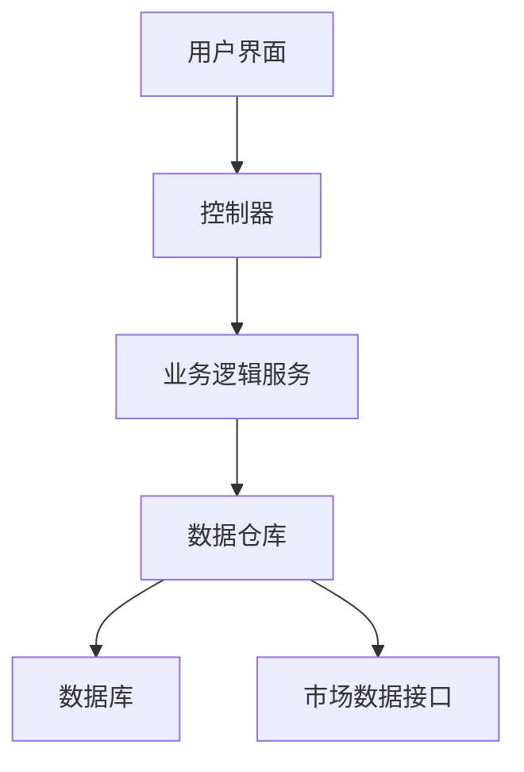

                 


# 智能投资组合多周期再平衡策略

> 关键词：智能投资组合，多周期再平衡，动态优化，风险管理，组合优化，人工智能

> 摘要：本文详细探讨了智能投资组合多周期再平衡策略的核心概念、算法原理、数学模型、系统架构、项目实现和最佳实践。通过结合人工智能和大数据技术，本文提出了一种动态优化的多周期再平衡方法，旨在降低投资组合风险，提高收益。

---

# 第1章: 投资组合管理与再平衡概述

## 1.1 投资组合管理的基本概念

### 1.1.1 投资组合的定义与特征
投资组合是指将资金分配到不同资产或资产类别中，以实现风险分散和收益最大化的策略。其核心特征包括：
- **分散性**：通过配置不同资产降低风险。
- **动态性**：根据市场变化调整资产配置。
- **目标导向**：追求特定收益目标或风险控制。

### 1.1.2 投资组合管理的目标与原则
- **目标**：最大化收益，最小化风险。
- **原则**：风险分散、定期评估、动态调整。

### 1.1.3 再平衡的概念与作用
再平衡是调整投资组合以维持预定资产配置的过程，其作用包括：
- 维持目标资产比例。
- 降低市场波动风险。
- 提高长期收益稳定性。

## 1.2 多周期再平衡策略的背景与挑战

### 1.2.1 传统投资组合管理的局限性
- **定期再平衡**：固定时间调整可能导致错过最佳时机。
- **市场波动**：单靠定期再平衡难以应对剧烈市场变化。
- **多周期管理**：不同周期的资产配置复杂，难以协调。

### 1.2.2 智能再平衡策略的兴起
- **人工智能应用**：利用机器学习模型预测市场变化。
- **大数据驱动**：通过海量数据优化决策。
- **动态调整**：实时或高频调整资产配置，提高收益。

### 1.2.3 多周期再平衡策略的核心问题
- **资产配置优化**：如何在不同周期内合理分配资产。
- **再平衡时机选择**：确定最佳调整时间。
- **多目标优化**：平衡收益、风险和流动性目标。

---

# 第2章: 智能投资组合多周期再平衡策略的核心概念

## 2.1 智能投资组合的数学模型

### 2.1.1 均值-方差模型
目标是最小化投资组合的方差（风险），同时满足收益和约束条件：
$$
\min_w \sigma^2 = \min_w w^T \Sigma w \\
\text{约束条件: } \sum_{i=1}^n w_i = 1, \sum_{i=1}^n w_i r_i = \mu
$$

### 2.1.2 风险平价模型
目标是使各资产的风险贡献相等，优化公式为：
$$
\min_w \sum_{i=1}^n (w_i \sigma_i)^2
$$

## 2.2 多周期再平衡策略的实体关系图

```mermaid
er
actor: 投资者
actor --> strategy: 选择策略
strategy --> portfolio: 定义投资组合
portfolio --> rebalancing: 定义再平衡规则
rebalancing --> market_data: 获取市场数据
portfolio --> performance: 计算绩效
```

## 2.3 智能再平衡策略与传统策略的对比

| 特性               | 传统再平衡策略         | 智能再平衡策略         |
|--------------------|------------------------|------------------------|
| 决策依据           | 固定时间或阈值         | 动态市场数据和模型预测  |
| 调整频率           | 定期（如季度、半年）     | 动态（实时或高频）      |
| 优化目标           | 单一目标（如收益）     | 多目标优化（收益、风险）|
| 适应性             | 较低                   | 较高                   |

---

# 第3章: 智能投资组合多周期再平衡策略的算法原理

## 3.1 投资组合优化算法

### 3.1.1 均值-方差模型的优化流程



### 3.1.2 风险平价模型的优化流程



### 3.1.3 优化算法实现

```python
import numpy as np
from scipy.optimize import minimize

def portfolio_optimization(returns, n_assets):
    # 定义目标函数
    def objective(w):
        return np.dot(w.T, np.dot(returns.cov(), w))
    
    # 约束条件
    constraints = [
        {'type': 'eq', 'fun': lambda w: sum(w) - 1},
        {'type': 'eq', 'fun': lambda w: np.dot(w, returns.mean()) - target_return}
    ]
    
    # 初始化权重
    initial_guess = np.array([1.0 / n_assets] * n_assets)
    
    # 求解
    result = minimize(objective, initial_guess, constraints)
    return result.x
```

---

# 第4章: 智能投资组合多周期再平衡策略的系统架构

## 4.1 系统架构设计



## 4.2 核心功能模块

| 模块名称         | 功能描述                       |
|------------------|------------------------------|
| 数据采集模块     | 从市场获取实时数据             |
| 模型计算模块     | 实现投资组合优化算法           |
| 再平衡执行模块   | 根据模型结果调整资产配置       |
| 性能监控模块     | 监控投资组合表现并提供反馈     |

---

# 第5章: 智能投资组合多周期再平衡策略的项目实现

## 5.1 环境搭建与代码实现

### 5.1.1 环境安装
```bash
pip install numpy pandas scipy matplotlib
```

### 5.1.2 核心代码实现

```python
import numpy as np
from scipy.optimize import minimize

def mean_variance_optimization(returns):
    n = len(returns.columns)
    # 定义目标函数
    def objective(w):
        return np.dot(w.T, returns.cov() @ w)
    
    # 约束条件
    constraints = [
        {'type': 'eq', 'fun': lambda w: sum(w) - 1},
        {'type': 'eq', 'fun': lambda w: np.dot(w, returns.mean()) - 0.1}
    ]
    
    # 初始化权重
    initial_guess = np.array([1.0 / n] * n)
    
    # 求解
    result = minimize(objective, initial_guess, constraints)
    return result.x

# 示例数据
returns = pd.DataFrame({
    '资产1': [0.1, 0.05, 0.08],
    '资产2': [0.08, 0.12, 0.05],
    '资产3': [0.06, 0.09, 0.1]
})

# 调用函数
weights = mean_variance_optimization(returns)
print("最优权重:", weights)
```

## 5.2 项目实战与案例分析

### 5.2.1 数据分析与预处理
- 数据清洗：处理缺失值和异常值。
- 数据标准化：确保各资产数据具有可比性。

### 5.2.2 投资组合优化与再平衡
- 使用均值-方差模型计算最优权重。
- 根据市场变化动态调整权重。

### 5.2.3 性能评估与优化效果
- 计算投资组合的收益和风险。
- 比较优化前后的绩效，验证策略的有效性。

---

# 第6章: 智能投资组合多周期再平衡策略的最佳实践

## 6.1 小结
智能投资组合多周期再平衡策略通过动态优化和实时调整，有效降低了投资风险，提高了收益。

## 6.2 注意事项
- 数据质量：确保数据准确性和完整性。
- 模型选择：根据具体情况选择合适的优化模型。
- 风险管理：定期监控和评估策略效果。

## 6.3 拓展阅读
- 研究基于机器学习的投资组合优化方法。
- 探索多因子模型在投资组合管理中的应用。

---

# 结语
智能投资组合多周期再平衡策略是投资领域的一项重要创新，结合人工智能和大数据技术，为投资者提供了更高效、更精准的投资工具。随着技术的不断发展，这类策略将在未来的金融投资中发挥越来越重要的作用。

