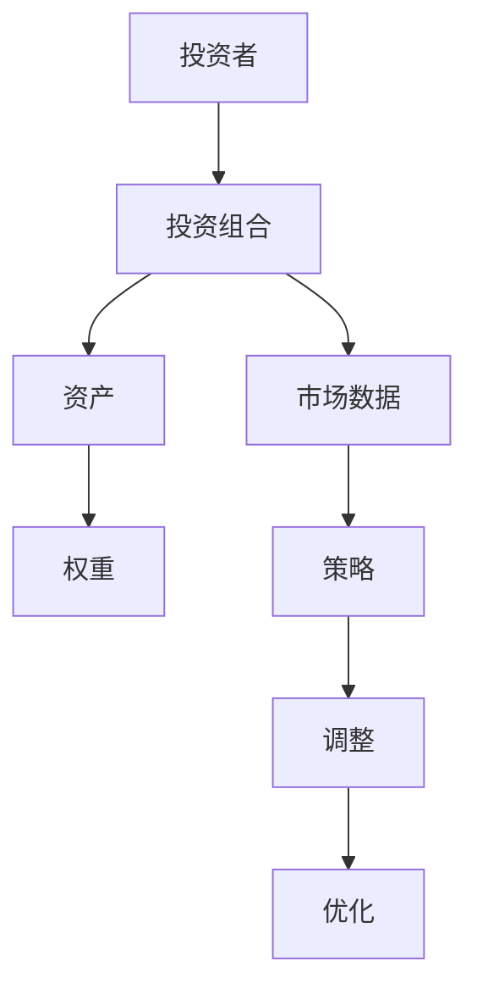
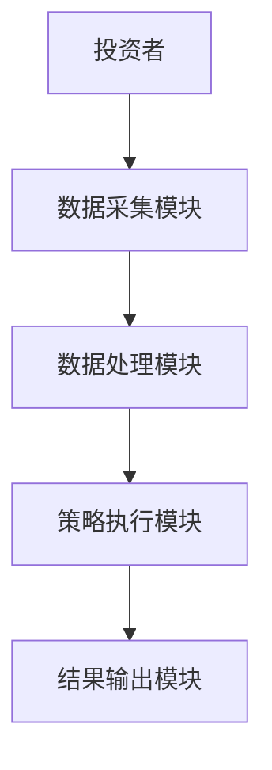

                 


# 智能投资组合多周期再平衡策略

> 关键词：智能投资组合，多周期再平衡，资产配置，动态优化，机器学习

> 摘要：本文探讨智能投资组合的多周期再平衡策略，通过分析传统投资组合管理的局限性，提出基于机器学习的动态再平衡方法，结合多时间周期的市场波动，优化投资组合的风险调整后收益。

---

# 第1章: 智能投资组合与多周期再平衡策略背景

## 1.1 问题背景与意义

### 1.1.1 投资组合管理的传统挑战
传统的投资组合管理依赖于定期检查和手动调整，这种方法在市场波动加剧时显得不够灵活，可能导致收益损失或风险增加。此外，不同资产类别的波动性和相关性在不同时间周期下表现各异，单一周期的管理难以捕捉市场机会。

### 1.1.2 多周期再平衡的必要性
多周期再平衡策略能够捕捉不同时间框架下的市场信号，通过动态调整资产配置，优化投资组合的收益与风险比。这种方法尤其适用于波动性较高的市场环境，能够及时应对突发事件和趋势变化。

### 1.1.3 智能化投资的机遇与趋势
随着人工智能和大数据技术的发展，投资组合管理逐渐智能化。通过机器学习算法分析海量市场数据，实现自动化、精准化的投资决策，成为现代投资管理的重要趋势。

## 1.2 问题描述与目标

### 1.2.1 投资组合再平衡的核心问题
再平衡的目的是维持投资组合的资产配置比例，以适应市场变化和投资者风险偏好。然而，传统方法的固定频率调整可能无法应对复杂多变的市场环境。

### 1.2.2 多周期策略的复杂性
多周期策略需要同时考虑多个时间框架的数据，增加了计算复杂性。如何在不同周期间找到平衡点，是实现高效再平衡策略的关键挑战。

### 1.2.3 智能投资的目标与边界
智能投资追求在不同市场环境下实现最优风险调整后收益。其边界在于数据质量和计算能力，需在实际应用中考虑模型的可解释性和鲁棒性。

## 1.3 核心概念与边界

### 1.3.1 投资组合的定义与构成
投资组合由多种资产构成，包括股票、债券、基金等。其价值和风险取决于各资产的权重和相关性。

### 1.3.2 再平衡的定义与分类
再平衡是调整资产权重以维持目标配置的过程，分为定期和动态两种策略。

### 1.3.3 多周期策略的特征与限制
多周期策略在不同时间框架下进行调整，但需处理数据冗余和计算复杂性。

---

# 第2章: 智能投资组合的核心概念与联系

## 2.1 核心概念原理

### 2.1.1 投资组合优化的数学模型
均值-方差模型用于优化投资组合的风险和收益。其目标是最小化风险（方差）的同时实现最大收益。

### 2.1.2 多周期再平衡的机制
通过分析多周期数据，算法确定最优调整时机和幅度，动态优化资产配置。

### 2.1.3 智能算法在投资组合管理中的应用
机器学习算法（如支持向量机、随机森林）用于预测市场走势，辅助决策。

## 2.2 核心概念对比表

| 特性 | 单周期策略 | 多周期策略 |
|------|------------|------------|
| 时间框架 | 单一时间 | 多个时间 |
| 计算复杂性 | 较低 | 较高 |
| 灵活性 | 较低 | 较高 |

## 2.3 实体关系图



---

# 第3章: 多周期再平衡策略的算法原理

## 3.1 算法原理概述

### 3.1.1 投资组合优化的数学模型
目标函数：最大化收益，最小化风险。
$$ \text{收益} = \mathbf{w}^T \mu $$
$$ \text{风险} = \mathbf{w}^T \Sigma \mathbf{w} $$

### 3.1.2 动态再平衡的算法步骤
1. 数据采集：获取多周期市场数据。
2. 预测市场走势：使用机器学习模型预测未来走势。
3. 计算调整幅度：基于预测结果确定最优调整方案。
4. 执行调整：按照计划进行资产再平衡。

### 3.1.3 多周期策略的实现框架
- 数据预处理：标准化、去噪。
- 策略选择：基于模型预测。
- 优化计算：求解最优化问题。

## 3.2 数学模型与公式

### 3.2.1 均值-方差模型
$$ E(r_p) = \mathbf{w}^T \mu $$
$$ Var(r_p) = \mathbf{w}^T \Sigma \mathbf{w} $$

### 3.2.2 动态再平衡公式
$$ w_t = w_{t-1} + \Delta w $$

## 3.3 机器学习模型实现

### 3.3.1 算法流程图


### 3.3.2 核心代码
```python
import numpy as np
from sklearn.linear_model import LinearRegression

# 数据预处理
data = pd.DataFrame(...)
data_processed = preprocess(data)

# 特征提取
features = data_processed[['feature1', 'feature2']]

# 模型训练
model = LinearRegression()
model.fit(features, targets)

# 预测
predictions = model.predict(new_data)
```

---

# 第4章: 系统分析与架构设计

## 4.1 系统功能设计

### 4.1.1 领域模型


### 4.1.2 系统架构


---

# 第5章: 项目实战

## 5.1 环境安装
```bash
pip install numpy pandas scikit-learn
```

## 5.2 核心代码实现

### 5.2.1 数据处理
```python
import pandas as pd
import numpy as np

data = pd.read_csv('market_data.csv')
processed_data = data.dropna().astype(float)
```

### 5.2.2 策略实现
```python
from sklearn.ensemble import RandomForestRegressor

model = RandomForestRegressor()
model.fit(processed_data[['feature1', 'feature2']], processed_data['target'])
```

### 5.2.3 优化模块
```python
def optimize_weights(weights, returns, risk_free_rate):
    # 定义目标函数
    def objective(weights):
        return - (weights.T @ returns) + 0.5 * weights.T @ weights @ (returns - risk_free_rate)
    # 约束条件
    constraints = {'sum_to_unity': weights.sum() == 1}
    # 求解
    result = minimize(objective, initial_guess, constraints)
    return result.x
```

## 5.3 实际案例分析

### 5.3.1 数据分析
分析不同周期下的资产表现，确定最优调整点。

### 5.3.2 策略比较
比较单周期与多周期策略的收益和风险表现，验证多周期策略的有效性。

---

# 第6章: 最佳实践与总结

## 6.1 小结
智能投资组合多周期再平衡策略通过动态调整优化收益与风险，是现代投资管理的重要方向。

## 6.2 注意事项
- 模型的鲁棒性
- 计算资源的分配
- 风险管理的重要性

## 6.3 拓展阅读
推荐相关书籍和论文，深入学习投资组合优化和机器学习在金融中的应用。

---

# 结语
通过本文的分析，读者可以理解并掌握智能投资组合多周期再平衡策略的核心原理和实现方法，为实际投资管理提供有力支持。

