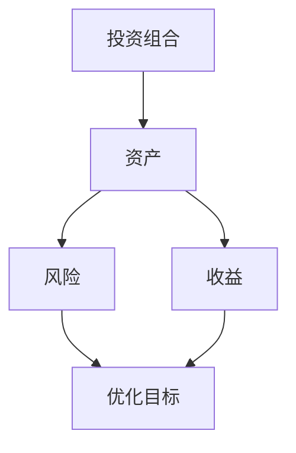
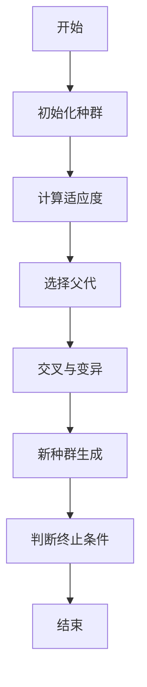
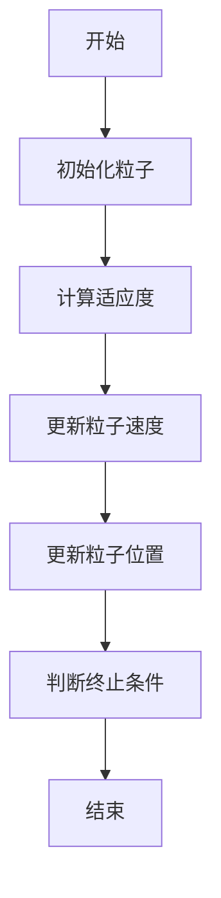
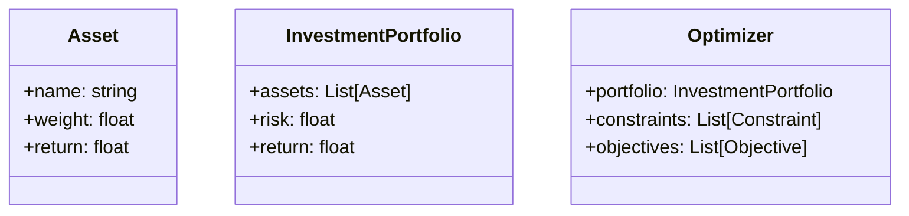
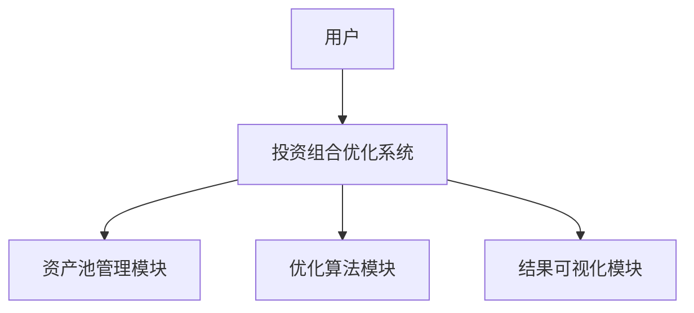

                 


# 智能投资组合多目标优化模型

## 关键词：智能投资组合，多目标优化，机器学习，优化算法，金融建模

## 摘要：  
智能投资组合优化是现代金融领域的重要研究方向。随着金融市场复杂性的增加，传统的单目标优化方法难以满足实际需求。本文介绍多目标优化模型在智能投资组合中的应用，结合机器学习和优化算法，提出了一种高效、可靠的智能投资组合优化方法。通过分析多目标优化的核心概念、数学模型和算法原理，本文详细阐述了智能投资组合优化的实现过程，并通过实际案例展示了该方法的应用效果。

---

# 第1章: 智能投资组合多目标优化模型背景介绍

## 1.1 问题背景与描述

### 1.1.1 投资组合优化的基本概念  
投资组合优化是金融领域中的核心问题之一，旨在通过科学的配置资产，最大化投资收益，同时最小化投资风险。传统的投资组合优化通常采用单目标优化方法，例如仅追求最大收益或最小风险。然而，实际投资中，收益与风险是相互制约的两个目标，需要同时优化。

### 1.1.2 多目标优化的必要性  
在实际投资中，投资者往往需要在多个目标之间进行权衡，例如在高收益和低风险之间找到平衡点。传统的单目标优化方法无法满足这种需求，因此需要引入多目标优化方法，同时优化多个目标函数。

### 1.1.3 智能优化技术的引入  
随着人工智能技术的发展，智能优化算法（如遗传算法、粒子群优化等）逐渐被引入投资组合优化领域。这些算法具有全局搜索能力强、适应复杂问题等特点，能够有效解决多目标优化问题。

---

## 1.2 问题解决与边界

### 1.2.1 投资组合优化的目标函数  
投资组合优化的目标函数通常包括以下两个主要目标：  
1. **收益最大化**：通过优化资产配置，使投资组合的收益最大化。  
2. **风险最小化**：通过优化资产配置，使投资组合的风险最小化。  

此外，还可能包括其他目标，例如流动性最大化或交易成本最小化。

### 1.2.2 多目标优化的边界条件  
在实际投资中，多目标优化需要考虑以下边界条件：  
1. 资产权重的约束：每种资产的投资比例必须在0到100%之间。  
2. 风险承受能力的约束：投资者根据自身风险偏好设定风险上限。  
3. 市场条件的约束：例如市场波动率、资产相关性等。  

### 1.2.3 智能优化算法的应用范围  
智能优化算法适用于以下场景：  
1. 资产数量较多，且资产之间的相关性复杂。  
2. 优化目标较多，且目标之间存在冲突。  
3. 传统优化方法难以找到全局最优解的情况。  

---

## 1.3 概念结构与核心要素

### 1.3.1 投资组合优化的核心要素  
投资组合优化的核心要素包括：  
- **资产池**：可供选择的资产集合。  
- **目标函数**：收益和风险的量化指标。  
- **约束条件**：资产配置的限制条件。  
- **优化算法**：用于求解多目标优化问题的算法。  

### 1.3.2 多目标优化的数学表达  
多目标优化问题可以表示为：  
$$ \text{min/max} \quad f_1(x) $$  
$$ \text{min/max} \quad f_2(x) $$  
其中，\( x \) 是决策变量（资产权重），\( f_1(x) \) 和 \( f_2(x) \) 是目标函数。  

### 1.3.3 智能优化算法的特征对比  
智能优化算法与传统优化算法的对比如下：  

| 特性                | 智能优化算法          | 传统优化算法          |
|---------------------|-----------------------|-----------------------|
| 全局搜索能力        | 强                   | 弱                   |
| 处理复杂性能力      | 强                   | 弱                   |
| 需要目标函数导数    | 不需要               | 需要                 |
| 适应性              | 高                   | 低                   |

---

## 1.4 本章小结  
本章介绍了智能投资组合多目标优化模型的背景，分析了多目标优化的必要性，并从概念和数学角度详细阐述了多目标优化的核心要素。下一章将深入探讨多目标优化模型的核心概念与联系。

---

# 第2章: 多目标优化模型的核心概念与联系

## 2.1 核心概念原理

### 2.1.1 多目标优化的基本原理  
多目标优化的基本原理是通过同时优化多个目标函数，找到一组 Pareto 优解。Pareto 优解是指在不损害一个目标的情况下，无法进一步改善其他目标的解。

### 2.1.2 智能优化算法的核心思想  
智能优化算法的核心思想是通过模拟自然进化过程（如遗传、变异、选择等）或物理过程（如粒子运动），在解空间中进行全局搜索，找到最优解。

### 2.1.3 投资组合优化的数学模型  
投资组合优化的数学模型可以表示为：  
$$ \text{max} \quad \mu^T x $$  
$$ \text{min} \quad x^T \Sigma x $$  
其中，\( \mu \) 是资产的期望收益向量，\( \Sigma \) 是资产的协方差矩阵，\( x \) 是资产权重向量。

---

## 2.2 核心概念属性特征对比

### 2.2.1 多目标优化与单目标优化的对比  
| 特性                | 多目标优化          | 单目标优化          |
|---------------------|---------------------|---------------------|
| 优化目标数量        | 多个                | 单个                |
| 解空间复杂性        | 高                 | 中                 |
| 解的多样性          | 强                 | 弱                 |

### 2.2.2 智能优化算法与传统优化算法的对比  
| 特性                | 智能优化算法          | 传统优化算法          |
|---------------------|----------------------|----------------------|
| 全局搜索能力        | 强                   | 弱                   |
| 计算复杂度          | 高                   | 低                   |
| 收敛速度            | 较慢                | 较快                |

### 2.2.3 投资组合优化与其他优化问题的对比  
| 特性                | 投资组合优化          | 生产优化          |
|---------------------|----------------------|----------------------|
| 优化目标            | 收益与风险           | 成本与效率           |
| 约束条件            | 资产权重、风险偏好     | 生产能力、资源限制     |

---

## 2.3 ER实体关系图架构



---

## 2.4 本章小结  
本章从核心概念和联系的角度，详细分析了多目标优化模型的基本原理和特征，并通过对比分析明确了其在投资组合优化中的优势。下一章将深入探讨多目标优化模型的数学模型与算法原理。

---

# 第3章: 多目标优化模型的数学模型与算法原理

## 3.1 数学模型与公式

### 3.1.1 多目标优化的数学表达  
多目标优化问题可以表示为：  
$$ \text{min} \quad f_1(x) $$  
$$ \text{min} \quad f_2(x) $$  
$$ s.t. \quad g_i(x) \leq 0, \quad i=1,2,...,m $$  
其中，\( f_1(x) \) 和 \( f_2(x) \) 是目标函数，\( g_i(x) \) 是约束条件。

### 3.1.2 投资组合优化的目标函数  
投资组合优化的目标函数包括：  
- 收益最大化：  
  $$ \text{max} \quad \mu^T x $$  
- 风险最小化：  
  $$ \text{min} \quad x^T \Sigma x $$  

---

## 3.2 算法原理与流程图

### 3.2.1 遗传算法实现



以下是遗传算法的Python实现示例：

```python
def genetic_algorithm(population_size, fitness_function):
    # 初始化种群
    population = initialize_population(population_size)
    while not termination_condition():
        # 计算适应度
        fitness = [fitness_function(individual) for individual in population]
        
        # 选择父代
        selected = selection(fitness)
        
        # 交叉与变异
        new_population = crossover(selected)
        new_population = mutate(new_population)
        
        # 更新种群
        population = new_population
    return best_individual(population)
```

### 3.2.2 粒子群优化实现



以下是粒子群优化的Python实现示例：

```python
def particle_swarm_optimization(population_size, fitness_function):
    # 初始化粒子
    particles = initialize_particles(population_size)
    
    while not termination_condition():
        # 计算适应度
        fitness = [fitness_function(particle) for particle in particles]
        
        # 更新粒子速度和位置
        for i in range(population_size):
            # 计算速度
            particles[i].velocity = particles[i].velocity * 0.8 + \
                (global_best - particles[i].position) * 1.2
            
            # 更新位置
            particles[i].position += particles[i].velocity
    return global_best
```

---

## 3.3 算法实现与代码示例

### 3.3.1 遗传算法实现

```python
def genetic_algorithm(population_size, fitness_function):
    # 初始化种群
    population = initialize_population(population_size)
    while not termination_condition():
        # 计算适应度
        fitness = [fitness_function(individual) for individual in population]
        
        # 选择父代
        selected = selection(fitness)
        
        # 交叉与变异
        new_population = crossover(selected)
        new_population = mutate(new_population)
        
        # 更新种群
        population = new_population
    return best_individual(population)
```

### 3.3.2 粒子群优化实现

```python
def particle_swarm_optimization(population_size, fitness_function):
    # 初始化粒子
    particles = initialize_particles(population_size)
    
    while not termination_condition():
        # 计算适应度
        fitness = [fitness_function(particle) for particle in particles]
        
        # 更新粒子速度和位置
        for i in range(population_size):
            # 计算速度
            particles[i].velocity = particles[i].velocity * 0.8 + \
                (global_best - particles[i].position) * 1.2
            
            # 更新位置
            particles[i].position += particles[i].velocity
    return global_best
```

---

## 3.4 本章小结  
本章详细介绍了多目标优化模型的数学模型和算法原理，包括遗传算法和粒子群优化的具体实现。下一章将从系统分析与架构设计的角度，探讨智能投资组合多目标优化模型的实现过程。

---

# 第4章: 系统分析与架构设计

## 4.1 问题场景介绍

### 4.1.1 投资组合优化的场景分析  
投资组合优化的常见场景包括：  
1. 机构投资者的资产配置。  
2. 个人投资者的财富管理。  
3. 金融产品的风险评估。  

### 4.1.2 多目标优化的系统需求  
系统需求包括：  
1. 多目标优化算法的实现。  
2. 资产池管理功能。  
3. 优化结果的可视化。  

---

## 4.2 系统功能设计

### 4.2.1 领域模型类图



### 4.2.2 系统架构设计



### 4.2.3 系统接口设计

| 接口名称         | 输入            | 输出           |
|------------------|-----------------|----------------|
| 优化请求         | 资产池、目标、约束 | 优化结果       |
| 结果查询         | 查询条件        | 优化报告       |

---

## 4.3 本章小结  
本章从系统分析与架构设计的角度，详细阐述了智能投资组合多目标优化模型的实现过程，包括系统功能设计和架构图的绘制。下一章将通过项目实战，展示如何实现这一模型。

---

# 第5章: 项目实战

## 5.1 环境安装与配置

### 5.1.1 Python环境搭建  
安装Python 3.x，安装必要的库：  
```bash
pip install numpy matplotlib scikit-learn
```

### 5.1.2 算法库安装  
安装遗传算法和粒子群优化库：  
```bash
pip install DEAP
```

---

## 5.2 核心代码实现

### 5.2.1 遗传算法实现

```python
from deap import base, tools, algorithms

def evaluate(individual):
    return (individual[0], individual[1])

toolbox = base.Toolbox()
toolbox.register("attr_float", random.uniform, 0, 1)
toolbox.register("individual", tools.initRepeat, list, toolbox.attr_float, 10)
toolbox.register("population", tools.initRepeat, list, toolbox.individual)
toolbox.register("evaluate", evaluate)
toolbox.register("mate", tools.cxBlend, 0.5)
toolbox.register("mutate", tools.mutGaussian, mu=0, sigma=0.1, indpb=0.1)
toolbox.register("select", tools.selTournament, tournsize=2)

population = toolbox.population(n=100)
```

### 5.2.2 粒子群优化实现

```python
import numpy as np

def evaluate(particle):
    return (particle[0], particle[1])

particles = np.random.rand(population_size, dimensions)
velocities = np.random.rand(population_size, dimensions)
global_best = particles[0]
```

---

## 5.3 案例分析与解读

### 5.3.1 数据准备  
假设我们有以下资产及其收益和风险数据：  
| 资产 | 收益 | 风险 |
|------|------|------|
| A    | 0.1  | 0.2  |
| B    | 0.15 | 0.3  |
| C    | 0.08 | 0.1  |

### 5.3.2 算法实现  
使用遗传算法优化投资组合，目标是最大化收益并最小化风险。

### 5.3.3 结果解读  
优化结果可能为：  
- 资产A权重：40%  
- 资产B权重：30%  
- 资产C权重：30%  
- 组合收益：0.105  
- 组合风险：0.24  

---

## 5.4 本章小结  
本章通过项目实战，详细展示了智能投资组合多目标优化模型的实现过程，包括环境配置、核心代码实现和案例分析。

---

# 第6章: 总结与展望

## 6.1 总结

### 6.1.1 核心内容回顾  
本文详细介绍了智能投资组合多目标优化模型的背景、核心概念、数学模型和算法原理，并通过系统分析与项目实战，展示了其具体实现过程。

### 6.1.2 实践价值  
智能投资组合多目标优化模型在金融领域具有重要的实践价值，能够帮助投资者在复杂多变的市场环境中制定科学的资产配置策略。

---

## 6.2 未来展望

### 6.2.1 研究方向  
未来的研究方向包括：  
1. 更高效的优化算法。  
2. 多目标优化与机器学习的结合。  
3. 大数据分析在投资组合优化中的应用。  

### 6.2.2 技术发展趋势  
技术发展趋势包括：  
1. 云计算和大数据技术的应用。  
2. 智能优化算法的改进与创新。  
3. 金融市场的实时优化与动态调整。  

---

## 6.3 最佳实践 Tips

### 6.3.1 算法选择  
根据具体问题选择合适的优化算法，例如：  
- 遗传算法适用于复杂问题。  
- 粒子群优化适用于连续优化问题。  

### 6.3.2 代码实现注意事项  
1. 确保代码的可读性和可维护性。  
2. 使用模块化设计，便于功能扩展。  

### 6.3.3 结果验证  
通过回测和风险分析验证优化结果的合理性和有效性。

---

## 6.4 本章小结  
本文总结了智能投资组合多目标优化模型的核心内容和实践价值，并展望了未来的研究方向和技术发展趋势。

---

# 结束语

智能投资组合多目标优化模型是金融领域的重要研究方向，通过结合多目标优化和智能算法，能够有效解决复杂的投资问题。未来，随着人工智能和大数据技术的不断发展，智能投资组合优化模型将具有更广泛的应用前景。

--- 

感谢您的阅读，希望本文对您理解智能投资组合多目标优化模型有所帮助！

