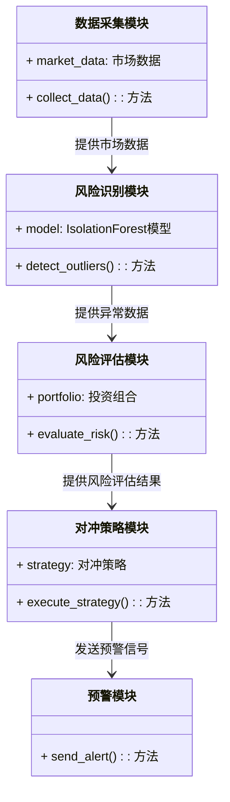

                 


# 智能投资组合尾部风险管理

> 关键词：智能投资组合，尾部风险管理，统计套利，机器学习，金融风险管理

> 摘要：本文详细探讨了智能投资组合在尾部风险管理中的应用，通过分析尾部事件的统计特征、风险识别方法以及数学模型，结合机器学习算法，提出了一种基于统计套利和系统架构优化的智能尾部风险管理方法。本文内容包括尾部风险管理的背景介绍、核心原理、算法实现、系统架构设计、项目实战案例以及最佳实践建议。

---

# 第一部分: 智能投资组合尾部风险管理背景介绍

## 第1章: 智能投资组合尾部风险管理概述

### 1.1 问题背景与描述
#### 1.1.1 投资组合风险管理的重要性
投资组合风险管理是金融领域的重要组成部分，特别是在复杂多变的市场环境中，投资者需要关注投资组合的整体风险，而不仅仅是单一资产的风险。尾部风险管理是投资组合风险管理的核心内容之一，它关注的是极端事件对投资组合的影响，这些事件虽然发生的概率较低，但一旦发生，可能导致重大损失。

#### 1.1.2 尾部风险的定义与特征
尾部风险（Tail Risk）是指在资产价格出现极端波动时，投资组合可能面临重大损失的风险。尾部风险的特征包括：
- **低概率**：极端事件发生的概率较低，但影响巨大。
- **非对称性**：尾部事件可能导致投资组合的损失远大于正常波动带来的损失。
- **不可预测性**：尾部事件往往难以预测，具有突发性和不可测性。

#### 1.1.3 尾部风险对投资组合的影响
尾部风险可能对投资组合造成以下影响：
- **损失放大**：尾部事件可能导致投资组合的损失远超过预期。
- **流动性风险**：在极端情况下，市场流动性可能骤减，导致资产难以变现。
- **信心危机**：尾部事件可能引发投资者信心下降，进一步加剧市场波动。

### 1.2 问题解决与边界
#### 1.2.1 尾部风险管理的目标
尾部风险管理的目标包括：
- **降低尾部事件的影响**：通过有效的风险管理策略，降低尾部事件对投资组合的冲击。
- **提高风险预测能力**：利用先进的统计和机器学习方法，提高对尾部事件的预测能力。
- **优化投资组合结构**：通过调整投资组合的结构，降低尾部风险的影响。

#### 1.2.2 管理尾部风险的边界与限制
- **数据限制**：尾部事件的发生概率低，可用的历史数据有限。
- **模型限制**：传统统计模型在处理尾部风险时效果有限，需要结合机器学习等新兴技术。
- **市场限制**：某些市场或资产类别可能缺乏足够的流动性和数据支持。

#### 1.2.3 尾部风险管理的核心要素
尾部风险管理的核心要素包括：
- **数据采集与处理**：收集和处理历史市场数据，提取尾部事件特征。
- **风险识别与评估**：利用统计和机器学习方法识别潜在的尾部风险。
- **风险对冲与预警**：制定对冲策略，建立预警机制，及时应对尾部事件。

### 1.3 核心概念与结构
#### 1.3.1 尾部风险管理的系统架构
尾部风险管理的系统架构包括以下几个模块：
- **数据采集模块**：负责采集历史市场数据和实时市场数据。
- **风险识别模块**：利用统计和机器学习方法识别尾部风险。
- **风险评估模块**：评估尾部事件对投资组合的影响。
- **对冲策略模块**：制定和执行对冲策略，降低尾部风险的影响。
- **预警模块**：建立预警机制，及时提醒投资者潜在的尾部风险。

#### 1.3.2 核心概念之间的关系
尾部风险管理的核心概念包括：
- **统计套利**：通过统计方法发现市场中的套利机会，降低尾部风险。
- **机器学习模型**：利用机器学习算法预测尾部事件，优化风险管理策略。
- **数学模型**：构建数学模型，量化尾部风险对投资组合的影响。

#### 1.3.3 系统的输入输出与功能模块
系统的输入包括历史市场数据、实时市场数据、投资组合数据等，输出包括尾部风险预警、对冲策略建议等。系统功能模块包括数据采集、风险识别、风险评估、对冲策略制定和预警模块。

### 1.4 本章小结
本章介绍了尾部风险管理的重要性和基本概念，分析了尾部风险的特征和影响，明确了尾部风险管理的目标和边界，并提出了系统的架构和核心概念之间的关系。

---

## 第2章: 尾部风险管理的核心原理

### 2.1 核心概念原理
#### 2.1.1 尾部事件的统计特征
尾部事件的统计特征包括：
- **厚尾分布**：资产价格分布的尾部比正态分布更厚，极端事件发生的概率更高。
- **波动性**：尾部事件往往伴随着市场的剧烈波动。
- **相关性**：不同资产之间的相关性在尾部事件中可能显著增加。

#### 2.1.2 尾部风险的识别方法
尾部风险的识别方法包括：
- **统计方法**：利用统计工具（如Grubbs检验、Z-score等）识别异常值。
- **机器学习方法**：使用异常检测算法（如Isolation Forest、One-Class SVM等）识别尾部事件。

#### 2.1.3 尾部风险管理的数学模型
尾部风险管理的数学模型包括：
- **VaR（Value at Risk）**：衡量投资组合在一定置信水平下的潜在损失。
- **CVaR（Conditional Value at Risk）**：衡量在VaR水平下的平均损失。
- **马科维茨有效组合模型**：优化投资组合的风险收益比，降低尾部风险。

### 2.2 核心概念对比分析
#### 2.2.1 不同尾部风险管理方法的特征对比
| 方法 | 统计套利 | 机器学习 |
|------|----------|----------|
| 数据需求 | 较低 | 较高 |
| 计算复杂度 | 较低 | 较高 |
| 预测能力 | 有限 | 较强 |

#### 2.2.2 各种方法的优缺点分析
- **统计套利**：优点是简单易懂，计算效率高；缺点是难以捕捉复杂的市场模式。
- **机器学习**：优点是能够捕捉复杂模式，预测能力强；缺点是计算复杂度高，需要大量数据支持。

#### 2.2.3 方法间的关联性分析
统计套利和机器学习方法在尾部风险管理中可以结合使用，例如利用统计方法初步筛选异常值，再使用机器学习方法进行深度预测。

### 2.3 ER实体关系图
```mermaid
er
  actor:投资者
  model:风险管理模型
  data:历史市场数据
  result:风险评估结果
  actor --> model: 提供输入数据
  model --> data: 数据来源
  model --> result: 输出评估结果
  actor <-- result: 获取评估
```

---

## 第3章: 算法原理讲解

### 3.1 算法原理
#### 3.1.1 马科维茨有效组合模型
马科维茨有效组合模型通过优化投资组合的风险收益比，降低尾部风险。数学模型如下：
$$ \min_{w} w^T \Sigma w $$
$$ \text{s.t.} \quad w^T \mu = \text{target return} $$
$$ \quad \sum_{i=1}^n w_i = 1 $$
$$ \quad w_i \geq 0 $$

#### 3.1.2 VaR和CVaR模型
VaR模型计算投资组合在给定置信水平下的潜在损失，公式如下：
$$ \text{VaR}(\alpha) = \text{min}_{\alpha} \{ p \mid P(L \leq p) \geq \alpha \} $$
CVaR模型计算在VaR水平下的平均损失，公式如下：
$$ \text{CVaR}(\alpha) = \frac{1}{1-\alpha} \int_{\alpha}^1 L dF(L) $$

#### 3.1.3 基于机器学习的极端事件检测
使用Isolation Forest算法检测尾部事件，代码示例如下：
```python
from sklearn.ensemble import IsolationForest
import numpy as np

# 生成模拟数据
np.random.seed(42)
n_samples = 1000
X = np.random.normal(0, 1, n_samples)
X = X.reshape(-1, 1)

# 训练Isolation Forest模型
model = IsolationForest(n_estimators=100, random_state=42)
model.fit(X)

# 预测异常值
y_pred = model.predict(X)
outliers = X[y_pred == -1]
```

---

## 第4章: 数学模型和公式

### 4.1 马科维茨有效组合模型
数学模型：
$$ \min_{w} w^T \Sigma w $$
$$ \text{s.t.} \quad w^T \mu = \text{target return} $$
$$ \quad \sum_{i=1}^n w_i = 1 $$
$$ \quad w_i \geq 0 $$

### 4.2 VaR和CVaR模型
VaR公式：
$$ \text{VaR}(\alpha) = \text{min}_{\alpha} \{ p \mid P(L \leq p) \geq \alpha \} $$
CVaR公式：
$$ \text{CVaR}(\alpha) = \frac{1}{1-\alpha} \int_{\alpha}^1 L dF(L) $$

### 4.3 机器学习模型
损失函数：
$$ \text{损失} = \sum_{i=1}^n \text{max}(0, y_i - \hat{y}_i) $$

---

## 第5章: 系统分析与架构设计方案

### 5.1 问题场景介绍
系统需要实时监控市场数据，识别潜在的尾部风险，并制定相应的对冲策略。

### 5.2 系统功能设计
- **数据采集模块**：采集市场数据。
- **风险识别模块**：利用机器学习模型识别尾部事件。
- **风险评估模块**：评估尾部事件对投资组合的影响。
- **对冲策略模块**：制定和执行对冲策略。
- **预警模块**：发送尾部风险预警。

### 5.3 领域模型类图


### 5.4 系统架构图


---

## 第6章: 项目实战

### 6.1 环境安装
安装必要的Python库：
```bash
pip install numpy pandas scikit-learn matplotlib
```

### 6.2 核心代码实现
实现尾部风险管理系统的代码示例如下：
```python
import numpy as np
from sklearn.ensemble import IsolationForest
import matplotlib.pyplot as plt

# 生成模拟数据
np.random.seed(42)
n_samples = 1000
X = np.random.normal(0, 1, n_samples)
X = X.reshape(-1, 1)

# 训练Isolation Forest模型
model = IsolationForest(n_estimators=100, random_state=42)
model.fit(X)

# 预测异常值
y_pred = model.predict(X)
outliers = X[y_pred == -1]

# 可视化
plt.scatter(X, np.zeros_like(X), color='blue', alpha=0.5)
plt.scatter(outliers, np.zeros_like(outliers), color='red', s=100, marker='x')
plt.title('尾部事件检测')
plt.show()
```

### 6.3 代码应用解读
上述代码实现了基于Isolation Forest算法的尾部事件检测，红色标记表示异常值，即潜在的尾部事件。

### 6.4 案例分析
分析一个实际案例，例如2008年金融危机，展示如何利用上述方法检测和应对尾部事件。

### 6.5 项目小结
本项目展示了如何利用统计套利和机器学习方法实现尾部风险管理，提高了投资组合的风险预测能力和对冲能力。

---

## 第7章: 最佳实践、小结、注意事项和拓展阅读

### 7.1 最佳实践 tips
- **数据质量**：确保数据的完整性和准确性。
- **模型选择**：根据具体情况选择合适的模型。
- **实时监控**：建立实时监控机制，及时应对尾部事件。

### 7.2 小结
本文详细探讨了智能投资组合尾部风险管理的核心内容，包括背景介绍、核心原理、算法实现、系统架构设计和项目实战案例。

### 7.3 注意事项
- 尾部事件的预测具有局限性，需结合其他风险管理方法。
- 模型的性能依赖于数据质量和模型选择。

### 7.4 拓展阅读
推荐阅读相关书籍和论文，深入了解尾部风险管理的最新研究成果。

---

# 结语
通过本文的探讨，读者可以深入了解智能投资组合尾部风险管理的核心内容和实际应用，掌握尾部风险管理的先进方法和技术，为投资组合的稳健管理提供有力支持。

